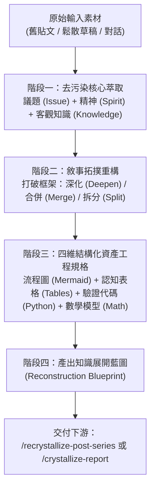

# 知識展開與敘事重構 (Knowledge Arc Expansion & Narrative Reframing)

本工作流是「重新結晶（Re-crystallization）」的**上游認知展開工序**。當既有貼文、粗糙草稿或歷史對話具備高度洞察與批判精神，但內文存在不可靠引用、鬆散數字、AI 生成痕跡或僵化的章節切割時，本工作流負責進行**去污染解構**、**第一性原理重鑄**與**自由敘事弧重構**，為下游的 `/recrystallize-post-series` 或 `/crystallize-report` 提供高解析度的架構藍圖。

---

## 0. 核心理念與認知自由度 (Core Principles & Freedom)

1. **取神棄形（Extract Essence, Discard Shell）**：
   - 嚴禁被原始素材的篇章數量、目錄階層或段落順序綁架。
   - 原始文本是發想種子與問題意識的來源，**絕非敘事天花板**。
2. **去污染與第一性原理求真（De-pollution & First-Principles Grounding）**：
   - 徹底清除一切無法考證的二手文獻指涉、疑似 AI 幻覺之論文引用、非精確的實驗數字與空泛學術修辭。
   - 將所有論點重新錨定至底層數學（機率論、微積分、線性代數、資訊論）、物理/幾何直覺，以及純標準函式庫可執行的數值模擬。
3. **拓撲自由重構（Topological Re-architecting）**：
   - 賦予 Agent 充分裁量權進行三種拓撲操作：
     - **深化（Deepen）**：將原文一筆帶過、實則蘊含核心機制的命題（如前向探針與反向梯度的代數差異），展開為獨立論證。
     - **合併（Merge）**：將本質同構、論點重複的篇章熔接為單一高密度的核心章節。
     - **拆分（Split）**：將單篇中超載、混雜多個獨立因果線的篇章，解耦為多個層次分明的認知節點。
4. **反換皮與抗鏡像禁令 (Anti-Reskinning Guardrail) [CRITICAL]**：
   - **嚴禁 1:1 換皮照抄**：若重構後的篇章 Slot 數量與主題分工與原始輸入素材完全一致（例如原素材為 10 篇，重構後也對應為 10 篇微調標題的報告），**判定為偽重構，必須即刻中止並打回重煉**。
   - 重構必須體現**維度升級（Dimensional Elevation）**：必須以更高的問題域維度（如：度量自欺、表徵偽證、流形盲區、可證偽閉環）統攝整合，將破碎材料重新熔鑄為層次分明的宏大敘事弧。
5. **四維結構化表達與認知工學 (Quad-structure Expressive Rigor & Cognitive Ergonomics) [CRITICAL]**：
   - 拒絕純文字長篇大論造成讀者的認知超載。對每一個重構的主題節點，**強制規劃「流程圖（Mermaid）＋ 診斷表格（Table）＋ 最小驗證程式碼（Code）＋ 嚴密數學公式（Math）」**。
   - **表格是不可或缺的認知支架**：每篇報告必須配備至少兩類結構化表格：
     - **數值走一遍對照表 (Toy Walkthrough Table)**：將極端數值演算的每一階段輸入、中間狀態、理論估計與經驗結果清晰定錨；
     - **跨維度診斷與範式對照表 (Diagnostic Matrix & Paradigm Comparison Table)**：將多個概念橫向對比（如表面讀數 vs 物理病灶、舊代脆弱做法 vs 新代嚴格工程防線）。
6. **藍圖架構權威（Blueprint Authority Over Downstream）**：
   - 本工作流產出的知識展開藍圖具備最高架構權威。
   - 當下游 `/recrystallize-post-series` 消費本藍圖時，藍圖定義的重構 Slot（例如 4 部深度專題報告）直接覆寫既有依候選貼文篇數鎖定之規則，下游不得以篇數減少為由強迫拆回碎片。

---

## 1. 輸入與邊界約定 (Inputs & Boundaries)

| 輸入類型 | 處理方式 |
| :--- | :--- |
| 指定母系列路徑（如 `content/posts/...`） | 批量掃描該系列所有關聯文章 |
| 指定單一草稿或報告路徑 | 針對該主題進行深度發散、解耦與重整 |
| 指定對話上下文或議題關鍵字 | 從對話紀錄中提取核心問題域與精神 |

### 邊界禁制
- **不寫最終長文報告**：本工作流產出的是**重構藍圖（Reconstruction Blueprint / Dossier）**，非最終篇章正文。
- **不更動 `content/` 原檔**：嚴禁就地修改、刪除既有發布內容。
- **不進行術語錨定**：術語錨定屬於下游發布管線職責。

---

## 2. 執行四階段程序 (Process Execution)



### 階段一：去污染核心萃取 (De-polluted Essence Extraction)

針對輸入素材進行穿透式閱讀，剝離表面裝飾，填寫**本質反推卡**：

```markdown
### 主題名稱：[暫定主題]
1. 議題核心 (Issue/Problem Domain)：本文試圖反思或解決的工程/理論盲區是什麼？
2. 批判精神 (Spirit/Stance)：本文堅持的認識論態度、審判視角與反直覺警示是什麼？
3. 客觀知識 (Objective Knowledge)：移除文獻假託後，底層真正成立的客觀規律、因果機制是什麼？
4. 污染掃除 (Contamination Purge)：
   - 需刪除之不可靠引用 / 模糊論文指涉：[列出]
   - 需替換之浮誇數字 / 未經驗證案例：[列出]
   - 需撥正之概念混淆：[列出]
```

### 階段二：敘事拓撲重構 (Narrative Arc Re-architecting)

1. **依據因果依賴與認知遞進，重劃篇章階梯**：
   - 建立自然的認知升級階梯（例如：從「純量統計自欺」$\to$「內部表徵偽證」$\to$「高維流形盲區」$\to$「事前契約工程」）。
2. **標定拓撲操作**：
   - `[MERGE]`：指明哪些篇章的因果鏈與結論同構，應合併吸收。
   - `[SPLIT]`：指明哪篇素材暗藏多個獨立核心問題，必須拆分為獨立 Slot。
   - `[DEEPEN]`：指明哪些在原文中僅有一兩句話帶過的潛在深度，應拉昇為核心骨幹。
3. **繪製全新系列/篇章全景因果拓撲圖（Mermaid）**。

### 階段三：四維結構化資產工程規格 (Quad-structure Asset Blueprinting)

為重構後的每個 Slot / 篇章，強制指定以下四維資產規劃：

1. **流程與因果圖（Visual Flowchart / DAG）**：
   - 指定 Mermaid 圖表類型（`flowchart`, `stateDiagram-v2`, `sequenceDiagram`）。
   - 明確標注該圖承載的因果傳播鏈、責任邊界、狀態轉移或破壞機制。
2. **對比與診斷表格（Structured Tables & Cognitive Ergonomics）**：
   - 強制規劃**「數值直覺對照表」**（錨定極端計算的輸入/中間/輸出）與**「病因診斷 / 範式轉移對照表」**（對照脆弱作法 vs 嚴謹工程），提供高密度認知支撐。
3. **最小驗證程式碼（Minimal Executable Code）**：
   - 嚴格限定僅使用 Python 標準函式庫或 NumPy。
   - 設計具備自我驗證能力的玩具模型（Toy Simulation），秒級重現現象（例如：蒙地卡羅極值挑選偏差、一維頻譜混疊、奇異值衰減、注意力置換不變性、PRD 曲線、逆向 SDE 誤差預算）。
4. **數學公式表達（Rigorous Mathematical Grounding）**：
   - 給出該篇章的數理核心表示（如 Jensen 不等式對極值的下界估計、Hessian 條件數定義、奈奎斯特取樣邊界、ELBO 互資訊分解式等）。

### 階段四：產出知識展開藍圖 (Output Downstream Blueprint)

將上述分析匯整為完整的規格書，預設輸出於對話，或依指示寫入 `.agent-scratch/` 作為下游工作流的 SSOT 輸入。

---

## 3. 輸出產物規格 (Deliverable Blueprint Schema)

產出的重構藍圖必須包含以下結構：

```markdown
# [系列/報告名稱]：知識展開與敘事重構藍圖

## 1. 認知階梯與因果拓撲 (Narrative Topology)
[包含全局 Mermaid 流程圖，說明各階層的認知演進與不可替代性]

## 2. 篇章重組對照與拓撲決策 (Structural Decisions)
[表格列出：新篇章 Slot | 來源素材映射 | 拓撲操作 (Merge/Split/Deepen) | 核心因果鏈]

## 3. 逐篇四維結構化資產規劃 (Per-Slot Quad-structure Specifications)
### Slot 01: [篇名]
- **核心問題與精神**：
- **數理核心 (Math)**：[具體公式與定理]
- **圖表規格 (Mermaid)**：[圖表結構與節點語意]
- **表格規格 (Tables)**：[數值對照表與範式診斷表設計]
- **程式碼規格 (Code)**：[驗證目標、變數設定與預期行為]
- **邊界與反例**：[何時不適用]

[...依序規劃其餘 Slot...]

## 4. 去污染稽核清單 (De-pollution Audit)
[明確列出已清除之不可靠來源、文獻與替代 First-principles 方案]
```

---

## 4. 品質閘門 (Quality Gate)

產出重構藍圖前必須逐項自檢：

- [ ] **去污染徹底**：所有二手不可靠論文引用與未經檢驗的實驗數字皆已被標記剔除，並替換為數學或物理第一性原理。
- [ ] **框架破除**：新架構明確展現出深化、合併或拆分的拓撲演進，未淪為原素材的 1:1 機械照搬。
- [ ] **拒絕換皮照抄**：新架構的 Slot 數量與主題分工不可與原始素材呈 1:1 鏡像對應，必須有實質的跨篇章熔接或多核心解耦。
- [ ] **四維資產無缺漏**：每個新規劃的主題節點均具備流程圖、診斷表格、最小驗證代碼與數學公式之明確規劃。
- [ ] **認知工學支架完備**：每篇報告配備至少兩類結構化表格（數值對照表 + 診斷/範式對照表），杜絕純文字疲勞。
- [ ] **代碼零重型依賴**：規劃的模擬程式碼純度達標（僅限標準函式庫或 NumPy），且具備確定性與可重現性。
- [ ] **敘事因果閉合**：篇章之間的依賴關係由因果推進決定，形成完整的認識論閉環。
