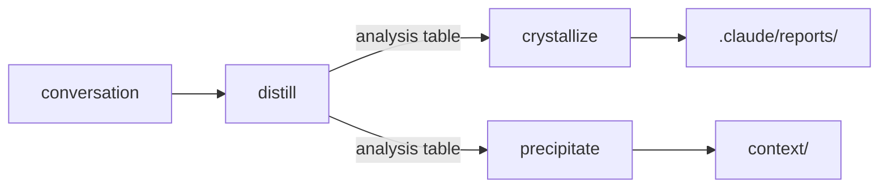

+++
title = "設計知識萃取工具"
date = "2026-03-05T09:13:02+08:00"
author = "TTL::0"
draft = false
isCJKLanguage = true
description = "分析對話知識的揮發性問題，並介紹了知識萃取管線（蒸餾、結晶、沉澱）的設計邏輯及其在專案知識保留上的應用。"
tags = [
    "分析論述", # term:AnalyticalEssay
    "AI 代理人", # term:AiAgent
    "知識萃取", # term:KnowledgeExtraction
    "工具設計", # term:ToolDesign
    "對話知識管理", # term:ConversationKnowledgeManagement
    "以程式碼為文件", # term:CodeAsDocumentation
    "敘事連續性規則", # term:NarrativeContinuityRules
  ]
series = ["遺留系統的 AI 協同治理：從單體指令到執行時優先的結構化實踐"]
[ai_info]
    [ai_info.generation]
        model = "Claude Opus 4.6"
        agent = "Claude Code VSCode Extension 2.1.66"
    [ai_info.refinement]
        model = "Gemini 3.5 Flash"
        agent = "Antigravity IDE 2.0.4"
+++

<!--more-->

## 背景

治理框架建立後，文件階層、機制分類、**知識路由**（Attribution Routing） <!-- term:AttributionRouting -->各就各位——但一個新的問題隨即浮現：產出這些治理決策的思考過程本身，存在哪裡？

> [!IMPORTANT]
> **知識路由** <!-- term:AttributionRouting --> (Attribution Routing): 將系統的非結構化知識或遺留債務，精準指派並分流至合適的追蹤與管理工具之機制。 <!-- anchor:AttributionRouting -->

設計替代方案的評估、試錯序列、使用者挑戰與修正——這些構成決策品質的關鍵素材，全部活在對話 session 中。對話是 AI 輔助工程的原生工作介面，卻也是最脆弱的知識載體。**上下文壓縮**（Context Compression） <!-- term:ContextCompression -->是平台的不可掛鉤系統事件——壓縮發生時，使用者和 AI 都不會收到預先通知。一旦壓縮完成，替代方案的比較、權衡推理的細節被縮減為摘要，再也無法從中萃取完整的決策記錄。

> [!IMPORTANT]
> **上下文壓縮** <!-- term:ContextCompression --> (Context Compression): AI 對話中因長度限制而自動摘要上下文的機制 <!-- anchor:ContextCompression -->

這意味著最有價值的知識——不是「做了什麼」而是「為什麼這樣做」——具有時間窗口。必須在對話細節尚存時結構化萃取，否則就永久失去了。本文分析為此設計的工具管線：從評估到結構化到持久化的三階段架構，以及驅動知識在不同目的地間流動的歸屬路由（attribution routing）機制。

## 分析

### 管線拓撲：三工具、三階段、一個輸入源

將**知識萃取**（Knowledge Extraction） <!-- term:KnowledgeExtraction -->拆分為多個工具而非建造單一全功能工具，是基於三個觀察。第一，評估和生成之間存在**人類決策點**——使用者看到評估結果後決定下一步，而非讓工具自動串聯。第二，評估具有**獨立價值**——即使不生成任何報告，知道哪些知識值得萃取本身就幫助使用者。第三，生成**未必發生**——評估可能得出「內容不足」的結論。

> [!IMPORTANT]
> **知識萃取** <!-- term:KnowledgeExtraction --> (Knowledge Extraction): 從非結構化的開發對話中，提取有價值決策與技術知識的過程。 <!-- anchor:KnowledgeExtraction -->

三個工具沿著化學隱喻命名，各自負責一個階段：

distill（**蒸餾**（Distill） <!-- term:Distill -->）是上游評估節點，掃描對話、辨識主題、評估深度與成熟度、標記歸屬傾向。輸出是一張分析表——不包含建議、不觸發後續動作、不建立檔案。crystallize（**結晶**（Crystallize） <!-- term:Crystallize -->）是結構化節點，將對話內容匹配到適當的報告格式並生成報告。precipitate（沉澱）是持久化節點，將專案特定知識沉澱到知識庫或就近文件。

> [!IMPORTANT]
> **蒸餾** <!-- term:Distill --> (Distill): 從長對話或大量開發脈絡中萃取關鍵資訊的處理過程。 <!-- anchor:Distill -->
> **結晶** <!-- term:Crystallize --> (Crystallize): 將蒸餾後的關鍵知識沉澱並結構化為正式報告或規格的過程。 <!-- anchor:Crystallize -->

這個拓撲中，distill 是兩條分歧路徑共享的上游分流節點，而非 precipitate 的子集。早期分析曾因 precipitate 描述中的用詞偏移（「蒸餾 <!-- term:Distill -->知識」用於應為「萃取知識」之處）而誤判兩者功能重疊。使用者的校正揭示了真正的問題——這是術語問題，不是結構性重疊。兩條下游路徑的產出完全不同：一條產出內化報告，另一條產出專案知識。

### 歸屬作為路由：內化、外化、或兩者

distill 的**三元歸屬**（Ternary Attribution） <!-- term:TernaryAttribution -->評估（internalize / externalize / both）是整條管線的分流機制。每個主題被標記為「適合內化」（理解本身就是價值）、「適合外化」（持久化在專案中才有價值）、或「兩者」（原理需要理解，具體決策需要記錄）。

> [!IMPORTANT]
> **三元歸屬** <!-- term:TernaryAttribution --> (Ternary Attribution): 對話知識蒸餾時，將主題歸類為內化、外化或兩者皆具的分類機制。 <!-- anchor:TernaryAttribution -->

這個歸屬傾向直接預測合適的下游工具。內化主題流向 crystallize，產出寫入報告目錄的結構化報告。外化主題流向 precipitate，沉澱到知識庫或就近文件。兩者兼具的主題各取所需——原理部分結晶 <!-- term:Crystallize -->為報告，決策部分沉澱為專案知識。

歸屬路由暴露了治理框架中的一個缺口。既有的**以程式碼為文件**（Code-As-Documentation） <!-- term:CodeAsDocumentation -->規則（code-as-documentation）說明了知識不應該去哪裡（知識庫是過渡債務），卻缺少一張**正向路由表**指明知識應該去哪裡。缺少**正向指引**（Positive Guidelines） <!-- term:PositiveGuidelines -->時，知識庫因慣性成為預設目的地。修補方案是新增一張知識路由 <!-- term:AttributionRouting -->表（knowledge routing table），按知識性質指定目的地，預設選擇最高優先序的行——低優先序行是退路，不是偏好。

> [!IMPORTANT]
> **以程式碼為文件** <!-- term:CodeAsDocumentation --> (Code-As-Documentation): 將程式碼本身視為主要文件的開發原則 <!-- anchor:CodeAsDocumentation -->
> **正向指引** <!-- term:PositiveGuidelines --> (Positive Guidelines): 告訴 AI 應該做什麼、如何做以達成預期目標的常規性開發規範。 <!-- anchor:PositiveGuidelines -->

歸屬系統被設計為**非指示性的**——distill 標記傾向但不做決定。當 crystallize 收到一個「外化」主題時，它會告知使用者 precipitate 可能更合適，但不拒絕生成。這保留了使用者自主權，同時提供判斷錨點。

### 文體選擇作為核心價值

crystallize 的核心價值不是報告生成——而是**文體選擇**：判斷內容的自然形態，匹配到正確的報告結構，而非將內容塞進固定模板。這個判斷通過**首次匹配**（First-Match） <!-- term:FirstMatch -->測試（first-match test）實現：內容記錄多階段流程且包含沿途決策的，匹配 Experience Report；從觀察通過分析發展到原則的，匹配 **分析論文**（Analytical Essay） <!-- term:AnalyticalEssay -->；捕捉特定技術發現及調查過程的，匹配 Technical Note。三者都不匹配或內容太薄時，拒絕生成。

> [!IMPORTANT]
> **首次匹配** <!-- term:FirstMatch --> (First-Match): 採用首次命中邏輯的分類或測試機制 <!-- anchor:FirstMatch -->
> **分析論文** <!-- term:AnalyticalEssay --> (Analytical Essay): 一種著重於深度剖析、邏輯推導與系統性論證的寫作結構與文體。 <!-- anchor:AnalyticalEssay -->

文體選擇的重要性在一次六輪結構辯論中得到了最清晰的驗證。為一篇關於知識歸屬的分析性文章選擇結構時，歷經使用者提議四段式、AI 修正**反思**（Reflection） <!-- term:Reflection -->與結論的順序、使用者要求讀者友善性、AI 提議五段敘事式、使用者要求學術嚴謹性、AI 提議五段學術式。最後 AI 自我校正——「理論基礎」段落是空的，因為治理框架是自建的而非基於外部文獻。繞了六輪回到原點：使用者最初提議的四段式（引言→分析→反思 <!-- term:Reflection -->→結論）就是內容的自然形態。

> [!IMPORTANT]
> **反思** <!-- term:Reflection --> (Reflection): 對現行架構與工程盲點進行的深層檢討與批判。 <!-- anchor:Reflection -->

這個經歷驗證了一個判斷標準：四段是內容的自然數量——不是套用模板的結果，而是內容本身的形態。能否刪除任何段落而不失論點？不能。任何段落應拆分嗎？不應（量不足）。任何兩段應合併嗎？不應（每對之間有清晰的認知轉換）。段落順序能對調嗎？不能（每段依賴前段的前提）。

### 一次寫入原則（write-once principle）

報告被定義為**一次寫入的內化成品**——它們的存在是為了幫助使用者吸收知識，而非被維護或被其他文件引用。這個定義產生了三個連鎖設計決策。

第一，**報告不可被引用**。報告目錄中的檔案不得成為其他文件的參考來源。如果某個洞見需要被引用，它屬於外化歸屬，應通過 precipitate 進入知識庫或就近文件。這防止報告從「內化管道」退化為「非正式知識庫」。

第二，**模板被消除**。空白結構骨架附帶認知標注的模板，最初被提議為「認知**鷹架**（Scaffolding） <!-- term:Scaffolding -->」教導使用者思維結構。分析後發現它們是冗餘的：技能定義檔已包含完整的結構定義（供 AI 消費），生成的報告已是每種結構的具體實例（供使用者內化）。模板尷尬地夾在兩者之間——對 AI 是技能定義的退化版本，對使用者不如實際報告。「模板的成功以被拋棄來衡量」——使用者讀過幾份同結構的報告後就會內化思維模式，模板從那一刻起不再有用。

> [!IMPORTANT]
> **鷹架** <!-- term:Scaffolding --> (Scaffolding): 專案在過渡或重構階段所建立的臨時性治理機制，其生命週期與特定過渡性問題綁定，問題解決後即應予以拆除。 <!-- anchor:Scaffolding -->

第三，**重結晶**（Re-Crystallization） <!-- term:ReCrystallization -->不是編輯。當需要將新 session 內容與既有報告結合時，操作是用既有報告作為素材生成**新的獨立報告**，而非修改舊報告。舊報告不被觸碰，新報告是獨立成品。一次寫入原則使重結晶 <!-- term:ReCrystallization -->天然安全——沒有下游消費者會因為新報告取代舊報告而中斷。

> [!IMPORTANT]
> **重結晶** <!-- term:ReCrystallization --> (Re-Crystallization): 使用既有報告作為素材生成新的獨立報告的過程 <!-- anchor:ReCrystallization -->

一次寫入原則的邊界在一個後續測試案例中被進一步鋒利化。有人問：能否用改進後的流程（可讀性指南、**密度分層**（Density Layering） <!-- term:DensityLayering -->）重結晶 <!-- term:ReCrystallization -->早期報告？所有三份報告都正確地未通過重結晶 <!-- term:ReCrystallization -->閘門——沒有新內容（敘事弧未改變）、沒有新角度（相同觀點）、唯一的差異是改進的輸出流程。結論是：**一次寫入成品是內容和流程能力的時間點快照。** 改進的流程向前適用於未來報告，不向後適用於歷史報告。

> [!IMPORTANT]
> **密度分層** <!-- term:DensityLayering --> (Density Layering): 根據決策點的數量動態調整標註與敘事密度的寫作策略 <!-- anchor:DensityLayering -->

### 品質控制：可讀性指南、密度管理、背景對齊

產出數份報告後，一個基本的可讀性問題被辨識：報告「過度結構化、術語密度高、敘事感不足」。分析既有報告後發現的跨報告模式包括：文件中段的**術語加速**（Jargon Acceleration） <!-- term:JargonAcceleration -->——連續段落各自引入新術語而無緩衝；段落之間缺乏連接組織；假設讀者具備先前上下文。

> [!IMPORTANT]
> **術語加速** <!-- term:JargonAcceleration --> (Jargon Acceleration): 文件中段落連續引入新術語且缺乏解釋的現象 <!-- anchor:JargonAcceleration -->

**決策點密度**（Decision Point Density） <!-- term:DecisionPointDensity -->的管理是具體的解決方案之一。Experience Report 中的決策點以**行內標註**（Callout） <!-- term:Callout -->嵌入敘事，數量不同時採用不同策略：2-4 個時全部使用完整格式；5-7 個時為最具影響力的決策保留完整格式，其餘織入敘事散文；8 個以上時僅 2-3 個最重要的使用完整格式，其餘全部織入散文。額外約束：不超過兩個連續的完整格式標註而不穿插敘事段落。

> [!IMPORTANT]
> **決策點密度** <!-- term:DecisionPointDensity --> (Decision Point Density): 文件中決策點標註的密集程度 <!-- anchor:DecisionPointDensity -->
> **行內標註** <!-- term:Callout --> (Callout): 在文件中以行內標註形式突出顯示的特定區塊 <!-- anchor:Callout -->

可讀性指南被整理為獨立參考文件，涵蓋四個維度。**術語引介協議**（Terminology Introduction Protocol） <!-- term:TerminologyIntroductionProtocol -->要求每個領域術語首次出現時附帶括號解釋或範例先行引介，每段落不超過兩個新術語。**敘事連續性規則**（Narrative Continuity Rules） <!-- term:NarrativeContinuityRules -->要求階段之間的過渡句、背景段使用場景設定而非壓縮摘要、結構元素（表格、標註）不得成為孤兒（必須有敘事上下文包裹）。句子複雜度限制要求單一句子不得包含三個以上獨立概念。

> [!IMPORTANT]
> **術語引介協議** <!-- term:TerminologyIntroductionProtocol --> (Terminology Introduction Protocol): 規範新術語首次出現時需附帶解釋或範例的協議 <!-- anchor:TerminologyIntroductionProtocol -->
> **敘事連續性規則** <!-- term:NarrativeContinuityRules --> (Narrative Continuity Rules): 規範文章段落間的過渡與背景設定需具備連貫性的規則 <!-- anchor:NarrativeContinuityRules -->

**品質閘門**（Quality Gate） <!-- term:QualityGate -->新增了兩項檢查。結構平衡檢查：若結構元素（表格、標註）超過散文行數，需補充敘事連接組織——不是填充，而是將參考文件轉變為可讀報告的差異。背景對齊審查：報告完稿後回頭檢查背景段——背景提及但發現段未延伸的內容應移除（那是歷史，不是起始條件）；發現段假設但背景未建立的上下文應補入。

> [!IMPORTANT]
> **品質閘門** <!-- term:QualityGate --> (Quality Gate): 控制產出品質的檢查點或審查機制 <!-- anchor:QualityGate -->

### 批次協調與跨 session 持久化

當同一 session 產出多份報告時，兩個額外機制啟動。**批次協調計畫**（Batch Coordination Plan） <!-- term:BatchCoordinationPlan -->在報告生成前建立內部協調——範圍邊界防止內容重疊，**銜接點**（Handoff Points） <!-- term:HandoffPoints -->確保一份報告的結論自然連接到下一份的起始條件。協調計畫是內部工作文件，不持久化、不出現在任何輸出中。

> [!IMPORTANT]
> **批次協調計畫** <!-- term:BatchCoordinationPlan --> (Batch Coordination Plan): 在產出多份報告時，確保內容不重疊並自然銜接的內部計畫 <!-- anchor:BatchCoordinationPlan -->
> **銜接點** <!-- term:HandoffPoints --> (Handoff Points): 確保一份報告的結論自然連接到下一份報告起始條件的銜接點 <!-- anchor:HandoffPoints -->

**導讀**（Reading Guide） <!-- term:ReadingGuide -->在報告生成後完成——包含閱讀順序、跨報告連結和 session 背景。關鍵設計原則是「導讀 <!-- term:ReadingGuide -->是導航，不是引用」——它幫助讀者找到方向，但不引用報告內容，不建立下游依賴。這與一次寫入原則一致：報告目錄中的所有成品都是終點，不是其他文件的源頭。

> [!IMPORTANT]
> **導讀** <!-- term:ReadingGuide --> (Reading Guide): 幫助讀者了解閱讀順序與跨報告連結的導讀文件 <!-- anchor:ReadingGuide -->

跨 session 的**後設資料**（Metadata） <!-- term:Metadata -->索引記錄每份報告的日期、主題、結構和關鍵主題，用於三個預期的消費場景：distill 檢測已結晶 <!-- term:Crystallize -->的主題（去重）、crystallize 發現相關既有報告（重結晶 <!-- term:ReCrystallization -->評估）、知識捕獲提醒改善訊號準確度。索引僅包含**後設資料** <!-- term:Metadata -->——不引用報告內容，維持與「不可引用」約束的相容性。

> [!IMPORTANT]
> **後設資料** <!-- term:Metadata --> (Metadata): 描述其他資料的資料，例如 frontmatter 或標頭資訊 <!-- anchor:Metadata -->

由於上下文壓縮 <!-- term:ContextCompression -->無法被掛鉤，一條啟發式的始終啟用規則（knowledge-capture-reminder）被建立，在四種訊號出現時建議使用者考慮執行蒸餾 <!-- term:Distill -->：累積三個以上獨立決策主題、單一主題經歷三輪以上挑戰修正循環、深度討論後主題轉移、使用者明確表示切換任務或結束工作。規則建議但不自動觸發——使用者決定是否和何時蒸餾 <!-- term:Distill -->。

## 結論

管線設計浮現了幾個跨工具的張力。

**評估與生成之間的人類決策點是刻意的低效。** 自動串聯會更快，但失去了使用者判斷「這個主題是否值得結構化」的機會。低效是特性，不是缺陷——它保護了使用者對知識流向的控制權。

**歸屬三分法是簡化，不是精確分類。** 真實的知識經常同時具有內化和外化價值，而「兩者」標籤只是承認這個事實而非解決它。但簡化在這裡是正確的——過度精細的分類系統會讓 distill 從輕量評估變成繁重判斷，違背其設計意圖。

**一次寫入原則在概念上清晰但在實踐中有張力。** 報告不可被引用意味著有價值的洞見必須被「複製」到知識庫（通過 precipitate）才能被其他文件引用。這看似是重複，但實際上是路由——同一個洞見在不同目的地有不同的形態和生命週期。報告中的版本為讀者內化而寫，知識庫中的版本為機器查詢而寫。

**品質控制的加入時機揭示了工具演化的模式。** 可讀性指南不是在初始設計中構想的，而是在多份報告產出後根據實際品質問題回溯加入的。這支持了一個更一般性的觀察：工具的品質控制機制往往在工具被使用後才能準確設計，因為品質問題的形態需要實際產出才能揭示。

## 結論

這個知識萃取 <!-- term:KnowledgeExtraction -->管線的設計指向三個可轉移的原則。

**內容驅動結構，而非結構驅動內容。** 匹配內容的自然形態到正確的格式是核心價值——六輪結構辯論最終回到原點的經歷是最好的證明。強迫內容適應固定模板會失去形態中承載的資訊。

**歸屬路由比功能拆分更重要。** 管線的價值不在於有三個工具而非一個，而在於三元歸屬 <!-- term:TernaryAttribution -->提供了一個判斷框架——每一塊知識都被問「它的價值在哪裡實現？」這個問題的答案決定了目的地和形態。

**一次寫入成品的不可引用性不是限制，而是保護。** 允許引用會讓報告悄悄從「幫助理解的管道」變成「需要維護的知識源」，最終繼承與知識庫相同的債務累積問題。切斷引用鏈是讓報告保持為報告的必要條件。