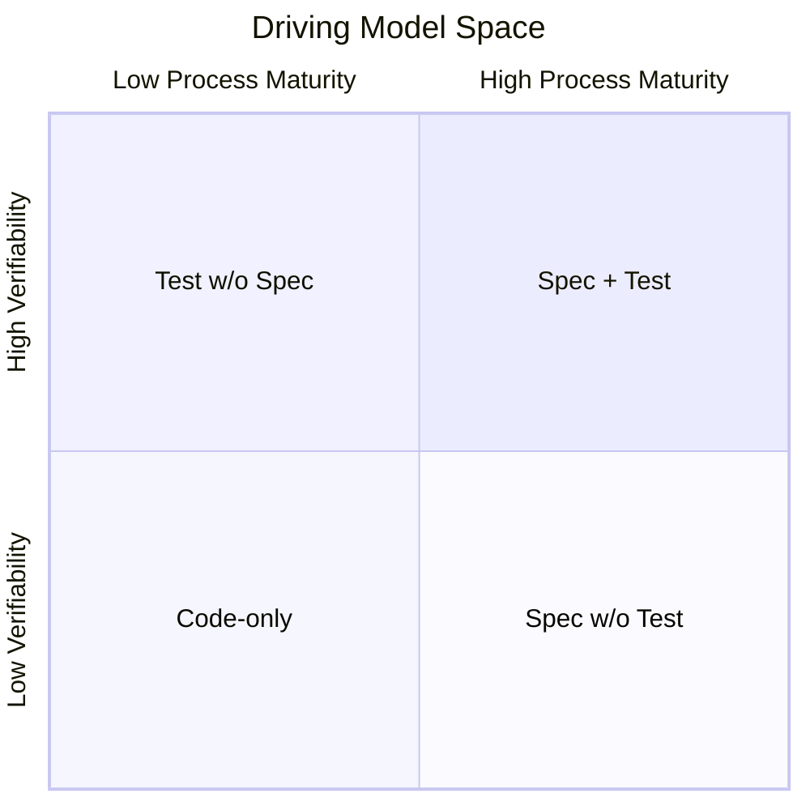
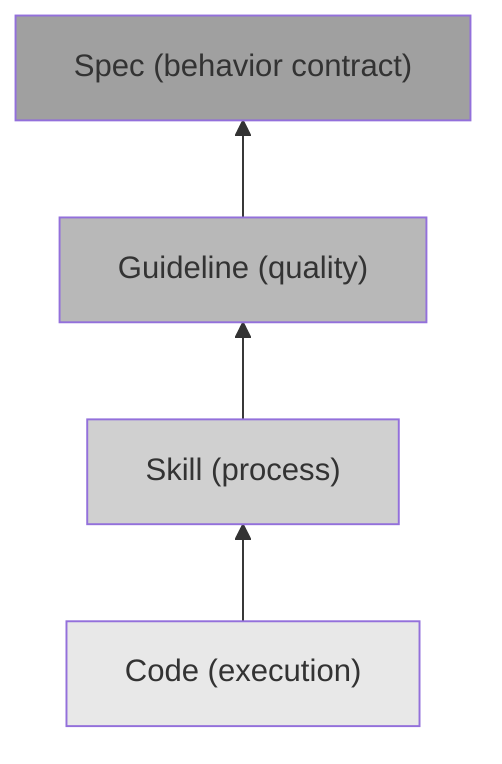

+++
title = "驅動模型的演化動力學：四加一結構與層疊共存"
date = "2026-03-09T23:00:03+08:00"
author = "TTL::0"
draft = false
isCJKLanguage = true
description = "五種驅動模型被獨立定義後，一個自然的問題浮現：它們之間的關係是什麼？是嚴格的線性序列——每個專案必須從程式碼驅動逐步走向規格驅動？還是自助餐——任意挑選、自由組合？"
tags = [
    "分析論述", # term:AnalyticalEssay
    "AI 代理人", # term:AiAgent
    "層疊共存", # term:LayeredCoexistence
    "正交性", # term:Orthogonality
    "儀式化採納", # term:RitualizedAdoption
    "跳層遷移", # term:LayerSkippingMigration
    "全域強制", # term:GlobalEnforcement
  ]
series = ["驅動模型：專案演化與範式遷移的自我迭代"]
[ai_info]
    [ai_info.generation]
        model = "Claude Opus 4.6"
        agent = "Claude Code VSCode Extension 2.1.72"
    [ai_info.refinement]
        model = "Gemini 3.5 Flash"
        agent = "Antigravity IDE 2.0.4"
+++

<!--more-->

## 背景

五種驅動模型被獨立定義後，一個自然的問題浮現：它們之間的關係是什麼？是嚴格的線性序列——每個專案必須從程式碼驅動逐步走向規格驅動？還是自助餐——任意挑選、自由組合？

兩種極端解讀都不符合觀察。線性序列暗示「更後面的模型更好」，忽略了語境的**決定性**（Deterministic） <!-- term:Deterministic -->作用。自助餐式的自由組合則忽略了模型之間存在的結構性依賴——有些模型在**前置條件**（Prerequisite） <!-- term:Prerequisite -->未滿足時強行導入，不會產生預期的效果。

> [!IMPORTANT]
> **決定性** <!-- term:Deterministic --> (Deterministic): 保證在相同的輸入與控制下，自動化管線每次執行所產出的文件結構與內容完全收斂一致的特性。 <!-- anchor:Deterministic -->
> **前置條件** <!-- term:Prerequisite --> (Prerequisite): 執行某項開發活動之前必須滿足的準備工作或狀態。 <!-- anchor:Prerequisite -->

本文分析驅動模型之間的演化結構，提出一個「四加一（four-plus-one）」的架構：四個模型構成一條流程成熟度的演化軸，測試驅動作為正交的可驗證性維度，兩軸獨立運作。

## 分析

### 測試驅動的正交性

五個模型中，測試驅動佔據一個獨特的位置。其他四個模型——程式碼驅動、技能驅動、**準則**（Guidelines） <!-- term:Guidelines -->驅動、規格驅動——各自回答的是流程層面的問題：「下一步的決策依據是什麼？」它們構成一條從「無外部結構」到「完整行為契約」的演化路徑。

> [!IMPORTANT]
> **準則** <!-- term:Guidelines --> (Guidelines): 強制性的專案準則，指導如何正確地做事 <!-- anchor:Guidelines -->

測試驅動回答的是一個不同維度的問題：「行為是否可驗證？」這個問題與流程成熟度正交。一個程式碼驅動的專案可以有完善的測試套件——測試驗證的是「程式碼做了什麼」，即使沒有規格定義「程式碼應該做什麼」。同樣，一個規格驅動的專案也可以沒有自動化測試——規格定義了**預期行為**（Expected Behavior） <!-- term:ExpectedBehavior -->，但驗證依賴人工檢查。

> [!IMPORTANT]
> **預期行為** <!-- term:ExpectedBehavior --> (Expected Behavior): 系統或模組在特定輸入或情境下被要求達到的正確輸出與副作用狀態 <!-- anchor:ExpectedBehavior -->

這個**正交性**（Orthogonality） <!-- term:Orthogonality -->可以用一個二維空間來視覺化：

> [!IMPORTANT]
> **正交性** <!-- term:Orthogonality --> (Orthogonality): 兩個設計維度或系統特質之間互不干涉、獨立運作的結構關係。 <!-- anchor:Orthogonality -->

左下角是純程式碼驅動（無流程結構、無自動化驗證）。右上角是規格驅動加測試驅動（完整行為契約加自動化驗證）。但左上和右下同樣是有意義的位置：有測試但沒有規格的專案（測試驅動的價值獨立於規格存在），以及有規格但沒有自動化測試的專案（規格的價值獨立於測試存在）。

正交性 <!-- term:Orthogonality -->的實踐意義在於：測試驅動可以在演化軸的任何位置被疊加，不需要等待流程成熟度達到某個門檻。一個程式碼驅動的專案引入測試驅動是合理的——它增加了行為的可驗證性，即使行為的意圖仍然隱含在程式碼中。

### 流程成熟度的演化軸

排除測試驅動後，剩餘四個模型構成一條演化軸。它們的排列不是任意的——每個模型解決的問題，是前一個模型的結構性缺口。

演化順序是：程式碼驅動 → 技能驅動 → **準則驅動**（Guideline-Driven） <!-- term:GuidelineDriven --> → 規格驅動。每一步遷移的觸發條件是前一個模型的結構性失敗變得不可忍受。下表呈現觸發條件：

> [!IMPORTANT]
> **準則驅動** <!-- term:GuidelineDriven --> (Guideline-Driven): 以自動化規則與檢查哨護欄引導系統演進的過程導向開發模式。 <!-- anchor:GuidelineDriven -->

| 從 | 到 | 觸發條件 | 核心缺口 |
|----|----|---------|---------|
| 程式碼驅動 | 技能驅動 | 操作流程不一致開始造成品質波動 | 缺乏流程標準化 |
| 技能驅動 | 準則驅動 <!-- term:GuidelineDriven --> | 技能被正確執行但產出品質不一致 | 缺乏品質定義 |
| 準則驅動 <!-- term:GuidelineDriven --> | 規格驅動 | 品質達標但無法回答「什麼行為算完成」 | 缺乏行為契約 |

遷移是單向的——不是因為技術上不能回退，而是因為每次遷移的觸發條件是前一個模型的結構性極限。回退意味著重新面對已被識別的極限。一個已經辨識出「操作不一致造成品質波動」的團隊，不會因為引入了技能驅動之後又故意放棄它——除非技能驅動本身引入了更大的問題。

但單向不代表不可跳躍。並非每個專案都必須經歷全部四個階段。如果一個專案的初始條件已經包含了前置模型的等效物（例如團隊成員自帶操作一致性的經驗），它可以跳過相應的階段直接進入更後面的模型。序列描述的是能力依賴關係，不是強制的時間順序。

### 層疊共存：演化是加法不是替換

演化軸的一個關鍵特性是：遷移到新模型不意味著前序模型消失。相反，前序模型降格為新模型的基礎設施層。

當專案從程式碼驅動遷移到技能驅動時，程式碼仍然是執行層——它沒有消失，只是不再持有決策權威。從技能驅動遷移到準則驅動 <!-- term:GuidelineDriven -->時，技能仍然處理流程，程式碼仍然是執行層——它們都繼續運作，只是準則 <!-- term:Guidelines -->現在是品質的決策權威。

這種層疊結構可以表示為：

每一層建立在前一層之上，但不取代它。這意味著到達規格驅動的專案同時擁有四層：規格定義行為契約，準則 <!-- term:Guidelines -->保證品質下限，技能確保流程一致，程式碼作為最終的執行層。四層各司其職，缺一不可——拿掉任何一層都會產生功能退化。

**層疊共存**（Layered Coexistence） <!-- term:LayeredCoexistence -->的另一個面向是維護成本的累加。每一層都需要維護：規格需要與需求同步，準則 <!-- term:Guidelines -->需要與技術演進同步，技能需要與工具鏈同步，程式碼需要與所有上層保持一致。這就是為什麼演化的時機很重要——每引入一層都增加維護成本，只有當前一層的結構性失敗成本超過新一層的維護成本時，遷移才是值得的。

> [!IMPORTANT]
> **層疊共存** <!-- term:LayeredCoexistence --> (Layered Coexistence): 新引入的決策模型不取代前序模型，而是將前序模型降格為其底層基礎設施共同運作的演化結構。 <!-- anchor:LayeredCoexistence -->

### 遷移的反模式

理解了演化結構後，可以辨識三種常見的遷移反模式。

**跳層遷移**（Layer-Skipping Migration） <!-- term:LayerSkippingMigration -->。 直接從程式碼驅動跳到規格驅動，跳過技能驅動和準則驅動 <!-- term:GuidelineDriven -->。結果是規格寫好了但沒有執行流程（缺技能層），執行了但品質不一致（缺準則 <!-- term:Guidelines -->層）。規格存在但不產生預期的效果——因為中間的基礎設施層缺失。這與「跳躍」不同：跳躍是因為前置條件 <!-- term:Prerequisite -->已被等效物滿足，跳層是在前置條件 <!-- term:Prerequisite -->未滿足時強行引入。

> [!IMPORTANT]
> **跳層遷移** <!-- term:LayerSkippingMigration --> (Layer-Skipping Migration): 在前置的流程或品質基礎設施尚未完備前，強行引入高階行為契約模型的演化反模式。 <!-- anchor:LayerSkippingMigration -->

**儀式化採納**（Ritualized Adoption） <!-- term:RitualizedAdoption -->。 引入了新的驅動模型但不真正讓它持有決策權威。例如，建立了規格但仍然以程式碼為準——規格變成需要維護但不被遵循的裝飾物。這比不引入更糟，因為它增加了維護成本卻不帶來收益。

> [!IMPORTANT]
> **儀式化採納** <!-- term:RitualizedAdoption --> (Ritualized Adoption): 形式上導入新的管理或技術模型，但實質決策權威並未真正轉移的無效演化反模式。 <!-- anchor:RitualizedAdoption -->

**全域強制**（Global Enforcement） <!-- term:GlobalEnforcement -->。 將最高層級的驅動模型強制應用於專案的所有模組。某些模組可能規模小、變更少、風險低——對它們而言，程式碼驅動或技能驅動就足夠了。全域強制 <!-- term:GlobalEnforcement -->規格驅動不是更嚴謹，而是過度工程——為低風險區域增加了不必要的維護負擔。

> [!IMPORTANT]
> **全域強制** <!-- term:GlobalEnforcement --> (Global Enforcement): 不顧模組的規模與風險差異，盲目對全系統統一實施最高抽象層級之行為規格定義的反模式。 <!-- anchor:GlobalEnforcement -->

三個反模式共享一個根因：忽略了演化結構的層疊性質。每一層的引入都有前置條件 <!-- term:Prerequisite -->和成本（新一層的維護負擔）。脫離這兩個考量的遷移，無論方向是否「正確」，都會產生問題。

## 結論

### 序列的普遍性

流程成熟度的演化軸（程式碼→技能→準則 <!-- term:Guidelines -->→規格）是否普遍適用？還是只在特定類型的專案中成立？

這個序列的底層邏輯是：每一步填補前一步的語意缺口。程式碼缺乏流程標準→技能填補。技能缺乏品質定義→準則 <!-- term:Guidelines -->填補。準則 <!-- term:Guidelines -->缺乏行為契約→規格填補。這個「缺口驅動填補」的模式是普遍的——只要專案的複雜度增長到足以暴露這些缺口。

但暴露的順序可能因專案而異。一個高度受規範的行業（金融、醫療）可能從第一天就需要行為契約——它的起點就是規格驅動。一個快速迭代的產品團隊可能在品質準則 <!-- term:Guidelines -->之前就需要行為規格——因為「什麼算完成」的問題比「什麼算好品質」更緊迫。

因此，演化軸描述的是能力依賴的邏輯順序，不是所有專案必須經歷的時間順序。大多數專案的實際經歷會大致遵循這個序列，但跳躍、並行、甚至局部回退都是可能的。

### 四加一是描述，不是規範

「四加一」架構本身也是一個驅動模型——它試圖為專案演化提供一個分析框架。作為分析框架，它的價值在於解釋力（能否幫助理解已觀察到的現象），不在於預測力（能否準確預測下一步該做什麼）。

真實專案的演化受到太多語境因素的影響——團隊文化、技術棧特性、商業壓力、歷史慣性——任何分析框架都無法將這些因素完整納入。「四加一」提供的是思考的骨架，不是行動的處方。

## 結論

驅動模型之間的關係不是線性序列也不是自由組合，而是一個有結構的演化框架。測試驅動作為正交的可驗證性維度，可以在任何階段疊加。程式碼驅動、技能驅動、準則驅動 <!-- term:GuidelineDriven -->、規格驅動構成流程成熟度的演化軸，每一步遷移填補前一步的結構性缺口。演化是加法不是替換——前序模型降格為基礎設施層，繼續運作。

三個可遷移的原則：

1. **測試驅動與流程成熟度正交，不應被排入演化序列。** 將測試驅動視為「程式碼驅動之後、技能驅動之前」的步驟，會導致錯誤的前置條件 <!-- term:Prerequisite -->假設——以為必須先有流程框架才能寫測試。實際上，測試可以在任何階段獨立引入，因為它解決的是可驗證性問題，不是流程成熟度問題。

2. **演化是層疊的——新模型建立在前序模型之上，不取代它。** 規格驅動的專案仍然需要準則 <!-- term:Guidelines -->、技能和程式碼。拿掉任何一層都會產生退化。這意味著每引入一層都增加維護成本，遷移的時機取決於成本交叉——當前一層的結構性失敗成本超過新一層的維護成本時。

3. **遷移反模式的共同根因是忽略層疊結構。** 跳層遷移 <!-- term:LayerSkippingMigration -->忽略前置條件 <!-- term:Prerequisite -->，儀式化採納 <!-- term:RitualizedAdoption -->忽略權威轉移，全域強制 <!-- term:GlobalEnforcement -->忽略模組差異。辨識這三個反模式比記住演化序列更有操作價值——因為大多數遷移失敗不是方向錯了，而是方式錯了。