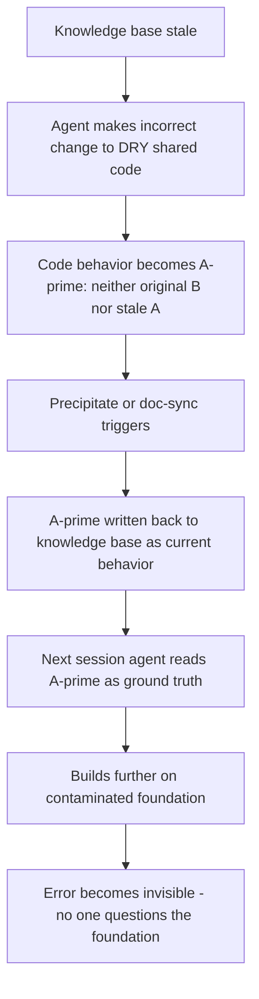
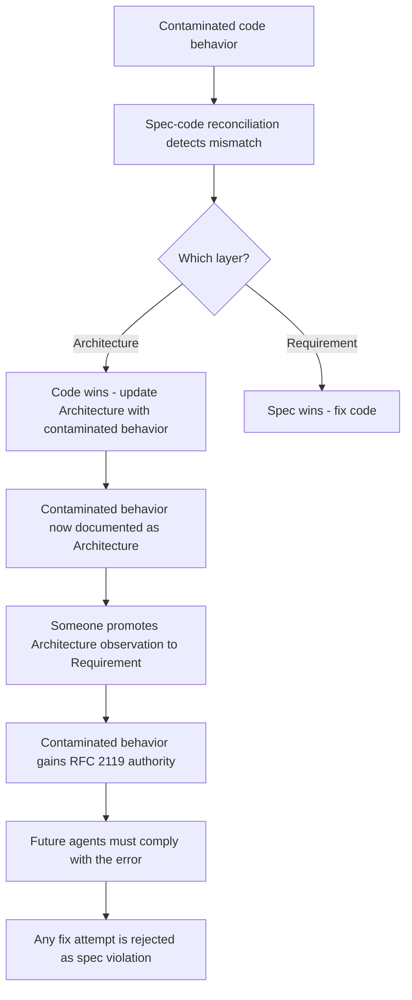

+++
title = "代碼整潔度的隱性危害：從單點風險到系統性崩潰"
date = "2026-03-11T22:30:02+08:00"
author = "TTL::0"
draft = false
isCJKLanguage = true
description = "Agent 是接龍狀態機——它的「存在」等於 context window 中可見的 token。在這個前提下，傳統代碼品質實踐的多個面向都可能製造因果斷裂（causal breakpoint）：封裝刪掉了局部上下文、設計模式引入了 runtime 才確定的綁定、抽象層數超出了 agent 的追蹤能力。"
tags = [
    "分析論述", # term:AnalyticalEssay
    "AI 代理人", # term:AiAgent
    "動態弱型別", # term:DynamicWeakTyping
    "二次污染", # term:SecondaryContamination
    "隱性非同步上下文", # term:ImplicitAsyncContext
  ]
series = ["接龍狀態機的因果斷裂：Agent 推理的本質限制"]
[ai_info]
    [ai_info.generation]
        model = "Claude Opus 4.6"
        agent = "Claude Code VSCode Extension 2.1.72"
    [ai_info.refinement]
        model = "Gemini 3.5 Flash"
        agent = "Antigravity IDE 2.0.4"
+++

<!--more-->

## 背景

Agent 是**接龍狀態機**（Sequence Completion Machine） <!-- term:SequenceCompletionMachine -->——它的「存在」等於 context window 中可見的 token。在這個前提下，傳統代碼品質實踐的多個面向都可能製造**因果斷裂**（Causal Breakpoint） <!-- term:CausalBreakpoint -->：封裝刪掉了局部上下文、設計模式引入了 runtime 才確定的綁定、抽象層數超出了 agent 的追蹤能力。

> [!IMPORTANT]
> **接龍狀態機** <!-- term:SequenceCompletionMachine --> (Sequence Completion Machine): 基於條件機率生成下一個 Token 的狀態機本質，其輸出取決於前文 Token 的統計分佈而非邏輯推理 <!-- anchor:SequenceCompletionMachine -->
> **因果斷裂** <!-- term:CausalBreakpoint --> (Causal Breakpoint): AI Agent 運算中由於上下文視窗或靜態程式碼中關鍵因果資訊缺失，導致無法正確推演系統狀態的現象 <!-- anchor:CausalBreakpoint -->


本文展開這些風險在具體代碼實踐中的表現，從單點的語意稀釋到設計模式和語法層面的風險分級，再到多重實踐疊加後的系統性崩潰——包括**二次污染**（Secondary Contamination） <!-- term:SecondaryContamination -->和 spec-driven 開發的污染終態。

> [!IMPORTANT]
> **二次污染** <!-- term:SecondaryContamination --> (Secondary Contamination): AI Agent 基於過時知識做出的錯誤程式碼修改，被反向同步或寫回知識庫並固化為新事實的現象 <!-- anchor:SecondaryContamination -->


## 分析：單點風險向量

### 語意稀釋

語意稀釋是指一個精確的概念被泛化表述取代後，喪失了區分力。判斷標準是：**代碼結構暗示的自由度，是否在系統中被實際使用？**

```javascript
// 稀釋：看似支援多種排序策略
function getSort(type) {
    if (type === 'name') return sortByName;
    if (type === 'date') return sortByDate;
    if (type === 'size') return sortBySize;
    return sortByName;
}

// 但所有呼叫端永遠只傳 'name'：
list.sort(getSort('name'));
```

```python
# 稀釋：看似支援多種排序策略
class SortableList:
    def sort(self, key: str = "name", reverse: bool = False,
             comparator: Callable = None, locale: str = None):
        if comparator:
            self.items.sort(key=comparator, reverse=reverse)
        elif key == "name":
            self.items.sort(key=lambda x: x.name, reverse=reverse)
        elif key == "date":
            self.items.sort(key=lambda x: x.date, reverse=reverse)
        # ... 更多分支

# 但全專案只有一個呼叫點：
file_list.sort("name")
```

```rust
// 稀釋：泛型暗示「任何 Sortable 都能用」
fn sort_items<T: Sortable>(items: &mut Vec<T>, strategy: SortStrategy) {
    match strategy {
        SortStrategy::ByName => items.sort_by(|a, b| a.name().cmp(&b.name())),
        SortStrategy::ByDate => items.sort_by(|a, b| a.date().cmp(&b.date())),
        SortStrategy::BySize => items.sort_by(|a, b| a.size().cmp(&b.size())),
    }
}

// 但全專案只有一個呼叫點：
sort_items(&mut files, SortStrategy::ByName);
// 泛型 T + enum SortStrategy 製造「雙重幻影自由度」——
// 強型別讓稀釋更隱蔽，因為它看起來像「設計良好的泛型」
```

三個分支和 `type` 參數暗示了一個**不存在的變化軸**。Agent 會認為系統有多種排序策略在運作，並在修改時小心翼翼地保護這些「策略」——但實際上它們從未被行使。沒有被使用的自由度就是稀釋，它消耗 agent 的注意力（context window 空間）去理解一個不會發生的可能性。

注意 Rust 的案例：強型別系統讓稀釋**更難被察覺**。泛型 `T: Sortable` + `SortStrategy` enum 看起來像合理的設計——型別檢查器會確保一切編譯通過——但實際上只有一條路徑被行使。型別安全不等於語意安全。

**高度抽象**（High Abstraction） <!-- term:HighAbstraction -->本身不等於稀釋。判斷線是：抽象所暗示的自由度，是否有 **≥ 2 個消費者**在行使不同路徑？有，就是合理的抽象。沒有，就是語意稀釋。這個判斷標準也適用於過早泛化（premature generalization）——只有一個消費者卻建了 interface + factory + registry 的情況。

> [!IMPORTANT]
> **高度抽象** <!-- term:HighAbstraction --> (High Abstraction): 隱藏底層實作細節以提供簡化介面的架構層級，若無多個消費者則容易退化為語意稀釋 <!-- anchor:HighAbstraction -->


### 設計模式風險分級

設計模式的 agent 風險取決於一個維度：**綁定關係是靜態可見還是 runtime 才確定**。Agent 的優勢是靜態分析，劣勢是 runtime 推演。凡是把決策從寫碼時推遲到 runtime 的模式，都在放大 agent 的劣勢。

下表按風險排序，高風險模式在上：

| 模式 | 風險 | Agent 斷點 |
|---|---|---|
| **Observer** | 高 | 無法靜態追蹤「誰在聽」；事件名是字串，grep 找到訂閱者但無法確認執行順序與副作用交互 |
| **Strategy** | 高 | Agent 必須遍歷所有實作才能判斷「當前場景走哪條」；單一實作時整個模式都是噪音 |
| **Decorator/Chain** | 高 | 行為在 runtime 疊加，靜態分析看不到最終組合，agent 對「這個呼叫實際做了什麼」的回答是機率性的 |
| **Mediator** | 高 | God object 風險——agent 的 context window 裝不下整個 mediator，局部閱讀導致遺漏協調邏輯 |
| **Abstract Factory** | 高 | 兩層間接（factory 選擇 + 產品建構），agent 需 3 次跳轉才看到實際物件，中途任一跳轉錯誤就全錯 |
| Template Method | 低 | 綁定在繼承鏈中可見 |
| Builder | 低 | 建構步驟在靜態程式碼中可見 |
| Facade | 低 | 簡化介面，減少而非增加跳轉 |

**高風險共性**：runtime 才確定的綁定關係。**低風險共性**：綁定在靜態結構中可見，agent 靠 grep + 繼承鏈就能完整追蹤。

### 危險語法：三種語言的風險光譜

與設計模式類似，語法層面的風險也來自同一個根源：讓「看到的」和「執行的」不一致。以下覆蓋**動態弱型別**（Dynamic Weak Typing） <!-- term:DynamicWeakTyping -->、**動態強型別**（Dynamic Strong Typing） <!-- term:DynamicStrongTyping -->、**靜態強型別**（Static Strong Typing） <!-- term:StaticStrongTyping -->三種語言，形成完整的風險光譜。

> [!IMPORTANT]
> **動態弱型別** <!-- term:DynamicWeakTyping --> (Dynamic Weak Typing): 在執行期才確定變數型別且允許隱式型別轉換的程式語言特性（如 JavaScript） <!-- anchor:DynamicWeakTyping -->
> **動態強型別** <!-- term:DynamicStrongTyping --> (Dynamic Strong Typing): 在執行期確定變數型別但禁止隱式型別轉換的程式語言特性（如 Python） <!-- anchor:DynamicStrongTyping -->
> **靜態強型別** <!-- term:StaticStrongTyping --> (Static Strong Typing): 在編譯期即確定變數型別且禁止隱式型別轉換的程式語言特性（如 Rust） <!-- anchor:StaticStrongTyping -->


**JavaScript**——盲區最廣泛：

| 語法 | 風險 | 原因 |
|---|---|---|
| Mixin（runtime 動態） | 極高 | 同名方法覆蓋順序取決於混入順序，agent 無法從單一文件判斷最終形態；ExtJS 的 `mixins` 尤其危險——覆蓋規則不同於 class 繼承 |
| Proxy / Reflect | 極高 | 攔截任意屬性存取，靜態分析完全失效，agent 看到 `obj.foo` 無法確定實際執行什麼 |
| Monkey Patching | 極高 | `SomeClass.prototype.method = ...` 在任意位置改寫行為，影響全域但 grep 只能找到賦值點，找不到影響範圍 |
| getter/setter | 中 | 看起來像屬性存取，實際執行函數；agent 常假設 `obj.x` 是純讀取而忽略副作用 |

```javascript
// Proxy：靜態分析完全失效
const handler = {
    get(target, prop) {
        console.log(`accessed ${prop}`);  // 副作用
        return prop in target ? target[prop] : fetchFromRemote(prop);
    }
};
const config = new Proxy({}, handler);
config.timeout;  // ← agent 以為是屬性讀取，實際可能觸發 HTTP 請求

// Mixin（ExtJS 風格）：覆蓋順序不可見
Ext.define('MyPanel', {
    mixins: ['Draggable', 'Resizable'],  // 兩者都定義 onMouseDown，誰贏？
    // agent 無法從這一行判斷——需要查看 mixins 源碼 + ExtJS 的混入優先規則
});
```

**Python**——盲區同樣廣泛，但形態不同：

| 語法 | 風險 | 原因 |
|---|---|---|
| `__getattr__` / `__getattribute__` | 極高 | 任意屬性存取被攔截，`obj.foo` 可能觸發 HTTP 請求、ORM 查詢 |
| Metaclass | 極高 | `class Foo(metaclass=Meta)` ——類別本身的建構過程被改寫，agent 看到 `class Foo` 不代表 Foo 長那樣 |
| Decorator 疊加 | 高 | `@cache @retry @auth def f()` ——三層包裝後，`f` 的簽名、回傳值、例外行為都與原始定義不同 |
| `*args, **kwargs` 透傳 | 高 | `def wrapper(*args, **kwargs): return inner(*args, **kwargs)` ——agent 無法從 wrapper 推斷 inner 接受什麼參數 |
| Mixin（多重繼承） | 高 | MRO 決定方法解析順序，`class C(A, B)` 和 `class C(B, A)` 行為不同，agent 常忽略順序差異 |
| `@property` | 中 | 看似讀屬性，實際可能觸發計算、I/O、甚至狀態修改 |

```python
# __getattr__：任意屬性存取變成 RPC 呼叫
class RemoteService:
    def __getattr__(self, name):
        def method_proxy(*args, **kwargs):
            return requests.post(f"{self.url}/{name}", json={"args": args})
        return method_proxy

svc = RemoteService(url="http://api.internal")
svc.get_users()  # ← agent 以為這是本地方法呼叫，實際是 HTTP POST

# Metaclass：類別建構過程被改寫
class AutoRegister(type):
    registry = {}
    def __new__(mcs, name, bases, namespace):
        cls = super().__new__(mcs, name, bases, namespace)
        mcs.registry[name] = cls  # 副作用：註冊到全域 registry
        return cls

class Handler(metaclass=AutoRegister):  # ← agent 看到 class 定義
    pass                                 #    看不到它已被註冊到某處
```

**Rust**——盲區集中但位於關鍵底層：

| 語法 | 風險 | 原因 |
|---|---|---|
| `dyn Trait`（動態分派） | 高 | 靜態分析只看到 trait 介面，看不到實際實作——等同 JS 的 runtime 綁定 |
| `macro_rules!` / proc macro | 高 | 展開後的代碼與源碼不同——等同 Python 的 metaclass，agent 讀的不是實際編譯的 |
| `unsafe` block | 高 | 編譯器保證在此區域失效，agent 無法依賴型別系統推斷正確性 |
| Trait blanket impl（`impl<T: X> Y for T`） | 中 | 隱式為所有符合條件的型別加方法，agent 看不到顯式的 impl 宣告 |
| `Deref` coercion | 中 | `obj.method()` 可能在解引用鏈上的任意層解析——等同 JS 的 getter 陷阱 |

```rust
// dyn Trait：靜態分析只看到介面
fn process(handler: &dyn EventHandler) {
    handler.on_event(event);  // ← 哪個實作？agent 只看到 trait 簽名
}

// proc macro：源碼 ≠ 編譯碼
#[derive(Builder)]       // ← 展開後生成數十行 impl 代碼
struct Config {          //    agent 讀到的 struct 定義不是完整的型別
    host: String,
    port: u16,
}
// 展開後 Config 有 ConfigBuilder、build()、set_host() 等
// 但源碼中完全看不到這些方法

// unsafe：編譯器保證失效
unsafe {
    let ptr = some_ptr as *mut Node;
    (*ptr).next = new_node;  // ← agent 無法依賴型別系統判斷正確性
                              //    生命週期、別名規則在此區域都不保證
}
```

三種語言的對比揭示了一個重要結論：強型別大幅縮小了 agent 的盲區面積，但沒有消除。JS/Python 的盲區是廣泛的（幾乎所有維度），Rust 的盲區是集中的（主要在動態分派和 macro 展開）。然而殘餘風險往往出現在系統最關鍵的底層——`unsafe` 和 proc macro 通常用在基礎設施代碼中，一旦 agent 在那裡犯錯，爆炸半徑最大。

### 隱性非同步上下文

**隱性非同步上下文**（Implicit Async Context） <!-- term:ImplicitAsyncContext -->是因果斷裂 <!-- term:CausalBreakpoint -->光譜中「從未存在」類型的極端案例。代碼語法上看起來是同步的，但實際執行涉及非同步時序，而中間可能發生的狀態變更**從未以 token 形式出現在代碼文本中**。

> [!IMPORTANT]
> **隱性非同步上下文** <!-- term:ImplicitAsyncContext --> (Implicit Async Context): 語法上呈同步形式但實際涉及非同步時序，且其狀態變更未在文本中留下 Token 提示的邏輯盲區 <!-- anchor:ImplicitAsyncContext -->


```javascript
const user = await getUser();
// ← 邏輯死區：其他 async 流可能已修改共享狀態
//    但這裡沒有任何 token 提示這個可能性
const order = await getOrder(user.id);
// agent 假設 user 還是剛才那個 user
```

```python
# Python 的 async/await 有相同的邏輯死區
async def process_order():
    user = await get_user()
    # ← 邏輯死區：其他 coroutine 可能已修改共享狀態
    #    asyncio event loop 在這裡讓出控制權
    order = await get_order(user.id)
    # agent 逐行閱讀，看不到 await 之間的世界變化
```

Agent 做因果推斷的方式是逐行順序模擬。兩個 `await` 之間的世界變化，在代碼文本中完全不可見。Agent 不是「看到了但理解錯」，而是那段因果鏈**從未存在於它的輸入中**。具體的失敗模式包括：忽略競態條件、按書寫順序推斷 `Promise.all` 的副作用執行順序、以及遺漏 `try/catch` 中並行操作已完成一半的錯誤路徑。

### 收束：代碼文本 ≠ 實際行為

以上所有風險向量——語意稀釋、高風險設計模式、危險語法、隱性非同步——共享同一個特徵：**代碼的文本表述與實際執行行為之間存在落差**。人類用直覺、經驗和主動探索來補全這個落差。Agent 只有 token 序列，落差就是盲區。

## 反思：從單點到系統性崩潰

單一的因果斷裂 <!-- term:CausalBreakpoint -->造成局部錯誤。但當多個代碼實踐同時製造因果斷裂 <!-- term:CausalBreakpoint -->，風險從線性相加升級為指數放大。

### DRY + 集中知識庫的疊加放大

DRY 消除重複後，代碼路徑收斂為唯一一份。**集中化知識庫**（Centralized Knowledge Base） <!-- term:CentralizedKnowledgeBase -->收斂理解來源為唯一一處。兩者同時收斂，agent 的**容錯餘裕**（Error Margin） <!-- term:ErrorMargin -->歸零：

> [!IMPORTANT]
> **集中化知識庫** <!-- term:CentralizedKnowledgeBase --> (Centralized Knowledge Base): 集中存放專案設計決策與知識的文件庫，過度收斂時會降低 Agent 面對過時資訊的容錯空間 <!-- anchor:CentralizedKnowledgeBase -->
> **容錯餘裕** <!-- term:ErrorMargin --> (Error Margin): 系統或 Agent 面對過時知識或錯誤修改時，能避免引發系統性崩潰的迴旋空間 <!-- anchor:ErrorMargin -->


| | 有重複 + 無知識庫 | DRY + 集中知識庫 |
|---|---|---|
| Agent 理解錯誤時 | 改壞一處，其他副本不受影響 | 改壞唯一一份，全部消費者受影響 |
| 知識過時時 | 每份副本有局部上下文可交叉驗證 | 唯一的理解來源就是過時的知識庫，無處交叉驗證 |
| 修復成本 | 低——局部修復 | 高——需理解所有消費者的差異需求 |

本質上，DRY 收斂了代碼路徑，集中知識庫收斂了理解來源。兩者同時收斂等於 agent 的容錯餘裕 <!-- term:ErrorMargin -->歸零。人類在這個架構下靠記憶和直覺補全，agent 沒有這兩樣東西。

### 二次污染的靜默固化

疊加放大不是終點。當錯誤修改的結果被**反向寫回知識庫**，錯誤從暫時狀態固化為「事實」——這就是二次污染 <!-- term:SecondaryContamination -->：



這條鏈是靜默的（silent）。每個階段看起來都像正常操作——代碼改了、文件同步了、下一個 session 正常工作。沒有任何環節會主動發出「這裡有污染」的訊號。人類團隊中，code review 或某個「記得原本怎樣」的資深成員可能攔截。Agent session 之間無記憶延續，每次都是全新的信任起點——知識庫寫什麼就信什麼。

### Spec-driven 的污染終態

二次污染 <!-- term:SecondaryContamination -->的最終形態是侵蝕規格本身。在**雙層規格結構**（Dual-Layer Spec） <!-- term:DualLayerSpec -->中，**架構層**（Architecture） <!-- term:Architecture --> 層的規則是「代碼贏——當代碼與 架構層 <!-- term:Architecture --> 矛盾時，更新 架構層 <!-- term:Architecture -->」。這條規則的設計意圖是允許代碼演進。但當代碼本身已被污染，這條規則就變成了**污染的高速公路**：

> [!IMPORTANT]
> **雙層規格結構** <!-- term:DualLayerSpec --> (Dual-Layer Spec): 將系統規格拆分為高層需求契約與底層行為觀察的架構設計方式 <!-- anchor:DualLayerSpec -->
> **架構層** <!-- term:Architecture --> (Architecture): 規格文件中用以客觀記錄系統「實際在做什麼」的事實陳述層。 <!-- anchor:Architecture -->




關鍵轉折點在於 架構層 <!-- term:Architecture --> → Requirement 的提升。這個提升的可逆性急劇下降：

| 階段 | 可逆性 |
|---|---|
| 代碼被污染 | 可逆——git revert |
| 架構層 <!-- term:Architecture --> 被更新 | 可逆——但需要有人意識到它是錯的 |
| 架構層 <!-- term:Architecture --> → Requirement 提升 | **幾乎不可逆**——後續所有 agent 都會「修正代碼以符合 spec」，將任何修復嘗試打回去 |

傳統開發中，過時的 spec 只是「沒人看的文件」。**spec-driven** 開發中，spec 是強制執行的契約。過時的 spec 不會被忽略，它會被 agent **主動執行**。這把「文件過時」從被動風險轉變為主動破壞力。

## 結論

代碼品質實踐的風險可以分為三個層級。第一層是單點風險：語意稀釋、高風險設計模式、危險語法、隱性非同步——每個都製造局部的因果斷裂 <!-- term:CausalBreakpoint -->。第二層是疊加風險：DRY + 集中知識庫同時收斂，agent 的容錯餘裕 <!-- term:ErrorMargin -->歸零。第三層是系統性崩潰：二次污染 <!-- term:SecondaryContamination -->靜默固化，直到 spec-driven 框架開始主動保護錯誤。

所有風險共享一個共同特徵：代碼文本 ≠ 實際行為。人類用直覺補全落差，agent 無法補全。認識到這個落差的存在，是設計有效回應方案的前提。