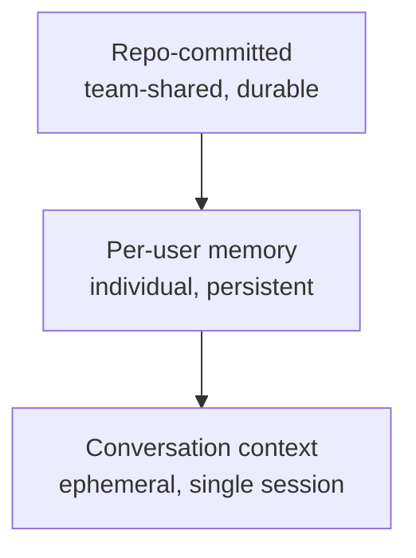

+++
title = "知識分層：AI 輔助團隊的記憶架構"
date = "2026-03-12T16:00:01+08:00"
author = "TTL::0"
draft = false
isCJKLanguage = true
description = "探討 AI Agent 引入後的倉庫層、個人記憶層與對話層三層知識模型，以及當上層缺失時的優雅退化設計與知識晉升觸發條件。"
tags = [
    "技術筆記", # term:TechnicalNote
    "AI 代理人", # term:AiAgent
    "持久記憶", # term:PersistentMemory
    "對話層", # term:ConversationContext
    "倉庫層", # term:RepoCommitted
    "個人記憶層", # term:PerUserMemory
    "可見性", # term:Visibility
  ]
[ai_info]
    [ai_info.generation]
        model = "Claude Opus 4.6"
        agent = "Claude Code VSCode Extension 2.1.72"
    [ai_info.refinement]
        model = "Gemini 3.5 Flash"
        agent = "Antigravity IDE 2.0.4"
+++

<!--more-->

## 問題

AI 輔助開發工具引入了一個新的基礎設施問題：知識應該存放在哪裡？傳統開發團隊的知識載體是程式碼、文件、和口頭溝通。AI agent 的加入增加了兩個新的儲存層——agent 的**持久記憶**（Persistent Memory） <!-- term:PersistentMemory -->和對話上下文。當這三個層次的邊界模糊時，團隊會遇到重複記錄、資訊過時、和知識找不到等問題。

> [!IMPORTANT]
> **持久記憶** <!-- term:PersistentMemory --> (Persistent Memory): 代理人跨對話維護的長期記憶，用於存放使用者偏好與互動規則。 <!-- anchor:PersistentMemory -->

這不是假想的風險。在實際操作中，一個常見的症狀是：agent 的記憶中記錄了程式碼結構資訊，但程式碼已經被重構——記憶和現實脫節，agent 根據過時資訊做出錯誤建議。另一個症狀是：團隊成員 A 在記憶中累積了大量專案脈絡，但團隊成員 B 的 agent 完全不知道這些脈絡——個人記憶無法支撐團隊協作。

## 調查

### 三層知識模型

觀察 AI agent 工具的實際運作，知識自然分佈在三個層次，每個層次有不同的耐久性（durability）、**可見性**（Visibility） <!-- term:Visibility -->和適用對象。

> [!IMPORTANT]
> **可見性** <!-- term:Visibility --> (Visibility): 知識在開發團隊或 AI 代理人之間的公開與可存取程度。 <!-- anchor:Visibility -->

下圖展示三層的關係——越上層越耐久、越共享，越下層越短暫、越個人：

**倉庫層**（Repo-Committed） <!-- term:RepoCommitted --> 是提交到版本控制的所有知識——程式碼、規格、**共置文件**（Co-Located Readme） <!-- term:CoLocatedReadme -->、規則定義。這一層對團隊所有成員可見，由版本控制保護，是最耐久的知識載體。它的更新成本最高（需要 commit），但可靠性也最高。

> [!IMPORTANT]
> **倉庫層** <!-- term:RepoCommitted --> (Repo-Committed): 提交至版本控制系統之專案倉庫的耐久知識，如程式碼、規格與規則。 <!-- anchor:RepoCommitted -->
> **共置文件** <!-- term:CoLocatedReadme --> (Co-Located Readme): 與程式碼放在相同倉庫目錄下的說明文件，利於隨時查閱。 <!-- anchor:CoLocatedReadme -->

**個人記憶層**（Per-User Memory） <!-- term:PerUserMemory --> 是 agent 為個別使用者維護的持久記憶 <!-- term:PersistentMemory -->。它跨對話存續，但只對單一使用者的 agent 可見。典型內容包括使用者的角色偏好、反覆出現的反饋、和外部系統的參照指引。這一層的耐久性介於倉庫和對話之間——它比對話長壽，但不受版本控制保護。

> [!IMPORTANT]
> **個人記憶層** <!-- term:PerUserMemory --> (Per-User Memory): 代理人為個別使用者維護的偏好與互動記憶，不提交至版本控制。 <!-- anchor:PerUserMemory -->

**對話層**（Conversation Context） <!-- term:ConversationContext --> 是單次對話中的即時上下文。它包含當前任務的推理過程、嘗試的方案、和中間結果。對話結束後，這些資訊只存在於壓縮的紀錄中，不再被主動使用。

> [!IMPORTANT]
> **對話層** <!-- term:ConversationContext --> (Conversation Context): 對話上下文在三層知識模型中所處的即時、短暫的資訊暫存層。 <!-- anchor:ConversationContext -->

### 優雅退化

三層模型的一個關鍵設計特性是優雅退化（graceful degradation）：當某一層缺失時，系統會穿透到下一層，而非停止運作。

規格不存在？穿透到共置文件 <!-- term:CoLocatedReadme -->。共置文件 <!-- term:CoLocatedReadme -->不存在？穿透到程式碼搜尋。個人記憶中沒有使用者偏好？使用預設行為。對話中沒有先前討論的脈絡？從頭推理。每一層的缺失都不是災難性的——它只是增加了推理的成本和降低了結果的精確度。

這個特性讓系統在任何知識密度下都能運作。一個全新加入的團隊成員，其 agent 的個人記憶是空的，倉庫層 <!-- term:RepoCommitted -->的規格可能稀疏，但系統仍然可以通過搜尋程式碼來工作。隨著使用時間增加，個人記憶層 <!-- term:PerUserMemory -->逐漸充實，規格逐漸豐富，系統的效率自然提升——但從未有一個「必須先準備好才能開始」的門檻。

### 反模式

三層模型的邊界清晰時運作良好，但實踐中容易出現三種反模式。

**反模式一：在耐久層存放短暫狀態。** 把當前任務的進度、暫時的除錯線索、或待辦事項存入個人記憶。這些資訊在當前對話結束後就失去意義，但會持續佔據記憶空間，增加 agent 的雜訊。正確做法是使用對話內的任務追蹤（task tracking），而非記憶。

**反模式二：在記憶中複製倉庫知識。** 把程式碼結構、檔案路徑、或 API **形狀**（Data Shape） <!-- term:DataShape -->記錄在個人記憶中。這些資訊的權威來源是程式碼本身——記憶中的副本會在程式碼變更後立即過時，且沒有機制觸發同步更新。正確做法是讓 agent 在需要時直接讀取程式碼。

> [!IMPORTANT]
> **形狀** <!-- term:DataShape --> (Data Shape): 資料結構或物件所包含的屬性與型別定義，通常由型別系統來描述 <!-- anchor:DataShape -->

**反模式三：把記憶當作文件。** 嘗試在個人記憶中建立完整的專案知識庫，記錄架構決策、設計原理、歷史脈絡。這些知識如果有價值，就應該存在倉庫層 <!-- term:RepoCommitted -->供團隊共享。記憶的正確用途是記錄「關於使用者的資訊」和「關於如何與使用者互動的資訊」，不是「關於專案的資訊」。

### 知識晉升的觸發條件

知識什麼時候應該從一個層次移動到另一個層次？這裡列出四個晉升觸發條件（promotion trigger）。

第一，**重複出現**。同一個知識在多次對話中被需要。如果 agent 在第三次對話中又需要相同的脈絡，這個脈絡應該從對話層 <!-- term:ConversationContext -->晉升到記憶層。如果這個脈絡對團隊其他成員也有價值，它應該進一步晉升到倉庫層 <!-- term:RepoCommitted -->。

第二，**決策約束**。知識影響了實作決策。對話中發現的一個設計約束，如果會影響未來的實作方向，不應該留在對話層 <!-- term:ConversationContext -->等待被遺忘。根據約束的範圍——個人偏好晉升到記憶層，團隊共享的設計原則晉升到倉庫層 <!-- term:RepoCommitted -->。

第三，**校正反饋**。使用者糾正了 agent 的行為。這類知識幾乎總是應該晉升到記憶層，因為它代表使用者的期望和 agent 的預設行為之間存在落差。不晉升就意味著使用者必須在每次對話中重複同樣的糾正。

第四，**跨人員價值**。知識對團隊其他成員也有用。這是從記憶層晉升到倉庫層 <!-- term:RepoCommitted -->的核心判斷——個人記憶只服務一個人，倉庫知識服務整個團隊。當一個洞察的價值超越個人使用場景時，它應該被提交到版本控制。

值得注意的是，知識也可以跳層晉升。一個在對話中發現的重要設計約束，可能直接晉升到倉庫層 <!-- term:RepoCommitted -->，跳過記憶層——因為它的價值本質上是團隊級的，不是個人級的。

### 退化失敗模式

優雅退化的前提是「下一層能提供足夠的替代資訊」。當這個前提不成立時，退化就會失敗。

**倉庫層 <!-- term:RepoCommitted -->缺失的影響最大。** 如果程式碼本身不清晰（命名模糊、結構混亂），穿透到程式碼搜尋也無法獲得可靠的理解。這就是為什麼「程式碼自我文件化」（code as documentation）是基礎性要求——它不只服務人類讀者，也是 AI agent 退化路徑的最後防線。

**記憶層缺失的影響中等。** 沒有個人記憶，agent 會使用預設行為，這通常是可接受的。真正的損失在於累積的互動偏好——使用者需要重新教導 agent 自己的工作方式。對於新成員，這個成本是不可避免的；對於系統遷移或記憶遺失，這個成本是令人沮喪的重複勞動。

**對話層 <!-- term:ConversationContext -->的退化是常態。** 長對話會觸發**上下文壓縮**（Context Compression） <!-- term:ContextCompression -->，細節被摘要取代。這不是失敗——它是設計中的必然。正確的應對是在壓縮發生前，把有價值的知識晉升到更耐久的層次。這正是**蒸餾**（Distill） <!-- term:Distill -->和**結晶**（Crystallize） <!-- term:Crystallize -->等工具存在的原因。

> [!IMPORTANT]
> **上下文壓縮** <!-- term:ContextCompression --> (Context Compression): AI 對話中因長度限制而自動摘要上下文的機制 <!-- anchor:ContextCompression -->
> **蒸餾** <!-- term:Distill --> (Distill): 從長對話或大量開發脈絡中萃取關鍵資訊的處理過程。 <!-- anchor:Distill -->
> **結晶** <!-- term:Crystallize --> (Crystallize): 將蒸餾後的關鍵知識沉澱並結構化為正式報告或規格的過程。 <!-- anchor:Crystallize -->

## 發現

三層知識模型的核心洞察是：每一層的存在不是為了追求完整性，而是為了在其上方的層次不可用時提供退化路徑。這個設計哲學決定了每一層應該存放什麼——不是「什麼知識最重要」，而是「當上層缺失時，這一層能提供什麼替代」。

這解釋了為什麼個人記憶不應該複製倉庫知識：倉庫層 <!-- term:RepoCommitted -->是最可靠的，它的存在使得記憶層不需要承擔「專案知識」的責任。記憶層的真正價值是存放倉庫層 <!-- term:RepoCommitted -->無法表達的東西——個人偏好、互動反饋、外部參照。

這也解釋了語言選擇的邏輯。當文件的**主要消費者**（Primary Consumer） <!-- term:PrimaryConsumer -->是 AI agent 時，使用 English 讓 agent 的處理效率最高。當文件的主要消費者 <!-- term:PrimaryConsumer -->是人類團隊成員時，使用團隊的工作語言（如正體中文）讓理解成本最低。這不是「哪個語言更好」的問題——是「誰在讀」的問題。規格文件由 agent 頻繁解析，用 English；報告由人類閱讀內化，用母語。消費者身份決定語言選擇（consumer-driven language selection），而非內容性質。

> [!IMPORTANT]
> **主要消費者** <!-- term:PrimaryConsumer --> (Primary Consumer): 使用或解讀特定文件/知識的核心對象（如代理人或人類團隊成員）。 <!-- anchor:PrimaryConsumer -->

## 應用

將這個模型應用到團隊協作，有三個實踐建議。

第一，**區分個人記憶和團隊知識的提交路徑。** 個人記憶存放在使用者的 agent 設定目錄中（如 `~/.claude/projects/`），不提交到版本控制。團隊知識透過規格、共置文件 <!-- term:CoLocatedReadme -->、和規則定義提交到倉庫。兩者不應混合——個人記憶提交到版本控制會把個人偏好強加給團隊，團隊知識存在個人記憶中會創造資訊孤島。

第二，**建立晉升習慣而非晉升制度。** 要求團隊成員在每次對話後填寫知識晉升清單是不切實際的。更有效的做法是培養判斷力：當你第三次在對話中解釋同一件事時，它該晉升了。當你的 agent 給出錯誤建議，而糾正後的理解對同事也有用時，它不該只留在你的記憶裡。

第三，**接受非對稱的知識密度。** 團隊中不同成員的個人記憶密度會不同，不同領域的規格覆蓋率也會不同。這不是需要修正的不平衡——它是系統在不同成熟度下的自然狀態。優雅退化的設計保證了：即使某個層次完全空白，系統仍然能運作，只是效率較低。追求均勻的知識密度是誤用的完美主義。