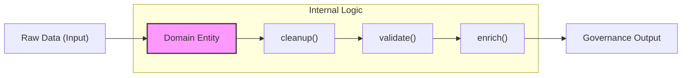

+++
title = "領域驅動架構與 AI Agent 的協作效能：從認知壓縮到行為護攔"
date = "2026-03-29T02:25:01+08:00"
author = "TTL::0"
draft = false
isCJKLanguage = true
description = "分析如何透過領域驅動架構（DDD）進行系統重組，將散亂的程序化腳本壓縮為具備自癒能力的領域實體，以降低 AI Agent 的認知摩擦與搜尋熵，從而建立行為護攔並提升人機協作效率。"
tags = [
    "技術筆記", # term:TechnicalNote
    "AI 代理人", # term:AiAgent
    "分析論述", # term:AnalyticalEssay
    "AI 治理", # term:AIGovernance
    "認知壓縮", # term:CognitiveCompression
    "行為護攔", # term:BehavioralSafeguards
    "架構熵", # term:ArchitecturalEntropy
    "搜尋熵", # term:SearchEntropy
  ]
[ai_info]
    [ai_info.generation]
        model = "Gemini 3 Flash"
        agent = "Antigravity IDE 1.19.6.0"
    [ai_info.refinement]
        model = "Gemini 3.5 Flash"
        agent = "Antigravity IDE 2.0.4"
+++

<!--more-->

## 1. 導言：系統熵增與認知摩擦

在自動化內容生產管線的發展初期，開發者傾向於利用「**程序化腳本**（Procedural Scripts） <!-- term:ProceduralScripts -->」解決即時問題。這種模式雖能提供極高的初始開發速度，卻也埋下了 **「**架構熵**（Architectural Entropy） <!-- term:ArchitecturalEntropy -->」** 的種子。隨著業務邏輯分層（如術語鎖定、格式修復）日益複雜，**代理人**（AI Agent） <!-- term:AiAgent --> 在操作時會展現出嚴重的認知摩擦：由於邏輯散落在多個獨立腳本中，Agent 必須讀取大量無關代碼來定位一個簡單的清理行為。

> [!IMPORTANT]
> **程序化腳本** <!-- term:ProceduralScripts --> (Procedural Scripts): 以步驟或指令為導向的自動化腳本，通常缺乏物件導向或領域建模的抽象設計。 <!-- anchor:ProceduralScripts -->
> **架構熵** <!-- term:ArchitecturalEntropy --> (Architectural Entropy): 隨著系統功能增加與重複修改，軟體架構逐漸走向無序、混亂且認知成本增加的狀態。 <!-- anchor:ArchitecturalEntropy -->
> **AI 代理人** <!-- term:AiAgent --> (AI Agent): 具備自主理解、推論與程式碼生成能力，能在給定規則下執行特定任務的 AI 協作者。 <!-- anchor:AiAgent -->

本文分析如何透過 **領域驅動架構 (Domain-Driven **架構層**（Architecture） <!-- term:Architecture -->, DDD)** 進行物理級的架構重組，將散亂的命令壓縮為具備自癒能力的「**領域實體**（Domain Entity） <!-- term:DomainEntity -->」，並最終達成人類與 AI **代理人** <!-- term:AiAgent -->之間的高效協作。

> [!IMPORTANT]
> **架構層** <!-- term:Architecture --> (Architecture): 規格文件中用以客觀記錄系統「實際在做什麼」的事實陳述層。 <!-- anchor:Architecture -->
> **領域實體** <!-- term:DomainEntity --> (Domain Entity): 領域驅動設計中具有唯一識別標識，且其生命週期與狀態變化在業務邏輯中至關重要的領域物件。 <!-- anchor:DomainEntity -->

## 2. 分析

### 2.1 認知壓縮：降低 Agent 的搜尋熵

當 代理人 <!-- term:AiAgent --> 處理複雜任務時，其決策路徑常被非標準化的腳本結構切斷。在遺產架構中，由於行為與數據物理分離，Agent 無法確定特定的校正步驟是否已感知最新的系統狀態。這種 **「**狀態不確定性**（State Uncertainty） <!-- term:StateUncertainty -->」** 迫使 Agent 執行額外的檢查步驟，佔用了寶貴的上下文窗口）。

> [!IMPORTANT]
> **狀態不確定性** <!-- term:StateUncertainty --> (State Uncertainty): 在行為與數據分離的架構下，AI Agent 無法確定當前讀取的狀態是否為最新單一真相來源的情況。 <!-- anchor:StateUncertainty -->

透過將行為收納至領域實體 <!-- term:DomainEntity -->，我們實現了 **「**認知壓縮**（Cognitive Compression） <!-- term:CognitiveCompression -->」**。當 Agent 呼叫一個實體方法時，它是在調用一個經過驗證的「邏輯封包」，而不需要關心內部的實作細節，這極大化了處理複雜任務的 **「**語意解析度**（Semantic Resolution） <!-- term:SemanticResolution -->」**。

> [!IMPORTANT]
> **認知壓縮** <!-- term:CognitiveCompression --> (Cognitive Compression): 透過抽象化、封裝與語意簡化，降低 AI Agent 或開發者理解與維護程式碼所需的認知負荷。 <!-- anchor:CognitiveCompression -->
> **語意解析度** <!-- term:SemanticResolution --> (Semantic Resolution): 程式碼或接口所表達之業務意圖的清晰度，高解析度有助於降低 AI 的理解偏誤與搜尋熵。 <!-- anchor:SemanticResolution -->

### 2.2 從命令式到宣告式：領域實體的自癒能力

將操作邏輯遷移至領域類別內部，標誌著從 **「**命令式**（Imperative） <!-- term:Imperative -->」** 到 **「**宣告式**（Declarative） <!-- term:Declarative -->」** 的治理轉向。

> [!IMPORTANT]
> **命令式** <!-- term:Imperative --> (Imperative): 一種編程或治理正規，強調明確指定執行步驟與控制流來達到目標。 <!-- anchor:Imperative -->
> **宣告式** <!-- term:Declarative --> (Declarative): 一種編程或治理正規，僅描述預期達成的狀態或目標，將具體執行與自癒細節委派給底層實體或系統。 <!-- anchor:Declarative -->

**敘事連結**：在這種架構下，代理人 <!-- term:AiAgent --> 只需要判斷「是否需要執行維護」，而「如何維護」則是由領域對象本能地執行。這種行為邊界的劃分，為 Agent 建立了一套物理級的 **「**行為護攔**（Behavioral Safeguards） <!-- term:BehavioralSafeguards -->」**，防止了過往因腳本衝突導致的資料結構崩潰。

> [!IMPORTANT]
> **行為護攔** <!-- term:BehavioralSafeguards --> (Behavioral Safeguards): 在軟體架構或 AI 協作設計中，為限制或約束 AI Agent 操作邊界而建立的防禦性機制與實體規則。 <!-- anchor:BehavioralSafeguards -->

### 2.3 雙向真相來源與同步機制

治理的核心在於對 **「單一真相來源 (**單一事實來源**（Single Source of Truth） <!-- term:SingleSourceOfTruth -->, SSOT)」** 的維護。透過建立領域實體 <!-- term:DomainEntity -->間的同步機制，解決了人類編輯（非結構化）與機器處理（結構化）之間的時序衝突。

> [!IMPORTANT]
> **單一事實來源** <!-- term:SingleSourceOfTruth --> (Single Source of Truth): 指在特定工作執行緒中唯一被視為絕對真實與合法的結構化資料來源，所有操作皆以其為單向基準。 <!-- anchor:SingleSourceOfTruth -->

- **狀態鑑定**：透過同步檢查，自動觸發從「可讀源」向「可機讀源」的狀態遷移。
- **因果發布**（Causal Release） <!-- term:CausalRelease -->：當 代理人 <!-- term:AiAgent --> 釋放新規則時，它透過領域接口執行補足動作，確保所有後續生產步驟都能即時感知新狀態，建立了一種強固的因果鏈。

> [!IMPORTANT]
> **因果發布** <!-- term:CausalRelease --> (Causal Release): 當系統或 AI Agent 發布新規範時，依循明確的因果鏈同步更新所有相關狀態，確保依賴步驟即時感知的機制。 <!-- anchor:CausalRelease -->

## 3. 反思

重構的過程揭示了 AI 友善架構的未來方向：代碼不應執行「讓電腦執行」，更應是「讓 AI 理解其意圖與限制」。當架構具備了 **「**自描述性**（Self-Descriptive） <!-- term:SelfDescriptive -->」**，代理人 <!-- term:AiAgent --> 就能從一個工具執行者，轉型為一位熟知領域規則的「執法者」。

> [!IMPORTANT]
> **自描述性** <!-- term:SelfDescriptive --> (Self-Descriptive): 程式碼、架構或後設資料本身即包含其設計意圖、約束與操作說明，使 AI Agent 無需外部文件即可理解其語意。 <!-- anchor:SelfDescriptive -->

## 4. 實務對比

| 維度 | **遺產腳本模式**（Legacy Script Pattern） <!-- term:LegacyScriptPattern --> | 領域驅動模式 |
| :--- | :--- | :--- |
| **行為調度** | `subprocess.call(["script.py", target])` (意圖不明，Agent 須處理底層路徑) | `entity.execute_task(context)` (意圖顯式，實體狀態轉換可追蹤) |
| **路徑治理** | 硬編碼相對路徑 `../../db/` | 透過基礎設施配置提供路徑常量 |
| **品質驗證** | 依賴外部程序進行檢查 (檢查與對象隔離，修正動作延遲) | 實體預載審計行為，即時反饋閉環 |

> [!IMPORTANT]
> **遺產腳本模式** <!-- term:LegacyScriptPattern --> (Legacy Script Pattern): 指程式碼庫中零散、未經分層且直接呼叫作業系統路徑的命令式程序化腳本執行模式。 <!-- anchor:LegacyScriptPattern -->

## 5. 結論

領域驅動架構成功地將生產管線從「不穩定狀態」拉回到「可管理邊界」。對於 代理人 <!-- term:AiAgent --> 而言，這種架構重疊不僅僅是代碼格式的清理，更是 **「**認知效率**（Cognitive Efficiency） <!-- term:CognitiveEfficiency -->的升級」**。當領域邊界被清晰劃定，AI 生產力的釋放將不再受限於處理零星的語法錯誤，而是能全面轉向對高價值知識特徵的深度挖掘。

> [!IMPORTANT]
> **認知效率** <!-- term:CognitiveEfficiency --> (Cognitive Efficiency): AI Agent 或人類在理解、分析或執行系統任務時的思維轉換效率與速度。 <!-- anchor:CognitiveEfficiency -->
