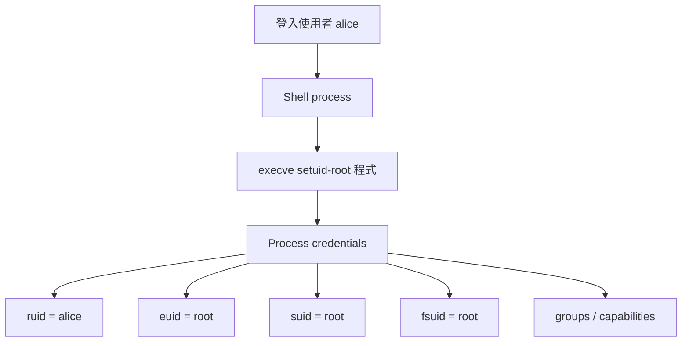
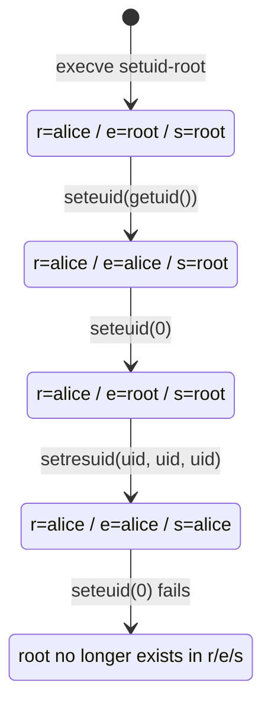

+++
title = "一個 Process 到底是誰：Linux Credentials 的主體模型"
date = "2026-06-10T16:56:01+08:00"
author = "TTL::0"
draft = false
isCJKLanguage = true
description = "在 kernel 眼中，一個 process 不是單一 UID，而是一組可轉換的 credentials。本文建立 process 作為權限主體的狀態模型，解析 real / effective / saved UID、setuid 與降權如何決定它當下與未來能做什麼。"
tags = [
    "分析論述", # term:AnalyticalEssay
    "AI 代理人", # term:AiAgent
    "分析論文", # term:AnalyticalEssay
    "實務對比", # term:PracticalContrastiveExamples
    "不同角色", # term:DifferentRoles
    "最小權限", # term:LeastPrivilege
    "形狀", # term:DataShape
  ]
series = ["Linux 權限模型：從 Process 主體到 Sandbox 邊界的完整推理弧"]
[ai_info]
    [ai_info.generation]
        model = "GPT 5.5"
        agent = "Codex VS Code extension 26.602.71036"
    [ai_info.refinement]
        model = "Claude Opus 4.8"
        agent = "Claude Code VSCode Extension 2.1.170"
+++

---

<!--more-->

## 導言

Linux 權限模型最容易誤解的地方，是把「登入使用者」直接等同於「程式執行時的權限」。這個簡化在一般命令列操作中常常夠用，但一遇到 setuid 程式、daemon 降權、container 或 socket daemon，就會失準。

本文的問題是：一個 process 在 kernel 眼中到底是誰？答案不是單一 UID，而是一組可轉換的 credentials。這組狀態決定 process 當下能做什麼，也決定它未來能不能重新取得曾經擁有的權限。

---

## 分析

### Credentials 是 process 的主體狀態

Process 是執行單位，但權限判斷並不直接等同於 process ID。Kernel 會從目前執行的 task 找到 credentials，再依照操作類型使用其中不同欄位。



這張圖的重點是：啟動者仍然是 alice，但 process 的 effective UID 可以變成 root。權限檢查問的不是「誰登入」，而是「這個 process 當下帶著哪份 credentials」。

四個 UID 各自扮演**不同角色**（Different Roles） <!-- term:DifferentRoles -->：

> [!IMPORTANT]
> **不同角色** <!-- term:DifferentRoles --> (Different Roles): 在 1:N 協作拓撲中，將 Agent 分配為生成者與審查者等不同職責角色進行協作，藉由職能分工與視角差異來發現設計缺陷。 <!-- anchor:DifferentRoles -->


| 欄位 | 角色 | 權限意義 |
|---|---|---|
| real UID | 誰啟動 process | 保留起源身份，常用於歸屬與部分互動檢查 |
| effective UID | 現在用誰的權限 | 多數特權判斷的主要輸入 |
| saved-set UID | 能不能切回舊權限 | 讓 setuid 程式暫時降權後仍可復權 |
| filesystem UID | 檔案系統存取身份 | VFS 權限檢查使用的身份 |

這四者不是為了複雜而複雜。它們讓 process 可以把「起源」、「當下權限」、「可復權能力」與「檔案存取身份」分開管理。

### execve 是身份轉換的關鍵時刻

當 process 呼叫 `execve()` 載入新程式，原本的 process image 被替換，但 real UID 不會因此改變。若目標檔案有 set-user-ID bit，新的 effective UID 會變成檔案擁有者。

```text
alice 執行 setuid-root 程式後：

ruid  = alice
euid  = root
suid  = root
fsuid = root
```

這裡的關鍵不是「alice 變成 root」，而是「這個 process 的 effective identity 暫時變成 root」。saved-set UID 同步保存 root，代表 process 後續可以在低權限與 root 之間切換。

### 暫時降權與永久降權是兩種不同承諾

暫時降權只改變當下 effective UID。它降低了普通執行區段的權限，但並未移除未來復權能力。



這個狀態圖把**最小權限**（Least Privilege） <!-- term:LeastPrivilege -->的第一個分岔畫出來：暫時降權仍保留 root 作為 saved-set UID；永久降權則把 root 從 real、effective、saved 三個欄位中移除。

> [!IMPORTANT]
> **最小權限** <!-- term:LeastPrivilege --> (Least Privilege): 讓 process 在每個生命週期階段只保留必要能力的設計原則，透過 capabilities、namespace、seccomp、LSM 與 cgroup 等層共同收斂權限邊界。 <!-- anchor:LeastPrivilege -->


永久降權的安全價值在於不可逆。當 process 進入長時間主迴圈、處理外部輸入或載入插件時，保留 saved root 會擴大攻擊面。若攻擊者能劫持控制流，`seteuid(0)` 就可能把 root 拿回來。

---

## 結論

Process credentials 展現了一種重要設計：權限不是單一標籤，而是生命週期狀態。啟動、初始化、服務請求、清理，每個階段需要的權限不同，因此同一個 process 在不同階段也應該有不同的權限**形狀**（Data Shape） <!-- term:DataShape -->。

> [!IMPORTANT]
> **形狀** <!-- term:DataShape --> (Data Shape): 資料結構或物件所包含的屬性與型別定義，通常由型別系統來描述 <!-- anchor:DataShape -->


這個模型的邊界是 capabilities。現代 Linux 不只問 `euid == 0`，還會問 process 是否帶有某個細粒度能力，例如 `CAP_SETUID` 或 `CAP_NET_BIND_SERVICE`。因此「不是 root」不必然等於「沒有特權」，而「需要一個特權操作」也不必然需要完整 root。

另一個容易漏掉的邊界是 group。只降 UID 而不清 supplementary groups，會造成表面上已降權、實際仍保留群組權限的狀態。這種殘留權限比明顯的 root 更難被肉眼發現。

---

## 實務對比

以下對比鎖定一個常見誤差：把暫時降權當成永久降權。

**錯誤：只放下 effective UID，卻保留 saved root。**

```c
seteuid(getuid());
run_untrusted_loop();
```

這段程式在主迴圈中看似以普通使用者執行，但 saved-set UID 仍可能是 root。一旦控制流被不可信輸入劫持，復權路徑仍然存在。

**正確：初始化後不可逆地移除 root。**

```c
setgroups(1, &gid);
setresgid(gid, gid, gid);
setresuid(uid, uid, uid);

if (setresuid(0, 0, 0) == 0) {
    abort();
}
```

這個版本先處理群組，再處理使用者身份，最後驗證不能復權。它不是只改變「現在用誰執行」，而是刪除「未來能回到誰」。

---

## 結論

Linux process credentials 的核心原理是：process 的權限身份是一組可轉換狀態，而不是登入使用者的一個靜態副本。

最小權限 <!-- term:LeastPrivilege -->因此不是一句「不要用 root」。更精確的公式是：在每個生命週期階段，只保留該階段必要的 effective identity、group 與 capability；一旦不再需要，就不可逆地移除復權路徑，並驗證移除成功。