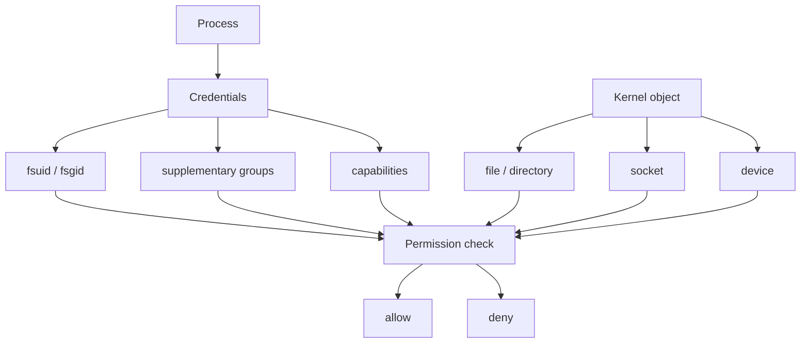
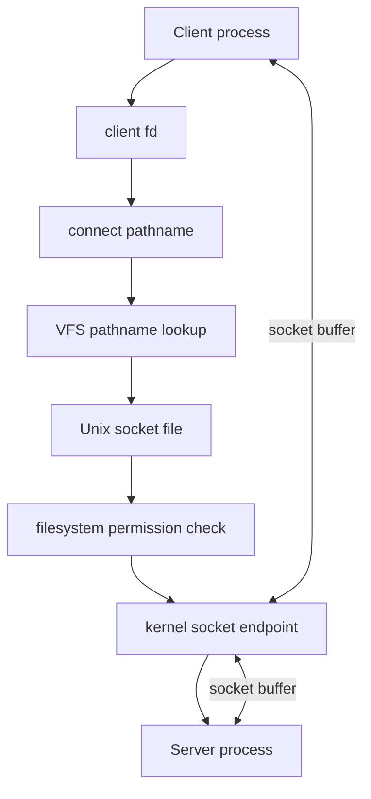

+++
title = "檔案、Socket 與 Kernel Object：權限檢查如何把主體接到客體"
date = "2026-06-10T16:56:02+08:00"
author = "TTL::0"
draft = false
isCJKLanguage = true
description = "process credentials 是主體，檔案、目錄、socket、device 則是客體。本文說明 kernel 如何把主體接到不同類型的 kernel object，並解析 Unix socket file 為何同時受 filesystem 權限與 socket IPC 規則約束。"
tags = [
    "分析論述", # term:AnalyticalEssay
    "AI 代理人", # term:AiAgent
    "分析論文", # term:AnalyticalEssay
    "實務對比", # term:PracticalContrastiveExamples
    "反思", # term:Reflection
    "導言", # term:Introduction
  ]
series = ["Linux 權限模型：從 Process 主體到 Sandbox 邊界的完整推理弧"]
[ai_info]
    [ai_info.generation]
        model = "GPT 5.5"
        agent = "Codex VS Code extension 26.602.71036"
    [ai_info.refinement]
        model = "Claude Opus 4.8"
        agent = "Claude Code VSCode Extension 2.1.170"
+++

---

<!--more-->

## 導言

理解 process credentials 之後，下一個問題是：process 要碰外部物件時，kernel 到底檢查什麼？檔案、目錄、socket、pipe、device 都可能透過 file descriptor 被操作，但它們不是同一種物件。

本文的核心論點是：filesystem 權限與 socket 權限不是兩套互斥世界。它們共享 process credentials 作為**主體**（Subject） <!-- term:Subject -->輸入，但**客體**（Object） <!-- term:Object -->的類型不同，所以檢查路徑不同。Unix socket file 正好站在兩者交界：它在 filesystem namespace 裡有名字與權限，但真正行為是 socket IPC。

> [!IMPORTANT]
> **主體** <!-- term:Subject --> (Subject): 權限檢查中發起操作的一方，在 Linux 中由 process credentials（UID、GID、capabilities 等）描述其身分與當下能力。 <!-- anchor:Subject -->
> **客體** <!-- term:Object --> (Object): 權限檢查中被存取的目標，例如檔案、目錄、Unix socket、device 等 kernel object，其類型決定 kernel 走哪一條檢查路徑。 <!-- anchor:Object -->


---

## 分析

### 從「我是誰」到「我要碰什麼」

Process credentials 解決的是主體 <!-- term:Subject -->身份問題：這個 process 現在以誰的身份執行、還保留哪些群組與能力。但權限判斷一定還有另一半：它要碰的東西是什麼。

這一半不能被「檔案」兩個字全部包住。Regular file、directory、Unix socket、pipe、device 都可能出現在 filesystem 或 file descriptor 的世界裡，但它們背後對應的 kernel object 不同。讀者若先把「名字」與「行為」分開，後面的 socket file 就不會顯得矛盾。

### 權限檢查是 subject/object 比對

從 kernel 視角看，process 是主體 <!-- term:Subject -->，檔案或 socket 是客體 <!-- term:Object -->。權限結果不是任何一邊單獨決定，而是主體 <!-- term:Subject -->狀態、客體 <!-- term:Object --> metadata 與額外政策的合成。



這張圖的重點是「同一個 process credentials 會被不同子系統使用」。VFS 會用它比對 inode 權限；socket 層會用它檢查連線、peer credentials 或 capability。

### Filesystem 看的是 inode 與 path

檔案系統檢查不只看檔案本身。Kernel 先解析路徑，每一層目錄都需要 search 權限，也就是目錄的 `x` bit。最後才到目標 inode 的 owner、group、mode bits 與 ACL。

```text
讀 /var/lib/app/config.yml 需要：

/var              目錄 x 權限
/var/lib          目錄 x 權限
/var/lib/app      目錄 x 權限
config.yml        檔案 r 權限
```

傳統 mode bits 可以用這個簡化規則理解：

```text
if process.fsuid == file.owner:
    use owner bits
elif process.fsgid == file.group or file.group in supplementary_groups:
    use group bits
else:
    use other bits
```

這解釋了很多 app 開發者常見的困惑：檔案本身看起來可讀，但父目錄缺少 `x`，仍然會得到 permission denied。權限不是只貼在最終檔案上，而是貼在整條路徑上。

這也是為什麼 debug 檔案權限時，`ls -l config.yml` 經常不夠。它只看最後一個 inode，卻沒有回答 process 能不能穿越前面的目錄鏈。

### File descriptor 不是 regular file

Process 手上操作的常常是 file descriptor。這個 handle 可以指向很多種 kernel object，而不只 regular file。

| FD 指向 | `read/write` 的實際含義 |
|---|---|
| regular file | 讀寫磁碟或快取中的檔案內容 |
| socket | 收發通訊資料 |
| pipe | process 間串流 |
| device | 與裝置驅動互動 |
| eventfd/signalfd | 與 kernel event 機制互動 |

這個抽象讓 API 變得一致，也讓語意容易混淆。看到 `write(fd, ...)` 不代表資料一定寫進檔案；如果 fd 指向 socket，它是在送資料。

### Socket file 是 filesystem 入口，不是資料檔

Unix domain socket 可以綁定到 pathname，例如 `/tmp/app.sock`。這個 pathname 會在 filesystem 裡出現一個特殊節點，但它不是 regular file。



這裡有兩段權限語意。第一段是 pathname lookup 與 socket file 權限，決定 client 能不能找到並連上入口。第二段是 socket endpoint 與 server protocol，決定連上後能做什麼。

Docker socket 是這個模型的強烈例子：

```text
srw-rw---- root docker /var/run/docker.sock
```

加入 `docker` group 的使用者可以連上 Docker daemon。危險不在於讀取一個檔案內容，而在於取得向高權限 daemon 發命令的入口。

### Unix socket 的最小通訊流程

Unix socket file 最容易懂的方式，是把 server 與 client 的動作拆開。Server 先建立 socket endpoint，並把它綁定到 pathname；client 再用同一個 pathname 找到 endpoint。

```text
server:
  socket(AF_UNIX, SOCK_STREAM, 0)
  bind("/tmp/app.sock")
  listen()
  accept()

client:
  socket(AF_UNIX, SOCK_STREAM, 0)
  connect("/tmp/app.sock")
  send() / recv()
```

這段流程裡，`/tmp/app.sock` 是尋址入口。真正資料流是在 `accept()` 後建立的 socket connection 中移動，不是在 pathname 對應的節點裡累積文字內容。

### Docker socket 把入口權限變成 daemon 權限

Socket file 的權限本身只回答「誰能連」。但如果背後 daemon 有高權限，能連就可能意味著能要求 daemon 代替自己執行高權限操作。

```mermaid
flowchart TD
    User[User in docker group] --> Sock[/var/run/docker.sock]
    Sock --> Daemon[Docker daemon]
    Daemon --> Host[Host-level operations]

    User -->|connect allowed by socket mode| Sock
    Sock -->|Docker API request| Daemon
    Daemon -->|runs privileged actions| Host
```

這張圖把危險來源攤開：不是 socket file 自己有神奇權限，而是它把 client 接到一個高權限服務。入口權限、protocol 授權與 daemon 自身權限必須一起看。

---

## 結論

Unix 把許多東西都暴露成 file descriptor，這是優雅也危險的抽象。它讓同一套 read/write/poll 機制可以操作檔案、socket 與 pipe；但如果把「fd」等同於「普通檔案」，就會誤解 socket file 的安全意義。

Socket file 的雙重性特別值得保留。它之所以像 file，是因為它有 pathname、owner、group 與 mode。它之所以是 socket，是因為 connect 之後資料不寫入磁碟，而是進入 kernel socket buffer。

這個交界也提醒我們：權限邊界常常不是單一 layer。能不能連上 socket 是 filesystem 問題；連上後能不能做危險操作，是 daemon protocol 與 daemon 自身權限問題。

---

## 實務對比

**錯誤：把 socket file 當成可讀寫資料檔。**

```text
看到 /var/run/service.sock
=> 以為權限只代表能不能讀取這個檔案內容
```

這個理解會低估風險。Socket file 通常是服務入口，權限代表能不能對背後 daemon 發起通訊。

**正確：把 socket file 當成本機 IPC 的門牌與門鎖。**

```text
pathname      = 入口位置
mode bits     = 誰能接近入口
socket buffer = 真正資料通道
daemon        = 代替 client 執行操作的一方
```

如果 daemon 本身有高權限，socket file 的 group 權限就可能間接授予高權限能力。這也是 Docker socket 被視為敏感邊界的原因。

**錯誤：只檢查檔案本身 mode。**

```text
-rw-r--r-- app app config.yml
```

若父目錄沒有 `x` 權限，process 仍然不能穿越路徑找到檔案。

**正確：把 path 上每個目錄都納入檢查。**

```text
namei -l /var/lib/app/config.yml
```

這類工具的價值在於把整條 path 的權限展開，而不是只看最後一個 inode。

---

## 結論

Filesystem 與 socket 的共同點，是都把 process credentials 當成主體 <!-- term:Subject -->輸入。差異在於客體 <!-- term:Object -->不同：regular file 的核心是 inode 與資料內容；Unix socket file 的核心是 pathname 入口與背後 socket endpoint。

因此 app 開發者面對權限問題時，不應只問「這是不是檔案」。更好的問題是：process 手上的 fd 指向哪種 kernel object？這個 object 的入口權限在哪一層？連上之後又是誰代替誰執行操作？