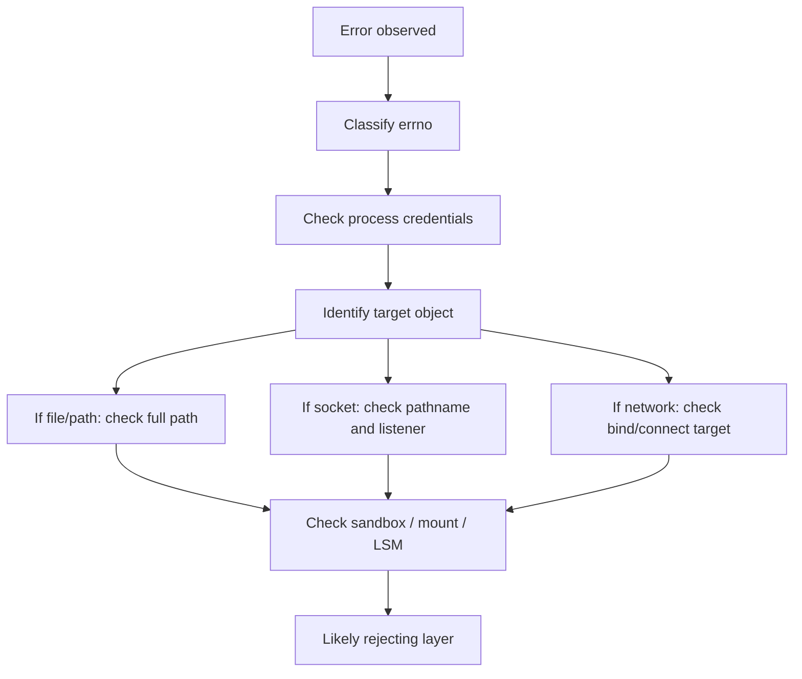

+++
title = "Permission Denied 不是一種錯：Linux 權限排查地圖"
date = "2026-06-10T16:56:03+08:00"
author = "TTL::0"
draft = false
isCJKLanguage = true
description = "EACCES、EPERM 與 ECONNREFUSED 不是同一種「Permission denied」。本文把 process 主體與 kernel object 模型轉成一張排查地圖，協助定位 kernel 究竟在哪一層、為什麼拒絕了操作。"
tags = [
    "技術筆記", # term:TechnicalNote
    "AI 代理人", # term:AiAgent
    "主體", # term:Subject
    "客體", # term:Object
  ]
series = ["Linux 權限模型：從 Process 主體到 Sandbox 邊界的完整推理弧"]
[ai_info]
    [ai_info.generation]
        model = "GPT 5.5"
        agent = "Codex VS Code extension 26.602.71036"
    [ai_info.refinement]
        model = "Claude Opus 4.8"
        agent = "Claude Code VSCode Extension 2.1.170"
+++

---

<!--more-->

## 問題

App 開發者遇到權限錯誤時，最常見的反應是看檔案 mode 或把程式改成 root 跑。這兩個動作有時有效，但它們沒有回答真正問題：kernel 到底在哪一層拒絕了操作。

`EACCES`、`EPERM`、`ECONNREFUSED` 看起來都像「不能做」，但語意不同。`EACCES` 常指存取權限不足，`EPERM` 常指操作本身需要特權或被政策拒絕，`ECONNREFUSED` 則通常代表 socket 連線目標沒有接受連線。把它們混成一種「Permission denied」，排查方向就會失焦。

---

## 調查

### 先確認錯誤類型

排查的第一步不是猜權限，而是確認錯誤來自哪種 object。檔案、Unix socket、TCP port、container mount、LSM policy 都可能產生相似的表面訊息。

```text
EACCES:
  常見於 file/path/socket pathname 權限不足

EPERM:
  常見於缺 capability、seccomp/LSM 拒絕、操作不被允許

ECONNREFUSED:
  常見於 socket endpoint 沒有 server listen

ENOENT:
  常見於 path 不存在，或 namespace 中看不到該 path
```

這個分類不是絕對規則，但它能讓排查從「到處看」變成「先定位層次」。

### 第二步看 process 身份

權限檢查的**主體**（Subject） <!-- term:Subject -->是 process，不是你的登入直覺。先確認程式實際以誰執行，以及它帶有哪些群組。

> [!IMPORTANT]
> **主體** <!-- term:Subject --> (Subject): 權限檢查中發起操作的一方，在 Linux 中由 process credentials（UID、GID、capabilities 等）描述其身分與當下能力。 <!-- anchor:Subject -->


```bash
id
ps -o pid,user,group,comm -p <pid>
cat /proc/<pid>/status | grep -E '^(Uid|Gid|Groups|Cap):'
```

`Uid:` 與 `Gid:` 會列出 real、effective、saved-set、filesystem 欄位。若你在 debug service，shell 的 `id` 只能代表目前 shell，不一定代表 daemon。

### 第三步看 path，而不是只看檔案

Filesystem 錯誤要檢查整條路徑。最後一個檔案可讀，前面的目錄不可穿越，一樣會失敗。

```bash
namei -l /var/lib/app/config.yml
ls -l /var/lib/app/config.yml
getfacl /var/lib/app/config.yml
```

`namei -l` 的價值是把 path 每一層拆開。只要任何一層目錄缺少 `x` 權限，process 就不能走到目標檔案。

### 第四步看 socket 是否是入口問題

Socket 錯誤要分成兩段：能不能找到入口，以及入口背後有沒有 server。

```bash
ls -l /tmp/app.sock
ss -lx | grep app.sock
stat /tmp/app.sock
```

若是 Unix socket，`ls -l` 開頭會是 `s`。這個節點的權限控制誰能 connect；但 server 是否真的 listen，要用 socket 工具確認。

### 第五步看 sandbox 邊界

如果 process 跑在 container 或 service manager 之下，傳統 UID/GID 可能不是完整答案。Readonly mount、`noexec`、`nosuid`、seccomp、LSM 都可能造成「看起來有權限，實際仍失敗」。

```text
檢查方向：
  mount 是否 readonly / noexec / nosuid
  process 是否缺 capability
  seccomp 是否擋 syscall
  AppArmor / SELinux 是否 deny
  container 是否看得到該 path 或 socket
```

這些限制不是檔案 mode 的延伸，而是額外裁判。它們會在傳統 DAC 允許後，仍然把操作拒絕。

---

## 發現

權限排查可以整理成一個從主體 <!-- term:Subject -->到**客體**（Object） <!-- term:Object -->，再到邊界的流程。

> [!IMPORTANT]
> **客體** <!-- term:Object --> (Object): 權限檢查中被存取的目標，例如檔案、目錄、Unix socket、device 等 kernel object，其類型決定 kernel 走哪一條檢查路徑。 <!-- anchor:Object -->




這張圖的重點是順序。先知道錯在哪類 object，再看主體 <!-- term:Subject -->身份與客體 <!-- term:Object -->規則，最後檢查額外邊界。這比一開始就 `sudo` 更能保留根因。

可用的最小 checklist 是：

| 問題 | 先查什麼 | 典型工具 |
|---|---|---|
| 檔案讀不到 | process 身份與整條 path | `id`、`/proc/<pid>/status`、`namei -l` |
| socket 連不上 | socket node 與 server listener | `ls -l`、`ss -lx` |
| 明明是 root 還不行 | capability、LSM、mount flag | `/proc/<pid>/status`、audit log、mount info |
| container 裡找不到 | namespace 與 volume mount | container inspect、mount table |
| 可以 connect 但不能操作 | daemon protocol 授權 | server log、peer credential、API policy |

排查的核心不是記更多命令，而是每個命令回答不同層的問題。`ls -l` 回答 object metadata；`id` 回答 shell 身份；`/proc/<pid>/status` 回答特定 process 身份；`ss` 回答 socket endpoint 狀態。

---

## 應用

面對一個具體錯誤，可以用三句話約束排查：

```text
1. 是哪個 process 在失敗？
2. 它要碰哪種 kernel object？
3. 哪一層 policy 拒絕了這次操作？
```

例如一個 service 讀不到 `/var/lib/app/config.yml`，不要只看檔案 mode。先查 service process 的 effective UID/GID，再用 `namei -l` 查整條 path。若 path 沒問題，再看 service 是否被 AppArmor profile 或 readonly mount 限制。

又例如 client 連不上 `/var/run/app.sock`，先確認該 pathname 是 socket node，再確認 server 是否 listen。若能 connect 但 API 被拒絕，問題就不在 filesystem mode，而在 daemon 的 peer credential 或 protocol 授權。