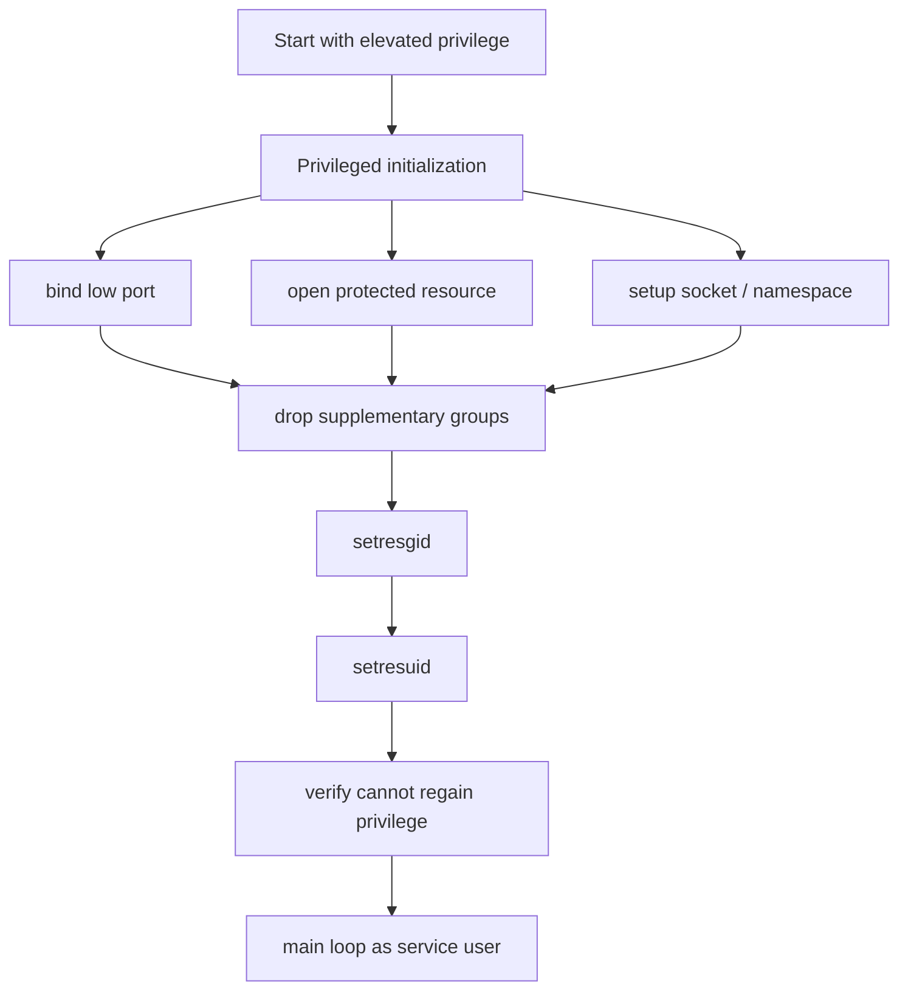

+++
title = "最小權限的現代形狀：從降權到 Sandbox 邊界"
date = "2026-06-10T16:56:04+08:00"
author = "TTL::0"
draft = false
isCJKLanguage = true
description = "最小權限不是「不要用 root」一句話就能交代。本文拆解 process identity、capabilities、namespace、seccomp、LSM 與 cgroup 如何在 daemon 生命週期的各階段，共同收斂出一道現代化的權限邊界。"
tags = [
    "分析論述", # term:AnalyticalEssay
    "AI 代理人", # term:AiAgent
    "分析論文", # term:AnalyticalEssay
    "最小權限", # term:LeastPrivilege
    "實務對比", # term:PracticalContrastiveExamples
    "形狀", # term:DataShape
    "反思", # term:Reflection
    "導言", # term:Introduction
  ]
series = ["Linux 權限模型：從 Process 主體到 Sandbox 邊界的完整推理弧"]
[ai_info]
    [ai_info.generation]
        model = "GPT 5.5"
        agent = "Codex VS Code extension 26.602.71036"
    [ai_info.refinement]
        model = "Claude Opus 4.8"
        agent = "Claude Code VSCode Extension 2.1.170"
+++

---

<!--more-->

## 導言

「不要用 root 跑服務」是一句正確但不完整的建議。Linux 的**最小權限**（Least Privilege） <!-- term:LeastPrivilege -->不是單一開關，而是 process identity、groups、capabilities、namespace、seccomp、LSM 與 cgroup 共同形成的邊界。

> [!IMPORTANT]
> **最小權限** <!-- term:LeastPrivilege --> (Least Privilege): 讓 process 在每個生命週期階段只保留必要能力的設計原則，透過 capabilities、namespace、seccomp、LSM 與 cgroup 等層共同收斂權限邊界。 <!-- anchor:LeastPrivilege -->


本文的問題是：一個 app 或 daemon 要做到最小權限 <!-- term:LeastPrivilege -->，實際依賴哪些層？答案是：讓 process 在每個生命週期階段只保留必要能力，並把可見世界、可用資源與可呼叫 syscall 一起縮小。

---

## 分析

### 最小權限是生命週期設計

Daemon 常見的安全**形狀**（Data Shape） <!-- term:DataShape -->不是永遠不用特權，而是只在初始化階段使用特權。初始化完成後，服務應進入低權限主迴圈。

> [!IMPORTANT]
> **形狀** <!-- term:DataShape --> (Data Shape): 資料結構或物件所包含的屬性與型別定義，通常由型別系統來描述 <!-- anchor:DataShape -->




這張圖的重點是時間。特權可以存在於啟動瞬間，但不應陪 process 走完整個生命週期。只要主迴圈會接收外部輸入，保留復權能力就會擴大損害半徑。

### Capabilities 把 root 拆成細項

傳統 Unix 模型常把 root 視為全能使用者。現代 Linux 會把許多 root 權限拆成 capability，例如綁定低 port、修改 UID、繞過檔案權限或管理網路設定。

| 需求 | 粗糙做法 | 更小權限做法 |
|---|---|---|
| 綁定 80/443 port | 用 root 啟動整個服務 | 授予 `CAP_NET_BIND_SERVICE` |
| 改變 UID/GID | 長期保留 root | 只在初始化保留 `CAP_SETUID` / `CAP_SETGID` |
| 讀取受保護檔案 | 讓服務持續 root | 啟動時開 fd，之後降權 |
| 管理網路 | 給完整 root | 評估是否只需 `CAP_NET_ADMIN` |

Capabilities 的價值是縮小權限種類。但它也會製造新的誤判：不是 root 的 process 仍可能帶有危險 capability。因此檢查權限不能只看 UID。

### Namespace 改變可見世界

Namespace 不是單純 deny 某個動作，而是改變 process 看見的世界。這使 container 裡的 root 與 host root 可以不同，也使 mount、PID、network、IPC 的可見範圍可以被隔離。

```text
mount namespace  -> 看見哪套 filesystem
pid namespace    -> 看見哪些 process
net namespace    -> 看見哪些網卡、路由與 port
user namespace   -> UID/GID 如何對映
ipc namespace    -> 看見哪些 IPC object
```

這個模型能解釋為什麼 container 不等於完整安全邊界。若 container 掛載 host 的 Docker socket，process 即使待在自己的 filesystem 視角中，仍然拿到了控制 host daemon 的入口。

### Seccomp、LSM 與 cgroup 管不同維度

Seccomp 不是身份系統，而是 syscall filter。它直接限制 process 能呼叫哪些 kernel 入口，例如禁止 `mount()`、`ptrace()` 或某些 `clone()` 形式。

LSM，例如 SELinux、AppArmor 或 Landlock，是額外政策裁判。即使傳統 mode bits 與 capabilities 允許，LSM 仍可拒絕。

Cgroup 則主要限制資源用量，例如 CPU、memory、IO 與 process 數量。它不回答「你是不是這個檔案的 owner」，而回答「你最多能消耗多少」。

這幾層常被混稱為 sandbox，但它們控制的面向不同：namespace 管可見世界，capabilities 管特權種類，seccomp 管 syscall 面，LSM 管政策，cgroup 管資源。

---

## 結論

最小權限 <!-- term:LeastPrivilege -->的難點在於它不是單一維度。把 UID 降下去很重要，但如果 supplementary groups、capabilities、host socket mount 或 permissive syscall 面仍然存在，系統仍可能保留危險能力。

這也解釋了 app 開發者為什麼需要懂一點 kernel object 模型。很多安全事故不是應用邏輯直接寫錯，而是部署時暴露了錯誤 object：例如把高權限 daemon socket 掛進 container，或給了過大的 `CAP_SYS_ADMIN`。

一個實用邊界是：一般 app 開發者不必理解 kernel `struct cred` 的每個欄位，但需要能辨識「我這個 process 到底以誰執行、能看到什麼、能呼叫什麼、能碰到哪些 host object」。

---

## 實務對比

**錯誤：用 root 長期跑服務。**

```text
root 啟動
root 綁 port
root 讀 config
root 處理所有 request
```

這種模型讓每個 request 都處在最高損害半徑內。任何解析漏洞、插件漏洞或 command injection 都可能直接變成 root 級事故。

**正確：把特權限制在初始化期。**

```text
root 啟動
取得必要 privileged resource
清 supplementary groups
降 GID
降 UID
驗證不能復權
低權限主迴圈
```

這個模型承認初始化可能需要特權，但拒絕讓特權穿越整個服務生命週期。

**錯誤：把 container root 當成安全保證。**

```text
runAsUser: 0
mount /var/run/docker.sock
add CAP_SYS_ADMIN
```

這種部署雖然看起來仍在 container 內，實際上已經把 host 高權限入口交給 container 內 process。

**正確：同時縮小身份、能力、可見世界與 syscall 面。**

```text
runAsNonRoot
drop capabilities
read-only root filesystem
no_new_privs
seccomp profile
避免掛載 host daemon socket
```

這不是單點修補，而是把多個逃逸通道同時收窄。

---

## 結論

Linux 最小權限 <!-- term:LeastPrivilege -->的通用原理是：不要只問 process 是不是 root，而要問它在每個維度上還保留什麼能力。

完整的最小權限 <!-- term:LeastPrivilege -->模型至少包含四個問題：它以什麼 credentials 執行？它還帶有哪些 capabilities 與 groups？它在什麼 namespace 與 mount 視角裡？它能呼叫哪些 syscall、接觸哪些 host object、消耗多少資源？

當這些問題一起被回答，最小權限 <!-- term:LeastPrivilege -->才從口號變成可檢查的工程狀態。