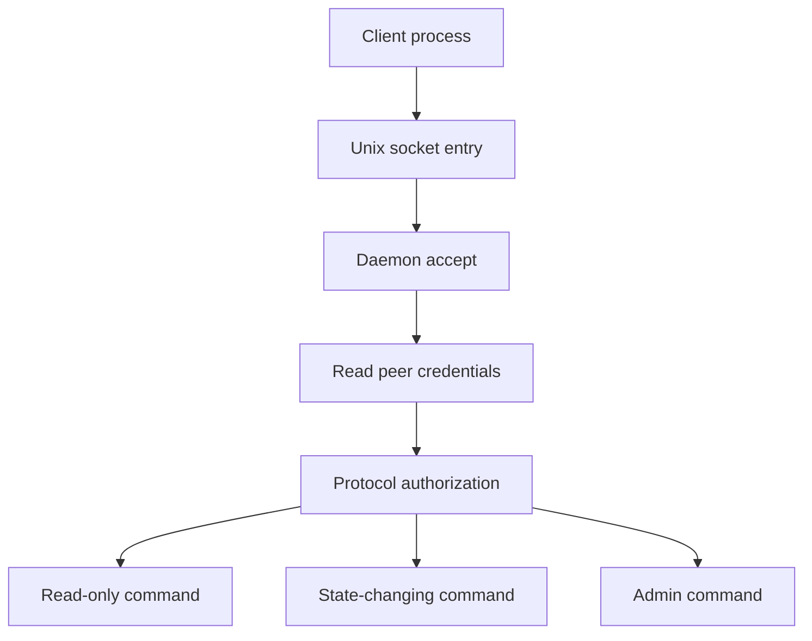

+++
title = "Unix Socket Daemon 的授權邊界：從入口權限到 Protocol 權限"
date = "2026-06-10T16:56:05+08:00"
author = "TTL::0"
draft = false
isCJKLanguage = true
description = "Unix socket daemon 的授權不只看 socket file mode。本文拆出四層授權邊界：誰找得到入口、誰連得進來、protocol 允許做什麼，以及 daemon 自身握有多大權力。"
tags = [
    "分析論述", # term:AnalyticalEssay
    "AI 代理人", # term:AiAgent
    "分析論文", # term:AnalyticalEssay
    "實務對比", # term:PracticalContrastiveExamples
    "反思", # term:Reflection
    "導言", # term:Introduction
  ]
series = ["Linux 權限模型：從 Process 主體到 Sandbox 邊界的完整推理弧"]
[ai_info]
    [ai_info.generation]
        model = "GPT 5.5"
        agent = "Codex VS Code extension 26.602.71036"
    [ai_info.refinement]
        model = "Claude Opus 4.8"
        agent = "Claude Code VSCode Extension 2.1.170"
+++

---

<!--more-->

## 導言

Unix domain socket 常被用來做本機 daemon 的控制入口。它比 TCP socket 更容易套用 filesystem 權限，也能讓 server 查到 client 的 process credentials。這讓它很適合 local agent、container runtime、desktop service 與 system daemon。

但 Unix socket 的安全性不只取決於 socket file mode。真正的授權邊界包含四層：誰能找到入口、誰連進來、protocol 允許做什麼，以及 daemon 自身有多大權力。

---

## 分析

### Socket file 只處理入口

Pathname socket 會在 filesystem namespace 中出現一個節點。這個節點控制誰能 connect，但不等於完整授權。

```text
srw-rw---- root appctl /run/app/control.sock
```

這表示 root 與 `appctl` group 成員可以接近入口。可是接近入口之後，server 仍需要判斷這個 client 可以執行哪些命令。

### Peer credentials 是第二道門

Linux Unix socket 可以讓 server 取得對端 process 的 pid、uid、gid。這通常透過 `SO_PEERCRED` 完成。

```text
client connect
  -> server accept
  -> server reads peer credentials
  -> server maps uid/gid to allowed actions
```

這一層的價值，是避免只依賴 socket file mode。Mode bits 適合做粗篩；peer credentials 適合做 per-client 的授權。

### Protocol 授權才決定能做什麼

即使 client 合法連線，也不應自動取得 daemon 的全部能力。Daemon protocol 應把命令分級，並把每個命令對應到明確授權。



這張圖把 socket daemon 的授權拆成可檢查步驟。入口允許連線，不代表 admin command 也應該允許。

### Daemon 權力決定 blast radius

Daemon 本身若以 root 或高 capability 執行，就能代表 client 做高權限操作。這種設計不是一定錯，但必須把 protocol 授權做得更嚴格。

Docker socket 的風險就是典型案例。能連上 socket 的使用者，實際上能要求 Docker daemon 建立容器、掛載 host path，甚至取得 host root 級效果。

---

## 結論

Unix socket daemon 的安全核心不是「socket file 權限設對就好」。Socket file 只是一道門；server 接受請求後，仍然需要知道門外的人是誰，以及他能要求櫃台做什麼。

這個模型也讓本機 IPC 不再只是便利通道。它是一條 privilege boundary。只要 daemon 的權力大於 client，daemon 就必須承擔授權代理的責任。

最容易出錯的設計，是把「能 connect」等同於「能做所有事」。這在小工具裡很常見，因為 socket file mode 看似已經足夠。但當 daemon 能改系統狀態或啟動子程序，這個簡化就會變成權限放大器。

---

## 實務對比

**錯誤：只靠 socket group 授權所有命令。**

```text
/run/app.sock group = app
所有 app group 成員都能呼叫 reload、delete、exec、admin
```

這種做法把 coarse-grained group 變成全部權限。任何被加入 group 的 process 都取得 daemon 的完整操作面。

**正確：入口、身份、命令分級各自檢查。**

```text
socket mode:
  控制誰能 connect

peer credentials:
  確認連進來的是哪個 uid/gid

protocol authorization:
  決定這個 uid/gid 可執行哪些 command

daemon privilege:
  儘量降低自身權限或縮小代執行範圍
```

這種分層讓授權失敗的影響被限制在單一命令，而不是整個 daemon 能力。

---

## 結論

Unix socket daemon 的權限模型應被視為四層結構：filesystem 入口、peer credentials、protocol authorization、daemon privilege。

這個結構的通用原理是：入口權限只能決定誰能敲門，不能替代應用層授權。只要 server 能代表 client 執行更高權限操作，server 就必須把每個命令當成一次新的權限決策。