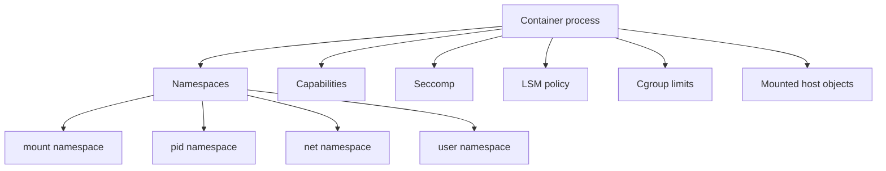

+++
title = "Container 權限模型：Root、Namespace 與 Host Object 的邊界"
date = "2026-06-10T16:56:06+08:00"
author = "TTL::0"
draft = false
isCJKLanguage = true
description = "Container 不是單一安全機制，而是 namespace、cgroup、capabilities、mount、seccomp 與 LSM 的組合。本文解釋為什麼 container root 不等於 host root，以及哪些設定會讓這道邊界整個崩塌。"
tags = [
    "分析論述", # term:AnalyticalEssay
    "AI 代理人", # term:AiAgent
    "分析論文", # term:AnalyticalEssay
    "實務對比", # term:PracticalContrastiveExamples
    "反思", # term:Reflection
    "導言", # term:Introduction
  ]
series = ["Linux 權限模型：從 Process 主體到 Sandbox 邊界的完整推理弧"]
[ai_info]
    [ai_info.generation]
        model = "GPT 5.5"
        agent = "Codex VS Code extension 26.602.71036"
    [ai_info.refinement]
        model = "Claude Opus 4.8"
        agent = "Claude Code VSCode Extension 2.1.170"
+++

---

<!--more-->

## 導言

Container 常被描述成隔離環境，但它不是單一安全機制。它是 namespace、cgroup、capabilities、mount、seccomp 與 LSM 的組合。這些層彼此互補，也彼此留下缺口。

本文的問題是：為什麼 container 裡的 root 不一定等於 host root，但某些設定又會讓 container 幾乎取得 host 權力？答案在於 container 限制的是 process 能看見、能呼叫、能持有、能接觸的 kernel object，而不是創造一個完全不同的 kernel。

---

## 分析

### Namespace 改變看到的世界

Namespace 讓 process 看見不同的 filesystem、PID、network、IPC 或 user mapping。它改變的是視角，而不是把 process 移到另一個 kernel。



這張圖的重點是組合。Container 安全不是「有 namespace 就好」，而是多層限制同時成立。

### Container root 是相對身份

若使用 user namespace，container 內的 UID 0 可以對映到 host 上的非 root UID。這讓 container 內 root 具備管理容器內檔案的能力，卻不必直接成為 host root。

但如果沒有 user namespace，或額外給了過大的 capabilities，container root 的危險程度就會上升。尤其是 `CAP_SYS_ADMIN`，它涵蓋範圍很大，常被視為接近 root 的能力集合。

### Host object mount 會打穿抽象邊界

Container 最常見的危險不是 namespace 本身失效，而是部署者把高權限 host object 掛了進去。

```text
危險訊號：
  -v /var/run/docker.sock:/var/run/docker.sock
  -v /:/host
  --privileged
  --pid=host
  --net=host
  --cap-add SYS_ADMIN
```

這些設定共同點是：它們讓 container process 接觸到原本應該留在 host 邊界外的 object。只要碰到的 object 夠有權力，container 內低隔離就會變成 host 級風險。

### Seccomp 與 LSM 收窄 syscall 與 policy 面

Seccomp 限制 process 可以呼叫哪些 syscall。這不是身份檢查，而是直接收窄 kernel API 面。即使攻擊者控制了 process，也不能呼叫被 filter 擋住的高風險 syscall。

LSM 則提供額外 policy。AppArmor、SELinux 或 Landlock 可以在傳統權限允許時仍然 deny。這使 container 邊界多一層「即使看得到，也不一定能做」的限制。

---

## 結論

Container 權限模型最容易被一句話誤導：「container 裡是 root，所以很危險」或「container 已隔離，所以安全」。兩句都只說中一半。

真正需要判斷的是邊界組合：user namespace 是否啟用、capabilities 是否縮小、host mount 是否暴露、seccomp 是否套用、LSM 是否 enforcing。任何一層太寬，都可能讓其他層的隔離價值下降。

這也是為什麼 Docker socket mount 特別危險。它不需要突破 namespace；它直接把 host 高權限 daemon 的控制入口交給 container process。攻擊不是逃出牆，而是拿到牆外櫃台的電話。

---

## 實務對比

**錯誤：把 container 當成天然安全邊界。**

```text
run as root
--privileged
mount docker.sock
mount host filesystem
default broad capabilities
```

這種設定把多數防線打開。即使應用程式本身在 container 內，process 仍可能碰到 host 級 object。

**正確：把 container 視為多層限制的組合。**

```text
runAsNonRoot
drop all capabilities, add back only required ones
read-only root filesystem
no_new_privs
seccomp default profile
avoid host daemon sockets
limit hostPath mounts
apply AppArmor / SELinux policy
```

這個做法不依賴單一防線。它把身份、能力、filesystem 視角、syscall 面與 host object 接觸面同時收窄。

---

## 結論

Container 權限不是「裡面是不是 root」這一題。更完整的問題是：這個 process 的 root 是如何對映的？它還帶有哪些 capabilities？它能看見哪些 namespace？它能接觸哪些 host object？它能呼叫哪些 syscall？

只要這些問題被逐一回答，container 才從部署黑盒變成可檢查的權限邊界。