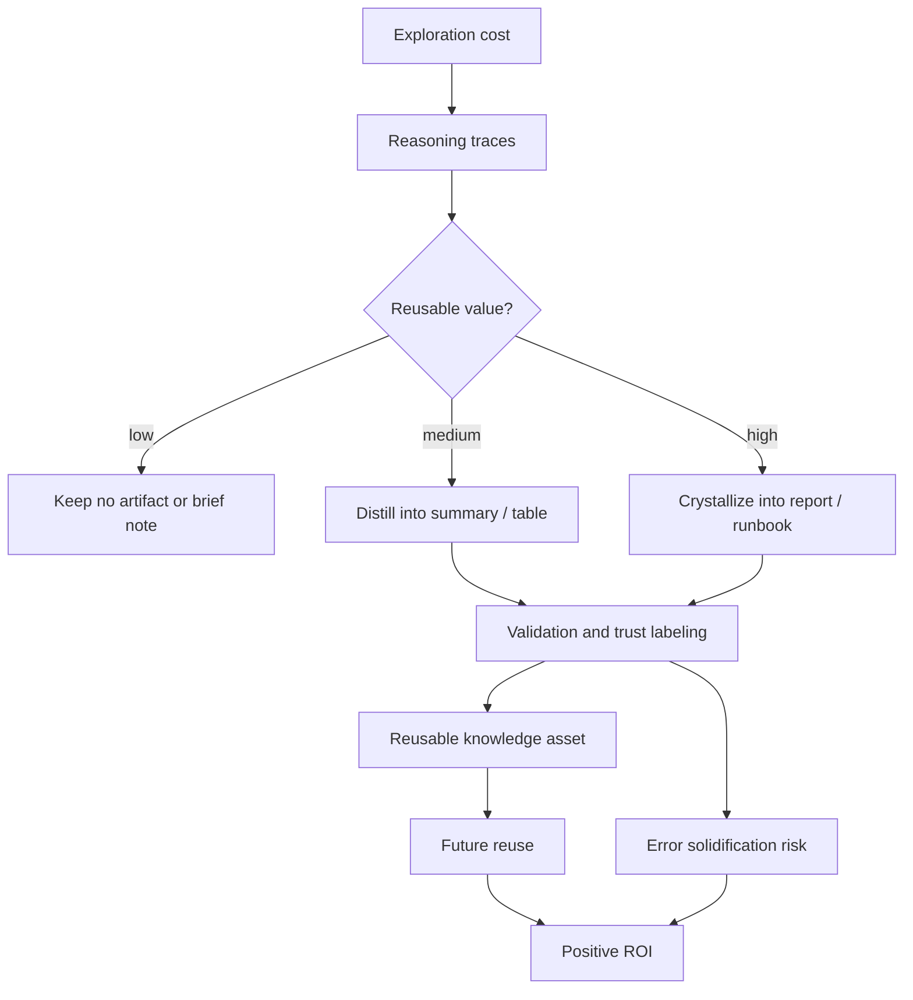

+++
title = "知識回收的 ROI：把一次性探索轉成可重用理解"
date = "2026-06-10T17:58:01+08:00"
author = "TTL::0"
draft = false
isCJKLanguage = true
description = "探索成本花掉了，不代表內容就值得保存。本文用 ROI 視角拆解知識回收：哪些一次性探索值得蒸餾成可重用結構，哪些只是把低價值內容整理得更漂亮的浪費。"
tags = [
    "分析論述", # term:AnalyticalEssay
    "AI 代理人", # term:AiAgent
    "分析論文", # term:AnalyticalEssay
    "實務對比", # term:PracticalContrastiveExamples
    "蒸餾", # term:Distill
    "結晶", # term:Crystallize
    "反思", # term:Reflection
    "導言", # term:Introduction
  ]
series = ["自洽不等於可信：AI 系統如何在流暢敘事裡守住信任邊界"]
[ai_info]
    [ai_info.generation]
        model = "GPT 5.5"
        agent = "Codex VS Code extension 26.602.71036"
    [ai_info.refinement]
        model = "Claude Opus 4.8"
        agent = "Claude Code VSCode Extension 2.1.170"
+++

---

<!--more-->

## 導言

探索不是免費的。一次長對話、一次 debug、一次架構討論或一次 incident response，都會消耗時間、注意力、推理成本與上下文空間。在 AI 對話中，這些成本常以 token 形式被支付；在人類協作中，則以會議、白板、review 與實驗時間的形式被支付。

如果探索結束後沒有留下可重用結構，這些成本就會快速消散。下次遇到相似問題時，團隊或個人只能重新展開一次。我想主張的是，知識回收的 ROI（return on investment）來自把一次性探索轉成可重用理解，而不是來自保存所有對話。

---

## 分析

### 探索成本買到的不只是答案

一次探索通常不只產生結論。它還產生分類、排除路徑、反例、未解問題、語彙校準與判斷順序。這些內容若只留在原始對話或會議記憶中，很容易失去可重用性。

```text
一次性探索常產生：
  問題拆解
  概念分類
  替代方案
  取捨理由
  反例與邊界
  待查假設
  可視化模型
```

真正值得回收的不是每一句話，而是這些被探索成本換出來的結構。**蒸餾**（Distill） <!-- term:Distill -->的工作，就是把暫時性的推理痕跡轉成穩定的理解物件。

> [!IMPORTANT]
> **蒸餾** <!-- term:Distill --> (Distill): 從長對話或大量開發脈絡中萃取關鍵資訊的處理過程。 <!-- anchor:Distill -->


### ROI 不是自動為正

知識回收不是保存癖。不是每段對話、每次會議、每個 debug log 都值得**結晶**（Crystallize） <!-- term:Crystallize -->。若探索成本低、未來重用機率低，或內容無法形成可校驗結構，蒸餾 <!-- term:Distill -->反而會浪費時間。

> [!IMPORTANT]
> **結晶** <!-- term:Crystallize --> (Crystallize): 將蒸餾後的關鍵知識沉澱並結構化為正式報告或規格的過程。 <!-- anchor:Crystallize -->


可以用一個簡化公式描述：

```text
知識回收 ROI =
  未來重用價值
  - 蒸餾成本
  - 校驗成本
  - 錯誤固化風險
```

這個公式提醒我們：蒸餾 <!-- term:Distill -->不是因為「已經花了成本」就必然值得。已花成本只是 sunk cost；真正的 ROI 取決於未來是否能少花同樣的探索成本。

### 哪些探索值得回收

判斷是否值得蒸餾 <!-- term:Distill -->，可以看四個條件：探索成本是否高、重用可能是否高、是否已形成結構、是否可被校驗。

| 對話或工作類型 | 回收價值 | 原因 |
|---|---|---|
| 一次性事實查詢 | 低 | 重用價值小，直接查來源更快 |
| 長篇概念探索 | 高 | 已形成分類、模型與敘事弧 |
| 架構決策討論 | 高 | 含替代方案、取捨與責任脈絡 |
| Debug 過程 | 中高 | 若含根因與排查路徑，未來可轉成 runbook |
| Code review 反覆爭點 | 中高 | 可萃取成 checklist 或設計原則 |
| Incident response | 高 | 壓力下形成的線索需要轉成 postmortem |
| 情緒性閒聊 | 低到中 | 除非形成自我理解或穩定方法論 |
| 新興主題推測 | 中 | 可回收成假設清單，但不可當結論 |

這張表把「值得保存」和「值得相信」分開。高回收價值的內容，也可能需要高校驗成本。

### 回收產物應該按用途分級

知識回收不只有一種產物。低風險內容可以變成摘要；高價值決策可以變成報告；可操作流程可以變成 runbook；跨場景原理則可能變成方法論。

| 產物形式 | 適合內容 | 風險 |
|---|---|---|
| 摘要 | 單次討論的主旨與結論 | 容易壓掉不確定性 |
| 表格 | 分類、比較、決策條件 | 容易過度整齊 |
| 圖解 | 流程、因果、權限邊界 | 容易把推論畫成定論 |
| 報告 | 完整敘事弧與原理 | 權威感較強，需要校驗 |
| Runbook | 可操作排查流程 | 錯誤步驟會被重複執行 |
| 決策紀錄 | 架構取捨與責任脈絡 | 若背景過期，會誤導後續 |

這裡的原則是：產物越可操作、越像權威文件，越需要校驗與 owner 授權。蒸餾 <!-- term:Distill -->可以生成候選資產，但不能自動決定它應該升格到哪個層級。

### 回收流程需要先篩選再結晶

健康的知識回收流程不是「長對話一結束就全部寫成報告」。它應先判斷價值，再選擇合適形式。



這張圖的關鍵是 value gate。沒有重用價值的內容不需要被隆重保存；高重用價值的內容才值得付出蒸餾 <!-- term:Distill -->與校驗成本。

---

## 反思

知識回收最容易走向兩個極端。第一個極端是什麼都不留，讓每次探索都變成一次性消耗。第二個極端是什麼都保存，把未校驗內容包裝成知識庫，最後形成漂亮但沉重的垃圾場。

好的回收不是保存更多，而是保留能減少未來重複探索的結構。這也意味著，蒸餾 <!-- term:Distill -->的第一個問題不應是「能不能寫成報告」，而應是「這段探索未來是否會再次被需要」。

在 AI 對話中，token 讓成本變得可見；但真正被回收的不只是 token。被回收的是已經展開的問題空間、概念分界、反例與判斷順序。這些東西若能被重用，蒸餾 <!-- term:Distill -->才有 ROI。

---

## 實務對比

**錯誤：把所有長對話都結晶 <!-- term:Crystallize -->。**

```text
對話很長
token 花很多
內容看起來有結構
=> 全部寫成報告
```

這個做法把成本誤認為價值。長度只代表花費，不代表未來重用。

**錯誤：因為內容未驗證，就完全不回收。**

```text
內容還有推論
可能有錯
=> 不值得整理
```

這也過度保守。未驗證內容仍可回收成假設清單、問題地圖與待查項目，只要不要把它寫成定論。

**正確：先判斷回收價值，再決定產物等級。**

```text
高探索成本 + 高重用可能 + 可形成結構 + 可被校驗
=> 值得結晶

高探索成本 + 低可驗證性
=> 可整理成假設與問題清單

低探索成本 + 低重用可能
=> 不需要保存
```

這個流程把蒸餾 <!-- term:Distill -->從「自動保存」改成「投資判斷」。它保留了知識回收的效率，也避免把所有 context 都固化成資產。

---

## 結論

知識回收的 ROI 來自把一次性探索轉成可重用理解。它不是保存所有對話，也不是把已花成本正當化，而是判斷哪些推理結構能在未來減少重複探索。

最短原則是：

```text
蒸餾不是為了保存 context，
而是為了回收可重用的理解結構。
```

當探索成本高、重用可能高、結構已形成且校驗成本可控時，蒸餾 <!-- term:Distill -->通常具有高 ROI。反過來，若只是把低價值內容整理得更漂亮，蒸餾 <!-- term:Distill -->本身就會變成新的浪費。