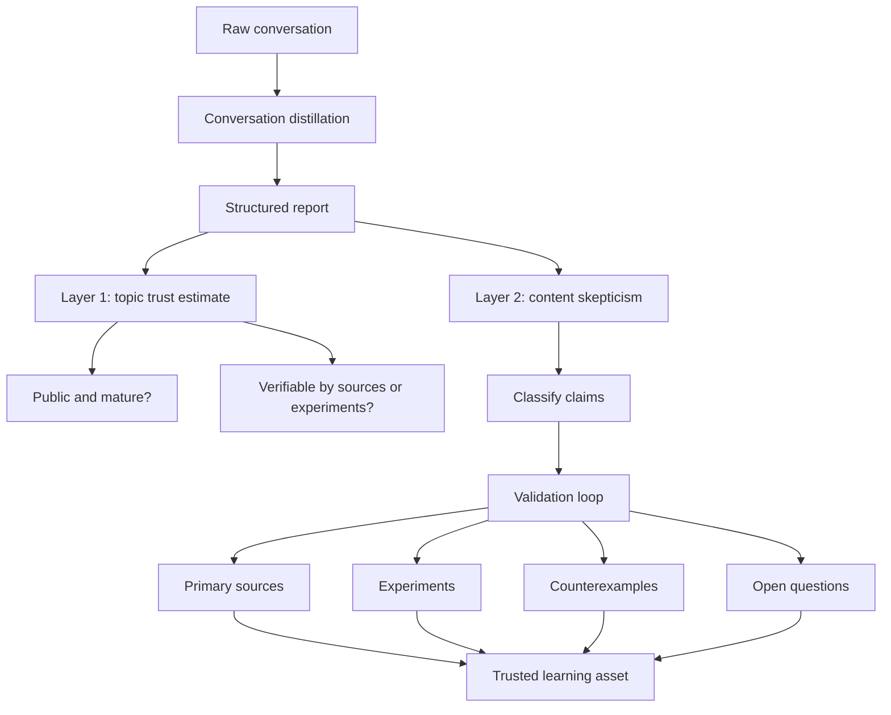

+++
title = "對話蒸餾的可信度：雙層防禦如何避免知識幻覺"
date = "2026-06-10T17:22:02+08:00"
author = "TTL::0"
draft = false
isCJKLanguage = true
description = "結構化文字會製造權威感，把未驗證的推論寫得像結論。本文提出雙層防禦：先估主題可信度，再對內容保持懷疑與校驗，避免對話蒸餾淪為知識幻覺的製造器。"
tags = [
    "分析論述", # term:AnalyticalEssay
    "大型語言模型", # term:Llm
    "分析論文", # term:AnalyticalEssay
    "對話蒸餾", # term:ConversationDistillation
    "知識幻覺", # term:KnowledgeHallucination
    "實務對比", # term:PracticalContrastiveExamples
    "模型蒸餾", # term:ModelDistillation
    "反思", # term:Reflection
  ]
series = ["自洽不等於可信：AI 系統如何在流暢敘事裡守住信任邊界"]
[ai_info]
    [ai_info.generation]
        model = "GPT 5.5"
        agent = "Codex VS Code extension 26.602.71036"
    [ai_info.refinement]
        model = "Claude Opus 4.8"
        agent = "Claude Code VSCode Extension 2.1.170"
+++

---

<!--more-->

## 導言

**對話蒸餾**（Conversation Distillation） <!-- term:ConversationDistillation -->能把一段探索、追問與臨時理解，整理成可閱讀的報告、表格與圖解。它的價值很直接：原本散落在工作記憶裡的理解，會變成可回顧、可討論、可延伸的知識資產。

> [!IMPORTANT]
> **對話蒸餾** <!-- term:ConversationDistillation --> (Conversation Distillation): 把一段探索、追問與臨時理解整理成可閱讀報告、表格與圖解的轉換過程；它組織理解，但不訓練模型，也不自動授權內容為真。 <!-- anchor:ConversationDistillation -->


但這種能力也帶來風險。結構化文字很容易產生權威感，讓「尚未驗證的推論」看起來像「已經成立的結論」。因此，對話蒸餾 <!-- term:ConversationDistillation -->不能只追求流暢；它需要一套可信度防禦。

我想主張的是，健康的對話蒸餾 <!-- term:ConversationDistillation -->至少需要兩層防禦。第一層先評估主題本身是否適合被**蒸餾**（Distill） <!-- term:Distill -->學習；第二層即使主題可信，仍對具體內容保持懷疑與校驗。

> [!IMPORTANT]
> **蒸餾** <!-- term:Distill --> (Distill): 從長對話或大量開發脈絡中萃取關鍵資訊的處理過程。 <!-- anchor:Distill -->


---

## 分析

### 對話蒸餾不是模型蒸餾

**模型蒸餾**（Model Distillation） <!-- term:ModelDistillation -->通常指把大型模型的行為壓縮到小型模型中。對話蒸餾 <!-- term:ConversationDistillation -->不是這件事。它不訓練模型，也不保證產出具備一手知識來源的權威性。

> [!IMPORTANT]
> **模型蒸餾** <!-- term:ModelDistillation --> (Model Distillation): 把大型模型的行為壓縮到小型模型中的訓練技術，與對話蒸餾不同，後者不涉及模型訓練。 <!-- anchor:ModelDistillation -->


對話蒸餾 <!-- term:ConversationDistillation -->做的是另一種轉換：

```text
原始對話 / 草稿 / 問答
  ↓
摘要、分類、重組、補洞、視覺化
  ↓
可閱讀的知識資產 / 報告 / 圖表
```

這個轉換的核心價值是組織理解，而不是自動授權真理。它能讓學習者更快看見結構，但不能替代一手資料、實驗與反例。

### 結構化會同時提升理解與遮蔽不確定性

蒸餾 <!-- term:Distill -->後的報告通常比原始對話更順。段落有因果，表格有分類，Mermaid 圖有箭頭。這些形式會降低閱讀成本，也會讓內容看起來更完整。

問題是，不確定性有時不是被解決了，而是被排版消失了。原本對話中還帶著「也許」、「要查」、「這裡可能有版本差異」的地方，進入報告後容易被寫成平滑句子。

因此，漂亮結構本身不是可信度來源。它只代表可讀性提高，不代表驗證完成。

### 第一層防禦：主題可信度預估

第一層防禦處理的是「這個主題適不適合用對話蒸餾 <!-- term:ConversationDistillation -->快速學」。有些領域公開、成熟、可驗證，蒸餾 <!-- term:Distill -->偏差預期較小；有些領域封閉、新興、快速變動，蒸餾 <!-- term:Distill -->風險就高。

| 條件 | 可信度較高 | 可信度較低 |
|---|---|---|
| 公開性 | 公開標準、man page、教科書、成熟 API | 私有系統、內部流程、未公開事件 |
| 成熟度 | 多年穩定、廣泛使用 | 新興技術、快速變動 |
| 可驗證性 | 可用 demo、測試、原始碼驗證 | 只能聽說、難以重現 |
| 一手資料密度 | 官方文件、spec、source code 多 | 二手文章多、官方資料少 |
| 實務共識 | 社群與業界說法一致 | 不同來源互相矛盾 |

這一層給的是初始信任等級。它回答「這份蒸餾 <!-- term:Distill -->產出能不能先作為學習地圖」。它不回答「裡面的每句話是否都已經可靠」。

成熟公開知識通常適合蒸餾 <!-- term:Distill -->，例如經典作業系統概念、長期穩定的語言特性、公開標準與成熟 API。封閉系統、最新產品行為、未公開事件與高變動政策則不適合只靠蒸餾 <!-- term:Distill -->建立信任。

可以用幾組例子校準這個判斷。這些例子不代表可以免除校驗，而是代表蒸餾 <!-- term:Distill -->時的初始風險不同。

| 主題類型 | 例子 | 蒸餾 <!-- term:Distill -->可信條件 |
|---|---|---|
| 經典系統概念 | process、filesystem、TCP/IP、virtual memory | 公開教材多，實作長期存在，可用實驗觀察 |
| 成熟程式語言特性 | C pointer、Python iterator、JavaScript event loop | 官方文件與大量測試可驗證，但版本差異仍需注意 |
| 公開協定與格式 | HTTP、TLS、JSON、POSIX shell 基礎 | 有 spec 或標準文件，術語穩定，可對照實作 |
| 穩定開源工具 | Git 基本資料模型、SQLite transaction、PostgreSQL index 概念 | 原始碼、文件、社群案例密集，容易交叉驗證 |
| 快速變動產品 | 最新雲端服務行為、模型 API 參數、SaaS 權限介面 | 官方文件可能更新很快，必須即時查證 |
| 封閉或私有脈絡 | 公司內部流程、未公開事故、專案特殊約定 | 對話蒸餾 <!-- term:ConversationDistillation -->只能整理已知材料，不能補出權威事實 |

這張表的用途是降低「主題可信度」的判斷誤差。公開成熟主題適合先蒸餾 <!-- term:Distill -->出學習地圖；快速變動與封閉主題則應把蒸餾 <!-- term:Distill -->結果視為假設整理，而不是知識定稿。

### 第二層防禦：內容懷疑與校驗

第二層防禦處理的是「這份報告裡的哪類句子仍需驗證」。即使主題本身可信，內容仍有不同風險等級。

| 內容類型 | 懷疑程度 | 典型處理 |
|---|---|---|
| 基礎定義 | 較低 | 查一手資料確認術語 |
| 心智模型 | 中等 | 檢查是否過度簡化 |
| API 細節 | 中高 | 查版本、文件與實測 |
| 安全結論 | 高 | 明確威脅模型與邊界 |
| 具體操作建議 | 高 | 在目標環境驗證 |
| 新推論 / 類比 | 最高 | 標記為推論或待查 |

這一層防止高可信主題被過度信任。公開成熟的領域也可能有版本差異、平台差異與邊界案例。蒸餾 <!-- term:Distill -->報告若不標記這些差異，就會把「大方向可信」誤寫成「所有細節都可信」。

### 雙層防禦的工作流

雙層防禦可以用一個簡單流程表示。它先建立主題層的初始信任，再用內容層的校驗迴路調整具體信任。



這張圖的重點是：蒸餾 <!-- term:Distill -->產生的是 structured report，不是 trusted learning asset。中間必須經過主題層預估與內容層校驗。

可用的公式是：

```text
可信度 = 主題先驗可信度 × 內容校驗程度
```

這個公式不是數學精算，而是提醒：主題再成熟，若內容從未校驗，仍不能無條件信任；內容若被實驗驗證，但主題本身快速變動，也要保留時效性警覺。

---

## 反思

對話蒸餾 <!-- term:ConversationDistillation -->最危險的地方，不是它一定會錯，而是它會把錯誤寫得很像結論。人類讀者也容易被自己的理解快感說服：只要報告讀起來順，圖畫得漂亮，就覺得自己已經掌握。

這種風險在成熟公開主題中較小，但不會消失。成熟主題的優勢是有穩定的一手資料與大量實作可供交叉驗證；它降低的是偏差機率，而不是取消懷疑義務。

因此，對話蒸餾 <!-- term:ConversationDistillation -->的健康位置應該是學習地圖，而非唯一真相來源。它可以決定先讀什麼、怎麼分類、哪裡可能是核心原理；但它不應單獨決定安全基準、法律判斷、醫療建議或高風險部署決策。

---

## 實務對比

**錯誤：把蒸餾 <!-- term:Distill -->報告當成唯一真相來源。**

```text
對話內容很完整
報告很流暢
圖表很清楚
=> 直接視為已驗證知識
```

這個路徑忽略了蒸餾 <!-- term:Distill -->只是重新組織理解。它可能保留對話中的錯誤，也可能為了敘事完整補出尚未驗證的橋段。

**錯誤：因為有風險，就完全否定蒸餾 <!-- term:Distill -->價值。**

```text
AI 可能錯
摘要可能失真
=> 蒸餾報告沒有學習價值
```

這個反應也過度。對公開成熟且可驗證的主題，蒸餾 <!-- term:Distill -->能有效降低入門成本，尤其適合整理概念地圖與問題清單。

**正確：有條件地信任結構，有紀律地懷疑細節。**

```text
先判斷主題是否公開、成熟、可驗證
再把內容分成定義、模型、API 細節、安全結論、推論
最後對高風險內容查一手資料或做實驗
```

這個做法保留蒸餾 <!-- term:Distill -->的學習效率，也避免把漂亮結構誤認為真理。它不是全信，也不是全不信，而是把信任分配到合適的位置。

---

## 結論

對話蒸餾 <!-- term:ConversationDistillation -->的價值在於加速理解，但它的可信度來自可驗證性與校驗，而不是來自敘事流暢。

雙層防禦提供了一個穩定原則：第一層先估主題本身是否公開、成熟、可驗證；第二層即使主題可信，仍依內容類型保留懷疑。最短的操作口訣是：

```text
有條件地信任結構，
有紀律地懷疑細節。
```

當蒸餾 <!-- term:Distill -->被放在這個位置，它就不是**知識幻覺**（Knowledge Hallucination） <!-- term:KnowledgeHallucination -->的製造器，而是通往可校驗知識的地圖。

> [!IMPORTANT]
> **知識幻覺** <!-- term:KnowledgeHallucination --> (Knowledge Hallucination): 蒸餾產出的流暢結構讓未驗證推論看起來像已成立結論，使讀者誤以為自己已掌握知識。 <!-- anchor:KnowledgeHallucination -->