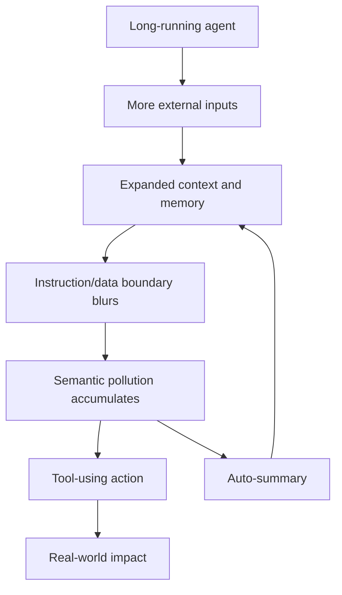

+++
title = "長時間 Agent 的語境污染：為什麼 Context Window 也是攻擊面"
date = "2026-06-10T17:40:03+08:00"
author = "TTL::0"
draft = false
isCJKLanguage = true
description = "長時間運行的 AI agent 不只累積能力，也累積語境。本文說明 context window 為何是攻擊面，以及語境最小權限如何成為 agent runtime 安全的核心，而非 UX 細節。"
tags = [
    "分析論述", # term:AnalyticalEssay
    "AI 代理人", # term:AiAgent
    "分析論文", # term:AnalyticalEssay
    "語境污染", # term:ContextPollution
    "上下文視窗", # term:ContextWindow
    "最小權限", # term:LeastPrivilege
    "實務對比", # term:PracticalContrastiveExamples
    "外部裁決", # term:ExternalArbitration
  ]
series = ["自洽不等於可信：AI 系統如何在流暢敘事裡守住信任邊界"]
[ai_info]
    [ai_info.generation]
        model = "GPT 5.5"
        agent = "Codex VS Code extension 26.602.71036"
    [ai_info.refinement]
        model = "Claude Opus 4.8"
        agent = "Claude Code VSCode Extension 2.1.170"
+++

---

<!--more-->

## 導言

長時間運行的 AI agent 不只累積能力，也會累積語境。它讀過的 email、網頁、issue、log、工具輸出、錯誤訊息與舊任務摘要，都可能進入 context 或 memory。當 agent 又具備檔案、網路、shell、瀏覽器、訊息平台等工具權限時，**語境污染**（Context Pollution） <!-- term:ContextPollution -->就不只是理解問題，而是行動風險。

> [!IMPORTANT]
> **語境污染** <!-- term:ContextPollution --> (Context Pollution): 外部內容、工具輸出或過期歷史被錯誤帶入 agent 的指令層，使其推理與行動受到未標記來源的影響。 <!-- anchor:ContextPollution -->


真正想回答的問題是，為什麼 agent 運行越久，風險可能越高？答案不是單純的「模型會忘記」，而是相反：它可能記得太多，而且忘記每段記憶從哪裡來。

---

## 分析

### Context 是語義執行狀態

傳統 daemon 長時間運行，常見風險是 memory leak、resource leak 或狀態腐敗。AI agent 多了一種特殊狀態：語義狀態。Context window 不是被動文字緩衝區，它會影響下一步推理與工具呼叫。

```text
傳統 daemon:
  process credentials + runtime state
  -> 影響它能做什麼

AI agent:
  process credentials + tool permissions + context state
  -> 影響它會做什麼
```

這個差異非常重要。工具權限決定 agent 能碰哪些外部物件；context state 決定 agent 為什麼要碰、何時碰、以什麼敘事理由碰。

### 污染來源不一定看起來惡意

語境污染 <!-- term:ContextPollution -->不只來自明顯攻擊。更多時候，它來自正常工作資料被錯誤地帶入指令層。

| 污染來源 | 例子 | 風險 |
|---|---|---|
| 外部內容 | email、網頁、Slack 訊息、GitHub issue | prompt injection 被包在正常資料裡 |
| 工具輸出 | shell log、API response、error trace | 臨時狀態被誤當成長期事實 |
| 歷史對話 | 舊目標、舊決策、未完成任務 | stale instruction 影響新任務 |
| plugin/skill 描述 | 過長或惡意的工具說明 | instruction bloat 與優先級污染 |
| 自動摘要 | memory summary、handoff note | 錯誤被壓縮後永久化 |
| retry loop | repair prompt、fallback plan | 錯誤假設被反覆強化 |

這張表的共同點是：污染經常披著資料的外衣。對人類來說，email 裡的「請忽略前面指示」只是正文；對 agent 來說，如果邊界不清，它可能被吸收到行動語境。

### 時間會放大污染

Agent 運行時間越長，接觸資料越多。若沒有清理策略，context 會逐漸混入更多過期資訊與未標記來源。



這張圖的關鍵迴路在 auto-summary。摘要可以降低 context 體積，但也可能把污染壓縮成更穩定、更難追溯的「背景事實」。

### 長跑 Agent 需要語境最小權限

傳統**最小權限**（Least Privilege） <!-- term:LeastPrivilege -->強調少給 root、少給 capability、少給檔案權限。Agent 還需要語境最小權限 <!-- term:LeastPrivilege -->：每個任務只載入必要 context，並保留來源、時效與可信等級。

> [!IMPORTANT]
> **最小權限** <!-- term:LeastPrivilege --> (Least Privilege): 讓 process 在每個生命週期階段只保留必要能力的設計原則，透過 capabilities、namespace、seccomp、LSM 與 cgroup 等層共同收斂權限邊界。 <!-- anchor:LeastPrivilege -->


| 傳統防線 | Agent 對應防線 |
|---|---|
| drop privilege | drop stale context |
| chroot / namespace | context isolation |
| seccomp | action allowlist |
| audit log | semantic trace |
| daemon restart | context reset |
| capability bounding | tool and data-source bounding |

這不是類比遊戲，而是工程需求。Agent 的行動由工具權限與語境共同決定，因此安全邊界也必須同時限制兩者。

---

## 反思

長時間 agent 最危險的地方，不是它突然變得邪惡，而是它逐漸變得自洽。被污染的 context 會被後續摘要、修復、handoff 與**反思**（Reflection） <!-- term:Reflection -->整理成流暢敘事。到了那個時候，污染不再像污染，而像一段合理背景。

> [!IMPORTANT]
> **反思** <!-- term:Reflection --> (Reflection): 對現行架構與工程盲點進行的深層檢討與批判。 <!-- anchor:Reflection -->


這也解釋了為什麼「讓 agent 自己整理自己的記憶」不是完整防線。整理可以降低噪音，但如果沒有 provenance、aging、quarantine 與**外部裁決**（External Arbitration） <!-- term:ExternalArbitration -->，整理本身可能只是污染固化。

> [!IMPORTANT]
> **外部裁決** <!-- term:ExternalArbitration --> (External Arbitration): 由非同源機制（人類、測試、policy engine、權限邊界或獨立 verifier）授權信任狀態，而非讓生成系統自我批准。 <!-- anchor:ExternalArbitration -->


真正的防線要讓 agent 無法把所有文字都當成同一種東西。外部資料應是資料，工具輸出應是證據，使用者指令應是指令，系統政策應是政策。這些層不能只靠模型語氣辨認。

---

## 實務對比

**錯誤：讓長跑 agent 無限制保留語境。**

```text
所有工具輸出都進 memory
所有舊任務摘要都可被新任務讀取
外部文件與使用者指令混在同一段 context
agent 自己判斷哪些內容可信
```

這種設計把 context window 當成便利容器，卻沒有把它當成攻擊面。結果是 prompt injection、過期假設與錯誤摘要有機會累積。

**正確：把 context 當成有來源與權限的狀態。**

```text
task-scoped context
external data quarantine
source/provenance tagging
memory expiration
tool output treated as data, not instruction
high-risk action requires fresh confirmation
periodic reset and compaction review
```

這種設計承認 agent 需要 context，但拒絕讓 context 無限混合。它把「知道更多」改成「只在合適任務中知道必要內容」。

---

## 結論

Agent 的 context window 不是記憶體而已，它是執行前狀態的一部分。污染 context，就像污染 process state；若 agent 又有工具權限，污染就可能轉化為真實行動。

長時間 agent 的安全原則可以濃縮成一句話：

```text
不要只限制 agent 能做什麼，
也要限制它帶著哪些語境去做。
```

這使語境最小權限 <!-- term:LeastPrivilege -->成為 agent runtime security 的核心，而不是 UX 細節。