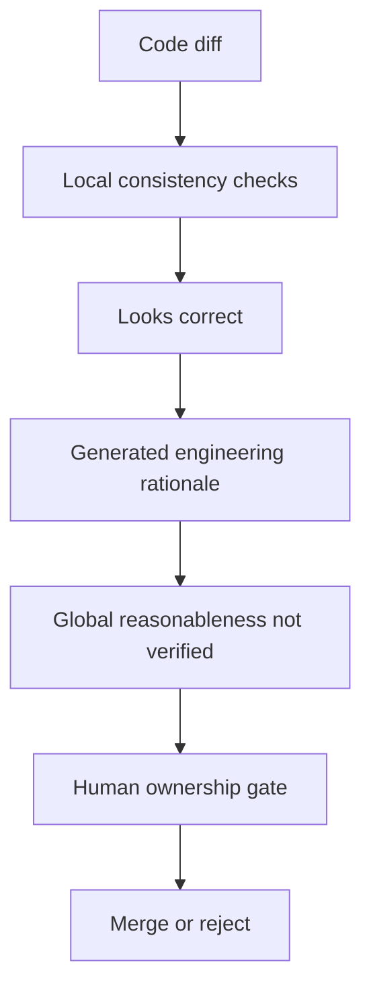

+++
title = "AI Code Review 的邊界：局部一致性能被檢查，全局合理性必須被授權"
date = "2026-06-10T17:40:04+08:00"
author = "TTL::0"
draft = false
isCJKLanguage = true
description = "AI 擅長驗局部一致性，但全局合理性必須由人類授權。本文劃出 AI code review 的邊界，解釋為何自洽的 diff 仍需要 owner 的責任閘門，而非格式完整就放行。"
tags = [
    "分析論述", # term:AnalyticalEssay
    "大型語言模型", # term:Llm
    "分析論文", # term:AnalyticalEssay
    "程式碼審查", # term:CodeReview
    "實務對比", # term:PracticalContrastiveExamples
    "對話蒸餾", # term:ConversationDistillation
    "閉環自洽", # term:ClosedLoopSelfConsistency
    "反思", # term:Reflection
  ]
series = ["自洽不等於可信：AI 系統如何在流暢敘事裡守住信任邊界"]
[ai_info]
    [ai_info.generation]
        model = "GPT 5.5"
        agent = "Codex VS Code extension 26.602.71036"
    [ai_info.refinement]
        model = "Claude Opus 4.8"
        agent = "Claude Code VSCode Extension 2.1.170"
+++

---

<!--more-->

## 導言

AI code review 很有用。它能快速掃描 diff、找出明顯 bug、提醒測試缺口、檢查 API 使用與樣式一致性。但把 code review 完全交給 AI，會把「看起來局部正確」誤認成「整體上值得 merge」。

我的核心主張其實很簡單：AI 擅長驗局部一致性；人類必須授權全局合理性。Code review 不只是檢查引用是否正確，也是在判斷一個 change 是否符合需求、產品承諾、架構方向與風險承擔。

---

## 分析

### Review 有不同層次

不是所有 review 問題都同樣適合交給 AI。越接近語法、型別、引用與局部資料流，AI 越擅長；越接近產品意圖、架構方向與風險接受，就越需要人類 owner。

| Review 層次 | AI 適合度 | 說明 |
|---|---|---|
| 語法與型別 | 高 | 可由程式結構直接判斷 |
| API 引用與參數 | 高 | 可檢查呼叫、import、配置鍵 |
| 常見局部 bug | 中高 | null、race、off-by-one、錯誤分支 |
| 測試缺口 | 中 | 可指出 obvious missing cases |
| 架構一致性 | 中低 | 需要專案長期約束 |
| 產品合理性 | 低 | 需要使用者模型與商業背景 |
| 風險接受 | 低 | 需要 owner 承擔取捨 |
| 是否值得做 | 很低 | 這是決策，不是檢查 |

這張表不是否定 AI review，而是把它放在正確位置。AI 是高密度檢查器，不是最終決策者。

### 引用正確性不等於合理性

AI 很適合查引用正確性。例如 function 是否存在、參數是否對齊、type 是否吻合、測試是否呼叫到新路徑。

合理性問的是另一組問題：

```text
這個需求是否應該存在？
這個抽象是否會污染長期架構？
這個權限變更是否符合安全模型？
這個 cache 是否跨 tenant？
這個 workaround 是修根因還是掩蓋症狀？
```

這些問題不一定能從 diff 本身推出來。它們依賴專案歷史、產品語境、組織風險與未來 roadmap。

### 自洽 diff 可能是錯的

最危險的 AI review 不是完全胡說，而是把局部自洽的錯誤改動包裝成合理工程敘事。



這張圖的斷點在 Human ownership gate。若沒有這個閘門，AI 可能讓局部正確的 diff 直接穿過全局合理性檢查。

### Review 的責任不能被格式取代

一份 AI review 可以很像專業 review：有 severity、有檔案行號、有建議、有測試清單。但格式完整不等於責任成立。真正的 review 需要有人承擔 merge 後的後果。

這點和**對話蒸餾**（Conversation Distillation） <!-- term:ConversationDistillation -->相同。AI 可以產生防禦的語法，例如風險表、缺口清單與信心評級；但若沒有外部授權，它仍可能只是自洽敘事。

> [!IMPORTANT]
> **對話蒸餾** <!-- term:ConversationDistillation --> (Conversation Distillation): 把一段探索、追問與臨時理解整理成可閱讀報告、表格與圖解的轉換過程；它組織理解，但不訓練模型，也不自動授權內容為真。 <!-- anchor:ConversationDistillation -->


---

## 反思

軟體開發的難點不是只把 code 寫對，而是把對的 code 放在對的系統位置。AI 可以協助檢查「這段 code 是否看起來成立」，但很難獨立回答「這個 change 是否應該被系統接受」。

這不代表 AI review 沒價值。相反，它能提高檢查密度，讓人類 reviewer 把注意力留給意圖、架構與風險。問題出在把 AI review 從輔助檢查提升為最終授權。

最健康的分工是：AI 幫人類看更多局部，人類負責決定整體。若流程讓 AI 寫 code、AI review、AI approve、AI merge，就會形成**閉環自洽**（Closed-Loop Self-Consistency） <!-- term:ClosedLoopSelfConsistency -->。那不是自動化成熟，而是責任消失。

> [!IMPORTANT]
> **閉環自洽** <!-- term:ClosedLoopSelfConsistency --> (Closed-Loop Self-Consistency): LLM 自己生成、解釋、檢查並批准行動，使防禦退化成同源語境內的自我說服，缺乏可打斷流暢性的外部阻力。 <!-- anchor:ClosedLoopSelfConsistency -->


---

## 實務對比

**錯誤：把 AI review 通過視為 merge 授權。**

```text
AI 沒找到 bug
測試看起來有補
diff 敘事合理
=> 自動 merge
```

這條路把 absence of detected issue 誤認為 correctness。AI 沒看到問題，不代表產品、架構與風險都合理。

**正確：讓 AI review 成為人類 review 的前置濾網。**

```text
AI:
  檢查引用、型別、局部 bug、測試缺口
  產生疑點清單
  標出需要 owner 判斷的風險

Human:
  判斷需求是否合理
  判斷架構方向是否可接受
  決定風險是否值得承擔
  授權 merge
```

這個流程讓 AI 做它擅長的高密度掃描，也保留人類對全局合理性的責任。

---

## 結論

AI code review 的正確定位不是「替代 reviewer」，而是「增加 reviewer 的觀察面」。它能驗證局部一致性，但不能自我授權全局合理性。

最短公式是：

```text
AI verifies local consistency.
Humans authorize global reasonableness.
```

中文說法則是：

```text
AI 擅長驗局部一致性；
人類必須授權全局合理性。
```

這條邊界若被抹除，code review 會從風險控制變成流暢敘事。