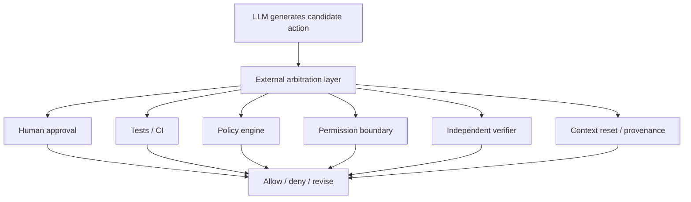

+++
title = "自動化工作流的外部裁決：為什麼防禦不能只由 LLM 自己生成"
date = "2026-06-10T17:40:05+08:00"
author = "TTL::0"
draft = false
isCJKLanguage = true
description = "當 LLM 自己生成、評估、批准又執行，防禦就退化成自洽敘事。本文主張自動化只能產生候選結構，信任狀態必須交由非同源的外部裁決授權。"
tags = [
    "分析論述", # term:AnalyticalEssay
    "AI 代理人", # term:AiAgent
    "分析論文", # term:AnalyticalEssay
    "外部裁決", # term:ExternalArbitration
    "閉環自洽", # term:ClosedLoopSelfConsistency
    "實務對比", # term:PracticalContrastiveExamples
    "蒸餾", # term:Distill
    "反思", # term:Reflection
  ]
series = ["自洽不等於可信：AI 系統如何在流暢敘事裡守住信任邊界"]
[ai_info]
    [ai_info.generation]
        model = "GPT 5.5"
        agent = "Codex VS Code extension 26.602.71036"
    [ai_info.refinement]
        model = "Claude Opus 4.8"
        agent = "Claude Code VSCode Extension 2.1.170"
+++

---

<!--more-->

## 導言

AI 工作流可以生成摘要、風險表、測試清單、review 意見與部署計畫。這些產物看起來像防禦，甚至有時真的有幫助。但如果整個流程都由 LLM 自己生成、自己評估、自己批准，防禦就會退化成自洽敘事。

真正想回答的問題是，自動化工作流要如何避免變成「看起來有安全流程，實際沒有**外部裁決**（External Arbitration） <!-- term:ExternalArbitration -->」？核心答案是：自動化可以產生候選結構，但信任狀態必須由系統外部授權。

> [!IMPORTANT]
> **外部裁決** <!-- term:ExternalArbitration --> (External Arbitration): 由非同源機制（人類、測試、policy engine、權限邊界或獨立 verifier）授權信任狀態，而非讓生成系統自我批准。 <!-- anchor:ExternalArbitration -->


---

## 分析

### 自動化可以產生防禦的語法

LLM 很擅長產生防禦形式。它可以列出風險、分類 severity、產生待查清單、寫出「已驗證」段落，甚至生成完整的 policy 文件。

問題是，防禦的語法不等於防禦本身。若沒有外部訊號驗證，這些產物可能只是更有秩序的自我說服。

| 防禦語法 | 真正防禦需要什麼 |
|---|---|
| 風險表 | 可追溯證據與 owner 判斷 |
| 測試清單 | 實際執行結果與失敗處理 |
| 信心評級 | 來源、版本、驗證方法 |
| 安全建議 | 威脅模型與不可繞過邊界 |
| review approval | 責任歸屬與 merge 權限 |

這張表的重點是：LLM 可以寫出左欄，但右欄需要非同源的裁決來源。

### 外部裁決者可以有多種形式

外部裁決 <!-- term:ExternalArbitration -->不一定永遠是人類手動點頭。它也可以是測試、policy engine、permission boundary、type checker、runtime guard 或獨立 verifier。重點是它不能只是同一個 LLM 自己延續自己的敘事。



這張圖把「外部」定義得更精確：外部不是一定非 AI，而是必須提供不同於生成敘事的約束來源。

### 不同工作流需要不同閘門

知識**蒸餾**（Distill） <!-- term:Distill -->、agent action、code review 與部署流程，需要的外部裁決 <!-- term:ExternalArbitration -->不同。把它們全部交給同一種「AI 自評」是不夠的。

> [!IMPORTANT]
> **蒸餾** <!-- term:Distill --> (Distill): 從長對話或大量開發脈絡中萃取關鍵資訊的處理過程。 <!-- anchor:Distill -->


| 工作流 | AI 可自動化 | 必要外部裁決 <!-- term:ExternalArbitration --> |
|---|---|---|
| 知識蒸餾 <!-- term:Distill --> | 摘要、結構、疑點清單 | 主題可信度、人類校驗、一手資料 |
| 長跑 agent | 任務規劃、工具選擇、摘要 | context isolation、tool allowlist、human confirmation |
| code review | 局部檢查、測試建議 | owner 對需求、架構、風險授權 |
| 部署 | checklist、變更摘要 | CI、policy、權限邊界、rollback plan |
| 安全判斷 | 威脅列舉、風險分類 | 威脅模型 owner、實測、獨立審查 |

這張表可作為設計工作流時的起點。先問「AI 可以幫忙整理什麼」，再問「哪個非同源機制負責批准」。

### 閉環自洽是主要失效模式

完全自動化的危險，不是流程沒有檢查，而是檢查本身也被同一種生成系統吸收。它會看起來越來越完整，因為每一輪都把前一輪的缺口補成過渡句。

```text
AI generates action
AI explains action
AI reviews explanation
AI marks risk as acceptable
AI executes action
```

這條路徑缺少真正的阻力。它會把可信度變成敘事品質，把安全性變成 checklist 完整度，把授權變成一句「looks good」。

---

## 反思

人類不是因為永遠比 AI 聰明，所以必須在迴路中。人類的重要性在於責任、語境與價值判斷。測試也不是因為懂產品，而是因為它提供不可由敘事直接改寫的外部結果。

同理，policy engine、permission boundary 與 sandbox 的價值，不是它們更會解釋，而是它們能拒絕。真正的防禦必須能打斷流暢性。

這也意味著，良好的 AI 工作流不應追求全程順滑。它應該在高風險位置故意製造摩擦：要求確認、要求證據、要求測試、要求權限、要求重新載入乾淨 context。

---

## 實務對比

**錯誤：把 AI 自評當成控制面。**

```text
AI 產出變更
AI 產出 review
AI 產出風險接受理由
AI 自動執行
```

這個流程看起來有效率，但所有判斷都在同一個自洽語境裡完成。它沒有真正的外部裁決 <!-- term:ExternalArbitration -->。

**正確：讓 AI 產生候選，讓外部機制授權。**

```text
AI 產出候選方案
AI 標出風險與待查點
CI 跑測試
policy engine 檢查邊界
human owner 批准高風險決策
permission boundary 限制實際可做範圍
```

這個流程不是反自動化，而是把自動化放在可控範圍內。AI 負責提高生成與檢查密度，外部裁決 <!-- term:ExternalArbitration -->負責授權信任與行動。

---

## 結論

自動化可以產生防禦的語法，但不能替代防禦的授權。當 LLM 自己生成、自己檢查、自己批准、自己執行時，工作流會變成封閉敘事系統。

可信的 AI 工作流需要外部裁決 <!-- term:ExternalArbitration -->。這個裁決可以是人、測試、policy、permission boundary、獨立 verifier 或 context reset。共同原則是：

```text
讓 AI 產生候選結構；
讓非同源機制授權信任狀態。
```

只有這樣，自動化才是工程能力，而不是流暢的自我說服。