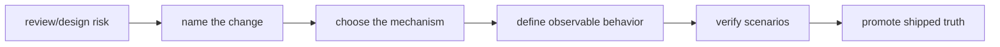

+++
title = "流程框架捕捉知識，但不擁有知識"
date = "2026-06-12T08:09:01+08:00"
author = "TTL::0"
draft = false
isCJKLanguage = true
description = "一段知識在哪裡被發現，很容易被誤認為它本質上屬於哪裡。若一個洞見是在 OpenSpec 這樣的規格驅動流程裡出現，我們很自然會說：這是 OpenSpec 知識。 但這個說法常常太粗。流程可以讓一個問題被命名、被拆解、被驗證、被保存； 它未必就是那個問題所屬的知識領域。"
tags = [
    "分析論述", # term:AnalyticalEssay
    "AI 代理人", # term:AiAgent
    "形狀", # term:DataShape
    "反思", # term:Reflection
  ]
[ai_info]
    [ai_info.generation]
        model = "GPT 5.5"
        agent = "Codex VS Code extension 26.609.30741"
    [ai_info.refinement]
        model = "Gemini 3.1 Pro"
        agent = "Antigravity IDE 2.0.4"
+++

<!--more-->

## 背景

一段知識在哪裡被發現，很容易被誤認為它本質上屬於哪裡。若一個洞見是在
OpenSpec 這樣的規格驅動流程裡出現，我們很自然會說：這是 OpenSpec 知識。
但這個說法常常太粗。流程可以讓一個問題被命名、被拆解、被驗證、被保存；
它未必就是那個問題所屬的知識領域。

這個區分在一次 reservation receipt 的設計過程中變得清楚。問題最初被一套
OpenSpec lifecycle 捕捉：先寫 proposal，再寫 design，再寫 delta spec，最後透過
tests 和 living spec 保存結果。可是被捕捉的核心並不是「如何使用 OpenSpec」，
而是 lease-based system 中的 correctness pattern：一個 resolver 不能只靠 job
identity 來修改工作，它必須證明自己仍然持有當前 reservation 的 authority。

本文的論點是：好的流程像顯影液。它讓知識浮現，但不決定知識的本體分類。知識
被流程捕捉之後，還需要依它解決的問題重新歸類。

## 分析

### 來源不是本質

最常見的誤認，是把 provenance 當成 ontology。Provenance 是一個東西從哪裡來；
ontology 是它本質上是什麼。兩者有關，但不能互換。一個工程洞見可能在 code
review 裡被發現，但它不一定是 review 方法論。一個產品原則可能在 roadmap 會議
中成形，但它不一定是會議流程知識。同樣地，一個 correctness pattern 可能在
OpenSpec change 中被固定，但它不因此變成 OpenSpec 本體知識。

判斷一段知識的歸屬，應該先問它解決的是什麼問題。若它回答「流程產物如何排序」，
它比較可能是 workflow 知識。若它回答「什麼條件下狀態轉移才有效」，它就是
系統正確性知識。若它回答「某個團隊或 repo 應該如何約定工作」，它才是 durable
project knowledge。這個判準比「它出現在哪個工具裡」更可靠。

### OpenSpec 的角色：把隱性風險變成可驗證契約

OpenSpec 在這個敘事中的價值很大，但它的價值不是替代工程判斷。它的價值是讓
工程判斷有地方落地。

一個風險最初可能只是設計文件中的一行：resolution 只用 `JobId`，在單一 sequential
worker 下安全，但未來 concurrent worker 或 durable broker 會需要 reservation
token。這句話如果停在風險列表裡，它仍然是可忽略的提醒。OpenSpec lifecycle 把
它推過幾個門檻：

這個流程的重要性在於，它把「可能有問題」變成「什麼行為必須成立」。proposal
說明為什麼現在要處理；design 比較方案；delta spec 描述 expired receipt 和
superseded receipt 應該如何被拒絕；tests 讓這些場景不只停留在文字裡；living spec
最後記錄系統已經出貨的真相。

但這些只是捕捉機制。被捕捉的核心，還是要回到系統模型本身。

### 技術核心：stale resolver 的權限問題

在 lease-based system 中，reservation 通常不是永久所有權。worker 取得工作時，
broker 只是暫時把工作藏起來一段時間。這段時間稱為 visibility lease。若 worker
在 lease 內完成，它可以 ack、retry 或 fail。若 lease 過期，工作應該重新變得可見，
以維持 at-least-once delivery。

問題出在 resolution authority。若 resolver 只需要提供 job identity，例如
`ack(job_id)`，那麼它可能在 lease 過期後仍然成功修改工作。更糟的是，另一個 worker
可能已經重新 reserve 同一個工作，舊 resolver 仍能 ack、retry 或 fail 它。此時
系統雖然看起來有 visibility lease，但 resolution 並沒有被 lease 約束。

這不是語法問題，也不是 API 美觀問題。這是權限模型錯誤。reservation 是暫時授權，
resolution 必須證明自己持有的授權仍然是當前授權。否則 at-least-once delivery
會被 stale mutation 侵蝕。

### 模式命名：reservation receipt / fencing token

解法是把 reservation authority 具體化成 receipt。broker 在 reserve 時回傳兩個
東西：工作內容與 opaque receipt。opaque 的意思是呼叫端不應理解或構造它，只把它
當成 broker 發出的權限憑證。之後 ack、retry、fail 都必須帶這個 receipt。

這個模式和 SQS receipt handle 或 fencing token 類似。它的要點不是 token 長什麼
樣子，而是 broker 驗證它是否仍然 current。

有幾種可能方案：

- JobId-only resolution 最簡單，但不能阻止 stale resolver。
- 公開 lease epoch 較容易實作，但把某種 backend 策略洩漏成公共契約。
- opaque per-reservation receipt 讓 broker 保留實作自由，也讓 durable backend 可以
  映射自己的 receipt handle。

選擇 opaque receipt 的原因，不是因為它最複雜，而是因為它把正確的抽象邊界放在
公共契約上。呼叫端只知道「我持有一張 reservation receipt」；broker 才知道如何
判斷它是否 expired、superseded 或 unknown。

### 流程如何幫助工程知識成熟

這裡可以看見流程與工程判斷的合作關係。工程判斷先指出問題：JobId-only resolution
允許 stale mutation。流程接著迫使這個判斷變得清楚：它需要 proposal 的動機、
design 的取捨、spec 的 observable behavior、tests 的反例與正例。

這種成熟化有三個效果。

第一，它讓風險從評論變成契約。風險若只是「未來可能要 receipt」，很容易被延後。
一旦寫成「expired receipt SHALL be rejected」，它就成為可測試的語義。

第二，它讓方案選擇留下理由。opaque token、epoch counter、JobId+receipt 都可能
工作，但它們的抽象邊界不同。design document 把這些取捨留給未來讀者，避免他們只
看到最後 API，看不到為什麼不是其他**形狀**（Data Shape） <!-- term:DataShape -->。

> [!IMPORTANT]
> **形狀** <!-- term:DataShape --> (Data Shape): 資料結構或物件所包含的屬性與型別定義，通常由型別系統來描述 <!-- anchor:DataShape -->

第三，它把 project-specific implementation 和 transferable pattern 分開。某個
repo 可能用 UUID 實作 receipt，另一個 broker 可能用 backend receipt handle。但
可轉移的原則是：resolve 必須綁定 current reservation authority。

### 重新分類：同一輪流程中其實有三種知識

當一段工作完成後，最有價值的動作不是把所有結論都貼上同一個標籤。更好的做法是
重新分類。

第一類是直接流程知識。例如 propose、apply、sync、archive 如何排序，以及何時把
delta spec promoted into living spec。這些知識確實屬於 OpenSpec workflow。

第二類是流程治理知識。例如 per-agent shim 不提交，共享 guideline 才提交；sync 應
綁定 verification，不是 archive。這些知識和 OpenSpec 相鄰，但更廣泛地關於 repo
governance。

第三類是工程 correctness 知識。例如 reservation receipt、stale resolver、fencing
token。這些知識不是 OpenSpec 知識。OpenSpec 只是把它們從隱性風險推成顯性契約。

這個分類能避免兩種錯誤。第一種錯誤是把工程 pattern 埋在流程文件裡，讓未來需要
分散式系統知識的人找不到它。第二種錯誤是把流程產物誤當成工程原理，導致人們
學會了怎麼寫 artifacts，卻沒學會為什麼 stale authority 危險。

## 結論

好的流程常常會讓人高估流程本身。因為它確實讓事情變好了：它防止遺忘，降低任意
決策，讓變更有可追蹤的順序。可是流程越有效，越容易把被流程顯影出的知識都收入
自己的名下。

這裡的張力不是要貶低流程。相反，流程之所以值得使用，正是因為它能捕捉比流程更
大的知識。OpenSpec 的價值不在於讓所有事情都變成 OpenSpec 問題，而在於它讓
非 OpenSpec 問題也能被嚴肅處理。

因此，一個成熟的知識系統需要兩步。第一步是捕捉：把洞見放進 proposal、design、
spec、test 或 guide 中。第二步是歸類：問這段洞見應該被誰理解、誰保存、在哪個
語境中重用。沒有第一步，知識容易流失。沒有第二步，知識會被放錯抽屜。

## 結論

一個流程框架可以是知識的顯影液，但不該被誤認為知識的主人。當一段洞見在流程
裡出現時，先感謝流程讓它浮現；接著把它從來源中取出，依它解決的問題重新命名。

可遷移的原則有三條：

1. **不要用來源判定本質。** 一段知識在哪裡被捕捉，不等於它屬於哪個知識領域。
2. **讓流程負責成熟化，讓分類負責重用。** proposal、design、spec、tests 能讓
   洞見變得可追蹤；分類則決定未來誰該找得到它。
3. **把 correctness pattern 從流程外殼中抽出來。** 如果一段知識回答的是狀態、
   權限或生命週期如何保持正確，它應被視為工程知識，即使它是在流程 artifact 中
   被發現與保存。