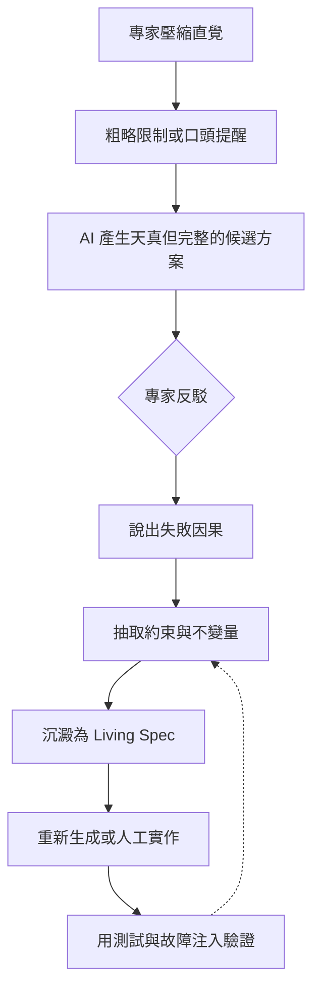

+++
title = "逆向解壓縮：專家直覺與 AI 幻覺的正面對決"
date = "2026-06-13T22:39:02+08:00"
author = "TTL::0"
draft = false
isCJKLanguage = true
description = "在系統重寫、架構治理或 AI 協作開發中，團隊很自然會倚賴原作者或資深維護者。他們知道哪些地方危險，知道哪些設計不能動，也知道某些看似古怪的限制背後曾經發生過什麼事故。照理說，讓這些專家直接指揮 AI，應該能得到最好的結果。"
tags = [
    "分析論述", # term:AnalyticalEssay
    "AI 代理人", # term:AiAgent
    "幻覺", # term:Hallucination
    "大型語言模型", # term:LargeLanguageModel
    "知識萃取", # term:KnowledgeExtraction
    "形狀", # term:DataShape
  ]
series = ["重構的重力井：AI 跨語言重寫的邊界與多維治理"]
[ai_info]
    [ai_info.generation]
        model = "GPT 5.5"
        agent = "Codex VS Code extension 26.609.30741"
    [ai_info.refinement]
        model = "Gemini 3.1 Pro"
        agent = "Antigravity IDE 2.0.4"
+++

<!--more-->

## 引言：最懂系統的人，常常最難把系統說清楚

在系統重寫、架構治理或 AI 協作開發中，團隊很自然會倚賴原作者或資深維護者。他們知道哪些地方危險，知道哪些設計不能動，也知道某些看似古怪的限制背後曾經發生過什麼事故。照理說，讓這些專家直接指揮 AI，應該能得到最好的結果。

現實往往相反。專家越熟悉系統，越可能用壓縮過的直覺說話。他可能只說：「這裡不能加鎖」、「這個狀態不能合併」、「這段流程不能改成同步」、「不要相信那個欄位」。這些話對同樣經歷過系統歷史的人很有意義，對 AI 卻常常不夠。AI 需要的是因果鏈、約束條件、失敗模式與可檢查的規格；專家給出的卻是結論。

這不是專家表達能力不足，而是專業知識的自然形態。長期維護系統的人，會把大量細節壓縮成直覺。直覺讓他能快速判斷風險，但也讓他很難從零展開所有原因。當 AI 只收到直覺結論，卻沒有收到背後的因果，它會試圖用常見模式補齊空白，於是產生一個自洽但物理錯誤的方案。

逆向解壓縮就是針對這個困境的方法：不要要求專家一開始就完美說明系統，而是利用 AI 的錯誤初稿觸發專家的反駁，讓隱性知識從「不行」被逼成「因為」。

## 一、專家直覺為什麼會壓縮

專家不是記住更多規則的人，而是把大量情境摺疊成快速判斷的人。當他看到一段新設計，可能立刻知道它會造成問題，但這個判斷背後也許包含多年事故記憶：

1. 某次高峰流量下，資料庫鎖等待形成連鎖阻塞。
2. 某個外部 API 在 timeout 後仍會完成副作用，導致重試重複扣款。
3. 某個舊欄位雖然命名錯誤，卻被三個下游系統用來判斷狀態。
4. 某段非同步流程不能合併，因為其中一段必須跨部署版本保持相容。
5. 某個 cache 不能簡單失效，因為它也是降級模式的一部分。

經過長期累積，專家不會每次都重新推導這些因果。他的大腦會把它們壓縮成模式辨識。這對日常維護很有效，因為系統裡很多決策需要快速判斷。但當要把知識交給 AI、交給新團隊或沉澱成規格時，壓縮就變成障礙。

專家說「不要用鎖」時，真正意思可能是：

1. 不要在這個熱路徑上持有跨 I/O 的全域鎖。
2. 因為外部服務延遲可能達到 30 秒。
3. 在高峰時這會耗盡 Worker。
4. Worker 耗盡後會阻塞確認流程。
5. 確認流程阻塞會導致訊息重送。
6. 重送會放大同一批外部呼叫。
7. 最後整個系統會進入自我放大的故障迴圈。

這條因果鏈如果沒有被說出來，AI 聽到的只是「不要用鎖」。它可能改用 channel、actor、async mutex、無鎖佇列或其他看似符合要求的方案，但仍然在跨 I/O 等待上保留同樣的資源佔用問題。它遵守了文字，卻沒有理解物理原因。

## 二、AI 為什麼會填補錯誤因果

大型語言模型不喜歡空白。當 prompt 裡有結論但缺少原因，它會根據訓練分布補出一個合理故事。這種補故事能力在普通任務中很有用，因為它能把不完整需求轉成可執行方案。但在高風險工程場景中，補出的因果可能恰好是幻覺的來源。

例如專家說：「重寫這個模組時不要使用全域鎖。」AI 可能理解成「請使用更現代的並發模式」。於是它產生 actor model，讓所有請求透過單一 actor 序列化處理。形式上它沒有使用全域 mutex，但物理上仍然保留了單點序列化，甚至更難觀測。專家真正反對的是熱路徑序列化，不是 mutex 這個語法符號。

又例如專家說：「這裡必須保留舊欄位。」AI 可能推論這是向後相容需求，於是在新資料模型中永久保留該欄位。但專家真正意思可能是：「遷移期間要保留，等舊版客戶端退場後要移除。」如果沒有時間維度，AI 會把暫時相容變成永久設計。

AI 的錯誤不是任意的，而是自洽的。它會生成一套看起來尊重專家指示的方案。危險正在這裡：錯誤方案足夠完整，才能激發專家說「不是這樣」。

## 三、逆向解壓縮的核心：用錯誤初稿逼出原因

傳統知識萃取要求專家先說明完整背景，再由文件化者整理成規格。這對專家很痛苦，因為他必須在沒有刺激物的情況下回憶大量隱性脈絡。逆向解壓縮反過來做：先讓 AI 根據不完整資訊產生一份天真方案，再請專家指出它會在哪裡壞。

指出錯誤比從零描述容易。專家看到具體方案時，壓縮直覺會被觸發。他不必先整理整個宇宙，只需要對眼前的錯誤產生反應：

1. 「這裡不能 await，因為持有租約時等待外部 API 會讓任務過期。」
2. 「這個 retry 會重複扣款，因為對方 timeout 後仍可能完成交易。」
3. 「這個欄位不能改名，因為舊版 mobile app 用字串比對。」
4. 「這個 queue 不能共用，因為低優先級任務曾經餓死高優先級告警。」
5. 「這個狀態不能合併，因為 pending_cancel 和 cancelled 對財務結算意義不同。」

每一句反駁都把「直覺」往「因果」推進一步。逆向解壓縮的目標不是讓 AI 第一次就寫對，而是讓 AI 的錯誤成為知識萃取的探針。

這個流程把 AI 從「必須一次正確的實作者」改造成「觸發專家記憶的刺激物」。它承認 AI 會錯，並把這個錯誤納入方法。

## 四、如何讓錯誤初稿可用而不危險

逆向解壓縮不是隨便讓 AI 亂寫。錯誤初稿必須被限制在安全框架中，否則它會污染後續設計。好的錯誤初稿應符合幾個條件。

第一，它必須是可討論的完整方案。只列抽象原則不夠，因為專家需要具體形狀來反駁。方案應包含資料流、狀態轉移、錯誤處理、資源模型與主要 API。

第二，它必須明確標記為候選假設，而不是建議實作。所有參與者都要知道這份內容的目的不是被採納，而是被攻擊。

第三，它必須避免過度權威語氣。AI 輸出應使用「假設」、「可能」、「待驗證」等標記，降低團隊被流暢文字說服的風險。

第四，它必須可追蹤。專家每一次反駁都應被記錄成結構化條目：錯誤設計、失敗原因、觸發條件、應保留的約束、需要驗證的測試。

第五，它不應直接進入 codebase。逆向解壓縮產生的是知識，不是立即可合併代碼。真正的實作應在規格沉澱後重新生成或重新手寫。

## 五、從反駁到規格：把怒火變成可執行約束

專家的反駁如果只停留在聊天紀錄中，很快又會變回隱性知識。逆向解壓縮真正有價值的地方，是把反駁轉成規格。

例如專家說：「這裡不能在持有 job lease 時呼叫外部 API，會造成 lease 過期後重複執行。」這句話可以被轉成幾個規格條目：

1. Worker 必須在取得 job lease 後，只執行本地狀態轉移與短時間 I/O。
2. 外部 API 呼叫必須在可重入的 delivery attempt 中執行。
3. 每次外部呼叫必須帶有 idempotency key。
4. lease 過期後，新的 Worker 可以接手，但不得產生不可控的重複副作用。
5. 測試必須覆蓋 Worker 在外部呼叫前、中、後崩潰的情境。

這才是 AI 能使用的上下文。它不再只是「不要這樣」，而是清楚描述系統不變量與驗證方式。

同樣地，「這個狀態不能合併」應轉成狀態機規格；「這個欄位不能刪」應轉成相容性矩陣與退場條件；「這個 queue 不能共用」應轉成優先級隔離與資源上限規格。規格化的過程讓專家直覺離開個人大腦，進入團隊與工具都能使用的公共空間。

## 六、逆向解壓縮與 code review 的關係

逆向解壓縮也可以改造 code review。傳統 review 常常在程式碼已經寫完後才發生，這時作者已投入大量時間，討論容易變成局部修補。若把逆向解壓縮放在設計前期，review 的焦點會從「這段程式碼哪裡要改」變成「這個方案在哪些失敗模式下不成立」。

一個可行流程是：

1. 作者用 AI 產生候選設計，而非正式實作。
2. 資深工程師只 review 設計的失敗語義與邊界。
3. 每個反駁都轉成 spec、測試或 archive note。
4. 規格穩定後，再讓 AI 或人依規格實作。
5. 最終 code review 檢查實作是否忠於規格，而不是重新發明所有上下文。

這樣做能減少兩種浪費：一是 AI 過早生成大量錯誤代碼，二是專家在 review 階段反覆用口頭方式重講歷史原因。專家仍然需要投入，但投入被集中在最有價值的地方：揭露隱性邊界。

## 七、何時不適合使用逆向解壓縮

這個方法不是萬能。若系統風險極高，例如涉及金流清算、安全權限、醫療決策或不可逆資料刪除，不能讓 AI 的錯誤初稿被誤認為實作方向。此時逆向解壓縮仍可用，但必須更嚴格地隔離在設計文件中，並由人類主導。

若專家已經能提供完整規格，也不需要故意讓 AI 先錯。逆向解壓縮的價值在於處理壓縮直覺，不是取代清晰文件。

若團隊缺乏把反駁轉成規格的紀律，這個方法也會失敗。專家罵完 AI 之後若沒有沉澱，知識仍然留在空氣中。下一輪 AI 或新人會犯同樣錯誤。

## 結論：AI 的平庸性可以變成知識萃取工具

AI 在專家系統中最危險的地方，是它會用自洽文字填補不知道的因果。但同一個特性也可以被反過來利用。讓 AI 生成一份天真、完整、可攻擊的方案，能迫使專家把壓縮直覺展開成具體反駁。只要團隊有紀律地把反駁轉成規格，AI 的錯誤就不再只是風險，而是知識萃取的催化劑。

逆向解壓縮的本質，是承認專家知識不是天然以文件形式存在，也承認 AI 不會自動理解未被說出的物理因果。兩者正面碰撞時，若沒有流程，會產生幻覺與挫折；若有流程，則能把「這樣不行」轉化為「系統必須如此」。

真正的成果不是 AI 寫出第一版正確代碼，而是團隊終於把原本只存在於專家直覺中的邊界，變成每個人、每個工具、每一次未來重構都必須遵守的共同契約。