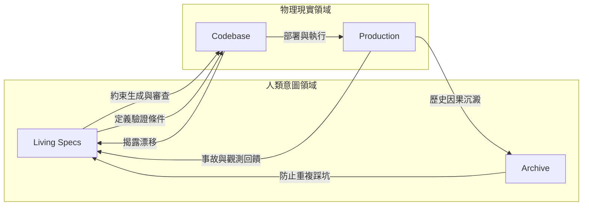

+++
title = "重建宇宙：抵禦技術熵增的多維 SSOT 框架"
date = "2026-06-13T22:39:03+08:00"
author = "TTL::0"
draft = false
isCJKLanguage = true
description = "在傳統工程治理中，團隊常說需要 SSOT，也就是 Single Source of Truth。對資料系統而言，SSOT 可能是某張資料表；對 API 而言，可能是 OpenAPI schema；對架構而言，可能是一份設計文件。這個概念的核心很簡單：當不同描述互相衝突時，團隊必須知道哪一個說法具有權威。"
tags = [
    "分析論述", # term:AnalyticalEssay
    "AI 代理人", # term:AiAgent
    "形狀", # term:DataShape
    "技術債", # term:TechnicalDebt
  ]
series = ["重構的重力井：AI 跨語言重寫的邊界與多維治理"]
[ai_info]
    [ai_info.generation]
        model = "GPT 5.5"
        agent = "Codex VS Code extension 26.609.30741"
    [ai_info.refinement]
        model = "Unknown"
        agent = "Antigravity IDE 2.0.4"
+++

<!--more-->

## 引言：單一真理來源已經不夠

在傳統工程治理中，團隊常說需要 SSOT，也就是 Single Source of Truth。對資料系統而言，SSOT 可能是某張資料表；對 API 而言，可能是 OpenAPI schema；對架構而言，可能是一份設計文件。這個概念的核心很簡單：當不同描述互相衝突時，團隊必須知道哪一個說法具有權威。

AI 深度參與開發後，這個問題變得更複雜。因為 AI 不只讀取真理來源，也會生成新的代碼、測試、文件與解釋。它可以快速補齊空白，卻也會快速製造新的不一致。若團隊只有單一維度的 SSOT，很容易出現三種失衡：

1. 文件寫得很美，但 codebase 中實際執行的是另一套行為。
2. codebase 是真實狀態，但缺乏意圖描述，AI 只能從現有形狀推斷未來方向。
3. 規格與代碼當下相符，卻沒有歷史因果，未來的人或 AI 會重新嘗試已失敗過的天真設計。

因此，現代 AI 協作工程不能只問「唯一真理在哪裡」，而要問「不同層次的真理各自負責什麼」。一個穩健系統需要多維 SSOT：Codebase 作為物理真理，Living Specs 作為意圖真理，Archive 作為歷史因果真理，Production 作為現實回饋真理。這些真理不是互相替代，而是互相制衡。

## 一、技術熵增：AI 為什麼需要更強治理

技術熵增指的是系統在長期變更後，逐漸失去清晰邊界、累積不一致、變得難以推理的過程。即使沒有 AI，軟體也會自然熵增：需求變更、臨時修補、團隊流動、文件過期、測試不足，都會讓系統偏離原始設計。

AI 讓這個過程加速。原因不是 AI 只能寫壞代碼，而是 AI 讓生成變得太便宜。當產出成本下降，團隊更容易接受「先讓它能跑」的局部解，並在事後才發現這些局部解改變了架構方向。AI 還會根據現有 codebase 的形狀繼續模仿，如果 codebase 已經有污染，它會把污染當成慣例擴散。

這種熵增通常不是一次大爆炸，而是很多小偏移：

1. 某個例外處理被複製到不該出現的層。
2. 某個內部欄位被新模組直接依賴。
3. 某個同步呼叫被塞進原本非同步的流程。
4. 某個相容性補丁沒有退場機制，逐漸變成永久設計。
5. 某個 AI 生成的 helper 看似方便，卻模糊了權限邊界。

要抵禦這種熵增，單靠 code review 不夠，單靠文件也不夠。團隊需要一套能同時回答「系統現在是什麼」、「系統應該是什麼」、「系統為什麼不能那樣」與「現實是否證明我們錯了」的治理模型。

## 二、第一維：Codebase 是物理現實的 SSOT

無論文件如何描述，真正被 CPU 執行、被資料庫承受、被使用者觸發的是 codebase。若文件說某流程是非同步，但代碼實際同步等待外部 API，那系統在物理上就是同步的。若規格說某狀態不可跳轉，但代碼允許直接更新欄位，那狀態機在現實中就是可被繞過。

因此，Codebase 是物理現實的 SSOT。它回答的是：系統現在實際做什麼。

這個地位不能被文件取代。很多治理失敗來自團隊過度相信文件，而沒有承認 codebase 已經漂移。AI 也會受到這種漂移影響。當 AI 讀到大量現有代碼時，它會把現有模式視為可延續的慣例，即使那些模式只是歷史事故或臨時補丁。

把 Codebase 視為物理 SSOT，有幾個實務含義：

1. 規格必須能追蹤到實作，不可長期停留在願望狀態。
2. 測試、靜態檢查與 runtime assertion 應驗證關鍵規格是否被代碼遵守。
3. AI 生成代碼前，應先檢查相關區域是否已有污染模式，不能盲目模仿。
4. 當 codebase 與文件衝突時，不能只改文件，也不能只怪代碼；必須啟動調和流程。

Codebase 是真實地形，但它不是全部真理。因為它只告訴我們現在如何運作，不一定告訴我們為什麼這樣運作，也不一定告訴我們未來應該往哪裡走。

## 三、第二維：Living Specs 是意圖真理的 SSOT

Living Specs 負責回答：系統應該是什麼。

它不是傳統意義上寫完就過期的設計文件，而是和系統演進一起維護的契約層。它應該描述狀態機、資料權威、API 語義、錯誤處理、相容性要求、資源邊界、非功能需求與不可違反的不變量。對 AI 協作而言，Living Specs 是最重要的上下文之一，因為它把人類意圖從零散聊天與口頭記憶中拉出來，變成可被工具讀取的約束。

AI 需要 Living Specs 的原因很直接：只給 codebase，AI 會模仿現狀；只給需求，AI 會套常見模式；給它規格，它才有機會在受控範圍內生成符合系統意圖的變更。

有效的 Living Specs 應具備幾個特徵：

1. 描述不變量，而不只是描述目前實作。
2. 包含失敗語義，而不只是成功流程。
3. 標明權威資料來源與衍生資料。
4. 記錄相容性窗口與退場條件。
5. 能連到測試、實作或 runtime 檢查。
6. 在變更完成後被更新，而不是留在初始版本。

Living Specs 的權威不是物理權威，而是意圖權威。它可以說「這段代碼雖然現在這樣跑，但這不是我們承認的架構方向」。這種權威對抵禦 AI 熵增非常重要，因為 AI 很容易把既有壞味道視為可複製範例。Spec 的存在讓團隊能對 AI 說：不要只學 codebase 的形狀，請服從這裡定義的邊界。

## 四、第三維：Archive 是歷史因果的 SSOT

Archive 負責回答：我們為什麼走到這裡，以及哪些路已經證明不能走。

很多架構決策看起來不優雅，是因為它們在防禦某個外部觀察不到的事故。若這些事故沒有被保存，未來的人會把防線當成技術債；AI 更會把它視為可以清理的噪音。於是團隊反覆重構回同一個坑，形成循環重構陷阱。

Archive 的價值在於保存因果，而不是保存所有歷史垃圾。它應該記錄：

1. 某個設計被採用的背景。
2. 被拒絕過的替代方案與失敗原因。
3. 生產事故暴露出的隱性邊界。
4. 相容性決策的時間範圍。
5. 重構或遷移過程中的取捨。
6. 已知危險模式與禁止原因。

例如，「不要把高優先級告警任務和批次報表任務放在同一個 queue」如果只是一條口頭規則，未來很容易被 AI 或新人視為過度設計。但若 Archive 記錄了某次報表暴增導致告警延遲 20 分鐘的事故，這條規則就有了因果重量。

Archive 與 Living Specs 的差別在於：Spec 管現在與未來的契約，Archive 管過去的教訓。Spec 不應塞滿所有歷史細節，否則會變得難讀；Archive 則可以保留更完整的背景，讓需要質疑某個限制的人能追溯原因。

## 五、第四維：Production 是現實回饋的 SSOT

Codebase 告訴我們系統如何寫，Production 告訴我們系統如何被現實對待。兩者不同。代碼可以看起來正確，但在真實流量、真實資料、真實網路與真實使用者行為下暴露問題。

Production 作為現實回饋 SSOT，負責回答：我們的假設是否成立。

這一維包含 metrics、logs、traces、事故報告、SLO、使用者回饋、資料修復紀錄、容量趨勢與故障演練結果。它對 AI 協作也很重要，因為 AI 通常看不到這些物理訊號。如果生成策略只依賴 codebase 和文件，會缺少現實校正。

Production 回饋應能反向更新 Specs 與 Archive：

1. 當某個延遲假設被打破，Spec 要更新非功能需求。
2. 當某個事故揭露新邊界，Archive 要記錄因果。
3. 當某個 AI 生成模式在生產中表現不佳，團隊要把它列為危險模式。
4. 當某個相容性補丁已無流量使用，Spec 要推動退場。

沒有 Production 這一維，治理會變成紙上架構。AI 可能生成符合文件的代碼，但文件本身已經脫離現實。

## 六、多維 SSOT 如何互相制衡

多維 SSOT 的重點不是製造更多文件，而是建立衝突處理機制。不同真理來源必然會衝突，成熟治理的標誌不是沒有衝突，而是知道衝突時如何行動。

幾種典型衝突如下：

1. Codebase 與 Spec 衝突：要判斷是實作漂移，還是 Spec 過期。若是漂移，修代碼；若是 Spec 過期，更新意圖並記錄原因。
2. Spec 與 Production 衝突：若生產現實打破規格假設，必須調整規格或補強系統，不可只忽略 metrics。
3. Codebase 與 Archive 衝突：若新代碼重引入曾失敗的模式，review 必須要求作者說明為何這次條件不同。
4. Spec 與 Archive 衝突：若團隊想移除舊限制，必須確認當年限制的觸發條件是否已不存在。

AI 可以被嵌入這個流程，但不能取代流程。它可以幫忙檢查 PR 是否違反 Spec，整理 Archive 中相關歷史，根據 Production 指標提出可能風險；但最終衝突裁決仍需要人類架構責任。

## 七、實作多維 SSOT 的最小可行做法

團隊不需要一開始就建立龐大的治理平台。可以從幾個最小動作開始。

第一，為核心模組建立 Living Spec。不要試圖一次文件化整個系統，先挑選最容易被 AI 誤改、最有事故風險、最需要跨團隊理解的部分。

第二，每次重大 review 都要求至少回答三個問題：這次變更是否改變 Spec？是否需要 Archive 記錄原因？是否需要新的 Production 指標或告警？

第三，建立「禁止模式」清單，但每條都必須連到因果說明。禁止不是權威口吻，而是歷史記憶的壓縮入口。

第四，把 AI prompt 從「請照現有代碼修改」改成「請依 Spec 修改，並檢查 Archive 中是否有相關禁忌」。這會明顯改變 AI 的生成方向。

第五，對 AI 生成的核心變更要求附上規格對照。作者必須說明每個重要設計如何滿足 Spec，哪些地方是延伸，哪些地方需要人類裁決。

第六，讓 Production 事件回流。事故後不只修 bug，還要問：哪條 Spec 缺失？哪個 Archive 條目應新增？哪個 AI 生成模式需要標記風險？

這些做法的目標不是增加儀式，而是讓知識不再只存在於某個人的記憶、某次聊天或某段偶然代碼中。

## 八、避免多維 SSOT 變成文件墳場

多維 SSOT 的風險是文件膨脹。若每個決策都被寫成長篇文件，團隊很快會停止閱讀，AI 也會被大量低價值上下文污染。因此需要幾條紀律。

第一，Spec 寫不變量與契約，不寫流水帳。它應該短、硬、可驗證。

第二，Archive 寫因果，不寫情緒。它可以保留背景，但核心必須是「當時條件、採取決策、替代方案、結果」。

第三，Codebase 中的註解只標記局部必要資訊，深層歷史應連到 Archive，不要塞滿實作。

第四，Production 回饋要被摘要成決策資料，不是把所有 logs 當知識保存。

第五，過期的相容性與限制要有退場流程。否則治理本身會成為新的重力井。

好的 SSOT 不是保存一切，而是保存未來決策所需的最小因果。

## 結論：重建宇宙需要多種真理互相拉住

AI 時代的工程治理不能只依賴單一權威。Codebase 是物理現實，但它可能攜帶歷史污染。Living Specs 是人類意圖，但它可能過期。Archive 保存歷史因果，但它不能替代當前契約。Production 提供現實回饋，但它需要被解釋後才能變成設計。

多維 SSOT 的價值，在於讓這些真理互相制衡。當 AI 生成速度提高，團隊更需要清楚知道：什麼是現在實際存在的，什麼是我們希望維持的，什麼是過去已經教訓過我們的，什麼是現實正在反駁我們的。

真正抵禦技術熵增的，不是一份完美文件，而是一個能把代碼、規格、歷史與生產回饋持續對齊的治理迴路。只有在這樣的迴路中，AI 才能成為擴展工程能力的工具，而不是擴散平庸與遺忘的力量。