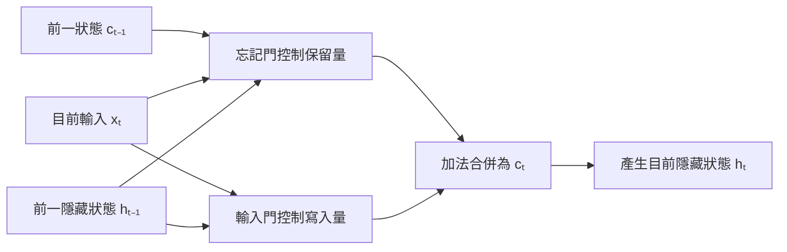

+++
title = "RNN 如何壓縮序列：隱藏狀態、梯度與門控資訊流"
date = "2026-09-06T02:36:04+08:00"
author = "TTL::0"
draft = false
isCJKLanguage = true
description = "遞迴網路以共享轉換把可變長度歷史壓成固定維度狀態。說明梯度為何在長序列上失控，以及門控如何重塑資訊與梯度路徑，而不是賦予模型記憶。"
tags = [
    "分析論述", # term:AnalyticalEssay
    "大型語言模型", # term:Llm
    "遞迴式神經網路", # term:RecurrentNeuralNetwork
    "長短期記憶網路", # term:LongShortTermMemory
    "實務對比", # term:PracticalContrastiveExamples
    "損失函數", # term:LossFunction
    "反思", # term:Reflection
    "導言", # term:Introduction
  ]
series = ["統計模型如何學習：同一套骨架，如何長出不同的參數與表示"]
[ai_info]
    [ai_info.generation]
        model = "GPT 5.6 Sol"
        agent = "Codex VS Code extension 26.901.22334"
    [ai_info.refinement]
        model = "Claude Opus 5"
        agent = "Claude Code VSCode Extension 2.1.261"
+++

<!--more-->

## 導言

序列資料的目前輸出常依賴先前輸入。**遞迴式神經網路**（Recurrent Neural Network） <!-- term:RecurrentNeuralNetwork -->以重複套用同一個狀態轉換，將可變長度歷史映射成固定維度的隱藏狀態。

> [!IMPORTANT]
> **遞迴式神經網路** <!-- term:RecurrentNeuralNetwork --> (Recurrent Neural Network): 重複套用同一狀態轉換，把可變長度序列映射為固定維度隱藏狀態的網路。 <!-- anchor:RecurrentNeuralNetwork -->


這個設計常被說成模型具有記憶。技術上更準確的描述是：模型維持一個隨時間更新的數值狀態，而狀態對過去資訊的保留程度由參數、激活函數與訓練結果共同決定。

## 分析

最基本的 RNN 可以寫成：

$$
h_t=\tanh(W_hh_{t-1}+W_xx_t+b),
\qquad
\hat y_t=W_yh_t.
$$

不同時間步共享 $W_h$ 與 $W_x$。更新的是 $h_t$，不是每讀取一個輸入就重新訓練參數。共享讓模型可處理不同長度序列，也使梯度必須穿過多次相同轉換。

早期狀態對後期狀態的影響包含 Jacobian 連乘：

$$
\frac{\partial h_T}{\partial h_k}
=
\prod_{t=k+1}^{T}
\frac{\partial h_t}{\partial h_{t-1}}.
$$

若乘積的有效尺度持續小於 1，梯度會消失；若持續大於 1，梯度可能爆炸。這是訓練訊號的數值問題，不等同於模型主動刪除記憶。

下列標量實驗隔離連乘效果：

```python
import numpy as np

steps = np.arange(1, 51)
for scale in (0.8, 1.0, 1.2):
    influence = scale ** steps
    values = influence[[9, 19, 49]]
    print(scale, np.round(values, 6))
```

尺度 0.8 的影響快速衰減，1.2 則快速增長。真實 RNN 使用矩陣與非線性函數，但同一個連乘結構仍是分析起點。

**長短期記憶網路**（Long Short-Term Memory） <!-- term:LongShortTermMemory -->加入單元狀態與門控。簡化的更新為：

> [!IMPORTANT]
> **長短期記憶網路** <!-- term:LongShortTermMemory --> (Long Short-Term Memory): 以門控結構調節資訊與梯度路徑的遞迴網路變體。 <!-- anchor:LongShortTermMemory -->


$$
c_t=f_t\odot c_{t-1}+i_t\odot\tilde c_t.
$$

門控的作用可拆成「保留舊狀態」與「寫入新內容」兩條路徑：



普通 RNN 主要讓資訊反覆穿過非線性轉換；這條加法合併路徑則讓舊狀態可以按比例直接延續。門仍可能學會關閉，因此圖中呈現的是可用通道，不是長期記憶的保證。

忘記門 $f_t$ 與輸入門 $i_t$ 是連續數值控制器。它們讓梯度有較直接的加法路徑，但不保證任何內容必然長期保存。GRU 以較少狀態完成類似控制，取捨是參數量與狀態表達方式。

## 反思

RNN 的核心限制不只是狀態維度有限。即使維度很大，訓練仍需讓相關訊號穿過時間展開；序列計算也限制同一樣本內的平行化。

門控模型改善可訓練性，卻沒有取消資料與目標的影響。若**損失函數**（Loss Function） <!-- term:LossFunction -->不獎勵某項長程資訊，門控網路沒有理由保留它。結構提供可能路徑，不等於指定內容。

> [!IMPORTANT]
> **損失函數** <!-- term:LossFunction --> (Loss Function): 把模型輸出與目標之間的差距量化為單一數值的評分函數。 <!-- anchor:LossFunction -->


## 實務對比

錯誤說法是「RNN 每讀一個 token 就覆寫一次參數」。實際上，前向計算更新隱藏狀態；訓練階段才使用整段或截斷序列的梯度更新共享參數。

另一個錯誤是用 $0.8^{50}$ 直接證明所有 RNN 都會失去長程資訊。矩陣方向、激活導數、門控與殘差路徑都會改變結果；標量例子只展示連乘為何可能不穩定。

正確分析應分開觀察前向狀態敏感度與反向梯度範數。兩者相關，但一個描述輸入影響，另一個描述參數能否從誤差中學習。

## 結論

RNN 以共享轉換把序列歷史壓進隱藏狀態。它的能力來自狀態遞迴，它的訓練困難也來自同一個遞迴結構。

LSTM 與 GRU 用門控重塑資訊與梯度路徑，而不是賦予模型人類式記憶。理解狀態更新與參數更新的差別，才能準確討論序列模型的能力。

梯度問題的分析可參考 Pascanu、Mikolov 與 Bengio 的 [On the Difficulty of Training Recurrent Neural Networks](https://arxiv.org/abs/1211.5063)。