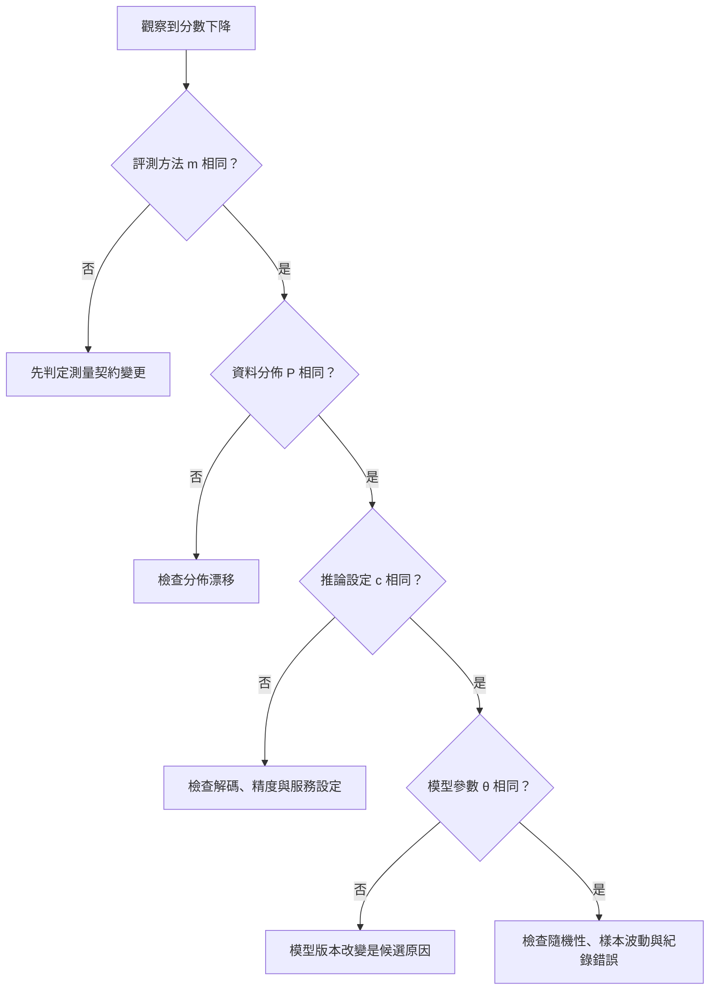

+++
title = "表現下降不等於模型退化：建立能力失效的診斷座標"
date = "2026-09-06T02:58:01+08:00"
author = "TTL::0"
draft = false
isCJKLanguage = true
description = "同一個準確率下降，可能來自參數更新、使用者族群改變、推論精度降低或評測換了題目。提出一組診斷座標，限定「能力退化」這句話需要哪些證據才能成立。"
tags = [
    "分析論述", # term:AnalyticalEssay
    "大型語言模型", # term:Llm
    "實務對比", # term:PracticalContrastiveExamples
    "機器學習", # term:MachineLearning
    "分佈漂移", # term:DistributionShift
    "差異", # term:Delta
  ]
series = ["模型能力如何失效：在歸咎模型之前，先固定比較條件"]
[ai_info]
    [ai_info.generation]
        model = "GPT 5.6 Sol"
        agent = "Codex VS Code extension 26.901.22334"
    [ai_info.refinement]
        model = "Claude Opus 5"
        agent = "Claude Code VSCode Extension 2.1.261"
+++

<!--more-->

## 導言

一個模型昨天準確率 90%，今天只剩 75%，直覺上像是模型退化了。然而，同一個數字可能來自參數被更新、使用者族群改變、推論精度降低，或評測題目換了一批。

如果只替症狀命名，便會把不同機制塞進同一故事。本文提出一組診斷座標，用來限定「能力退化」這句話需要哪些證據；這是分析工具，不是**機器學習**（Machine Learning） <!-- term:MachineLearning -->領域既有的統一生命週期理論。

> [!IMPORTANT]
> **機器學習** <!-- term:MachineLearning --> (Machine Learning): 先界定可選函數的範圍，再以資料估計其中參數的建模方法。 <!-- anchor:MachineLearning -->


## 分析

把觀察分數寫成：

$$
S(\theta,P,c,m).
$$

其中 $\theta$ 是模型參數，$P$ 是評估資料分佈，$c$ 是推論設定，$m$ 是把輸出換成分數的方法。這個記號的作用不是宣稱四者互相獨立，而是迫使分析者說明比較時究竟固定了什麼。

這四個座標可以轉成一棵最低限度的排查樹：



這棵樹不是要求固定順序，而是要求每條歸因都有對應的受控比較。只要上游座標尚未對齊，就不能從同一個下降症狀直接跳到「參數退化」。

若要主張模型本身退化，最直接的反事實比較是：

$$
\Delta_\theta S=
S(\theta_1,P^*,c^*,m^*)-
S(\theta_0,P^*,c^*,m^*).
$$

星號表示使用相同的參考條件。若 $\theta_1$ 在固定條件下較差，才能把**差異**（Delta） <!-- term:Delta -->定位到模型版本；即使如此，仍需繼續尋找是哪次訓練、轉換或序列化改變了行為。

> [!IMPORTANT]
> **差異** <!-- term:Delta --> (Delta): 特定變更的契約，用於驅動實作並作為驗證實作的基準對象。 <!-- anchor:Delta -->


下面的實驗製造兩種同樣從 100% 降到 75% 的情況。第一種更換模型閾值，第二種保留模型但更換資料。

```python
def accuracy(threshold, samples):
    correct = 0
    for x, label in samples:
        prediction = int(x >= threshold)
        correct += prediction == label
    return correct / len(samples)

reference = [(-2, 0), (-1, 0), (1, 1), (2, 1)]
shifted = [(-2, 0), (-1, 1), (1, 1), (2, 1)]

print("baseline:", accuracy(0, reference))
print("parameter changed:", accuracy(-1.5, reference))
print("distribution changed:", accuracy(0, shifted))
```

兩個 75% 無法互相替代。前者是決策邊界移動，後者是原來的輸入與標籤關係不再成立。只有保留模型版本、資料快照、推論設定與評測程式，才能辨認兩者。

這組座標還揭露第六種可能：測量假象。若評測指標從整體準確率改為罕見類別召回率，分數可以下降，但模型行為完全沒有變。新指標可能更符合需求，卻不能被倒述成模型突然遺失能力。

## 反思

能力不是脫離任務而獨立存在的物質。它通常表示模型在一組輸入、輸出契約與容許誤差下展現的行為。因此，固定比較條件不是形式主義，而是讓「能力」成為可反駁主張的最低要求。

另一方面，固定所有條件也可能掩蓋真實問題。部署系統關心的是今天能否服務今天的使用者，而不是只在舊測試集上維持分數。診斷需要同時保留兩種問題：模型是否改變，以及模型與世界是否仍匹配。

## 實務對比

錯誤做法是看到線上點擊率下降，便回滾模型權重。若實際原因是流量來源改變，回滾只會替換一個無辜的參數版本。

較好的做法會先重放同一批輸入，比較新舊模型輸出。接著固定模型，比較新舊資料切片；最後核對服務端的**量化**（Quantization） <!-- term:Quantization -->、提示模板與後處理。每一步只改一個座標，因果歸屬才有支點。

> [!IMPORTANT]
> **量化** <!-- term:Quantization --> (Quantization): 以較少位元表示權重或啟動值，改變數值格點以降低記憶體與計算成本的近似方法。 <!-- anchor:Quantization -->


另一個錯誤是把平均分數相同視為能力完全相同。兩個模型都得到 90%，其中一個可能改善常見案例，卻犧牲少數族群。平均值是一種測量壓縮，不能取代行為分佈。

## 結論

「模型退化」不是觀察句，而是因果判斷。表現由模型、資料、推論設定與測量方法共同產生；沒有固定比較條件，就不能把差異 <!-- term:Delta -->歸因於參數。

最可遷移的原則是先保存比較座標，再替現象命名。這能把含糊的時間故事改寫成可驗證問題，也避免讓「參數生命週期」之類的比喻超越證據。

經驗風險與**泛化**（Generalization） <!-- term:Generalization -->的背景可參考 [Deep Learning：機器學習 <!-- term:MachineLearning --> Basics](https://www.deeplearningbook.org/contents/ml.html)；部署系統的資料依賴與監測問題可參考 [Hidden **技術債**（Technical Debt） <!-- term:TechnicalDebt --> in 機器學習 <!-- term:MachineLearning --> Systems](https://proceedings.neurips.cc/paper_files/paper/2015/file/86df7dcfd896fcaf2674f757a2463eba-Paper.pdf)。

> [!IMPORTANT]
> **泛化** <!-- term:Generalization --> (Generalization): 模型在訓練樣本以外的資料上維持表現的能力。 <!-- anchor:Generalization -->
> **技術債** <!-- term:TechnicalDebt --> (Technical Debt): 程式碼中為求快速交付而妥協、待重構與修復的設計或品質缺陷。 <!-- anchor:TechnicalDebt -->