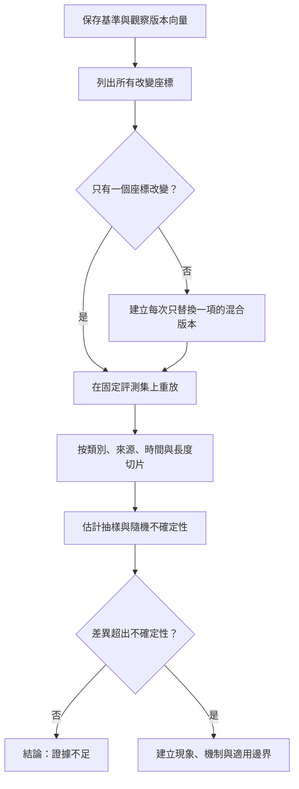

+++
title = "如何證明能力真的退化：控制變因、行為切片與因果診斷"
date = "2026-09-06T02:58:07+08:00"
author = "TTL::0"
draft = false
isCJKLanguage = true
description = "表現下降只是警報，不是根因。以可重放版本、單變因對照、行為切片與不確定性估計，把下降轉成可反駁的因果主張。"
tags = [
    "分析論述", # term:AnalyticalEssay
    "AI 代理人", # term:AiAgent
    "實務對比", # term:PracticalContrastiveExamples
    "差異", # term:Delta
    "反思", # term:Reflection
    "導言", # term:Introduction
  ]
series = ["模型能力如何失效：在歸咎模型之前，先固定比較條件"]
[ai_info]
    [ai_info.generation]
        model = "GPT 5.6 Sol"
        agent = "Codex VS Code extension 26.901.22334"
    [ai_info.refinement]
        model = "Claude Opus 5"
        agent = "Claude Code VSCode Extension 2.1.261"
+++

<!--more-->

## 導言

模型表現下降只是一個警報，不是根因。要證明能力真的退化，需要重現基線、固定比較條件，並排除資料、服務設定與評測程式的改變。

這種診斷與一般軟體除錯相似：先縮小**差異**（Delta） <!-- term:Delta -->，再建立能區分假說的實驗。不同之處是模型行為具有統計變異，單次重現通常不夠。

> [!IMPORTANT]
> **差異** <!-- term:Delta --> (Delta): 特定變更的契約，用於驅動實作並作為驗證實作的基準對象。 <!-- anchor:Delta -->


## 分析

把一次評估描述成版本向量：

$$
v=(\theta,P,c,m,s),
$$

其中 $s$ 是隨機種子或取樣狀態。比較 $v_0$ 與 $v_1$ 時，若多個座標同時改變，單一分數差不能識別各因素的效果。

最小診斷單位是受控對比：只替換一個座標並重算分數。多個因素可能互動，因此逐項差分不是唯一因果分解；它的價值是快速排除「什麼都變了」的不可判定狀態。

下列程式把兩次執行的差異 <!-- term:Delta -->轉成待驗證假說：

```python
baseline = {
    "model": "weights-v1",
    "data": "snapshot-2026-08",
    "inference": "fp32-greedy",
    "metric": "slice-accuracy-v2",
    "seed": 17,
}

observed = {
    "model": "weights-v2",
    "data": "snapshot-2026-09",
    "inference": "int8-greedy",
    "metric": "slice-accuracy-v2",
    "seed": 17,
}

changed = [
    key for key in baseline
    if baseline[key] != observed[key]
]
print("changed axes:", changed)
print("causal attribution ready:", len(changed) == 1)
```

輸出顯示模型、資料與推論同時改變，因此還不能把下降歸因於任何單一因素。下一步不是挑一個最像故事的原因，而是建立三組混合版本逐一重放。

完整程序可整理成一條逐步收窄假說的證據鏈：



流程的核心不是找出一個聽來合理的原因，而是讓每一步都排除一組替代解釋。最後的「證據不足」也是有效結果，它阻止抽樣噪聲被包裝成微幅退化。

平均分數之外還需要行為切片（behavioral slicing）。切片可按類別、來源、時間、輸入長度與安全邊界建立。其目的不是增加儀表板數量，而是找出損失是否集中於某個可解釋區域。

統計不確定性同樣重要。若兩次評估使用有限樣本，應提供重複種子、信賴區間或成對檢定。差異 <!-- term:Delta -->小於抽樣波動時，最合理的結論是證據不足，而不是輕微退化。

完整證據鏈應包含三層：現象是哪些行為改變，機制是哪個座標造成改變，邊界是在何種資料與設定下成立。缺少任一層，結論都應保持條件式。

## 反思

監測與診斷不是同一件事。線上監測追求快速發現異常，因此容許代理指標；根因診斷則需要保存版本與可重放資料。警報可以寬鬆，因果結論必須嚴格。

測不到漂移也不表示沒有風險。高維資料的兩樣本檢定依賴表示與樣本量，標籤延遲還會使真實任務損失晚於輸入改變出現。診斷系統本身也有偵測邊界。

## 實務對比

錯誤做法是只保存模型權重。若缺少資料快照、前處理版本與推論設定，即使舊權重仍在，也無法重建當時的行為基線。

較好的做法為每次發布保存可重放契約：模型雜湊、資料版本、前後處理、硬體精度、隨機設定及評測程式。發生下降後，先做新舊模型交叉新舊資料的二乘二比較。

另一個錯誤是反覆查看大量切片，直到找到顯著差異 <!-- term:Delta -->。多重比較會製造偶然訊號；探索所得切片應在獨立資料上確認，並回到預先定義的任務風險。

## 結論

能力退化需要被證明，而不是被命名。可重放版本、單變因對照、行為切片與不確定性估計共同把下降轉成可反駁的因果主張。

最重要的工程原則是保存比較條件。沒有資料與推論契約，模型版本只是一個孤立檔案；有了完整契約，失效才能被定位為未形成、學錯、被改寫、被近似，或只是與世界失配。

資料漂移偵測的實證邊界見 [Failing Loudly](https://proceedings.neurips.cc/paper/2019/hash/846c260d715e5b854ffad5f70a516c88-Abstract.html)；長期監測與資料依賴可參考 [Hidden **技術債**（Technical Debt） <!-- term:TechnicalDebt --> in **機器學習**（Machine Learning） <!-- term:MachineLearning --> Systems](https://proceedings.neurips.cc/paper_files/paper/2015/file/86df7dcfd896fcaf2674f757a2463eba-Paper.pdf)。

> [!IMPORTANT]
> **技術債** <!-- term:TechnicalDebt --> (Technical Debt): 程式碼中為求快速交付而妥協、待重構與修復的設計或品質缺陷。 <!-- anchor:TechnicalDebt -->
> **機器學習** <!-- term:MachineLearning --> (Machine Learning): 先界定可選函數的範圍，再以資料估計其中參數的建模方法。 <!-- anchor:MachineLearning -->