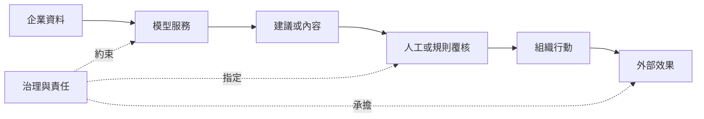

+++
title = "賣的不是模型：AI 商品由能力、服務與責任共同構成"
date = "2026-09-06T03:14:01+08:00"
author = "TTL::0"
draft = false
isCJKLanguage = true
description = "簽約買的是「AI 助理」，交付物看似一個模型，實際還包括 API、權限、監測、整合、支援與出錯後的處理程序。把 AI 商品視為社會技術系統，拆解各層如何共同決定可靠性。"
tags = [
    "分析論述", # term:AnalyticalEssay
    "AI 代理人", # term:AiAgent
    "社會技術系統", # term:SociotechnicalSystem
    "人工補償", # term:HumanCompensation
    "實務對比", # term:PracticalContrastiveExamples
    "反思", # term:Reflection
  ]
series = ["智慧敘事如何進入現實：不是市場受騙，而是敘事協調了投資與改造"]
[ai_info]
    [ai_info.generation]
        model = "GPT 5.6 Sol"
        agent = "Codex VS Code extension 26.901.22334"
    [ai_info.refinement]
        model = "Claude Opus 5"
        agent = "Claude Code VSCode Extension 2.1.261"
+++

<!--more-->

## 導言

企業簽約購買「AI 助理」時，交付物看似是一個模型。實際付款換來的通常還包括 API、權限、監測、整合、支援，以及出錯後的處理程序。

只研究模型會高估演示能力與產品能力的等價程度。本文把 AI 商品視為一個**社會技術系統**（Sociotechnical System） <!-- term:SociotechnicalSystem -->：數值模型只是其中一項元件，組織與基礎設施共同決定它能否可靠產生價值。

> [!IMPORTANT]
> **社會技術系統** <!-- term:SociotechnicalSystem --> (Sociotechnical System): 由技術元件與組織安排共同構成、必須整體運作才產生價值的系統。 <!-- anchor:SociotechnicalSystem -->

## 分析

可以先用加總式列出供應側元件：

$$
\text{AI Product}=
\text{Model}+
\text{Serving}+
\text{Integration}+
\text{Human Work}+
\text{Governance}.
$$

這不是會計恆等式，而是盤點工具。模型產生輸出；服務層管理容量與延遲；整合層連接企業資料；人類處理例外；治理層則指定誰能部署、覆核與停止系統。

商品價值也不能由模型分數直接推出。對特定流程，可把每期實現價值簡化成：

$$
V=**差異**（Delta） <!-- term:Delta --> Q+差異 <!-- term:Delta --> L-C_{\mathrm{serve}}
-C_{\mathrm{integrate}}-C_{\mathrm{review}}-mathbb E[H].
$$

> [!IMPORTANT]
> **差異** <!-- term:Delta --> (Delta): 特定變更的契約，用於驅動實作並作為驗證實作的基準對象。 <!-- anchor:Delta -->

$\差異 <!-- term:Delta --> Q$ 是品質改善，$\差異 <!-- term:Delta --> L$ 是節省的勞動，$H$ 是錯誤造成的損害。各項必須換成一致單位才可計算；在尚未估價時，這條式子只能提醒分析者哪些成本不應消失。

責任流與資料流並不相同。下面的關係圖顯示模型輸出需要經過授權，才會成為外部行動。

模型可以生成文字，卻不會自行取得付款、解僱或醫療處置權。行動權來自產品與組織設計；責任若在圖中沒有明確落點，不會因介面使用「助理」一詞而消失。

## 反思

「統計黑盒」不是 AI 獨有。保險定價、信用評分與需求預測同樣處理不確定性。生成式 AI 的特殊張力在於輸出像完整的人類工作成果，模型元件因而容易代表整個產品。

反過來，也不能因產品需要大量人工便否定模型價值。許多成熟服務都依賴操作、支援與風險控制。問題不是有沒有人，而是這些人力是否被計入成本、品質與責任設計。

## 實務對比

錯誤做法是用離線模型準確率估算可替代職位數。這跳過工作分解、例外比例、審核時間與錯誤損害，也假定每個正確輸出都能直接轉成組織行動。

較好的做法先選定一條工作流程，記錄輸入、模型輸出、人工接手與最終結果。只有端到端時間、品質與風險改善，才構成產品效用證據。

另一個錯誤是把「human in the loop」當成責任答案。若覆核者沒有時間、權限或足夠資訊，人類只是在介面上替自動化背書，而非有效控制。

## 結論

AI 商品不是模型權重的別名。它是模型、服務、整合、人工與治理共同運作的系統；任一層失效，都可能讓漂亮的模型輸出無法成為可靠結果。

因此，採購與評估應從交付責任出發，而非從模型人格出發。真正可購買的不是抽象智慧，而是一套在特定條件下產生效用、處理例外並承擔後果的服務安排。

AI 系統的角色與責任配置可參考 [NIST AI Risk Management Framework 1.0](https://www.nist.gov/publications/artificial-intelligence-risk-management-framework-ai-rmf-10)；模型只占生產系統一部分的工程分析見 [Hidden **技術債**（Technical Debt） <!-- term:TechnicalDebt --> in **機器學習**（Machine Learning） <!-- term:MachineLearning --> Systems](https://proceedings.neurips.cc/paper_files/paper/2015/hash/86df7dcfd896fcaf2674f757a2463eba-Abstract.html)。

> [!IMPORTANT]
> **技術債** <!-- term:TechnicalDebt --> (Technical Debt): 程式碼中為求快速交付而妥協、待重構與修復的設計或品質缺陷。 <!-- anchor:TechnicalDebt -->
> **機器學習** <!-- term:MachineLearning --> (Machine Learning): 先界定可選函數的範圍，再以資料估計其中參數的建模方法。 <!-- anchor:MachineLearning -->