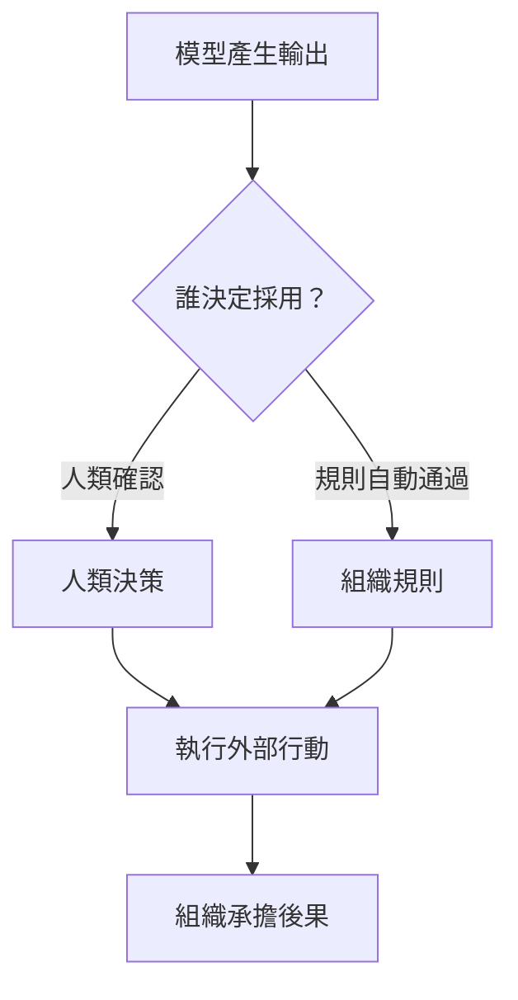

+++
title = "輸出為何看起來像行動者：語言介面、擬人化與責任投射"
date = "2026-09-06T03:14:02+08:00"
author = "TTL::0"
draft = false
isCJKLanguage = true
description = "「它知道」「它拒絕」能快速溝通系統行為，卻把輸出形式、內部機制與法律責任壓成同一個行動者。區分社會反應、行動授權與責任承擔三件事。"
tags = [
    "分析論述", # term:AnalyticalEssay
    "大型語言模型", # term:Llm
    "擬人化", # term:Anthropomorphism
    "實務對比", # term:PracticalContrastiveExamples
    "可見性", # term:Visibility
    "反思", # term:Reflection
    "導言", # term:Introduction
  ]
series = ["智慧敘事如何進入現實：不是市場受騙，而是敘事協調了投資與改造"]
[ai_info]
    [ai_info.generation]
        model = "GPT 5.6 Sol"
        agent = "Codex VS Code extension 26.901.22334"
    [ai_info.refinement]
        model = "Claude Opus 5"
        agent = "Claude Code VSCode Extension 2.1.261"
+++

<!--more-->

## 導言

一段流暢回答很容易被描述成「它知道」「它想要」或「它拒絕」。這些句子能快速溝通系統行為，卻也會把輸出形式、內部機制與法律責任壓成同一個行動者。

**擬人化**（Anthropomorphism） <!-- term:Anthropomorphism -->不必建立在使用者真的相信電腦有人格。人機互動研究早已發現，人們可能對電腦套用社會規則，同時清楚知道面前是機器。

> [!IMPORTANT]
> **擬人化** <!-- term:Anthropomorphism --> (Anthropomorphism): 以人的意圖、知識或意志描述系統行為的傾向，不必然預設使用者相信系統具有人格。 <!-- anchor:Anthropomorphism -->

## 分析

語言模型輸出下一段文字，可以抽象寫成：

$$
y\sim p_\theta(y\mid x,c),
$$

其中 $x$ 是當前輸入，$c$ 是可用上下文。這條條件分佈描述輸出如何生成，沒有自動賦予模型目標、行動權或責任地位。

分析時應拆開四個角色。第一是輸出生成者，負責產生建議；第二是決策者，選擇是否採納；第三是執行者，把決策作用於世界；第四是責任者，承擔結果並維持救濟程序。

這四者可以由同一個人承擔，也可以分散在模型供應商、部署企業、操作員與管理層之間。介面若把它們都畫成一個有名字的角色，使用者便容易把組織授權誤讀成模型自主性。

關鍵分界在菱形節點。模型說出一句話與系統允許那句話觸發行動，是兩項不同設計；後者來自組織決策，不能被歸因為模型忽然獲得意志。

擬人化 <!-- term:Anthropomorphism -->仍有實際作用。人名、第一人稱、對話節奏與情緒語句可以降低操作門檻，讓使用者以熟悉的社會腳本互動。它既可能改善可用性，也可能增加過度信任或情感依附。

## 反思

完全禁止擬人語言並不實際。「模型認為」有時只是「模型在此輸入下給出較高機率」的省略說法。問題在於省略是否跨越了重要邊界。

企業採用也不能只由情感投射解釋。採購者可能把模型視為純工具，仍因降低回應時間、競爭壓力或管理**可見性**（Visibility） <!-- term:Visibility -->而部署。擬人化 <!-- term:Anthropomorphism -->是介面與敘事機制，不是完整商業因果。

> [!IMPORTANT]
> **可見性** <!-- term:Visibility --> (Visibility): 知識在開發團隊或 AI 代理人之間的公開與可存取程度。 <!-- anchor:Visibility -->

## 實務對比

錯誤說法是「AI 自己決定拒絕貸款」。實際系統可能由模型輸出風險分數，再由企業規則設定門檻。若規則自動執行，授權者仍是部署該流程的組織。

較準確的說法是「系統根據模型分數與既定門檻拒絕申請」。它不否定模型的因果作用，卻保留了可追查的決策鏈。

另一個錯誤是認為只有不懂技術的人才會擬人化 <!-- term:Anthropomorphism -->。社會反應可能是快速而自動的互動策略；技術專家同樣會用人格化語言壓縮複雜行為。

## 結論

語言介面使統計輸出具有行動者外觀，但外觀不等於自主權。模型生成、組織授權、外部執行與責任承擔必須分開描述。

擬人化 <!-- term:Anthropomorphism -->既不是單純愚昧，也不是無害修辭。它能降低互動成本，也能遮蔽權力與責任；判斷它是否適當，取決於被省略的邊界是否影響使用者決策。

人們會對電腦採用社會規則的經典實驗見 Nass、Steuer 與 Tauber 的 [Computers Are Social Actors](https://doi.org/10.1145/191666.191703)；人機角色與責任區分可參考 [NIST AI RMF Core](https://airc.nist.gov/airmf-resources/airmf/5-sec-core/)。