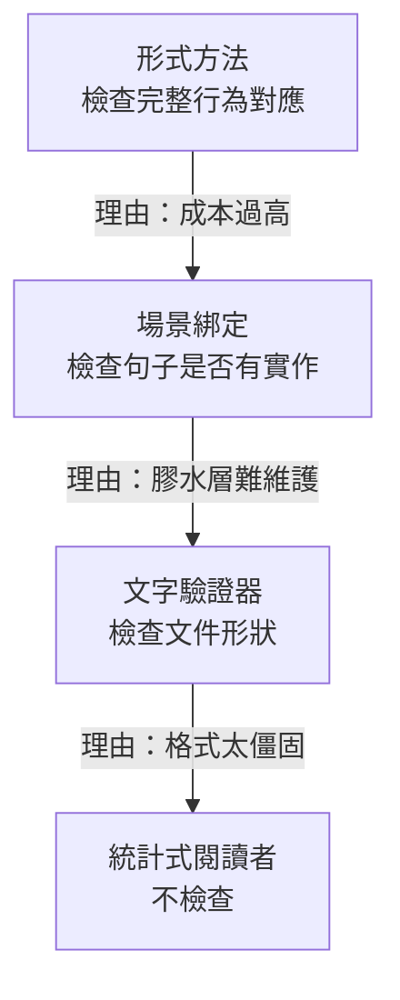

+++
title = "摩擦力是失敗點被感受到時的名字"
date = "2026-09-10T06:57:01+08:00"
author = "梅乾"
draft = false
isCJKLanguage = true
description = "一份規格的價值不在文字是否完整，而在它能讓什麼失敗。本文從行為驅動開發生態的退場回推機器、人與消費者三種失敗點，說明摩擦為何常是約束正在生效的訊號，以及缺席的檢查如何讓治理退化成文件。"
tags = [
    "分析論述", # term:AnalyticalEssay
    "AI 代理人", # term:AiAgent
    "失敗點", # term:FailurePoint
    "摩擦力", # term:Friction
    "行為驅動開發", # term:Bdd
    "場景綁定", # term:ScenarioBinding
    "負回饋", # term:NegativeFeedback
    "反事實", # term:Counterfactual
  ]
series = ["規格效力與生成失真：當連貫取代可失敗的約束"]
[ai_info]
    [ai_info.generation]
        model = "Claude Opus 5"
        agent = "Claude Code VSCode Extension 2.1.266"
    [ai_info.refinement]
        model = "GPT-5.6 Sol"
        agent = "Codex VS Code extension 26.908.40401"
+++

<!--more-->

## 導言

2024 年 12 月 19 日，SmartBear 將 Cucumber 移交給 Open Source Collective。隔天，Tricentis 宣布終止 SpecFlow。同月 31 日 SpecFlow 正式終止支援，隔日程式碼倉庫遭刪除、支援網站關閉。

兩家獨立的商業公司，在二十四小時內先後放掉同一個生態系的兩個旗艦實作。

這件事需要解釋，因為通常的失敗理由都不成立。這個生態系的規格格式沒有技術缺陷——它的三段式場景描述至今仍被逐條沿用。它的採用率也不低，兩個實作分別是 Java 與 .NET 生態的事實標準。它甚至沒有被更好的競品取代，社群後來是靠原作者的分叉專案自行接手維護。

一個格式正確、採用廣泛、無替代品的技術，為什麼會被兩個獨立的商業判斷同時放棄？

從這個問題回推，可以得到一個比「規格很重要」更精確的東西：**一份規格的價值，等於它能讓什麼東西壞掉。**

## 分析

### 從退場回推：三個候選死因，兩個不成立

要回推死因，先看實務社群給出的解釋，再檢查哪些解釋撐得住。

第一個常見說法是格式笨重。這個說法撐不住，因為同一套格式在該生態系退場後仍被大量沿用，包括各種輕量的替代實作。格式如果是死因，它不會在宿主死亡後繼續存活。

第二個說法是膠水層的維護成本。這裡指的是把自然語言句子綁定到實際函式呼叫的那層程式碼。它確實昂貴，但這個解釋只成立一半——實務回報指出，場景描述與綁定程式碼會各自漂移。句子只是查表用的鍵，它保證每個句子都有實作，卻不保證句子描述了那個實作。

第三個說法才是被引用最多的：協作前提失敗。非技術人員從來沒有寫過，甚至沒有讀過那些場景，最後整套東西淪為開發與測試人員自己維護的一種測試用領域特定語言。

這不是事後才發現的問題。2014 年，獨立敏捷教練 Liz Keogh 在一場該生態系的研討會上就指出，**行為驅動開發**（behaviour-driven development） <!-- term:Bdd -->最重要的是對話而非工具；她描述的失敗是社群宣稱在做這件事卻迴避了對話，而過度聚焦於測試自動化反而拖慢進度——產出了太多場景，卻疏於討論系統行為。

> [!IMPORTANT]
> **行為驅動開發** <!-- term:Bdd --> (BDD): 一種以軟體行為為核心的開發方法，透過 Given/When/Then 三段式場景，將抽象需求轉化為可自動化驗證的驗收條件。 <!-- anchor:Bdd -->

把三個說法放在一起看，一個共同結構浮現出來。這套技術原本設計了三個會壞掉的環節，而三個都被拆掉了。

### 定律：價值等於它能讓什麼壞掉

一份不能讓任何東西失敗的規格，無論寫得多好，價值都是零。它擋不下建置、頂不了人、不會被下游證偽，因此對系統的實際行為沒有任何約束力。

這個判準之所以優於「完整度」或「精確度」，因為後兩者描述的是文字的性質，而規格的作用對象不是文字，是行為。

值得注意的是，這並非外部評論者強加的標準。該生態系的官方文件本身就寫著：團隊產出的文件與自動化測試可以想成「不錯的副作用」，真正的目標是有價值、能運作的軟體。工具的作者把自己的產物降級為副作用，而後續十幾年裡，使用它的組織持續在計算那個副作用的覆蓋率。

失敗只能被安裝在三個地方。下表分列這三個位置與各自的成本結構，因為它們的差異決定了配置策略：

| **失敗點**（Failure Point） <!-- term:FailurePoint --> | 實體形式 | 成本與擴展性 |
| :--- | :--- | :--- |
| 機器 | 會擋下建置的檢查 | 確定性，不需閱讀。裝一次，效果複利 |
| 人 | 兩種意圖的碰撞 | 每次都要重新支付注意力，無法擴展 |
| 消費者 | 會壞掉的下游 | 由真實使用者提供，維護成本為零，但無法自行選擇是否存在 |

> [!IMPORTANT]
> **失敗點** <!-- term:FailurePoint --> (Failure Point): 能在產物偏離約束時產生拒絕、錯誤或負回饋的具體檢查位置。 <!-- anchor:FailurePoint -->

三者不可互相替代。機器的檢查覆蓋可形式化的不變量，人的碰撞覆蓋需要判斷的取捨，消費者的反噬覆蓋你沒想到的使用方式。任何一個缺席，該範圍就沒有任何東西在守。

回到那個退場事件，三個失敗點 <!-- term:FailurePoint -->的狀態是：協作前提失敗使第二個從未真正建立；綁定檢查只驗到句子有無實作，使第一個弱化為形狀層級；而測試自動化的產物不會被下游消費，第三個從一開始就不在場。

**因果機制**在於，缺乏失敗點 <!-- term:FailurePoint -->的產物不產生行為約束，因此它的維護成本無法被任何收益抵銷。商業公司比社群更早算清這筆帳，所以是它們先退場。

**邊界條件**是這條定律不適用於刻意不承擔約束的產物。入門文件、設計理由的紀錄、給未來讀者的說明，都不讓任何東西壞掉而仍然有價值。定律在此劃界而非失效：這類產物的正確定位就是文件，投入應按文件計算。定律禁止的是把不裝失敗點 <!-- term:FailurePoint -->的東西當成治理機制。

**反例**——當定律被違反時會發生什麼——正是那個退場事件本身。一套形式完備、語法嚴格、社群龐大的規格技術，在三個失敗點 <!-- term:FailurePoint -->全部缺席後，撐了大約十六年然後被商業判斷淘汰。它不是敗給更好的東西，是敗給自己沒有效力這件事被算清楚了。

### 衰減階梯：檢查強度如何逐級被拆掉

把數十年的規格技術放在一起看，會發現這不是一次事故，而是一個方向穩定的過程。下圖呈現檢查強度的逐級下降，以及每一級下降當時被接受的理由：

圖中每一級都比前一級便宜，也每一級都少檢查一樣東西。值得注意的是箭頭上標註的理由——四次下降的理由是同一個：某種形式的成本太高、太僵固、太難維護。

而這正是關鍵所在。**摩擦力（Friction） <!-- term:Friction -->是失敗點 <!-- term:FailurePoint -->在被感受到時的名字。**

> [!IMPORTANT]
> **摩擦力** <!-- term:Friction --> (Friction): 流程中的阻力或成本；在約束系統中也可能是失敗點正在生效的可感知表現。 <!-- anchor:Friction -->

一個永遠不會擋住你的檢查，你不會稱它為摩擦力 <!-- term:Friction -->。你只在它擋住你的那一刻感覺到它的存在，然後把那一刻記成成本。於是每一次以降低摩擦為理由的簡化，都在拆掉某個檢查，而拆掉的當下永遠感覺像進步，因為代價要到很久以後才到期。

**因果機制**是感受的不對稱。失敗點 <!-- term:FailurePoint -->的成本是即時且可歸因的，它的收益則是分散且**反事實**（Counterfactual） <!-- term:Counterfactual -->的——你無法觀測那些因為被擋下而沒有發生的錯誤。

> [!IMPORTANT]
> **反事實** <!-- term:Counterfactual --> (Counterfactual): 在未實際發生的處置下本應出現的結果，是因果宣稱的基準，也是觀測資料中永遠缺失的那一半。 <!-- anchor:Counterfactual -->

**邊界條件**是並非所有摩擦都是失敗點 <!-- term:FailurePoint -->。等待編譯、環境設定、工具鏈安裝也是摩擦，但它們不檢查任何東西。判別方式很直接：問這道摩擦擋掉的是什麼，如果答案是「沒有東西，它只是慢」，那它就是純成本，該最佳化。

**反例**出現在該生態系的膠水層爭議裡。社群把綁定程式碼當成純成本移除，卻沒有注意到它同時是規格與實作之間唯一會斷的那條線。移除之後，規格與程式碼的分歧不再產生任何訊號——不是分歧消失了，是通報分歧的機制消失了。

### 寬容的閱讀者移除了梯度

階梯的最後一級值得單獨處理，因為它的性質與前三級不同。

歷史上所有規格技術的閱讀者都是嚴格的：編譯器、剖析器、測試執行環境，或一個會當面反駁你的人。嚴格的操作型定義就是「它會壞給你看」。

統計式閱讀者的容忍度接近無限。模糊不會回報錯誤，只會回報一個看起來合理的猜測。這帶來一個前三級沒有的後果：沒有失敗就沒有梯度，寫作品質不再被任何力量推著往精確走。

前三級雖然逐步降低檢查強度，但保留下來的那部分仍然會失敗，因此仍然產生改進壓力。第四級是質變——它不是把檢查變弱，是把「檢查」這個環節整個換成一個不會拒絕的東西。

**因果機制**在於品質改進需要**負回饋**（Negative Feedback） <!-- term:NegativeFeedback -->。任何一種寫作技藝的進步，都來自「寫得不夠好時會發生不好的事」。移除該後果，技藝就停止演化。

> [!IMPORTANT]
> **負回饋** <!-- term:NegativeFeedback --> (Negative Feedback): 系統偏離目標時產生反向修正壓力，使行為能夠收斂的回饋機制。 <!-- anchor:NegativeFeedback -->

**邊界條件**是這只適用於需要精確度的內容。對於本來就無需精確的溝通，寬容的閱讀者是純粹的增益。

**反例**是規格寫錯後的失敗形狀。嚴格的閱讀者在規格有誤時拒絕運作，錯誤停在原地；寬容的閱讀者仍然產出結果，而且是細微地錯的結果——它通過語法、通過形狀檢查、通過閱讀時的直覺，只在行為上偏離。停止運作是便宜的失敗，細微地錯是昂貴的失敗。

### 第三個失敗點為何特別

前面提到消費者的反噬是唯一維護成本為零的失敗點 <!-- term:FailurePoint -->。這個性質值得展開，因為它牽涉到意圖的方向。

意圖起源於某顆腦袋，沒有任何由下而上的力量產生它。但只有與消費者的接觸，才決定那份意圖裡哪些部分撐得過接觸。生成由上而下，篩選由下而上，兩者缺一不可。

組織之所以感覺不到後者，是因為它只敘述生成那一弧。「我們決定做某件事」會被記錄下來，而失敗的意圖不會留下文件。倖存者偏誤使整件事看起來像意圖從上面下來然後被實作了。

**因果機制**是變異與選擇的分工。變異提供候選，選擇提供方向，只有變異的系統會產生大量候選而不收斂。

**邊界條件**是消費者只篩選他們看得見的東西。可維護性、耦合、長期修改成本、多數的安全性質，都不在他們的視野內。因此自然的選擇壓力覆蓋可見面，人工安裝的約束覆蓋不可見面，兩者互補而非重疊。

**反例**是缺乏篩選的那一側。當意圖可能永遠不會遇到消費者的反噬——做出來之後沒人抱怨，也永遠不會知道原本可以更好——那一側不是「比較安全」，而是無方向。只有變異而沒有選擇，按定義就是漂移。它不會出錯，因為沒有東西定義什麼叫錯。

## 反思

### 為什麼三個失敗點全部缺席還能撐十六年

一個合理的疑問是：如果效力為零，為什麼這套技術存活了那麼久？

答案是它並非全無效力，而是效力來自別的地方。**場景綁定**（Scenario Binding） <!-- term:ScenarioBinding -->雖然只檢查句子有無實作，那仍然是一個會斷的環節——它擋不住語意漂移，但擋得住結構性的疏漏。這是弱檢查，不是零檢查。

> [!IMPORTANT]
> **場景綁定** <!-- term:ScenarioBinding --> (Scenario Binding): 將自然語言場景步驟對應到可執行函式或測試程式碼的連接機制。 <!-- anchor:ScenarioBinding -->

真正歸零的是協作那一環。而它歸零的方式很特別：它從未被移除，只是從未被建立。文件上寫著非技術人員應該參與，實務上沒有發生，而沒有人把這個落差記錄成失敗，因為缺席不會產生訊號。

這帶出一個一般性的觀察：**失敗點 <!-- term:FailurePoint -->的缺席比失敗點 <!-- term:FailurePoint -->的移除更難察覺。** 移除是一個事件，會被討論、會被記錄、會有人反對。缺席只是某件事一直沒有發生，而沒有發生的事不進入任何紀錄。

### 定律無法涵蓋的一種價值

前面把入門文件劃到邊界外，但還有一種更難處理的情況：用來想清楚問題的草稿。

刻意暫定的規格是變異階段的正當產物。它的作用是幫助作者釐清自己在說什麼，而這個作用在文件寫完的那一刻就已經完成，與後續是否有人檢查無關。

定律在這裡不失效，但需要補一個時間維度：這類產物的價值發生在撰寫過程中，而不在產物本身。危險因此不在它的存在，而在它被誤認為已完成的契約——一份想清楚問題用的草稿被歸檔、被引用、被當成行為的真相來源。

### 階梯還會不會繼續往下

階梯的四級是已經發生的歷史。合理的追問是還有沒有第五級。

從結構上看沒有，因為第四級已經是零。但有另一個方向的移動值得注意：檢查可以被重新裝回去，而且現在比過去便宜。

當年那層膠水之所以致命，是因為把自然語言句子映射到程式碼呼叫需要大量人工。這正好是統計式工具現在擅長的操作。也就是說，殺死那套技術的那筆成本，如今已大幅下降。

這個觀察本身不構成主張——它只是指出階梯的下降理由與現在的成本結構已經不匹配，因此值得重新計算。

## 實務對比

抽象的定律容易在落地時漂移。以下三組對照鎖定**語意邊界**（Semantic Boundary） <!-- term:SemanticBoundary -->。

> [!IMPORTANT]
> **語意邊界** <!-- term:SemanticBoundary --> (Semantic Boundary): 模組或類別在空間維度上定義其職責與封裝邊界的概念 <!-- anchor:SemanticBoundary -->

**其一：驗收條件的處置**

錯誤的作法是把驗收條件寫進規格後即視為完成，理由是「它已經被記錄下來了」。結果是文件增加一段文字，系統的行為沒有增加任何約束。

正確的作法是寫完後立刻分流：能被機器檢查的送去做閘門，不能的登記為人的注意力預算。沒有第三個去處。未被分流的驗收條件只是更多的文字。

**其二：面對摩擦的反應**

錯誤的作法是把所有摩擦一律視為待最佳化的成本，因為摩擦的成本可歸因而收益不可觀測。

正確的作法是先問這道摩擦擋掉的是什麼。若答案是「沒有東西，它只是慢」，最佳化它；若答案指向某類會被攔下的錯誤，那麼在移除之前必須先安排替代的失敗點 <!-- term:FailurePoint -->。移除檢查與最佳化流程是兩種操作，混為一談是多數退化的起點。

**其三：對缺席的偵測**

錯誤的作法是依賴流程稽核來確認失敗點 <!-- term:FailurePoint -->存在。稽核檢查的是流程有沒有被執行，而缺席的失敗點 <!-- term:FailurePoint -->通常伴隨著被完整執行的流程——文件產出了、審查召開了、簽核完成了。

正確的作法是定期對每一份規格問三個問題：誰能讓我錯、這條驗收條件能否被機器檢查、這一欄是否只有在場的人寫得出來。三個問題分別對應三個失敗點 <!-- term:FailurePoint -->，而且都無法用流程紀錄回答。

## 結論

規格的品質判準必須從文字移到效力：**一份規格的價值，等於它能讓什麼東西壞掉。**

三個可遷移的原則：

**其一，摩擦力 <!-- term:Friction -->是失敗點 <!-- term:FailurePoint -->被感受到時的名字。** 失敗點 <!-- term:FailurePoint -->的成本即時且可歸因，收益分散且反事實 <!-- term:Counterfactual -->，因此感受天然偏向移除。決定簡化之前，先問這一步拿掉的是哪一個檢查，以及有沒有更便宜的替代品。分不出「移除檢查」與「最佳化流程」的組織，會在每一次改善中損失一點約束力。

**其二，缺席比移除更難察覺。** 移除是事件，會被討論與記錄；缺席只是某件事一直沒有發生，而沒有發生的事不進入任何紀錄。因此偵測缺席不能靠稽核流程，只能靠針對每一份產物直接追問它的失敗點 <!-- term:FailurePoint -->在哪。

**其三，變異與選擇缺一不可，而組織通常只敘述前者。** 由上而下產生的意圖，只有在接觸下游時才會被篩選。缺乏篩選的產物不會出錯，因為沒有東西定義什麼叫錯——那不是安全，那是漂移。找不到誰能讓你錯的時候，該做的是安裝一個選擇者，或誠實地把這份產物降級為文件。