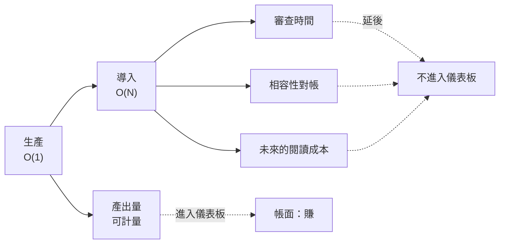

+++
title = "帳為什麼看起來是賺的"
date = "2026-09-10T07:10:02+08:00"
author = "TTL::0"
draft = false
isCJKLanguage = true
description = "產出翻倍而交付持平，不是收益憑空消失，而是導入、審查與未來閱讀成本落在儀表板之外。本文拆解生產與導入兩條成本曲線，區分外部性與債，並把測試、型別與契約檢查重新理解為可重複使用的注意力投資。"
tags = [
    "分析論述", # term:AnalyticalEssay
    "導入成本", # term:IntegrationCost
    "可計量性不對稱", # term:MeasurabilityAsymmetry
    "成本轉嫁", # term:CostShifting
    "外部性", # term:Externality
    "注意力投資", # term:AttentionInvestment
    "長期更新率", # term:LongTermUpdateRate
    "語意邊界", # term:SemanticBoundary
  ]
series = ["規格效力與生成失真：當連貫取代可失敗的約束"]
[ai_info]
    [ai_info.generation]
        model = "Claude Opus 5"
        agent = "Claude Code VSCode Extension 2.1.266"
    [ai_info.refinement]
        model = "GPT-5.6 Sol"
        agent = "Codex VS Code extension 26.908.40401"
+++

<!--more-->

## 導言

一份涵蓋一萬名以上開發者的遙測資料顯示：合併的變更請求增加百分之九十八，審查時間增加百分之九十一，而組織層級的交付指標持平。

三個數字放在一起才有意義。產出量幾乎翻倍，這是可以拿去開會的成果；審查時間也幾乎翻倍，這筆帳沒有人在記；而真正衡量組織能力的那個指標，一動也不動。

同一時期的程式碼層量測補上了另一半。一項追蹤六億筆以上變更的分析發現，「**長期更新率**（Long-Term Update Rate） <!-- term:LongTermUpdateRate -->」——動到十二個月以上未被觸碰的程式碼的變更佔比——從 2023 年的百分之一點七，降到 2026 年的百分之零點四六，跌幅約四分之三。

> [!IMPORTANT]
> **長期更新率** <!-- term:LongTermUpdateRate --> (Long-Term Update Rate): 變更中觸及長時間未被修改之既有程式碼的比例，用來觀察系統可修改範圍。 <!-- anchor:LongTermUpdateRate -->

這兩組數字指向同一個現象：系統的產出在增加，而系統吸收自身產出的能力在下降。

問題因此不是「效率有沒有提升」。問題是：**在生產力明顯提升的同時，帳為什麼會看起來是賺的？**

## 分析

### 從持平回推：兩條成本曲線的形狀不同

要解釋「產出翻倍而交付持平」，需要區分兩種成本。

生產一個單位的成本，是把它做出來的成本。這個成本與系統目前的規模無關——寫一個函式的難度不隨程式碼庫大小改變。以複雜度記號表示，它是 $O(1)$。

導入一個單位的成本，是讓它與系統既有部分相容的成本。這包含命名是否衝突、抽象層級是否一致、是否重複了既有能力、是否破壞了別處的假設。這個成本與系統規模成正比，因為新單位必須與既有的 N 個東西對帳。它是 $O(N)$。

兩條曲線相乘，總成本是 $O(N^2)$。而關鍵在於 N 為什麼在長：**因為生產便宜。**

值得強調的是，這個推導不需要任何**回饋迴路**（Feedback Loop） <!-- term:FeedbackLoop -->。常見的說法是「模型讀取自己的產出再放大」，那確實會加速，但它是加速項，不是主因。線性的生產撞上與規模成正比的導入，二次曲線就已經足夠致命。

> [!IMPORTANT]
> **回饋迴路** <!-- term:FeedbackLoop --> (Feedback Loop): 用於持續觀測治理機制運營效能的閉環系統，通常包含規則遵守率、規則有效性與治理摩擦成本三個觀測層次，藉以驅動治理規則的動態調整。 <!-- anchor:FeedbackLoop -->

下圖呈現成本的落點，以及量測邊界所在的位置：

圖中虛線是量測邊界。左上那條進了儀表板，右下三條沒有——不是因為它們不存在，而是因為它們延後、分散、且無法歸因到單一次變更。

**因果機制**是兩種成本對系統規模的依賴性不同，而規模由便宜的那一種驅動。

**邊界條件**是這不適用於**導入成本**（Integration Cost） <!-- term:IntegrationCost -->本來就接近零的工作。樣板程式碼、機械翻譯、格式轉換這類產物，失敗模式很淺，編譯器與測試就攔得住，因此生產成本下降是真實的淨賺。匯率依工作類別而定，不是齊一的。

> [!IMPORTANT]
> **導入成本** <!-- term:IntegrationCost --> (Integration Cost): 讓新增產物與既有系統的命名、抽象、行為及假設相容所需的成本。 <!-- anchor:IntegrationCost -->

**反例**是長期更新率 <!-- term:LongTermUpdateRate -->的崩塌。當導入成本 <!-- term:IntegrationCost -->高到某個程度，理性的反應不是付出它，而是繞過它——不去動舊的部分，只在旁邊新增。那個百分之零點四六，就是繞過行為的直接量測。舊程式碼不是被維護，是被放棄。

### 轉嫁是有損的

上一節說成本沒有消失，只是移動了位置。但「移動」這個詞低估了實際發生的事。

從寫作端移走一個單位的工作，到讀者端不會是一個單位。原因是閱讀不熟悉的程式碼比自己寫更貴——這是軟體工程長期的共識，也是「重寫比讀懂快」這個誘惑一直存在的理由，更是新人上手需要數月的理由。

所以這不是等量轉嫁，是**放大的轉嫁**。移走一單位，抵達時可能變成兩到三單位。

**因果機制**是理解需要重建作者的意圖，而重建的成本高於原初的產生。作者寫下一行時知道自己為什麼那樣寫；讀者必須從結果反推那個理由，而反推是搜尋問題。

**邊界條件**是當產物附帶了足以省去反推的東西時，放大係數會下降。一個會失敗的測試、一個型別簽章、一段記錄了被否決方案的說明，都能讓讀者跳過搜尋。

**反例**是一份沒有任何附帶物的高品質產出。它可以在每一個局部都正確，而讀者仍然必須逐行反推，因為正確性不會自我說明。品質不能替代可驗證性。

### 兩種病共用一個症狀

轉嫁預設有兩個當事人，但很多時候只有一個。這個區分決定了處方，因此不能混談。

當作者與後續的維護者不是同一人時，發生的是**外部性**（Externality） <!-- term:Externality -->：成本真實存在，卻由不在這筆交易裡的人承擔。

> [!IMPORTANT]
> **外部性** <!-- term:Externality --> (Externality): 行動成本或效益由交易之外的其他人或團隊承擔的經濟現象。 <!-- anchor:Externality -->

當作者三個月後讀不懂自己寫的東西時，發生的是**債**：成本由同一人承擔，只是延後了。它之所以仍然感覺像賺到，是因為收益在現在而成本在以後，且成本是機率性的。

**因果機制**在兩種情況下不同。外部性 <!-- term:Externality -->的成因是誘因錯配——付出成本的人與獲得收益的人不同。債的成因是折現偏誤——未來的成本被系統性低估。

**邊界條件**是兩者經常同時存在，因此不能只開一種藥。

**反例**是只治其中一種的組織。強化問責可以處理外部性 <!-- term:Externality -->，但對一個獨自工作的人毫無作用；讓成本當場可見可以處理債，但無法阻止一個人把成本推給別的團隊。兩種病共用「後來很難改」這個症狀，而症狀相同誤導了診斷。

### 可計量性不對稱才是主因

前面解釋了成本去了哪裡。還需要解釋為什麼沒有人發現。

答案不在任何人的能力或誠信，而在一個結構性的不對稱：**產出極度好數，導入成本 <!-- term:IntegrationCost -->延後、分散、且算不出來。**

一邊是立即可見的收益，另一邊是遲滯且不可見的損失。任何系統都會往可計量的那一邊漂，這不需要有人自欺——指標自己會誤導。

這個問題不新。Dijkstra 在 1988 年的一份手稿中給過處方：若要計算程式碼行數，不該視為「產出的行數」，而應視為「花掉的行數」。這個轉換的作用是把一個看似收益的量，重新記為成本。

**因果機制**是決策依賴指標，而指標只涵蓋可量測的部分。不可量測的部分不是被低估，是根本不進入計算。

**邊界條件**是當不可見的成本被轉換成某種會硬性失敗的東西時，它就進得了儀表板。這正是型別檢查與測試的價值所在——它們把「未來會出問題」轉換成「現在建置失敗」。

**反例**是一個所有指標都在改善的專案，同時愈來愈難修改。這不是矛盾，是**可計量性不對稱**（Measurability Asymmetry） <!-- term:MeasurabilityAsymmetry -->的必然結果：改善的是被量的東西，惡化的是沒被量的東西。

> [!IMPORTANT]
> **可計量性不對稱** <!-- term:MeasurabilityAsymmetry --> (Measurability Asymmetry): 收益容易即時量測，而延後、分散的成本難以進入同一套指標的結構性落差。 <!-- anchor:MeasurabilityAsymmetry -->

### 測試與型別的重新歸類

順著上一節可以得到一個對常見分類的修正。

測試、型別、架構檢查通常被歸為「品質工具」。這個歸類不算錯，但它掩蓋了更重要的性質：它們是**注意力經濟的工具**。

寫一個測試，是作者付出一次成本，讓所有未來的讀者不必各自付出反推成本。不寫，就是每個讀者各付一次，永遠。差別不在單價，在乘數。

**因果機制**是驗證成本的分攤方式。附帶檢查把驗證從「每次閱讀時執行」改成「撰寫時執行一次，之後由機器重複」。

**邊界條件**是這只對會被重複閱讀的產物成立。一段即將被刪除的實驗程式碼，乘數是一，附帶檢查的投資無法回收。

**反例**是把測試當成品質保證而非**注意力投資**（Attention Investment） <!-- term:AttentionInvestment -->的組織。它們會在時程壓力下第一個砍掉測試，因為「品質」聽起來像是可以稍後補的東西。若正確理解為注意力投資 <!-- term:AttentionInvestment -->，砍掉它的意思是把**成本轉嫁**（Cost Shifting） <!-- term:CostShifting -->給所有未來的讀者——那是一個明顯得多的錯誤決策。

> [!IMPORTANT]
> **注意力投資** <!-- term:AttentionInvestment --> (Attention Investment): 先投入測試、型別或契約檢查，以減少未來每位讀者重複驗證成本的作法。 <!-- anchor:AttentionInvestment -->
> **成本轉嫁** <!-- term:CostShifting --> (Cost Shifting): 工作從產生端移往理解端後，由其他人或未來時點承擔的成本移轉。 <!-- anchor:CostShifting -->

## 反思

### 為什麼審查不是解方

一個自然的反應是：既然成本落在審查，那就加強審查。

這條路走不通，而且理由是結構性的。審查是人力密集的，它的產能受限於可用的注意力，而注意力正是整個系統裡最稀缺的投入。用一個不隨規模擴展的機制，去承接一個隨規模擴展的成本，只會讓瓶頸更早到達。

更麻煩的是時序。審查發生在成本已經被推給讀者之後——被審查的人正是那個承接成本的人。在那個時點做的任何事，都是讀者在替寫作者收拾。

內部化必須發生在提交之前：發起端不能只帶著變更來，要帶著讓人不必逐行閱讀就能驗證它的那個東西一起來。

### 撞牆時間比成長率重要

若成本是二次成長，直覺的擔憂是它會無限膨脹。但真實系統有上限——脈絡容量的上限，以及「這個系統還能不能被安全修改」的上限。

因此實際的形狀更接近一條會飽和的曲線，飽和點是沒有人（也沒有工具）還能安全修改這個系統。到達之後，專案被重寫或被放棄。

這個修正改變了該盯的變數。不是成長率，是**剩餘跑道**。而前面那個長期更新率 <!-- term:LongTermUpdateRate -->的數字，正是跑道消耗速度的量測——當系統只改自己最近寫的部分，它的可修改範圍正在收縮，而收縮不會有任何告警。

### 這一切是否只是舊觀察換個場合

軟體工程長期就知道複雜度會單調增加，也長期就知道重構是必要的。因此可以合理質疑：本文是否只是把舊觀察套在新工具上。

差異在於一個被移除的上限。過去熵的注入速率受限於人的打字速度，那是一個硬性的、與人力成正比的節流閥。移除節流閥之後，同一條定律的時間常數改變了數個量級。

規律沒變，可用的反應時間變了。這足以構成一個新的工程問題，即使不是一個新的工程原理。

## 實務對比

以下三組對照鎖定**語意邊界**（Semantic Boundary） <!-- term:SemanticBoundary -->。

> [!IMPORTANT]
> **語意邊界** <!-- term:SemanticBoundary --> (Semantic Boundary): 模組或類別在空間維度上定義其職責與封裝邊界的概念 <!-- anchor:SemanticBoundary -->

**其一：效率宣稱的計算方式**

錯誤的作法是以產出量宣稱效率提升——變更請求數、行數、完成的工作項數。這些量在生產成本下降時必然上升，因此它們無法區分「更有效率」與「更會製造待處理的東西」。

正確的作法是同時報告產出量與吸收量。吸收量的候選包括審查所耗時間、動到舊程式碼的變更佔比、以及重複區塊的數量。單獨的產出量不是效率證據。

**其二：附帶物的要求**

錯誤的作法是要求提交者附上說明文件，理由是「讓別人看得懂」。說明文件不會失敗，因此它與程式碼漂移時沒有任何訊號。

正確的作法是要求附上會失敗的東西——測試、型別、契約檢查。判準是：這個附帶物在程式碼變了而它沒變時，會不會自己壞掉。會，才算數。

**其三：**技術債**（Technical Debt） <!-- term:TechnicalDebt -->的歸類**

> [!IMPORTANT]
> **技術債** <!-- term:TechnicalDebt --> (Technical Debt): 程式碼中為求快速交付而妥協、待重構與修復的設計或品質缺陷。 <!-- anchor:TechnicalDebt -->

錯誤的作法是把所有「以後很難改」的情況統稱技術債 <!-- term:TechnicalDebt -->，然後用同一套方法處理。

正確的作法是先問成本由誰承擔。同一人承擔且延後，那是債，處方是讓成本當場可見。他人承擔，那是外部性 <!-- term:Externality -->，處方是誘因與問責。用債的處方治外部性 <!-- term:Externality -->，等於要求承受成本的人自律，那不會發生。

## 結論

生產成本的下降不會自動轉換為系統能力的提升。兩者之間隔著一條與規模成正比的導入成本 <!-- term:IntegrationCost -->，以及一個只量得到其中一邊的儀表板。

三個可遷移的原則：

**其一，便宜的生產會製造昂貴的導入，而後者由前者驅動。** 兩條成本曲線對規模的依賴性不同，因此總成本是二次的，且不需要任何回饋迴路 <!-- term:FeedbackLoop -->就成立。評估任何提升產出的工具時，必須同時估計它對系統規模的影響。

**其二，可計量性不對稱 <!-- term:MeasurabilityAsymmetry -->不需要任何人失職就會造成誤判。** 只要一邊可量而另一邊不可量，決策就會系統性地偏向可量的那一邊。對抗的方式不是提醒大家注意，而是把不可量的那一面轉換成某種會硬性失敗的東西——因為只有會失敗的東西才進得了儀表板。

**其三，附帶檢查是注意力投資 <!-- term:AttentionInvestment -->，不是品質保證。** 寫作者付出一次，讓所有未來的讀者不必各自付出；差別在乘數不在單價。這個重新歸類會改變它在時程壓力下的優先順序，因為砍掉它的真實意義是把成本轉嫁 <!-- term:CostShifting -->給每一個後來的人。