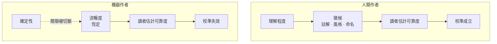

+++
title = "當可靠度訊號與可靠度脫鉤"
date = "2026-09-10T07:22:03+08:00"
author = "梅乾"
draft = false
isCJKLanguage = true
description = "當流暢度不再攜帶製作過程的確定性，讀者就無法從外觀區分可靠與不可靠的產物。本文以檸檬市場、自動化偏誤與相關失效解釋信任校準為何崩解，並主張依驗證覆蓋而非表面品質分配信任。"
tags = [
    "分析論述", # term:AnalyticalEssay
    "徵候", # term:ReliabilityTell
    "可區分性", # term:Distinguishability
    "檸檬市場", # term:MarketForLemons
    "自動化偏誤", # term:AutomationBias
    "相關失效", # term:CorrelatedFailure
    "驗證覆蓋", # term:VerificationCoverage
    "校準", # term:Calibration
  ]
series = ["規格效力與生成失真：當連貫取代可失敗的約束"]
[ai_info]
    [ai_info.generation]
        model = "Claude Opus 5"
        agent = "Claude Code VSCode Extension 2.1.266"
    [ai_info.refinement]
        model = "GPT-5.6 Sol"
        agent = "Codex VS Code extension 26.908.40401"
+++

<!--more-->

## 導言

一項針對十六位資深開放原始碼開發者的隨機對照試驗（randomized controlled trial）得到一個反直覺的結果。使用輔助工具後，受試者完成任務的速度慢了百分之十九。而在實驗開始前，他們自己預測會快百分之二十四。

差距有四十三個百分點，方向還相反。

這些不是外行。他們是自己維護的程式碼庫上的資深貢獻者，對任務難度與自己的工作節奏都有長期**校準**（Calibration） <!-- term:Calibration -->。而他們錯了，錯得比隨機猜測還糟。

> [!IMPORTANT]
> **校準** <!-- term:Calibration --> (Calibration): 模型輸出機率與實際正確率的一致程度。 <!-- anchor:Calibration -->

單純用「樂觀偏誤」解釋不夠，因為樂觀偏誤預測的是高估幅度，不是符號反轉。也不能用「他們沒注意」解釋，因為實驗結束後他們仍然維持原判斷。

需要解釋的是：**做這件事的人，為什麼連事後都感覺不到自己變慢了？**

從這個問題回推，會抵達一個比「AI 會出錯」更根本的東西——判斷可靠度所依賴的訊號，已經與可靠度本身**脫鉤**（Desynchronization） <!-- term:Desynchronization -->。

> [!IMPORTANT]
> **脫鉤** <!-- term:Desynchronization --> (Desynchronization): 中介索引檔與真實檔案系統狀態不再一致的現象，是雙重狀態同步最典型的故障表現。 <!-- anchor:Desynchronization -->

## 分析

### 從錯估回推：徵候是怎麼消失的

人判斷一份產物是否可信，靠的很少是逐行驗證。真正在用的是**徵候**（Reliability Tell） <!-- term:ReliabilityTell -->——那些洩漏製作過程狀態的痕跡。

> [!IMPORTANT]
> **徵候** <!-- term:ReliabilityTell --> (Reliability Tell): 洩漏產物製作過程狀態、供讀者間接估計可靠度的外觀或行為痕跡。 <!-- anchor:ReliabilityTell -->

人寫的東西帶著徵候 <!-- term:ReliabilityTell -->。猶豫留下的註解、風格突然改變、一個彆扭到只可能是遷就某個限制的命名、一段明顯抄自別處而未消化的區塊、一個標記著待辦的缺口。這些都不是內容，是關於內容如何被產生的旁證。

讀者長期以來就是靠這些估計可靠度，而且估得不錯。一段沒有註解、命名一致、風格統一的程式碼，通常真的比較可靠——因為在人類作者的世界裡，那種整齊需要理解作為前提。

機器產出打斷了這個關聯。**流暢度變成常數，與底下的確定性無關。** 模型很有把握時的輸出，和模型在極低機率區域勉強填出來的輸出，表面上完全一樣：同樣整齊的命名、同樣一致的風格、同樣沒有猶豫的痕跡。

下圖呈現這條判斷路徑，以及它斷在哪裡：

圖中左側的實線是完整的推論鏈，右側的虛線是被切斷的那一環。讀者的估計程序沒有改變，改變的是它所依賴的輸入不再攜帶資訊。

回到那個實驗，受試者的錯估因此有了機制上的解釋。他們感受到的是「產出看起來很好、來得很快」，而這在他們過去的經驗裡是高效率的可靠指標。指標本身沒有騙人，是指標與被指涉物之間的關聯斷了。

**因果機制**是徵候 <!-- term:ReliabilityTell -->作為代理指標的有效性，建立在「整齊需要理解」這個人類作者的限制上。移除該限制，代理指標就失去指涉能力。

**邊界條件**是這只影響需要估計可靠度的場合。若產物會立刻被獨立驗證——編譯、測試、正式流量——則不需要徵候 <!-- term:ReliabilityTell -->，因為有真正的檢查。

**反例**是資深者比新手更容易受影響。這聽起來矛盾，實際上是必然：校準 <!-- term:Calibration -->得愈好的人，愈依賴那組徵候 <!-- term:ReliabilityTell -->，因此關聯斷裂時損失愈大。新手本來就沒有可靠的直覺，反而不會被誤導。

### 這是檸檬市場，不是品質問題

上述結構在經濟學裡有現成的模型。Akerlof 於 1970 年分析二手車市場時指出，市場失靈的原因不是車子壞，而是**買家分不出來**。

分不出來時，理性的定價是按期望值。於是好貨得不到溢價、退出市場，平均品質下降，買家進一步降低出價——一個自我強化的下墜。

這個模型的關鍵性質是它不需要任何人失職。沒有人說謊，沒有人偷懶，光是資訊不對稱本身就足以讓市場崩壞。

套到手上的問題：讀者面對的困境不是機器產出品質差，而是**好的產出與壞的產出在表面上不可區分**。

**因果機制**是**可區分性**（Distinguishability） <!-- term:Distinguishability -->的喪失使理性行為者只能按整體期望值反應，因此無法給予高品質額外的信任，也無法對低品質施加額外的檢查。

> [!IMPORTANT]
> **可區分性** <!-- term:Distinguishability --> (Distinguishability): 觀察者能否依可見訊號辨別不同品質、狀態或來源之產物的性質。 <!-- anchor:Distinguishability -->

**邊界條件**在於古典的不對稱假設「知情的一方確實知道」。賣車的人知道車況，只是不說。這裡不完全如此——模型沒有可靠的自我評估被暴露出來，供應方也不掌握逐項的可靠度。

這個差異有實際後果。不對稱的兩種標準解法是**訊號**與**篩選**：前者由知情方付出昂貴且難偽造的代價來揭露，後者由不知情方強加一個測試。若沒有人知情，訊號就無從揭露，只剩篩選可用。

**反例**是誤把這個問題當成品質問題來治。提升平均品質不會恢復可區分性 <!-- term:Distinguishability -->——它甚至讓情況更糟，理由見下一節。

### 模型變好會讓情況變糟

這是本文最反直覺的一項，但它從前兩節直接推出。

平均品質上升會拉高信任，而尾端的失效仍然不帶徵候 <!-- term:ReliabilityTell -->。結果是檢查密度下降，而殘留的錯誤恰好是最難察覺的那一類。

錯誤的期望值可以下降，同時單次錯誤的成本上升——因為被抓到的機率下降得更快。

這個形狀在人因工程中有大量實證，稱為**自動化偏誤**（Automation Bias） <!-- term:AutomationBias -->。一份針對臨床決策支援系統的系統性回顧記錄了完整的樣態：整體績效通常提升，**但使用者未能辨識該系統新引入的錯誤類別**。改善是真的，新錯誤也是真的，而後者不進入使用者的注意範圍。

> [!IMPORTANT]
> **自動化偏誤** <!-- term:AutomationBias --> (Automation Bias): 使用者因倚賴自動化建議而降低獨立查核，未能辨識系統新引入錯誤的傾向。 <!-- anchor:AutomationBias -->

相關的理論工作把兩種現象區分開來。一種是傾向倚賴自動化的建議，另一種是傾向未經獨立查核即採納。兩者被解釋為注意力資源配置的問題——不是道德或紀律問題，而是有限注意力在感知到低風險時的理性重分配。

**因果機制**是信任與檢查密度成反比，而信任由平均品質驅動、風險由尾端品質決定。兩者脫鉤 <!-- term:Desynchronization -->時，理性反應會系統性地配置錯誤。

**邊界條件**是當失效會立即且明顯地顯現時，這個效應消失。人不會對一個當場爆炸的系統產生自滿。

**反例**正是那個實驗的受試者。他們不是不夠謹慎，而是把注意力配置到了看起來風險較低的地方——這是在完整資訊下的正確反應，只是資訊不完整。

### 為什麼不能用機器互審來補

若人的判斷失效，一個自然的想法是讓另一個模型來審查。

這條路的效力遠低於直覺，理由可以借用可靠度工程的一個經典結果。Knight 與 Leveson 在 1986 年檢驗多版本程式設計的獨立性假設，發現獨立開發的多個版本會出現**相關失效**（Correlated Failure） <!-- term:CorrelatedFailure -->。這個結果直接打掉了設計多樣性的基本前提：多個版本不等於多倍的偵測力，因為它們會在同樣的地方一起錯。

> [!IMPORTANT]
> **相關失效** <!-- term:CorrelatedFailure --> (Correlated Failure): 多個看似獨立的系統因共享成因或分布，而在相同位置共同失敗的現象。 <!-- anchor:CorrelatedFailure -->

同樣的結構在這裡成立。同一個訓練分布產生的審查者，盲區與作者相關。兩個相關的審查者遠遠達不到兩倍的偵測力。

更換不同來源的模型有幫助，但幫助有限——語料重疊使先驗仍然相關。而這個可用的去相關量還在縮小，因為模型愈來愈會讀到彼此的產出。

**因果機制**是偵測力依賴錯誤的獨立性，而獨立性由訓練分布的差異提供。分布重疊時，獨立性不成立。

**邊界條件**是這只適用於需要判斷的錯誤類別。局部且機械的缺陷——資源洩漏、邊界差一、漏掉的錯誤處理——偵測任務與生成任務不同，相關性低，機器審查在這裡確實有效。

**反例**是把機器審查用在架構判斷上。這個抽象是否恰當、這東西該不該存在、這是不是第四份幾乎一樣的實作——正是相關性最高的區域，也正是審查最不可能發現的區域。

### 人對人那一層仍然可用，但沒有人在用

前面說產物層只剩篩選可用。但不對稱其實有兩層，而第二層的性質完全不同。

發起端確實知道一些事。他看過被丟掉的版本、知道試了幾次才過、知道自己哪一段其實沒看懂、知道哪個決定是妥協而非設計。這些資訊真實存在於一個人的腦中。

在這一層，古典的不對稱成立，因此**訊號是可用的**。而它幾乎零成本——一句「這段我試了很多次，那個分支我不確定」就是完整的揭露。

問題是現行的工作流正在系統性地抹掉它。提交訊息由工具生成，變更說明由工具生成，全部回歸到同一種流暢。**人類作者僅剩的徵候 <!-- term:ReliabilityTell -->，被自動化補平了。**

**因果機制**是徵候 <!-- term:ReliabilityTell -->的產生需要一個不追求整齊的環節，而自動化的預設目標正是整齊。

**邊界條件**是這只在有人真的擁有該資訊時成立。若整個變更由工具端到端產生而人只按了核可，那麼發起端也不知情，這一層退回產物層的狀態。

**反例**是一份完全由工具撰寫的提交說明。它讀起來比人寫的更完整、更專業、更符合規範，而它承載的可靠度資訊是零。形式改善與資訊喪失同時發生，且前者掩蓋後者。

## 反思

### 為什麼這個問題無法靠訓練解決

一個常見的處方是提醒人們保持警覺、加強審查文化、教育使用者不要過度信任。

從前述機制看，這類處方的效力有限。自動化偏誤 <!-- term:AutomationBias -->被解釋為注意力資源配置的結果，而注意力配置對感知到的風險敏感。當一個系統平常都是對的，「保持警覺」要求的是持續為一個罕見事件付出注意力，這與注意力的運作方式相衝突。

有效的介入不是要求人更努力，而是**改變訊號本身**——讓不可靠的地方重新變得看得出來。這可以是強制標記不確定區段，可以是要求揭露嘗試次數，也可以是讓某類產出在缺乏獨立驗證時無法通過流程。

### 徵候能不能被人工裝回去

若徵候 <!-- term:ReliabilityTell -->是資訊，理論上它可以被重新產生。但這裡有一個難處。

徵候 <!-- term:ReliabilityTell -->之所以可信，是因為它**難以偽造**——猶豫的痕跡之所以指示猶豫，是因為不猶豫的人不會留下它。一旦徵候 <!-- term:ReliabilityTell -->變成一個要填的欄位，它就與內容脫鉤 <!-- term:Desynchronization -->，並迅速退化成儀式。

因此可行的方向不是要求人補上徵候 <!-- term:ReliabilityTell -->，而是要求人補上**代價**。一個會失敗的測試、一個具體到只有在場者寫得出來的否決理由，都是難以偽造的，因為偽造它們的成本不低於誠實產生它們。

這與訊號理論的核心一致：有效的訊號必須昂貴，而且對誠實者較便宜。

### 這個困境的一個非對稱出口

**檸檬市場**（Market For Lemons） <!-- term:MarketForLemons -->的標準解有兩個，前面說產物層只剩篩選。這聽起來悲觀，但篩選有一個被低估的性質。

> [!IMPORTANT]
> **檸檬市場** <!-- term:MarketForLemons --> (Market For Lemons): 因買方無法辨識品質而按平均價值交易，進而排擠高品質供給的資訊不對稱市場。 <!-- anchor:MarketForLemons -->

篩選是**一次性投資、重複使用**的。設計一道能擋下某類缺陷的檢查很貴，但它之後對每一次變更都生效，而且不消耗注意力。

相對地，訊號是每次都要重新支付的。即使人對人那一層的訊號恢復，它仍然需要每次提交都被誠實地寫一次。

因此在注意力稀缺的前提下，兩者的長期效益不對等。可篩選的部分應盡量往篩選推，訊號留給真正無法形式化的判斷。

## 實務對比

以下三組對照鎖定**語意邊界**（Semantic Boundary） <!-- term:SemanticBoundary -->。

> [!IMPORTANT]
> **語意邊界** <!-- term:SemanticBoundary --> (Semantic Boundary): 模組或類別在空間維度上定義其職責與封裝邊界的概念 <!-- anchor:SemanticBoundary -->

**其一：信任的分配方式**

錯誤的作法是依產物表面品質分配信任——寫得整齊、命名一致、結構清楚就少看幾眼。這正是被切斷的那條關聯，因此它已經不是資訊。

正確的作法是依**驗證覆蓋**（Verification Coverage） <!-- term:VerificationCoverage -->分配信任。被獨立檢查覆蓋的部分可以少看，沒有被覆蓋的部分無論寫得多好都要看。判準從產物的外觀移到產物之外的檢查。

> [!IMPORTANT]
> **驗證覆蓋** <!-- term:VerificationCoverage --> (Verification Coverage): 產物中已有獨立、可重複檢查機制保護的範圍與程度。 <!-- anchor:VerificationCoverage -->

**其二：機器審查的部署位置**

錯誤的作法是讓模型審查架構決策，因為那是人最花時間的部分，看起來最值得自動化。那也正是與生成任務相關性最高、偵測力最低的區域。

正確的作法是把機器審查配置在局部且機械的缺陷上——那裡偵測與生成是不同任務，相關性低，效果真實。架構判斷留給人，並接受它不可擴展。

**其三：提交說明的產生方式**

錯誤的作法是自動生成提交說明以節省時間。它會產出比人寫的更整齊的文字，同時把發起端僅有的可靠度資訊抹平。

正確的作法是保留一個強制的人工欄位，內容是模型不在場就寫不出來的東西：試了幾次、哪一段不確定、哪個決定是妥協。其餘部分自動生成無妨。

## 結論

判斷可靠度所依賴的訊號，已經與可靠度本身脫鉤 <!-- term:Desynchronization -->。這不是品質問題，而是可區分性 <!-- term:Distinguishability -->問題，因此提升品質無法解決它。

三個可遷移的原則：

**其一，可區分性 <!-- term:Distinguishability -->的喪失不需要任何人失職就會造成系統性誤判。** 這是檸檬市場 <!-- term:MarketForLemons -->的結構，光靠資訊不對稱就足以運作。因此處方不是道德呼籲，而是恢復可區分性 <!-- term:Distinguishability -->——用篩選，或用難以偽造的揭露。

**其二，平均品質上升會使殘留錯誤更貴。** 信任由平均品質驅動，風險由尾端品質決定，兩者脫鉤 <!-- term:Desynchronization -->時檢查密度會下降得比錯誤率更快。這意味著「工具變好了所以可以放心」是一個方向錯誤的推論。

**其三，相關的審查者不提供獨立的偵測力。** 這在可靠度工程裡是四十年前就被實證推翻的假設，而它正在以新的形式被重新採信。判斷審查價值時，該問的不是「有沒有審查」，而是「這個審查者會在哪些地方跟作者一起錯」。