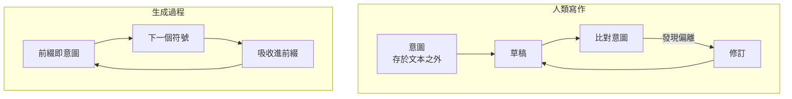

+++
title = "局部似真：連貫為何不蘊涵為真"
date = "2026-09-10T07:35:04+08:00"
author = "梅乾"
draft = false
isCJKLanguage = true
description = "生成過程最佳化局部接續，卻不保證全域一致或與外部事實對應。本文從一個不可證偽的錯誤斷言回推局部似真、自我封閉與非定常問題，說明精煉為何只提高連貫度，以及真實必須從產物之外進入。"
tags = [
    "分析論述", # term:AnalyticalEssay
    "局部似真", # term:LocalPlausibility
    "可證偽性", # term:Falsifiability
    "自我封閉", # term:SelfSealingClaim
    "規定性需求", # term:StipulatedRequirement
    "對應性需求", # term:CorrespondenceRequirement
    "非定常", # term:Nonstationarity
    "失敗點", # term:FailurePoint
  ]
series = ["規格效力與生成失真：當連貫取代可失敗的約束"]
[ai_info]
    [ai_info.generation]
        model = "Claude Opus 5"
        agent = "Claude Code VSCode Extension 2.1.266"
    [ai_info.refinement]
        model = "GPT-5.6 Sol"
        agent = "Codex VS Code extension 26.908.40401"
+++

<!--more-->

## 導言

一份技術分析的草稿裡出現了這樣一句話：這個領域缺乏產出層的對照研究，而且因為介入本身不斷改變，短期內也不會有。

這句話有幾個好性質。它承認侷限，語氣謙遜；它給出了理由，不是空口斷言；它與該草稿其餘部分的論證方向一致，讀起來毫無違和。

它也是錯的。實際去查之後，該領域有針對資深開發者的隨機對照試驗，有跨組織的交付穩定性數據，有數億筆規模的程式碼指標——而且多數結論並不站在樂觀敘事那一側。

值得追問的不是「為什麼會弄錯一個事實」。單一事實錯誤很平常。值得追問的是：**這句話經過了多輪精煉、通過了作者自己的審視、與整份文件高度契合，而錯誤沒有在任何一個環節被攔下。**

哪裡出了問題？

從這個具體失效回推，會抵達一個關於生成機制的結論：我們拿到的東西不是自洽，是**局部似真**（Local Plausibility） <!-- term:LocalPlausibility -->——而後者的性質比前者差一級。

> [!IMPORTANT]
> **局部似真** <!-- term:LocalPlausibility --> (Local Plausibility): 每個局部接續看似合理，但全域一致性與外部真實性未被保證的生成性質。 <!-- anchor:LocalPlausibility -->

## 分析

### 從那句話回推：它為什麼通不過任何檢查

先看那句話有什麼結構性質。

它不預測任何可觀測的事件。「短期內不會有」沒有兌現日；「缺乏」沒有界定門檻。因此沒有任何觀察能夠推翻它。

它同時是**自我封閉**（Self-Sealing Claim） <!-- term:SelfSealingClaim -->的。若有人舉出一項研究，它可以回應那項研究不夠嚴謹、樣本不足、或介入已經改變。每一個反例都能被吸收，而吸收不需要修改主張本身。

> [!IMPORTANT]
> **自我封閉** <!-- term:SelfSealingClaim --> (Self-Sealing Claim): 能吸收反例而不修改自身主張，因而逃避外部反駁的論證結構。 <!-- anchor:SelfSealingClaim -->

用一句更難聽的話說：它是一句沒有裝任何**失敗點**（Failure Point） <!-- term:FailurePoint -->的斷言。而沒有失敗點 <!-- term:FailurePoint -->的東西不會被任何檢查攔下——不是因為檢查失職，是因為沒有東西可以檢查。

> [!IMPORTANT]
> **失敗點** <!-- term:FailurePoint --> (Failure Point): 能在產物偏離約束時產生拒絕、錯誤或負回饋的具體檢查位置。 <!-- anchor:FailurePoint -->

它最壞的效果也不是講錯。是**它讓人不去找**。一句宣稱證據不存在的話，同時取消了尋找證據的動機，於是錯誤自我維持。

**因果機制**是**可證偽性**（Falsifiability） <!-- term:Falsifiability -->與可檢查性的等價。一個主張只有在它排除了某些可能觀察時，才可能被觀察推翻。

> [!IMPORTANT]
> **可證偽性** <!-- term:Falsifiability --> (Falsifiability): 宣稱必須事先指明何種觀測結果會推翻它；缺乏反駁條件的評估無法構成證據。 <!-- anchor:Falsifiability -->

**邊界條件**是某些主張本來就不必可證偽——定義、約定、價值宣示都是。問題不在不可證偽本身，在於把不可證偽的句子當成經驗描述來使用。

**反例**恰好是那句話自己。它以經驗描述的語氣出現，卻具備不可證偽的結構，因此它取得了經驗描述的權威而不承擔經驗描述的義務。

### 局部似真不是自洽，而且更糟

前一節解釋了那句話為何沒被攔下。還需要解釋它為何會被產生。

常見的說法是產出「自洽但不一定為真」。這個說法太寬容了。

邏輯一致是一個**全域**性質：一組命題中沒有任何兩個互相矛盾。權重生成則是**局部**的：每個符號只以有限視窗為條件產生。兩者不是同一種東西，而且模型沒有「一致性檢查」這個操作可以執行。

因此拿到的不是自洽，是局部似真 <!-- term:LocalPlausibility -->——每一個看的點都像真的，而整體是否成立從未被計算過。

它讀起來像連貫，還有一個更難處理的理由：**人的連貫偵測也是局部的**。我們順著讀、在視窗裡檢查、感覺順暢就通過。生產者與檢查者用同一個尺度失效。

這個區分有實際後果。一個「連貫但為假」的系統至少是可推導的——你可以從中導出結論、發現矛盾、進而反證它。局部似真 <!-- term:LocalPlausibility -->兩樣都沒有：它既不保證真，也不保證內部可靠，只在你剛好看的那個點上提供兩者的外觀。

**因果機制**是目標函數的作用範圍。生成過程最佳化的是局部條件機率，全域一致性從未進入目標。

**邊界條件**是視窗足夠涵蓋全部相關內容時，局部與全域趨於一致。短而封閉的產出因此比長而分散的產出安全。

**反例**是形式驗證工具在機器產出上的偵測率低於預期。它們抓得到能被該語言表達的矛盾，而局部似真 <!-- term:LocalPlausibility -->的破口散佈在所有檢查器粒度覆蓋不到的地方——不是矛盾太深，是矛盾根本不以矛盾的形式出現。

### 不連續在承諾，不在計算

若要精確定位問題，需要避開一個常見的誤解。

前向傳遞本身是連續的。稠密向量、對整個脈絡進行的注意力運算——模型在產生每個符號之前，確實計算了某種涵蓋全域的東西。它不是盲目接龍。

不連續發生在兩個地方。第一是介面：連續的分布被取樣成一個離散符號。第二是承諾：那個符號被吸收進前綴，不可撤回。

第二個才是致命的。錯誤不會被修正，只會被當成前提繼續條件化。

下圖對照兩種寫作過程的差異：

左側的迴圈之所以能夠收斂，是因為存在一個位於文本之外的參照點。人腦子裡有一個不在紙上的東西，可以拿紙上的東西去對它。

右側沒有那個外部參照點。**前綴就是它的意圖。** 因此它不可能偵測到「偏離意圖」——沒有東西可以被偏離。它說過的話就是它想說的話，每一個接續按定義都忠於意圖。

**因果機制**是修訂需要一個獨立於產物的參照物，而該過程的參照物就是產物本身。

**邊界條件**是多趟工作流——草稿、批判、重寫——部分地把修訂裝了回去。但裝回去的是動作，不是條件：批判者與作者來自同一個分布，且被修訂所朝向的「意圖」仍然存放在同一種介質裡。**同介質的參照點會跟著漂。**

**反例**是那句錯誤斷言的生成過程。它出現在一段論述「證據不足」的脈絡之後，是該脈絡下機率極高的接續。它忠於前綴，只是前綴不等於事實。

### 填充物是慣例，這讓它更難擋

還有一層需要解釋：為什麼填充出來的內容特別容易通過審查。

模型不能輸出「這裡未指定」。面對欠指定的意圖，它仍然必須交出完整產物，於是每個空隙都被最高權重的接續填滿。

而高權重不等於任意。權重裡壓縮的是大量真實的工程實踐，因此填充出來的往往是**慣例**——慣例的錯誤處理、慣例的命名、慣例的結構。這通常比中位數作者寫的還好。

問題在於這是向語料**均值回歸**（Regression To The Mean） <!-- term:RegressionToTheMean -->。而一個系統真正的約束——那些奇怪的、重要的、使它不同於其他系統的部分——按定義就是低權重。

> [!IMPORTANT]
> **均值回歸** <!-- term:RegressionToTheMean --> (Regression To The Mean): 極端觀測值在重複量測時傾向回到母體平均的統計現象。 <!-- anchor:RegressionToTheMean -->

所以填充物在平均上是對的，在**邊緣上系統性地錯**。而且錯誤不是隨機的，是相關的：全部朝同一個方向，也就是回歸慣例。

最難看的一層在最後：**慣例正好是審查在找的東西**。填充物看起來像良好實踐，它通過審查不是因為僥倖，而是因為它被最佳化的性質，恰好就是審查所檢查的性質。

**因果機制**是機率質量集中於語料中的常見模式，而審查者的期望也**校準**（Calibration） <!-- term:Calibration -->於同一批常見模式。

> [!IMPORTANT]
> **校準** <!-- term:Calibration --> (Calibration): 模型輸出機率與實際正確率的一致程度。 <!-- anchor:Calibration -->

**邊界條件**是在慣例即正解的領域，這個性質完全無害，甚至有益。

**反例**是任何一個依賴非慣例約束的系統。金流的重試語意、法規要求的保留期限、某個上游系統實際而非文件上的行為——這些地方的正確答案是低權重的，而填充物會給出高權重的那個。

### 自洽近似真實的那一半領域

前面的分析對某些領域過於嚴厲，需要劃出邊界。

需求有兩種性質。規定性（stipulated）的需求是被規定出來的：按鈕該做什麼沒有外部事實，決定使它為真，規格在此是構成性的。對應性（correspondence）的需求則必須對上某個系統管不到的東西——物理過程、法規、對手、另一個系統的實際行為。

在規定性領域，內部一致幾乎就是真實。因此「連貫即可信」這個判準有一半的時候是對的，而這正是它最頑強的原因：一個永遠錯的判準會被淘汰，一個有時對的判準會長存。

落差只在對應性領域打開，那裡連貫是免費的，而且免費得危險。

**因果機制**是真實性的來源不同。**規定性需求**（Stipulated Requirement） <!-- term:StipulatedRequirement -->的真值由決定產生，**對應性需求**（Correspondence Requirement） <!-- term:CorrespondenceRequirement -->的真值由外部事實產生，而生成過程只能接觸前者。

> [!IMPORTANT]
> **規定性需求** <!-- term:StipulatedRequirement --> (Stipulated Requirement): 其真值由決定或約定本身建立，而非由外部世界既有事實決定的需求。 <!-- anchor:StipulatedRequirement -->
> **對應性需求** <!-- term:CorrespondenceRequirement --> (Correspondence Requirement): 必須對上法規、物理過程或外部系統等不受規格控制之事實的需求。 <!-- anchor:CorrespondenceRequirement -->

**邊界條件**是多數系統同時包含兩種需求，且兩者不會自我標示。

**反例**是把規定性領域的順利經驗外推到對應性領域。介面行為的規格由工具草擬效果良好，於是同一套方法被套到金流或法遵——而後者的錯誤可能要到很久以後才顯現。

### 不可證偽的兩個高度

本文開頭那句錯誤斷言，其實包含一個值得認真對待的成分：介入本身確實在改變。這一點需要處理，而不是簡單否定。

論證分成兩層。單一生成過程沒有因果帳可查，因此任何負面結果都有逃生口——提示寫得不好、換個工具就好、加上某種技巧就對了。每次失敗都被一個輔助假說吸收，而這裡的逃生口數量無限。

但「沒有絕對因果」不蘊涵「不可證偽」。「這枚硬幣是公正的」對任何單次擲出都沒有因果解釋，擲一千次照樣可以證偽；整個實證醫學也是這樣運作的。缺乏決定論因果所蘊涵的是：證偽要在母體層次做，不能在個例層次做。

真正的障礙是**非定常**（Nonstationarity） <!-- term:Nonstationarity -->：介入在研究期間會改變。醫學試驗裡那顆藥三年都是同一顆，這裡不是。因此主張常常不是被反駁，而是被淘汰——反駁留下一條「這條路不通」，淘汰什麼都不留。

> [!IMPORTANT]
> **非定常** <!-- term:Nonstationarity --> (Nonstationarity): 資料分布、介入方式或系統性質隨時間改變，使不同時點結果不可直接視為同一母體的狀態。 <!-- anchor:Nonstationarity -->

但障礙不是禁令。跨版本的結構性主張——例如產出速率與系統健康**脫鉤**（Desynchronization） <!-- term:Desynchronization -->——是可測的，而且已經被測了。把障礙誇大成禁令，就回到了本文開頭那句話的錯誤。

> [!IMPORTANT]
> **脫鉤** <!-- term:Desynchronization --> (Desynchronization): 中介索引檔與真實檔案系統狀態不再一致的現象，是雙重狀態同步最典型的故障表現。 <!-- anchor:Desynchronization -->

**因果機制**是可證偽性 <!-- term:Falsifiability -->依賴主張的抽象層級。愈綁定特定版本的主張，愈容易被淘汰速度洗掉。

**邊界條件**是這只影響經驗主張。機制論證的正當用法不是預測，而是**佈署判準**：一個說「這條路徑沒有失敗點 <!-- term:FailurePoint -->」的論證，就算沒有產出資料也可行動，因為它直接指出該去那裡裝一個。

**反例**仍然是開頭那句話。它把一個關於研究難度的真實觀察，膨脹成一個關於證據不存在的斷言，而膨脹的部分正好是不可證偽的那一半。

## 反思

### 為什麼精煉次數不構成保護

一個直覺是多輪修改應該會過濾掉錯誤。開頭那個案例顯示不會，而理由值得說清楚。

精煉提升的是連貫度。每一輪修改都讓論述更順、銜接更好、術語更一致。但連貫度與真值是兩條獨立的軸——一組互相支持的錯誤命題，精煉之後會變成一組更互相支持的錯誤命題。

更麻煩的是方向性。精煉傾向於保留與整體契合的部分，淘汰突兀的部分。而一個查證得來的、與敘事方向不合的事實，在表面上正是突兀的。**精煉過程對不方便的真相有輕微的負向選擇。**

### 一個系統化到能吸收任何反例的框架

順著上一節，可以對任何高度連貫的分析提出一個檢驗：它能吸收多少反例而不修改自身？

這個檢驗有一個令人不適的性質——它適用於本文。四段分析互相支持、每個新觀察都能被納入而無需放棄任何前提，這正是需要警惕的形狀，而不是正確的證據。

從內部無法分辨兩者，因為局部檢查看不到全域問題。唯一的出路是外部的、可能失敗的檢定。開頭那個案例之所以能被發現，不是因為有人想得更透徹，而是因為有人去查了。

### 真實從哪裡進入

若連貫可以自我生產，那麼真實只能從外面進來——從系統沒有撰寫的東西的接觸面：正式流量、真實使用者、實體量測、對手、一個會回嘴的既有系統。

更精確一點：真實從**人真正撰寫**的地方進來，而不是人核可的地方。型別與測試裡確實含有一點現實，但那點現實的份量，等於當初有多少是人真的寫下來的。

這是把撰寫換成核可的工作流最深的代價。它不改變產物的形狀，只改變產物裡有多少東西曾經接觸過現實。

## 實務對比

以下三組對照鎖定**語意邊界**（Semantic Boundary） <!-- term:SemanticBoundary -->。

> [!IMPORTANT]
> **語意邊界** <!-- term:SemanticBoundary --> (Semantic Boundary): 模組或類別在空間維度上定義其職責與封裝邊界的概念 <!-- anchor:SemanticBoundary -->

**其一：對自身證據狀態的宣稱**

錯誤的作法是寫下「此領域尚無相關研究」或「短期內不會有」。這類句子聽起來謹慎，實際上不排除任何觀察，因此不可證偽；而且它取消了尋找的動機。

正確的作法是寫下**已執行的檢索與其邊界**：查了哪些來源、用了哪些檢索詞、得到什麼、還有哪裡沒查。前者是姿態，後者是可被推翻的紀錄。

**其二：欠指定處的處置**

錯誤的作法是讓產物看起來完整，因為完整的產物比帶著缺口的產物更容易通過審查。缺口被慣例填滿，而慣例正是審查在找的東西。

正確的作法是強制標記未決之處，並使標記本身難以偽造——例如要求填寫「若此處猜錯，會在何時以何種方式顯現」。答不出來的欄位就是真正的風險所在。

**其三：多模型交叉比對的解讀**

錯誤的作法是把多個模型的一致視為正確的證據。它們可能只是收斂到同一個語料均值，而收斂的填充物與收斂的意圖在表面上完全相同。

正確的作法是只採用單邊效力：**分歧可靠地指示欠指定，一致不指示任何事**。分歧圖是一張有用的地圖，它標出的不是誰對，而是這裡從來沒有人決定過。

## 結論

生成過程產出的不是自洽，是局部似真 <!-- term:LocalPlausibility -->——每個看的點都像真的，而整體是否成立從未被計算。

三個可遷移的原則：

**其一，沒有失敗點 <!-- term:FailurePoint -->的句子不會被任何檢查攔下。** 不排除任何觀察的主張，取得了經驗描述的權威而不承擔經驗描述的義務。撰寫時最該自我盤查的，正是那些聽起來謙遜、給了理由、卻不預測任何可觀測事件的句子。

**其二，連貫度與真值是獨立的兩條軸，而精煉只提升前者。** 多輪修改會讓一組錯誤命題變得更互相支持，並對突兀的、不合敘事方向的事實產生輕微的負向選擇。因此高度連貫應被視為需要外部檢定的訊號，而不是品質的證據。

**其三，同介質的參照點會跟著漂。** 修訂之所以有效，是因為存在一個位於產物之外的意圖。當參照物與產物存放在同一種可被覆寫的介質裡時，比對就失去意義。真實只從系統沒有撰寫的東西那裡進來，因此判斷一份產物含有多少現實，等於判斷其中有多少是人真的寫下的，而不是人核可的。