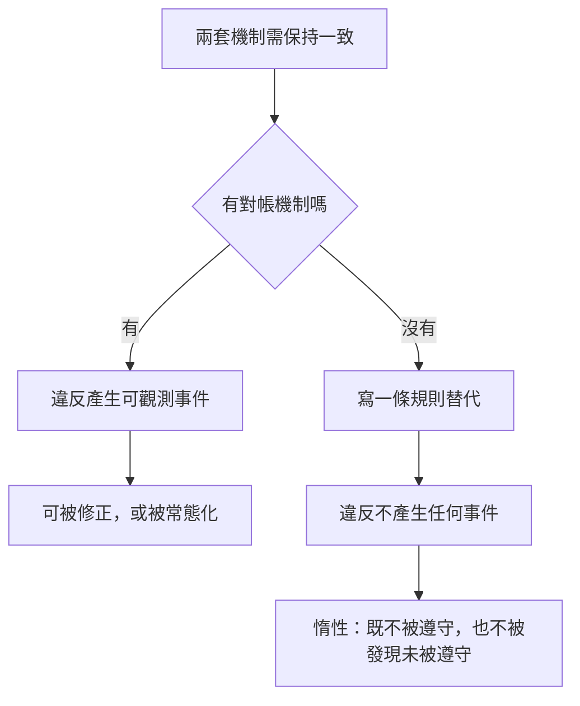

+++
title = "規則書是一張未對帳邊界的地圖"
date = "2026-09-11T05:05:03+08:00"
author = "梅乾"
draft = false
isCJKLanguage = true
description = "未受檢查的強制條款不是單純冗餘，而是未對帳邊界的證據；規則書可據此轉化為可估價的機制缺口清單。"
tags = [
    "分析論述", # term:AnalyticalEssay
    "常態化偏差", # term:NormalizationOfDeviance
    "廢止效力", # term:Desuetude
    "過度刑罰化", # term:Overcriminalization
    "可區分性", # term:Distinguishability
    "架構決策紀錄", # term:ArchitectureDecisionRecords
    "語意邊界", # term:SemanticBoundary
    "脫鉤", # term:Desynchronization
  ]
series = ["研發系統治理：工廠直覺穿過交接後留下什麼"]
[ai_info]
    [ai_info.generation]
        model = "Claude Opus 5"
        agent = "Claude Code VSCode Extension 2.1.267"
    [ai_info.refinement]
        model = "GPT-5.6 Sol"
        agent = "Codex VS Code extension 26.908.40401"
+++

<!--more-->

## 導言

挑戰者號的 O 環侵蝕不是沒有人知道。它被量測、被記錄、被討論，然後太空梭照樣起飛。

社會學家 Diane Vaughan 把這個過程命名為**常態化偏差**（Normalization Of Deviance） <!-- term:NormalizationOfDeviance -->：組織反覆觀察到問題卻沒有後果，於是「帶著這個缺陷飛行」逐漸變成正常而可接受的事。每一次成功飛行都讓下一次的異常更容易被接受。

> [!IMPORTANT]
> **常態化偏差** <!-- term:NormalizationOfDeviance --> (Normalization Of Deviance): 組織因異常反覆未造成後果，而逐步將其重新定義為可接受狀態的過程。 <!-- anchor:NormalizationOfDeviance -->

這個機制有兩個前提：**一個可觀測的異常**，以及**重複觀察到它卻存活下來**。

而它無法解釋另一類規則。一份工程規範裡寫著「所有介面變更必須附回溯相容性評估」，而沒有任何工具、任何流程節點、任何人在檢查這件事。它從來不產生可觀測的違反——沒有紅燈、沒有報表、沒有被擋下的提交。

沒有異常事件，就沒有東西可以被常態化。

這類條文的存在通常被當成冗餘：規則太多、該精簡。本文主張一個不同的讀法——**它們不是冗餘，它們是證據**。每一條沒有檢查的強制條款，都標記著組織架構裡一道缺少對帳機制的接縫。規則書因此可以被當成一張地圖來讀。

## 分析

### 假約束析出於未對帳的邊界

先確立這類條文從哪裡來，因為來源決定了它為什麼治不好。

當兩套機制必須保持一致，而沒有任何東西機械地比對它們時，組織會做一件事：寫一條規則。

- 票要進入測試狀態之前，任務清單必須全部勾選——補一道**系統邊界**上缺的對帳
- 嚴禁實作者自行變通繞過規格——補一道**角色邊界**上缺的對帳
- 簽核前必須比對原始目標——補一道**層級深度**造成的回饋缺口

每一條這樣的條文，都是一道沒有機制的接縫上，用文字長出來的替代物。

下圖對照兩條路徑，說明為什麼其中一條無法自我修正：

圖的右半邊沒有回到左邊的路徑。這不是因為沒有人想修，是因為**沒有訊號指出有東西需要修**。

**因果機制**是規則的約束力來自違反的後果，而後果的前提是違反可被偵測。偵測缺席時，規則的語氣強度與它的實際效力完全**脫鉤**（Desynchronization） <!-- term:Desynchronization -->。

> [!IMPORTANT]
> **脫鉤** <!-- term:Desynchronization --> (Desynchronization): 中介索引檔與真實檔案系統狀態不再一致的現象，是雙重狀態同步最典型的故障表現。 <!-- anchor:Desynchronization -->

**邊界條件**是並非所有未自動化的規則都屬此類。有些規則編碼的是真正需要判斷的事，而它們由一個真的會拒絕的人背書——那是人作為檢查點，不是沒有檢查點。判別方式是問：**這條規則被違反時，有沒有任何人或任何東西會知道。**

**反例**是規則在交接處的聚集現象。一份流程文件裡的強制條款，多數落在角色轉手、系統轉換、層級上報的位置。那不是巧合——**接縫愈多，這類條文愈多**。

### 稀釋效應已有記載，而它的機制不是人力耗損

未執行的規則會損害其他規則的可信度，這件事不是本文的發現。法律領域研究得比軟體治理早，也深。

**廢止效力**（Desuetude） <!-- term:Desuetude -->的傳統主張是，長期不被執行的法條逐漸失去可執行性。而**過度刑罰化**（Overcriminalization） <!-- term:Overcriminalization -->的研究更進一步：**未執行的法條侵蝕整個刑法體系的正當性**，公眾因此看到一個「已被深度妥協的法秩序」。法律若被例行忽視或執行不一致，會失去分量，並教會公民「法律本身不重要，重要的是國家決定執行什麼」。

> [!IMPORTANT]
> **廢止效力** <!-- term:Desuetude --> (Desuetude): 法規因長期未被執行而逐漸喪失實際效力的法理概念。 <!-- anchor:Desuetude -->
> **過度刑罰化** <!-- term:Overcriminalization --> (Overcriminalization): 以過多或過廣刑事規範治理行為，進而稀釋法秩序正當性的現象。 <!-- anchor:Overcriminalization -->

軟體治理文件是同一個結構，只是規模較小、後果較慢。

但這裡有一個常見的誤診必須排除。企業界對此有一套現成的解釋叫合規疲勞（compliance fatigue）：規則過多導致心力耗損、決策品質下降，因此不遵守。那是**容量論證**——人的注意力有限，規則超載。

容量論證推出的處方是減量。而它在這裡是錯的。

**一個精神飽滿、動機充足、注意力無限的讀者，仍然會對全部條款套用同一個折扣率**，因為他分不出哪些會咬人。這是**資訊論證**，不是容量論證。

**因果機制**是**可區分性**（Distinguishability） <!-- term:Distinguishability -->的喪失迫使讀者採用單一先驗。面對兩類外觀相同的物件，按整體期望值處理是理性的，而非疏忽。

> [!IMPORTANT]
> **可區分性** <!-- term:Distinguishability --> (Distinguishability): 觀察者能否依可見訊號辨別不同品質、狀態或來源之產物的性質。 <!-- anchor:Distinguishability -->

**邊界條件**是當被檢查的規則有明確標記時，效應消失。若文件用版面、標籤或位置把「這條會擋下建置」與「這條是期望」分開，讀者就能維持兩套折扣率。**問題出在混排，不在數量。**

**反例**是一個團隊反覆違反某條真正重要的規則，而當事人並非輕忽。他們是在一個已經訓練他們把所有強制條款讀成建議的環境裡，對一條實際上會咬人的條款做了同樣的解讀。懲罰個人在這裡無效，因為錯誤的來源是文件的組成，不是讀者的態度。

### 與常態化偏差的區分

回到開頭那個案例。區分兩者有實務上的後果，因為它們的處方不同。

常態化偏差 <!-- term:NormalizationOfDeviance -->處理的是**被觀察到的證據如何被重新定義**。O 環侵蝕的數據存在，每次都被看見，而組織逐步調整了「可接受」的定義。

無檢查的條文處理的是**證據從未產生**。沒有數據、沒有被看見的東西、沒有需要被重新定義的異常。

- **常態化偏差** <!-- term:NormalizationOfDeviance -->：證據被反覆觀察，然後被重新詮釋為正常
- **無檢查的條文**：從出生就是惰性的，沒有進入過可被違反的狀態

**因果機制**的差異在於基準線的移動方式。前者的基準線被證據推動而漂移；後者沒有基準線，因為從來沒有量過。

**邊界條件**是兩者可以共存於同一份文件。一份規範裡可能有五條會紅燈的規則正在被逐步放寬，同時有九十五條從未被檢查過。

**反例**是把後者當成前者來治。針對常態化偏差 <!-- term:NormalizationOfDeviance -->的處方是「重新檢視你們如何詮釋異常數據」——而對無檢查的條文施用這個處方會落空，因為沒有異常數據可供檢視。**問錯問題會得到「沒有異常」的答案，而那個答案是對的，只是毫無意義。**

### 與失效治理的區分

還有一種相鄰的失效值得分開：曾經有效、但被治理的對象消失之後仍然留著的機制。

那種機制**死了**。它建立時有真實的作用，而環境改變使它失去對象。

無檢查的條文**沒活過**。它從撰寫的那一刻起就沒有接上任何檢查。

診斷問題因此不同。前者問「它守的東西還在嗎」，後者問「它有沒有守過任何東西」。

處方也不同。死掉的機制該退役——確認風險場景不再可能發生，提取可遷移的片段，然後移除。沒活過的條文不能只是移除，因為它佔據的那道接縫仍然存在：**要嘛補上機制，要嘛承認那道接縫是空的並停止假裝它被守著。**

**因果機制**是兩者與被治理對象的關係相反。一個失去了對象，另一個從未擁有對象。

**邊界條件**是同一條規則可以先後是兩者：曾經有檢查、檢查被移除、條文留下。那種情況按後者處理，因為當下的狀態是無檢查。

**反例**是把這類條文逕行刪除而不處理接縫。規則消失了，而兩套機制之間仍然沒有對帳——短期內看起來更乾淨，實際上失去了唯一一個標記出該處有缺口的東西。

### 把規則書當地圖讀

前面的分析導出一個可以當場施用的診斷程序，而它是本文真正的主張。

如果這些條文是接縫上的析出物，那麼規則書就記錄了組織在哪些地方**感覺到需要一致性，卻沒有能力機械地保證它**。

程序只有一步：**對每一條沒有機器檢查的強制條款，問它守的是哪一道邊界。**

- 答得出來——那道邊界缺一個機制，而這條規則是它的代用品。接著評估補上機制的成本
- 答不出來——這條規則不守任何東西，它是純粹的稀釋源，該刪

這比統計「幾條有檢查、幾條沒有」有用得多。比值只給出一個難看的數字；按邊界分類則給出**一份缺口清單，而清單上每一項都指向一個具體的工程決定**。

## 反思

### 終端檢驗是同一個問題的較大版本

Deming 的十四點管理原則中，第三點寫的是：「Cease dependence on inspection to achieve quality. Eliminate the need for inspection on a mass basis by building quality into the product in the first place.」

停止依賴檢驗來達成品質，把品質做進產品裡。

這條原則通常被讀成關於成本或時機的建議。但從本文的角度看，它講的是同一件事的較大版本：**一個放在流程末端的檢驗關卡，是對整條產線上所有未對帳接縫的單點替代。**

而當那個關卡的判定本身不是確定性的——當它依賴判斷、依賴抽樣、依賴一份可以有不同寫法的報告——它就具備了無檢查條文的性質：它存在、它被執行、它產生一份通過的紀錄，而它是否真的攔住了什麼無法從紀錄中得知。

差別只在規模。一條無檢查的條文守著一道接縫，一個軟性的終端關卡守著全部接縫。

### 同一個結構出現在其他惰性產物上

規則書不是唯一的案例，而檢查這一點可以確認前面的分析不是單一產物的特例。

**架構決策紀錄**（Architecture Decision Records） <!-- term:ArchitectureDecisionRecords -->有完整記載的同型失效：沒有人標記舊紀錄為已取代，沒有人刪除，它們留在原處看起來權威，同時無聲地與程式碼庫矛盾。該領域對根因的定性是「假裝成活文件的靜態文件」，並且明確指出這是架構性的問題而非文化性的。

> [!IMPORTANT]
> **架構決策紀錄** <!-- term:ArchitectureDecisionRecords --> (Architecture Decision Records): 記錄重要架構決策、背景與取捨理由的可追溯文件。 <!-- anchor:ArchitectureDecisionRecords -->

知識庫的情況相同，而且有規模數字：超過 94% 的內容在任一個月內未被觸碰。

三者共用同一個性質：**它們都不可能出錯。** 一份過期的決策紀錄不會讓任何建置變紅，不會與任何東西矛盾到被偵測，因此它不會被修正，只會累積。

這一支的文獻比本文早，結論也相近。本文的增量不在指出這個現象，而在把它與接縫連起來——**這些產物之所以無法自我清理，與無檢查的條文之所以無法自我清理，是同一個缺席。**

有一項觀察值得補上。決策紀錄的成長率受限於人的書寫速度；而變更歷史的成長率由變更筆數驅動。當產生一筆變更的成本大幅下降時，這個累積問題從潛伏轉為急性——**既有文獻隱含假設的成長率上限，已經不再成立。**

### 不是所有未檢查的陳述都該刪

本文的處方有一個容易被誤用的地方，必須劃清。

有些陳述的功能本來就不是約束，而是宣告方向——價值觀、設計哲學、我們希望成為什麼樣的團隊。這些有真實的作用，而且它們**不應該有機器檢查**。

問題不在它們存在，在於它們與強制條款混排且語氣相同。一句「我們重視可維護性」與一句「所有公開介面變更必須附相容性評估」，如果用同樣的助動詞、同樣的編號、同樣的版面呈現，讀者就無法建立兩套折扣率。

所以處方的精確形式不是「刪掉沒有檢查的規則」，是**讓約束與期望在外觀上不可混淆**。刪除只適用於第三類：既不是約束、也不是期望、不守任何邊界的條文。

### 這件事無法靠把規則寫好來解決

面對規則失效，最直覺的反應是改善規則本身：寫得更清楚、更具體、更有例子、更容易遵守。

但本文的分析指出這條路不通，而理由是結構性的。這類條文是**在補一個缺席的機制**，而更好的規則仍然不是機制。把條文從模糊改成精確，並不會讓違反它產生任何事件。

這解釋了一個常見的挫折：治理文件一版比一版嚴謹，而實際的約束力沒有上升。投入落在了無法產生效力的那個維度上。

## 實務對比

抽象的原則容易在落地時漂移。以下三組對照鎖定**語意邊界**（Semantic Boundary） <!-- term:SemanticBoundary -->。

> [!IMPORTANT]
> **語意邊界** <!-- term:SemanticBoundary --> (Semantic Boundary): 模組或類別在空間維度上定義其職責與封裝邊界的概念 <!-- anchor:SemanticBoundary -->

**其一：規則書的版面**

錯誤的作法是把所有強制條款用統一格式編號條列，因為那看起來嚴謹、一致、專業。而統一格式正是消除可區分性 <!-- term:Distinguishability -->的手段——讀者失去了建立兩套折扣率的依據。

正確的作法是讓**會擋下建置的條款在版面上與其餘者不可混淆**。分區、標記、或直接把它們移到檢查器的設定檔裡並在文件中引用。判準是：一個新人在不執行任何工具的情況下，能不能指出哪些條款會咬人。

**其二：新增一條規則之前**

錯誤的作法是在事故檢討後新增一條「今後必須……」。這個動作成本低、看起來負責、而且會被記錄為改善措施。

正確的作法是先問這條規則要守哪一道接縫，以及那道接縫能不能被機械地對帳。能，就寫檢查器而不是寫規則。不能，就明確標記這是一條靠人守的規則，並指名由誰守。**兩者都比新增一條無主的條文好。**

**其三：規則被違反時的歸因**

錯誤的作法是把違反歸因於當事人的輕忽，並以加強宣導回應。在一本混排的規則書裡，當事人套用的是那份文件訓練出來的折扣率，而那個折扣率是理性的。

正確的作法是先問這條規則此前是否曾經產生過任何可觀測的違反。從未有過，那麼這次的違反不是紀律問題，是**這條規則第一次被要求生效**。回應應該是補上機制，而不是懲罰第一個踩到它的人。

## 結論

未被檢查的規則不是中性的。它佔據版面、消耗閱讀，並且改變讀者對整份文件的先驗信任。

三個可遷移的原則：

**其一，規則的約束力來自違反的可偵測性，不來自語氣強度。** 一條無法產生可觀測違反的強制條款，在效力上等同於一句期望，無論它用了多強的助動詞。撰寫規範時真正該決定的不是措辭，是這條規則被違反時什麼東西會知道。

**其二，處方是可區分性 <!-- term:Distinguishability -->，不是減量。** 稀釋效應本身在法律領域已有數十年的記載，而企業界慣用的解釋——規則太多導致心力耗損——會導向錯誤的處方。真正的機制是兩類條款在外觀上不可分辨，因此理性的讀者只能採用單一折扣率。減少規則數量不解決這件事；**把會咬人的與不會咬人的分開呈現，才解決。**

**其三，規則書可以被當成診斷工具讀。** 每一條無檢查的強制條款，都標記著一道組織感覺需要一致性、卻沒有能力機械保證的接縫。逐條追問它守哪道邊界，得到的不是一份待刪清單，而是一份按位置排列的機制缺口清單——**而那份清單上的每一項，都是一個可以被估價的工程決定。**