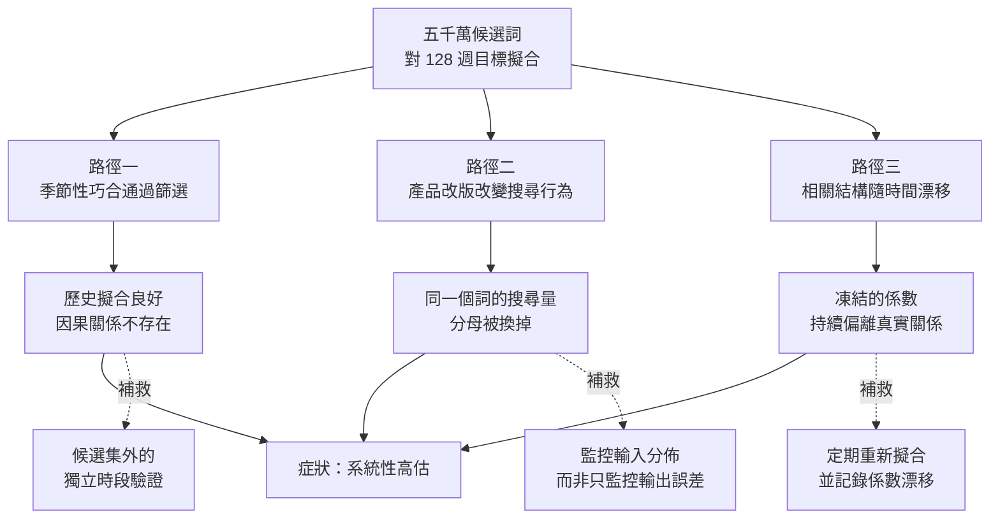

+++
title = "訓練誤差為何是有偏的：候選集規模與選擇偏差"
date = "2026-09-08T19:04:02+08:00"
author = "TTL::0"
draft = false
isCJKLanguage = true
description = "2013 年 2 月，美國正處於一個嚴重的流感季。一套運行了四年、發表在《Nature》上、被廣泛引用為大數據典範的預測系統，給出了當週的流感就診率估計——那個數字是疾管中心實測值的**兩倍以上**。"
tags = [
    "分析論述", # term:AnalyticalEssay
    "機器學習", # term:MachineLearning
    "選擇偏差", # term:SelectionBias
    "校準", # term:Calibration
  ]
series = ["訓練訊號與能力證據：當指標變好，你到底知道了什麼"]
[ai_info]
    [ai_info.generation]
        model = "Claude Opus 5"
        agent = "Claude Code VSCode Extension 2.1.261"
    [ai_info.refinement]
        model = "Claude Opus 5"
        agent = "Claude Code VSCode Extension 2.1.263"
+++

<!--more-->

## 導言

2013 年 2 月，美國正處於一個嚴重的流感季。一套運行了四年、發表在《Nature》上、被廣泛引用為大數據典範的預測系統，給出了當週的流感就診率估計——那個數字是疾管中心實測值的**兩倍以上**。

這套系統的建立方式在當時看來無懈可擊。研究者取用五千萬個候選搜尋詞，把每一個詞的每週搜尋量與疾管中心過去 128 週的流感通報率做比對，從中選出擬合最好的 45 個詞，組成預測模型。歷史資料上的擬合極佳。[Ginsberg 等人，《Nature》2009](https://www.nature.com/articles/nature07634)

後續分析指出，這不是一次偶發的失準。從 2011 年 8 月起的 108 週裡，該系統有 100 週高估了流感就診率。[Lazer 等人，《The Parable of Google Flu》，Science 2014](https://www.science.org/doi/10.1126/science.1248506)

一個在歷史資料上擬合得極好、連續四年運作、由頂尖團隊建立的系統，為什麼會系統性地朝同一個方向錯？答案不在程式碼裡，也不在資料量不夠——資料量恰恰是這個系統最不缺的東西。答案在「從五千萬個候選裡挑出四十五個」這個動作本身。

## 分析

### 先把數字走一遍

在談機制之前，先看兩組數字，它們決定了這個系統的處境。

**第一組：自由度與觀測數。** 模型有 45 個搜尋詞，每個詞需要一個係數，加上截距共 46 個可調參數。用來擬合的觀測有 128 週。參數與觀測的比例是 1 比 2.8。

這個比例本身就值得警惕。粗略的直覺是：每個參數需要「消耗」掉若干筆觀測才能被穩定估計，2.8 筆觀測養一個參數是很緊的。但這還不是主要問題——真正的問題是第二組數字。

**第二組：候選數。** 那 45 個詞不是事先指定的，是從五千萬個候選裡選出來的。

這一步很容易被當成資料前處理而略過，但它才是關鍵。挑選這個動作，本身就是一種擬合。當你從五千萬個候選中挑出「與目標最相關」的那些，你消耗掉的自由度遠遠超過 45——你實際上是在一個極其巨大的模型空間裡搜尋，而最終呈現的 46 個參數只是搜尋結果的**摘要**，不是搜尋成本的紀錄。

用一個小尺度的類比說明這個落差。假設你要從一副洗好的撲克牌裡抽一張，宣稱能抽到黑桃 A。抽一次成功的機率是 1/52。但如果規則改成「抽五十次，只要有一次是黑桃 A 就算成功，而且只報告成功的那一次」，成功機率超過六成。牌沒有變，你的能力沒有變，變的只是**你被允許嘗試幾次而只報告一次**。

五千萬個候選詞，就是五千萬次嘗試。

### 從症狀回推：三個獨立的成因

高估不是單一原因造成的。把 2013 年那個兩倍的數字往回推，至少可以分出三條路徑，而它們需要不同的補救動作。

**第一條：季節性巧合被當成因果訊號。** 在五千萬個候選詞裡，必然存在大量與流感無關、但恰好具有冬季高峰的搜尋詞。高中籃球賽季就是一個被指出的例子——它每年冬天上升，每年春天下降，與流感季的形狀高度相似。挑選程序只看相關係數，不看因果，因此這類詞會通過篩選。

一旦模型裡混入這類詞，它在**歷史資料上**依然表現良好，因為歷史上這兩件事確實同時發生。但它們同時發生的理由是各自獨立地跟隨季節，不是其中一個造成另一個。當某一年的流感季提前或延後，籃球賽季不會跟著動，模型就會給出錯誤的答案。

**第二條：資料生成過程被系統自己改變了。** 這條最容易被忽略。搜尋量不是自然現象，它是一個產品的輸出，而那個產品持續在改版。當搜尋引擎開始為流感相關查詢提供自動完成與推薦搜尋時，使用者搜尋這些詞的頻率會上升——上升的原因是介面變了，不是生病的人變多了。

模型無法區分這兩種上升。它學到的是「這些詞的搜尋量與流感率成正比」，而這個關係的分母被悄悄換掉了。

**第三條：模型被凍結，而世界沒有。** 建模時的相關結構是在特定幾年的資料上估計的。即使前兩個問題不存在，這些相關性也會隨時間漂移。一個不重新**校準**（Calibration） <!-- term:Calibration -->的模型，其誤差會單調累積。

> [!IMPORTANT]
> **校準** <!-- term:Calibration --> (Calibration): 模型輸出機率與實際正確率的一致程度。 <!-- anchor:Calibration -->


下圖把三條路徑分開。它們最終匯聚成同一個症狀，但入口不同，因此不能用同一種手段修理。



圖中的三個補救動作互相不可替代。獨立時段驗證能抓出路徑一，但抓不出路徑二——因為驗證時產品可能還沒改版。監控輸入分佈能抓出路徑二，但對路徑一無效——季節性巧合的輸入分佈完全正常。這個不可替代性是本篇最實用的結論：**看到高估就重新訓練，只處理了三分之一的問題**。

本篇接下來聚焦第一條路徑，因為它是三者中唯一在建模當下就已注定、且完全可以事前防範的。

### 把選擇程序跑一遍

前面說「五千萬次嘗試會找到巧合」是一個機制主張。它需要被驗證，而驗證方式是：**在確知沒有任何真實訊號的情況下**，執行同樣的選擇程序，看它產出什麼。

下面這段程式建立一個目標序列（扮演流感通報率）與兩萬個候選序列（扮演搜尋詞）。所有序列都是獨立的隨機噪聲——沒有任何一個候選與目標有因果關係，連相關性都只是抽樣噪聲。然後執行與原系統相同的程序：用前 128 週挑出相關性最高的 45 個，擬合線性模型，再拿到**另外 128 週**上評估。

```python
import random, math

WEEKS_IN, WEEKS_OUT, N_CAND, N_KEEP = 128, 128, 20000, 45

def corr(a, b):
    n = len(a); ma = sum(a)/n; mb = sum(b)/n
    va = sum((x-ma)**2 for x in a); vb = sum((y-mb)**2 for y in b)
    if va == 0 or vb == 0: return 0.0
    return sum((x-ma)*(y-mb) for x, y in zip(a, b)) / math.sqrt(va*vb)

def solve(A, y):
    """normal equations + Gaussian elimination with partial pivoting"""
    p = len(A[0])
    M = [[sum(A[r][i]*A[r][j] for r in range(len(A))) for j in range(p)]
         + [sum(A[r][i]*y[r] for r in range(len(A)))] for i in range(p)]
    for c in range(p):
        piv = max(range(c, p), key=lambda r: abs(M[r][c]))
        M[c], M[piv] = M[piv], M[c]
        if abs(M[c][c]) < 1e-12: continue
        for r in range(p):
            if r != c and M[r][c] != 0.0:
                f = M[r][c]/M[c][c]
                for k in range(c, p+1): M[r][k] -= f*M[c][k]
    return [M[i][p]/M[i][i] if abs(M[i][i]) > 1e-12 else 0.0 for i in range(p)]

def r2(actual, pred):
    m = sum(actual)/len(actual)
    ss_res = sum((a-p)**2 for a, p in zip(actual, pred))
    ss_tot = sum((a-m)**2 for a in actual)
    return 1 - ss_res/ss_tot

rng = random.Random(7)
# 目標：與任何候選都無因果關係的隨機序列
target_in  = [rng.gauss(0, 1) for _ in range(WEEKS_IN)]
target_out = [rng.gauss(0, 1) for _ in range(WEEKS_OUT)]

# 候選「搜尋詞」：純噪聲，沒有任何一個與目標有因果關係
scored = []
for _ in range(N_CAND):
    col_in  = [rng.gauss(0, 1) for _ in range(WEEKS_IN)]
    col_out = [rng.gauss(0, 1) for _ in range(WEEKS_OUT)]
    scored.append((abs(corr(col_in, target_in)), col_in, col_out))

scored.sort(key=lambda t: -t[0])
kept = scored[:N_KEEP]
print(f"候選數 {N_CAND}，保留前 {N_KEEP} 名")
print(f"最高單詞相關係數      |r| = {kept[0][0]:.3f}")
print(f"第 {N_KEEP} 名相關係數      |r| = {kept[-1][0]:.3f}")

X_in  = [[kept[j][1][t] for j in range(N_KEEP)] for t in range(WEEKS_IN)]
X_out = [[kept[j][2][t] for j in range(N_KEEP)] for t in range(WEEKS_OUT)]
beta  = solve(X_in, target_in)
pred_in  = [sum(X_in[t][j]*beta[j]  for j in range(N_KEEP)) for t in range(WEEKS_IN)]
pred_out = [sum(X_out[t][j]*beta[j] for j in range(N_KEEP)) for t in range(WEEKS_OUT)]
print(f"樣本內  R² = {r2(target_in, pred_in):+.3f}")
print(f"樣本外  R² = {r2(target_out, pred_out):+.3f}")
```

實際執行輸出：

```text
候選數 20000，保留前 45 名
最高單詞相關係數      |r| = 0.364
第 45 名相關係數      |r| = 0.270
樣本內  R² = +0.869
樣本外  R² = -0.171
```

三個數字各自說明一件事。

第一，**單一候選就已經很好看**。最高相關係數 0.364 出現在一個與目標完全無關的隨機序列上。若有人拿這個係數來論證「這個詞是流感的領先指標」，光看數字無法反駁。

第二，**組合起來近乎完美**。樣本內 $R^2$ 達到 0.869，意思是模型解釋了目標序列中近 87% 的變異。任何簡報上出現這個數字，都會被當成強證據。

第三，**樣本外是負的**。$R^2 = -0.171$ 的意思不是「解釋力較弱」，而是**比直接預測平均值還差**。模型不只沒學到東西，它學到的東西主動有害。

這裡的候選數只有兩萬，是原系統的四千分之一。把候選數提高到五千萬，前兩個數字只會更漂亮，第三個數字只會更難看。

### 資料的三個角色

上面的模擬把機制暴露得很清楚：問題不在模型類型，不在資料量，而在**同一批資料被要求同時扮演三個互相衝突的角色**。

- **擬合**：估計參數的值。這會消耗資料中的資訊。
- **選擇**：決定哪些候選進入模型。這也會消耗資料中的資訊，而且消耗量隨候選數增長。
- **證明**：估計模型在未見資料上的表現。這需要資料是「乾淨」的，也就是尚未被前兩個角色消耗過。

前兩個角色與第三個角色不相容。當一批資料已經參與過擬合與選擇，它上面的誤差就不再是未見資料誤差的無偏估計，而是一個系統性偏低的樂觀值。

把這件事寫成式子。設模型 $h$ 在有限資料 $S$ 上的平均損失為

$$
\hat{R}_S(h)=\frac{1}{n}\sum_{i=1}^{n}\ell\big(h(x_i),y_i\big),
$$

而它在真正關心的分佈 $P$ 上的期望損失為

$$
R_P(h)=\mathbb{E}_{(x,y)\sim P}\big[\ell(h(x),y)\big].
$$

若 $h$ 是**事先固定**的，那麼 $\hat{R}_S(h)$ 是 $R_P(h)$ 的無偏估計，兩者的差距只是抽樣噪聲，沒有方向。但若 $h$ 是**在 $S$ 上從候選集 $\mathcal{H}$ 中挑出來的**，也就是

$$
\hat{h}=\arg\min_{h\in\mathcal{H}}\hat{R}_S(h),
$$

那麼 $\hat{R}_S(\hat{h})$ 就不再無偏。挑選動作專門尋找那些在 $S$ 上運氣好的候選，因此

$$
\mathbb{E}\big[\hat{R}_S(\hat{h})\big] \le R_P(\hat{h}),
$$

而且候選集 $\mathcal{H}$ 越大，這個不等式越鬆。這正是模擬中 0.869 與 $-0.171$ 之間那段距離的來源。

值得強調的是，這個推導**沒有假設模型過度複雜**。即使每個候選都極其簡單，只要候選夠多、挑選程序用的是同一批資料，偏差就會出現。「參數少所以不會過擬合」是一個常見的錯誤安慰。

### 這個誤判什麼時候其實是對的

上面的論證有一個明確的失效條件，而承認它比重複警告更有用。

**當真實差異遠大於噪聲時，大候選集是安全的。** **選擇偏差**（Selection Bias） <!-- term:SelectionBias -->的幅度由抽樣噪聲的尺度決定。若候選之間的真實表現差距是 15 個百分點，而驗證集的抽樣噪聲只有 1 個百分點，那麼挑選程序會可靠地找到真正較好的候選，偏差可以忽略。這解釋了為什麼在許多實務場景中，「挑最好的那個」確實有效——不是因為選擇偏差 <!-- term:SelectionBias -->不存在，而是因為它被真實訊號淹沒了。

> [!IMPORTANT]
> **選擇偏差** <!-- term:SelectionBias --> (Selection Bias): 從多個候選中挑出表現最好者時，該讀數同時包含真實能力與抽樣噪聲，使其系統性地優於真值的偏差。 <!-- anchor:SelectionBias -->


判斷標準因此不是「候選數多不多」，而是**真實差異的尺度與噪聲尺度的比值**。這個比值可以估計：把驗證集自助重抽數次，看排名有多穩定。若前十名在每次重抽中都換人，你量到的是噪聲；若前三名穩定，你量到的是訊號。

**當候選之間高度相關時，有效候選數遠小於名目候選數。** 五千萬個搜尋詞裡有大量近義詞與拼寫變體，它們的搜尋量幾乎同步變動。從統計角度看，一千個完全同步的候選只等於一個候選。因此名目數字會誇大實際的偏差。這不會讓問題消失，但它說明「五千萬」這個數字本身不能直接換算成偏差幅度。

**當你的目標本來就只是相關性時，這整套顧慮不適用。** 若你要的是一個與流感率同步變動的即時指標，而且你接受它在關係改變時失效，那麼上述所有問題都變成已知的操作限制，而不是缺陷。錯誤發生在把一個相關性工具當成因果模型使用，並在此基礎上做公共衛生決策。

## 反思

### 為什麼更多資料不能修復它

一個直覺的反應是：128 週太少了，用更多年的資料就好。這個直覺在某個範圍內正確，在關鍵處錯誤。

更多觀測確實會壓低抽樣噪聲，從而縮小選擇偏差 <!-- term:SelectionBias -->。但候選數也在同時增長——搜尋詞的數量隨著網路使用而增加，而且建模者傾向於在資料變多時嘗試更複雜的模型。偏差取決於候選數與觀測數的**比例**，不是觀測數的絕對值。

更根本的是，資料量不能解決季節性巧合。籃球賽季與流感季在歷史上真的同步，多蒐集十年資料只會讓這個同步看起來更穩固。要打破它，需要的不是更多的同類觀測，而是**一段兩者解耦的時期**——例如流感季異常提前的那一年。這種資料無法靠等待累積，它取決於世界是否恰好提供了自然實驗。

### 選擇偏差與分佈偏移不是同一件事

前面刻意把三條路徑分開，因為實務中它們常被混為「模型退化」而套用同一種處理。

選擇偏差 <!-- term:SelectionBias -->在**建模當下**就已經注定。模型上線的第一天，它的真實表現就已經比報告的數字差；後續只是逐漸暴露。它的補救動作必須發生在事前——凍結一批資料，或改用未參與選擇的時段驗證。事後無法補救，因為所有可用的資料都已經被污染。

分佈偏移則發生在**上線之後**。模型剛上線時可能確實如報告所述，只是隨著輸入分佈改變而退化。它的補救動作是持續監控與重新校準 <!-- term:Calibration -->，這些都是事後動作。

兩者需要的儀表板不同。選擇偏差 <!-- term:SelectionBias -->需要的是「這個數字是在哪批資料上、經過幾次選擇產生的」這類**來源紀錄**；分佈偏移需要的是「輸入的統計特性今天與上週相比如何」這類**時序監控**。只裝後者的團隊會在上線第一天就已經錯了卻毫無察覺。

### 已經污染的資料能做什麼

若你接手一個專案，發現所有資料都已經被反覆使用過，情況並非全無辦法，但選項有限且都有代價。

**時間切分**通常是最實際的。若資料帶時間戳，取一段從未被任何人分析過的最新時段作為評估集。這對付選擇偏差 <!-- term:SelectionBias -->有效，但它同時混入了分佈偏移的影響——你會低估模型，而無法區分低估來自哪一種原因。這個混淆是可接受的，因為它偏保守。

**收集新資料**是唯一乾淨的解法，但成本最高，且在許多領域不可行。

**申報而非修復**是最低成本的誠實選項。無法給出無偏估計時，明確說明「此數字為樂觀上界，來自 $k$ 次候選中的最佳值」，讓下游決策者自行折價。這不改善模型，但它防止一個已知有偏的數字被當成無偏的用。

### 實驗能證明什麼，不能證明什麼

候選池的 20000 個特徵是被構造成互相獨立的純噪聲，所以每一個被選中的都是純偽陽性。真實的候選特徵彼此相關，而且有些確實有預測力。相關性會降低**有效**的獨立候選數，因此 20000 個獨立候選高估了偏差——相對於 20000 個相關候選而言。

128 週的樣本內／樣本外切分與 $k=45$ 都是選定的。偏差的方向是結構性的，幅度則隨候選數與觀測數的比例改變，而那個比例正是本文主張的關鍵量。所以這些數字示範了那個比例如何作用，不是任何真實專案的偏差估計。

第二與第三段程式是污染與正確切分的對照示意，沒有被執行。

## 實務對比

**錯誤做法**：在完整資料集上做特徵選擇，再切分訓練與測試。

```python
# 錯誤：特徵選擇看過了全部資料，包括後來當作測試集的那部分
selected = pick_top_k_features(X_all, y_all, k=45)
X_tr, X_te, y_tr, y_te = split(X_all[selected], y_all)
model = fit(X_tr, y_tr)
report(score(model, X_te, y_te))     # 這個數字已經被污染
```

問題在第一行。特徵選擇看過了 `y_all`，其中包含後來成為 `y_te` 的那些值。測試集因此參與了選擇決策，它上面的分數不再是獨立估計。這個錯誤特別隱蔽，因為切分的程式碼看起來完全正確。

**較可靠的做法**：把切分放在所有決策之前，並讓選擇程序只能看見訓練部分。

```python
# 正確：切分先發生，選擇程序只能看見訓練部分
X_tr, X_te, y_tr, y_te = split(X_all, y_all)

selected = pick_top_k_features(X_tr, y_tr, k=45)   # 只看訓練資料
model = fit(X_tr[selected], y_tr)
report(score(model, X_te[selected], y_te))         # 獨立估計
```

差別只有兩行的順序，但性質完全不同。第二版的 `X_te` 從未影響過任何決策，因此它上面的分數可以支撐能力主張。

**另一個錯誤做法**：報告單一數字，不記錄它經過幾次選擇。

```text
模型準確率：0.87
```

**較可靠的做法**：讓選擇成本成為報告的一部分。

```text
候選組態數      : 200（超參數網格 8×5×5）
特徵選擇候選數  : 20,000（僅在訓練折內執行）
驗證集最佳      : 0.87  ← 含選擇偏差，不作為能力宣稱
測試集單次評估  : 0.83  ← 決策凍結後評估，n=5,000
測試集使用次數  : 1
```

這份報告裡最重要的一行是最後一行。「測試集使用次數：1」是一個可稽核的事實，而它一旦變成 2，上面那個 0.83 就跟著降級。把它寫出來，等於讓團隊在下次想「再測一下」時，必須明知代價地做這個決定。

## 結論

一個系統可以在歷史資料上擬合得近乎完美，同時對未來一無所知。這兩件事不矛盾，因為擬合度衡量的是「這批證據被解釋得多好」，而不是「這個解釋能走多遠」。

當候選集足夠大時，總會有某些候選在有限的歷史上與目標高度吻合。挑選程序無法區分「因為有因果關係而吻合」與「因為嘗試次數夠多而吻合」，因為它只看得見吻合本身。這使得低訓練誤差在大候選集下失去估計意義——它衡量的不再是模型，而是模型加上挑選程序的聯合結果。

因此，任何用「擬合得很好」支撐的能力主張，都必須同時交代兩個數字：候選集有多大，以及最終評估是在哪一批從未參與選擇的資料上完成的。少了這兩個數字，一個 0.87 與一個 0.62 之間無法比較，因為它們可能來自完全不同的嘗試次數。