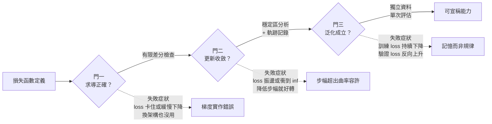

+++
title = "loss 在降不代表在學：求導、更新與泛化的三道門"
date = "2026-09-08T19:18:03+08:00"
author = "TTL::0"
draft = false
isCJKLanguage = true
description = "2017 年那篇提出 Transformer 的論文，在訓練設定裡藏了一個看起來像雜項的細節：學習率在前 4000 步線性上升，之後才按平方根倒數衰減。[Vaswani 等人，2017](https://arxiv.org/abs/1706.03762)"
tags = [
    "分析論述", # term:AnalyticalEssay
    "機器學習", # term:MachineLearning
    "條件數", # term:ConditionNumber
    "泛化", # term:Generalization
    "梯度下降", # term:GradientDescent
    "損失函數", # term:LossFunction
    "剪枝", # term:Pruning
  ]
series = ["訓練訊號與能力證據：當指標變好，你到底知道了什麼"]
[ai_info]
    [ai_info.generation]
        model = "Claude Opus 5"
        agent = "Claude Code VSCode Extension 2.1.261"
    [ai_info.refinement]
        model = "Claude Opus 5"
        agent = "Claude Code VSCode Extension 2.1.263"
+++

<!--more-->

## 導言

2017 年那篇提出 Transformer 的論文，在訓練設定裡藏了一個看起來像雜項的細節：學習率在前 4000 步線性上升，之後才按平方根倒數衰減。[Vaswani 等人，2017](https://arxiv.org/abs/1706.03762)

把這 4000 步的**暖身**拿掉，其他一律不變——同樣的資料、同樣的架構、同樣的**損失函數**（Loss Function） <!-- term:LossFunction -->、同樣正確的梯度計算——訓練會直接發散。這不是「效果差一點」，是 loss 衝到無限大、模型完全報廢。

> [!IMPORTANT]
> **損失函數** <!-- term:LossFunction --> (Loss Function): 把模型輸出與目標之間的差距量化為單一數值的評分函數。 <!-- anchor:LossFunction -->


這個事故的診斷價值在於它切得非常乾淨。梯度沒有算錯，一個位元都沒錯。模型完全有能力表示目標函數，同一份程式碼加上暖身就能訓練到頂尖水準。錯的只有一件事：**參數移動的幅度**。

後續分析把成因指向自適應最佳化器的早期行為。二階動量估計在前幾步只累積了極少樣本，變異數很大，因此換算出的有效步幅極不穩定；暖身的作用是壓低這段期間的步幅，直到估計穩定下來。[Liu 等人，RAdam](https://arxiv.org/abs/1908.03265) 另一條分析路徑指出，這個需求與層正規化的擺放位置有關：把正規化移到殘差分支之前，初始化時的梯度尺度就會變得溫和，暖身不再必要。[Xiong 等人，2020](https://arxiv.org/abs/2002.04745)

兩條分析的共同結論是：**一條下降的 loss 曲線，同時掩蓋了三個必須分別驗證的命題**。這篇要做的就是把它們拆開。

## 分析

### 先把數字走一遍

先用一個只有一個參數的模型，把「訓練」這件事整個手算一次。後面所有的一般式都可以退回到這組數字對照。

資料是四個點：$x=(-2,-1,1,2)$，真實關係 $y=3x$，所以 $y=(-6,-3,3,6)$。模型是 $\hat y=wx$，只有一個權重。損失是均方誤差：

$$
L(w)=\frac{1}{4}\sum_i (wx_i-y_i)^2 .
$$

因為 $y_i=3x_i$，可以把它化簡：$wx_i-y_i=(w-3)x_i$，於是

$$
L(w)=(w-3)^2\cdot\frac{1}{4}\sum_i x_i^2=(w-3)^2\cdot\frac{4+1+1+4}{4}=2.5\,(w-3)^2 .
$$

代幾個值：$L(0)=22.5$、$L(1)=10.0$、$L(3)=0$。損失是一個開口向上的拋物線，最低點在 $w=3$。

導數同樣可以直接算出：

$$
L'(w)=5\,(w-3).
$$

所以 $L'(0)=-15$、$L'(1)=-10$。負號表示往右走會降低損失。

現在用學習率 $\eta=0.1$ 從 $w_0=0$ 走兩步：

- 第一步：$w_1=0-0.1\times(-15)=1.5$，此時 $L=2.5\times 1.5^2=5.625$
- 第二步：$L'(1.5)=-7.5$，$w_2=1.5-0.1\times(-7.5)=2.25$，此時 $L=1.40625$

注意到誤差 $|w-3|$ 的變化：從 3 變成 1.5，再變成 0.75。**每一步恰好減半。**

這個 0.5 不是巧合。把更新式寫成誤差的形式：$w_{t+1}-3=(1-\eta\cdot 5)(w_t-3)$，而 $1-0.1\times 5=0.5$。這個係數叫做收縮因子，它稍後會決定訓練是收斂、振盪還是爆炸。

以上是全部的機制：算損失、算導數、按導數移動。三個步驟都很簡單，而下一節要說明的是，「這三步都做對了」與「模型學到了東西」之間還隔著多遠。

### 三道獨立的門

看到 loss 下降，人們自然得出「模型在學」。這句話實際上包含三個斷言，而它們可以各自為真或為假：

1. **求導正確**：程式算出的梯度，確實是損失函數 <!-- term:LossFunction -->對參數的導數。
2. **更新收斂**：以這個梯度、這個步幅、這個最佳化器，參數序列會朝損失更低處穩定移動。
3. **泛化**（Generalization） <!-- term:Generalization -->成立**：所得參數在訓練資料以外的輸入上，也產生所需行為。

> [!IMPORTANT]
> **泛化** <!-- term:Generalization --> (Generalization): 模型在訓練樣本以外的資料上維持表現的能力。 <!-- anchor:Generalization -->


這三者之間沒有蘊涵關係。梯度可以算錯，而 loss 照樣下降——只要錯誤的方向與真實下降方向夾角小於 90 度。更新可以完美收斂，而模型只是背下了訓練集。泛化 <!-- term:Generalization -->可以良好，而你根本沒檢查過梯度實作。

下圖把三道門畫成串聯的關卡，並標出各自的驗證手段。畫成圖而非清單，是因為每道門的**失敗症狀不同**，而症狀與門的對應關係正是診斷的關鍵。



圖中三條虛線是本篇最實用的部分。三種失敗的表現形態不同，因此**可以從症狀反推該檢查哪道門**。實務上最常見的錯誤是症狀出現時直接換架構，而換架構對門一的失敗完全無效——錯誤的梯度換個模型還是錯的。

以下逐門建立驗證方式，每一道都附上實際執行的輸出。

### 門一：求導正確

導數的定義給了一個不依賴任何框架的檢查方式。對一元函數，中央差分近似為

$$
f'(w)\approx\frac{f(w+\epsilon)-f(w-\epsilon)}{2\epsilon}.
$$

這個近似的誤差是 $O(\epsilon^2)$，所以取 $\epsilon=10^{-6}$ 時，它與真實導數應該吻合到接近浮點精度。若你手寫的解析梯度與它對不上，錯的幾乎一定是解析梯度。

用一個最小的例子：資料是四個點，真實關係 $y=3x$，模型只有一個權重 $w$，損失是均方誤差。

```python
xs = [-2.0, -1.0, 1.0, 2.0]
ys = [3.0 * x for x in xs]
def loss(w):  return sum((w*x - y)**2 for x, y in zip(xs, ys)) / len(xs)
def grad(w):  return 2.0 * sum((w*x - y)*x for x, y in zip(xs, ys)) / len(xs)

eps, w0 = 1e-6, 0.4
analytic = grad(w0)
numeric  = (loss(w0 + eps) - loss(w0 - eps)) / (2 * eps)
print("解析 %.9f  數值 %.9f  相對誤差 %.2e"
      % (analytic, numeric, abs(analytic - numeric) / abs(numeric)))

# 故意寫錯：漏掉係數 2
def grad_bug(w): return sum((w*x - y)*x for x, y in zip(xs, ys)) / len(xs)
print("錯誤實作 %.9f  相對誤差 %.2e" % (grad_bug(w0),
      abs(grad_bug(w0) - numeric) / abs(numeric)))
```

實際執行輸出：

```text
解析 -13.000000000  數值 -12.999999999  相對誤差 6.52e-11
錯誤實作 -6.500000000  相對誤差 5.00e-01
```

兩個相對誤差差了九個數量級。這就是這個檢查的價值：它給出的不是「看起來差不多」，而是一個**閾值極其明確**的判定。相對誤差在 $10^{-7}$ 以下代表實作正確，在 $10^{-2}$ 以上代表有 bug，中間地帶很窄。

關鍵在於那個「錯誤實作」會發生什麼。它的梯度方向完全正確，只是大小是真值的一半。用它訓練，loss **照樣會下降**，只是等效於把學習率減半。你不會看到任何異常，直到某天你調學習率調不出合理結果，卻找不到原因。

這說明了門一為什麼必須獨立驗證：**梯度錯誤的常見形態是尺度錯誤，而尺度錯誤不會產生可見症狀**。

### 門二：更新收斂

梯度正確之後，下一個問題是移動多遠。這個問題有一個可以解析求出的答案，而它解釋了 Transformer 暖身的必要性。

考慮一個二次損失 $L(w)=\frac{a}{2}(w-w^*)^2$，其中 $a$ 是曲率。**梯度下降**（Gradient Descent） <!-- term:GradientDescent -->的更新是 $w_{t+1}=w_t-\eta L'(w_t)=w_t-\eta a(w_t-w^*)$。把它改寫成誤差的遞迴：

> [!IMPORTANT]
> **梯度下降** <!-- term:GradientDescent --> (Gradient Descent): 沿損失函數負梯度方向反覆更新參數的最佳化方法。 <!-- anchor:GradientDescent -->


$$
w_{t+1}-w^*=(1-\eta a)(w_t-w^*).
$$

誤差每步乘上 $(1-\eta a)$。因此收斂的充要條件是這個因子的絕對值小於 1：

$$
|1-\eta a|<1
\quad\Longleftrightarrow\quad
0<\eta<\frac{2}{a}.
$$

這個式子把「學習率太大會不穩」從一句形容變成一個**可驗證的邊界**。下面的程式檢驗它：曲率 $a$ 從資料算出，然後跨越 $2/a$ 這條線測試四個學習率。

```python
import math
xs = [-2.0, -1.0, 1.0, 2.0]
ys = [3.0 * x for x in xs]
def loss(w):  return sum((w*x - y)**2 for x, y in zip(xs, ys)) / len(xs)
def grad(w):  return 2.0 * sum((w*x - y)*x for x, y in zip(xs, ys)) / len(xs)

a = 2.0 * sum(x*x for x in xs) / len(xs)
print("曲率 a = %.1f   線性穩定區 0 < lr < 2/a = %.3f" % (a, 2.0/a))
for lr in (0.10, 0.30, 0.39, 0.40, 0.45):
    w = 0.0
    for _ in range(40):
        w -= lr * grad(w)
        if not math.isfinite(w) or abs(w) > 1e12: break
    print("lr=%.2f  |1-lr*a|=%.3f  40 步後 w=%s"
          % (lr, abs(1 - lr*a),
             ("%.6f" % w) if math.isfinite(w) and abs(w) < 1e12 else "inf"))
```

實際執行輸出：

```text
曲率 a = 5.0   線性穩定區 0 < lr < 2/a = 0.400
lr=0.10  |1-lr*a|=0.500  40 步後 w=3.000000
lr=0.30  |1-lr*a|=0.500  40 步後 w=3.000000
lr=0.39  |1-lr*a|=0.950  40 步後 w=2.614464
lr=0.40  |1-lr*a|=1.000  40 步後 w=0.000000
lr=0.45  |1-lr*a|=1.250  40 步後 w=-22566.491536
```

理論預測與實測逐行吻合。$\eta=0.40$ 那一行特別值得看：收縮因子恰好等於 1，於是誤差既不縮小也不放大，$w$ 在 0 與 6 之間永遠來回，40 步後正好回到起點 0。這是一個**loss 曲線會顯示為完全平坦**的狀態——不是收斂，是振盪。

$\eta=0.45$ 那一行則是暖身要防止的東西：40 步之內 $w$ 跑到負兩萬多。真實訓練中這會表現為 loss 在幾十步內衝到 `inf` 或 `nan`。

### 門二的多維版本：一個學習率要同時服務所有方向

上面是一維的。真實模型有數十億個參數，而損失曲面在不同方向的曲率不同——這帶來一個一維版本看不見的問題。

穩定性由**最陡的方向**決定：只要有任何一個方向的曲率 $a_{\max}$ 使 $\eta a_{\max}>2$，那個方向就會發散，整個訓練跟著報廢。但收斂速度由**最平緩的方向**決定：那個方向的誤差每步只乘上 $|1-\eta a_{\min}|$，若 $a_{\min}$ 很小，這個因子非常接近 1。

兩者的比值 $a_{\max}/a_{\min}$ 稱為**條件數**（Condition Number） <!-- term:ConditionNumber -->。條件數 <!-- term:ConditionNumber -->大意味著你被夾在中間：不能放大步幅（陡方向會炸），放不大步幅就等於平緩方向幾乎不動。

> [!IMPORTANT]
> **條件數** <!-- term:ConditionNumber --> (Condition Number): 損失曲面各方向曲率的比值，決定固定學習率下梯度下降的收斂速度。 <!-- anchor:ConditionNumber -->


> [!IMPORTANT]
> **條件數**（Condition Number）：損失曲面上最大曲率與最小曲率的比值。它決定固定學習率的梯度下降在最好情況下能走多快。

下面用一個條件數 <!-- term:ConditionNumber -->為 100 的二維曲面驗證這個夾擊。

```python
a1, a2, STEPS = 0.2, 20.0, 50     # 平緩方向、陡峭方向的曲率
print("條件數 a2/a1 = %.0f" % (a2/a1))
print("穩定上界由陡峭方向決定：lr < 2/a2 = %.3f" % (2.0/a2))
for lr in (0.09, 0.099, 0.11):
    u = v = 1.0
    for _ in range(STEPS):
        u -= lr*a1*u          # 平緩方向
        v -= lr*a2*v          # 陡峭方向
    print("lr=%.3f  陡峭方向殘量=%.3e  平緩方向殘量=%.3e" % (lr, abs(v), abs(u)))
```

實際執行輸出：

```text
條件數 a2/a1 = 100
穩定上界由陡峭方向決定：lr < 2/a2 = 0.100
lr=0.090  陡峭方向殘量=1.427e-05  平緩方向殘量=4.033e-01
lr=0.099  陡峭方向殘量=3.642e-01  平緩方向殘量=3.679e-01
lr=0.110  陡峭方向殘量=9.100e+03  平緩方向殘量=3.288e-01
```

第一行是最能說明問題的：在幾乎最大的容許步幅下，陡峭方向已經解到 $10^{-5}$，平緩方向卻還剩 **40%** 沒動。你把學習率調到極限了，仍然有一整個方向的問題基本沒被處理。而再往上一點（第三行），陡峭方向就開始爆炸。

這正是暖身、正規化與自適應最佳化器共同要對付的東西。它們的作用不是「讓梯度更正確」，而是**改變不同方向的有效曲率比**，把這個夾擊放寬。

### 門三：泛化

前兩道門都過了，參數穩定收斂到損失的極小值。這仍然不保證模型學到了任何可遷移的東西。

下面的實驗把訓練誤差與未見點誤差並排。資料是 12 個帶噪聲的點，真實函數是 $y=x^2$，用不同次數的多項式擬合。

```python
rng = random.Random(3)
tr_x = [-1.0 + 2.0*i/11 for i in range(12)]
tr_y = [x*x + rng.gauss(0, 0.08) for x in tr_x]
te_x = [-1.0 + 2.0*i/199 for i in range(200)]
te_y = [x*x for x in te_x]
for deg in (1, 2, 4, 8, 11):
    b = solve([[x**j for j in range(deg+1)] for x in tr_x], tr_y)
    f = lambda x: sum(b[j]*x**j for j in range(deg+1))
    tr = sum((f(x)-y)**2 for x, y in zip(tr_x, tr_y))/len(tr_x)
    te = sum((f(x)-y)**2 for x, y in zip(te_x, te_y))/len(te_x)
    print("次數 %-4d 訓練 MSE %-12.6f 未見點 MSE %-12.6f" % (deg, tr, te))
```

實際執行輸出：

```text
次數 1    訓練 MSE 0.124156     未見點 MSE 0.098599
次數 2    訓練 MSE 0.003753     未見點 MSE 0.001055
次數 4    訓練 MSE 0.003585     未見點 MSE 0.001287
次數 8    訓練 MSE 0.002637     未見點 MSE 0.003037
次數 11   訓練 MSE 0.000000     未見點 MSE 0.075224
```

從上往下讀，訓練 MSE **單調下降**，一路降到 0.000000。若你只有這一欄，結論會是「11 次多項式最好」。

右欄講的是另一個故事。未見點 MSE 在次數 2 時最低，之後開始上升，到次數 11 時是次數 2 的 **71 倍**。訓練誤差歸零的那個模型，是全部五個之中最差的。

次數 11 的情形有一個精確的解釋：12 個點恰好可以被 11 次多項式完全插值，因此訓練誤差在數學上必然是 0。它把每一個噪聲擾動都當成需要通過的目標，曲線因此在點與點之間劇烈彎折。訓練誤差為 0 不是學習成功的極致，而是**這個指標已經完全失去鑑別力**的訊號。

## 反思

### 什麼時候看 loss 曲線就夠了

上面三道門都要求額外工作。要誠實說明它們什麼時候不必要。

**當你只是在複現一個已知配置時**，門一與門二已經被別人驗證過。你要確認的只是「我有沒有接錯線」，而 loss 是否下降到預期範圍就足以回答。這是最常見的情境，也是三道門紀律看起來多餘的原因。

**當模型每一步都在未見資料上被評估時**，門三被持續驗證，門一與門二的失敗會立刻顯現為評估指標不動。線上學習與某些強化學習設定屬於這一類。

**當失敗成本低於驗證成本時**，直接訓練然後看結果是理性的。門一的有限差分檢查在大模型上並不便宜，若一次訓練只要十分鐘，跑一次比檢查一次快。

三道門的價值集中在一個特定情境：**訓練昂貴、症狀模糊、而且你正在改動非標準的東西**。自訂損失函數 <!-- term:LossFunction -->、自訂層、非常規的最佳化器設定——這些場合下，症狀與成因的對應關係最不明顯，逐門排除的成本最低。

### 梯度大小不等於重要性

門一通過後，容易產生另一個誤讀：把梯度的數值大小當成該參數的重要程度。

反例來自重新參數化。同一個函數可以用不同尺度的參數表示。若把某層權重全部乘以 10，同時把下一層權重除以 10，模型的輸出函數完全不變，但兩層的梯度大小差了一百倍。梯度大小反映的是**目前參數化下的局部敏感度**，不是功能上的因果重要性。

這個反例的實務後果是：用梯度範數做**剪枝**（Pruning） <!-- term:Pruning -->或歸因時，必須先確認尺度是可比較的。跨層比較梯度範數，通常在比較初始化與正規化的選擇，而不是在比較功能。

> [!IMPORTANT]
> **剪枝** <!-- term:Pruning --> (Pruning): 移除模型中影響較小的連接或結構，以縮減規模的壓縮方法。 <!-- anchor:Pruning -->


### 隨機梯度改變了門二的意義

上面的穩定性分析假設每步用的是完整資料的梯度。實務上用的是小批次估計，這讓「收斂」的定義本身鬆動。

小批次梯度是完整梯度的帶噪估計。噪聲讓單步的損失不保證下降——即使學習率在穩定區內，個別步驟仍可能讓損失上升。因此「每一步 loss 都要下降」不是隨機梯度下降 <!-- term:GradientDescent -->的正確驗收條件；正確的觀察量是**平滑後的趨勢**與**軌跡是否有限**。

這也意味著門二的失敗判定需要調整。單次 loss 跳高不是發散證據；連續多步的指數增長或出現非有限值才是。把前者當成後者，會導致無謂地調低學習率，反而落進條件數 <!-- term:ConditionNumber -->的夾擊。

## 實務對比

**錯誤做法**：訓練不動，於是換模型。

```text
症狀：loss 卡在 2.3 不動
動作：把 3 層換成 6 層 → 還是不動
      把 6 層換成 12 層 → 還是不動
      換一個更大的預訓練模型 → 還是不動
```

這條路徑的問題是它從未檢查門一。若梯度實作有誤，或某層的梯度根本沒有回傳（例如張量在中途被 detach），換多少架構都不會有變化。四次嘗試花掉的時間，遠超過一次有限差分檢查。

**較可靠的做法**：依症狀決定檢查哪道門，一次只改一項。

```text
症狀：loss 卡在 2.3 不動

門一：有限差分檢查
      → 相對誤差 3e-11，通過
門一補充：印出各層梯度範數
      → 第 1-4 層全為 0.0  ← 找到了
      → 追查：資料前處理裡有一個 .detach()

修正後 loss 開始下降 → 才進入門二的學習率比較
```

關鍵不是有限差分本身，而是**在換架構之前先排除實作錯誤**。各層梯度範數這個診斷特別划算：它幾乎不花時間，卻能一眼看出訊號在哪裡斷掉。

**另一個錯誤做法**：用訓練 loss 決定何時停止訓練。

```python
# 錯誤：訓練 loss 幾乎永遠會繼續下降
while train_loss > threshold:
    train_one_epoch()
```

訓練 loss 單調下降是常態，用它當停止條件等於訓練到記憶為止。前面那張表裡，這個迴圈會一路跑到次數 11 那一行。

**較可靠的做法**：用獨立資料決定停止，用訓練 loss 只做健康檢查。

```python
best, patience = float('inf'), 0
while patience < 20:
    train_one_epoch()
    v = evaluate(val_set)              # 未參與參數更新的資料
    if v < best: best, patience = v, 0
    else:        patience += 1
    assert math.isfinite(train_loss)   # 訓練 loss 只用來偵測發散
```

兩個指標各司其職。驗證損失決定何時停，訓練損失只負責回答「有沒有爆掉」。把兩個角色分開之後，「loss 在降」這個觀察就退回它應有的位置：它是門二的健康訊號，不是門三的證據。

## 結論

一條下降的損失曲線，是三個獨立命題疊在同一張圖上的結果。梯度必須正確地反映損失對參數的敏感度；步幅必須落在曲率容許的區間內；所得參數還必須在未參與訓練的資料上產生所需行為。任一環節失敗，曲線都可能看起來正常。

三者的失敗症狀不同，這使得診斷有跡可循：卡住不動且換架構無效，先查求導；振盪或衝到無限大，先查步幅與曲率；訓練持續改善而獨立評估反向惡化，問題在目標與能力的錯配，不在最佳化。

因此，「模型在學」這句話應該被拆成三次可分別回答的檢查，而不是壓縮成一次對曲線的目測。把三者合併的代價，是當任何一環出錯時，你手上沒有任何資訊能指出是哪一環。