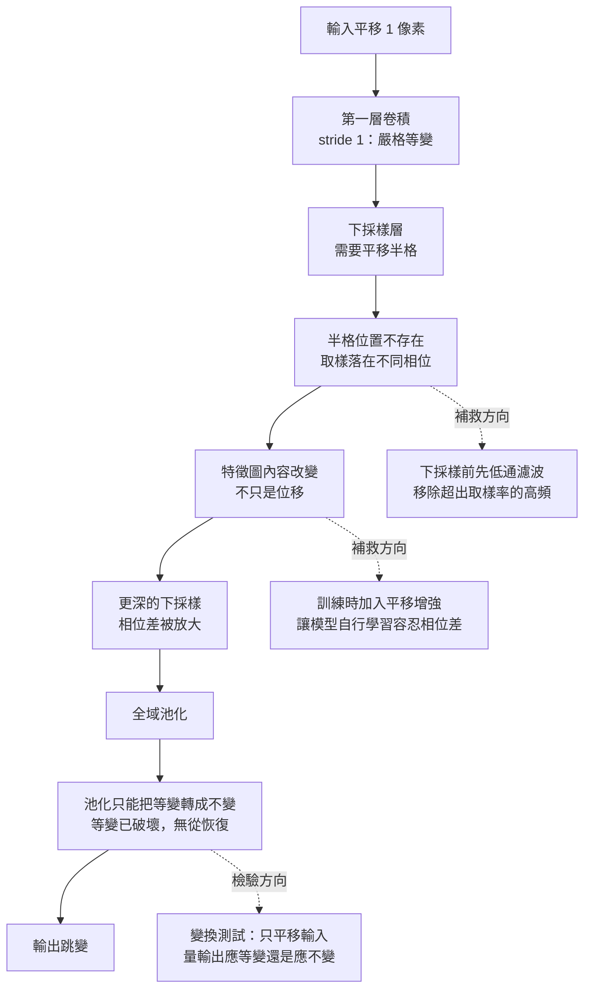

+++
title = "移一個像素就翻：卷積不變性宣稱的前提破壞"
date = "2026-09-08T19:31:04+08:00"
author = "TTL::0"
draft = false
isCJKLanguage = true
description = "拿一張影像分類器辨識正確的照片，把它整體往右移動一個像素。內容完全沒變——同一隻貓、同一個背景、同樣的光照。分類結果可能從「貓」變成別的類別。"
tags = [
    "分析論述", # term:AnalyticalEssay
    "機器學習", # term:MachineLearning
    "感受野", # term:ReceptiveField
    "平移等變性", # term:TranslationEquivariance
  ]
series = ["訓練訊號與能力證據：當指標變好，你到底知道了什麼"]
[ai_info]
    [ai_info.generation]
        model = "Claude Opus 5"
        agent = "Claude Code VSCode Extension 2.1.261"
    [ai_info.refinement]
        model = "Claude Opus 5"
        agent = "Claude Code VSCode Extension 2.1.263"
+++

<!--more-->

## 導言

拿一張影像分類器辨識正確的照片，把它整體往右移動一個像素。內容完全沒變——同一隻貓、同一個背景、同樣的光照。分類結果可能從「貓」變成別的類別。

這不是刻意構造的對抗樣本。研究者把整段影片逐格輸入分類器，相鄰格之間的物體位移只有一兩個像素，而預測機率在格與格之間劇烈跳動。他們用「鋸齒程度」計量這個現象，發現在標準的 ImageNet 分類器上它普遍存在。[Azulay 與 Weiss，《Why do deep convolutional networks generalize so poorly to small image transformations?》](https://arxiv.org/abs/1805.12177)

這個結果直接牴觸了一句幾乎每份教材都會寫的話：卷積網路具有平移不變性。那句話不是錯的——它有嚴格的數學證明。問題在於證明依賴一組前提，而標準的卷積網路架構**系統性地違反其中至少三個**。

這篇要處理的是一種特定的誤判形態：架構文件宣稱某個性質，該性質確實可證明，但宣稱被當成無條件成立。這類誤判與統計上的偏差不同——它不會因為資料變多而改善，因為它的根源在理論與實作之間，不在樣本量。

## 分析

### 先把數字走一遍

先把「等變」與「不變」這兩個常被混用的詞分清楚，用四個數字手算一次。

取一個長度 4 的循環訊號 $x=[1,0,0,0]$，卷積核 $w=[2,-1]$。互相關的定義是

$$
y_i=\sum_{k}w_k\,x_{i+k},
$$

索引循環。逐項算出來：

- $y_0=2\cdot x_0+(-1)\cdot x_1=2\cdot 1-0=2$
- $y_1=2\cdot x_1+(-1)\cdot x_2=0-0=0$
- $y_2=2\cdot x_2+(-1)\cdot x_3=0-0=0$
- $y_3=2\cdot x_3+(-1)\cdot x_0=0-1=-1$

所以 $y=[2,0,0,-1]$。

現在把輸入右移一格，$x'=[0,1,0,0]$，重算：

- $y'_0=2\cdot 0-1\cdot 1=-1$
- $y'_1=2\cdot 1-1\cdot 0=2$
- $y'_2=0$
- $y'_3=0$

得到 $y'=[-1,2,0,0]$。把原本的 $y=[2,0,0,-1]$ 右移一格，正好也是 $[-1,2,0,0]$。

這就是**平移等變性**（Translation Equivariance） <!-- term:TranslationEquivariance -->：輸入平移，輸出跟著以同樣方式平移。寫成算子形式，若 $T_\delta$ 表示平移 $\delta$，卷積算子 $C$ 滿足

> [!IMPORTANT]
> **平移等變性** <!-- term:TranslationEquivariance --> (Translation Equivariance): 輸入平移時輸出隨之平移的性質，由卷積的權重共享自然產生。 <!-- anchor:TranslationEquivariance -->


$$
C(T_\delta x)=T_\delta\,C(x).
$$

注意這裡**輸出改變了**。$y$ 與 $y'$ 是不同的向量。等變的意思是改變方式可預測，不是不改變。

**平移不變性**是另一件事：$C(T_\delta x)=C(x)$，輸出完全不動。卷積不具備這個性質，任何單層卷積都不具備。要得到不變性，必須在等變的特徵圖之後接一個**忽略位置的讀出**——例如對所有位置取平均或最大值。

> [!IMPORTANT]
> **平移等變性**（Translation Equivariance）：輸入平移時，輸出以對應方式平移。卷積的權重共享直接產生這個性質。
> **平移不變性**（Translation Invariance）：輸入平移時，輸出完全不變。它不是卷積的性質，而是等變特徵圖加上位置無關讀出的**組合結果**。

這個區分是理解導言那個事故的第一步。分類器最後確實有全域池化，理論上應該得到不變性。那麼不變性是在哪裡失掉的？

### 宣稱是條件命題

答案是：不變性沒有失掉，是**等變性先失掉了**。全域池化只能把等變轉成不變；等變若不成立，池化沒有東西可以轉。

把宣稱完整寫出來，前提就浮現了。「卷積是平移等變的」成立需要：

1. **域是無限的，或邊界是循環的。** 上面的手算用了循環索引。真實影像是有限的，邊界通常用零填充。在邊界附近，平移會把新的零推進來，而原本的內容被推出去——這裡的計算與內部不同。
2. **沒有下採樣，也就是 stride 為 1。** 手算中輸出與輸入的格點一一對應。若 stride 為 2，輸出格點只有輸入的一半。
3. **平移量是整數格點。** 手算移的是一整格。真實世界中物體的移動是連續的，成像後落在格點之間。

三個前提中，第二個破壞得最徹底，因為它不是邊界效應，而是**每一層都在發生**。

### 量測前提二的破壞

前提破壞是一個機制主張，需要量測。下面的程式建立一個循環邊界的一維卷積——刻意讓前提一與前提三成立——然後只操弄 stride，量等變誤差。

等變誤差定義為

$$
E_{\text{eq}}(d)=\frac{\big\lVert F(T_d x)-T_{d'}F(x)\big\rVert_2}{\lVert F(x)\rVert_2},
$$

其中 $d'$ 取所有整數輸出平移中誤差最小的那一個。這個取法刻意對等變性最有利：即使找不到理論上正確的對應平移，也給它挑一個最好的。

```python
import random, math

N, K = 32, 3
rng = random.Random(11)
kernel = [rng.gauss(0, 1) for _ in range(K)]

def roll(x, d):
    return [x[(i - d) % len(x)] for i in range(len(x))]

def conv(x, stride):
    """循環邊界的互相關，輸出取每 stride 個位置"""
    full = [sum(kernel[k] * x[(i + k) % N] for k in range(K)) for i in range(N)]
    return full[::stride]

def l2(a, b):  return math.sqrt(sum((p - q) ** 2 for p, q in zip(a, b)))
def norm(a):   return math.sqrt(sum(p * p for p in a))

x = [rng.gauss(0, 1) for _ in range(N)]
for stride in (1, 2, 4):
    base = conv(x, stride)
    for d in (1, 2, 4):
        shifted = conv(roll(x, d), stride)
        best = min(l2(shifted, roll(base, s)) / norm(base)
                   for s in range(len(base)))       # 給等變性最有利的判定
        print("stride=%d  輸入平移 d=%d  相對等變誤差 %.4f" % (stride, d, best))
```

實際執行輸出：

```text
stride=1  輸入平移 d=1  相對等變誤差 0.0000
stride=1  輸入平移 d=2  相對等變誤差 0.0000
stride=1  輸入平移 d=4  相對等變誤差 0.0000

stride=2  輸入平移 d=1  相對等變誤差 1.0465
stride=2  輸入平移 d=2  相對等變誤差 0.0000
stride=2  輸入平移 d=4  相對等變誤差 0.0000

stride=4  輸入平移 d=1  相對等變誤差 0.9984
stride=4  輸入平移 d=2  相對等變誤差 0.9195
stride=4  輸入平移 d=4  相對等變誤差 0.0000
```

這張表把前提破壞的位置定得非常精確。

**stride 為 1 時，誤差是嚴格的零。** 不是「很小」，是浮點意義下的零。等變性在此完全成立，理論與實作一致。

**stride 為 2 時，誤差呈現週期性。** 平移量是 2 的倍數時誤差為零；平移量為 1 時誤差是 1.0465。相對誤差大於 1 意味著**差異的大小超過訊號本身**——輸出不是稍微偏移，是變成一個無關的向量。

**stride 為 4 時，只有 4 的倍數才等變。** 平移 1 格與平移 2 格的誤差都在 0.92 以上。

規律很清楚：等變性只在平移量是 stride 的倍數時成立。原因是幾何上的：輸入平移一格，輸出應該平移「一格除以 stride」格。當 stride 為 2 時那是半格，而特徵圖上沒有半格這個位置。這個資訊沒有被近似，是**根本沒有地方可以放**。

真實網路把這件事乘上層數。一個總下採樣率為 32 的分類器，只在輸入平移為 32 的倍數時才嚴格等變。平移 1 個像素落在最壞的位置。

### 從破壞到症狀

有了量測，導言那個事故的因果鏈就可以完整寫出來。下圖把它畫成傳播路徑，因為關鍵在於**破壞發生在哪一層、以什麼形式被下一層接收**。



圖中「取樣落在不同相位」這一步是全鏈的樞紐。它說明症狀為何是**跳變而非漸變**：相位差不是連續量，它在整數格點之間切換，因此輸出的變化也是階梯式的。

三條虛線是三種不同層次的回應。低通濾波處理成因——在下採樣前移除訊號中超出新取樣率的高頻成分，這是取樣理論的標準做法，也是這條研究線的主要修補方向。[Zhang，《Making Convolutional Networks Shift-Invariant Again》](https://arxiv.org/abs/1904.11486) 資料增強處理症狀，讓模型在訓練中見過各種相位。變換測試則不修補任何東西，它只負責讓你知道自己現在在哪。

### 第二個宣稱誤讀：可達不等於已使用

同一類誤判在另一個地方重演。多層堆疊會擴大**感受野**（Receptive Field） <!-- term:ReceptiveField -->，也就是一個輸出單元可能連到的輸入範圍。對 stride 為 1、核寬 $K$ 的 $L$ 層網路，理論感受野 <!-- term:ReceptiveField -->是

> [!IMPORTANT]
> **感受野** <!-- term:ReceptiveField --> (Receptive Field): 輸出單元實際可見的輸入區域範圍，隨層數與步幅累積擴張。 <!-- anchor:ReceptiveField -->


$$
R_L=1+L(K-1).
$$

這個式子常被用來論證「網路已經看到全域資訊」。但它計算的是**拓撲上可達的範圍**，不是實際影響的分佈。

下面的程式把影響分佈算出來。$L$ 層均勻核的複合影響，就是把核與自己捲積 $L$ 次；每個輸入位置對輸出的影響權重可以直接讀出。

```python
def conv_full(a, b):
    out = [0.0]*(len(a)+len(b)-1)
    for i, x in enumerate(a):
        for j, y in enumerate(b):
            out[i+j] += x*y
    return out

K = 3
base = [1.0/K]*K          # 每層一個寬度 3 的均勻核
w = [1.0]
for L in range(1, 13):
    w = conv_full(w, base)
    rf = len(w)                                  # = 1 + L*(K-1)
    c = rf // 2
    total = sum(w); acc = w[c]; r = 0
    while acc < 0.90*total:                      # 由中心向外找 90% 影響的寬度
        r += 1
        acc += (w[c-r] if c-r >= 0 else 0.0) + (w[c+r] if c+r < rf else 0.0)
    if L in (1, 2, 4, 8, 12):
        print("L=%-3d 理論感受野 %-4d 中心影響佔比 %.4f  承載 90%% 影響的寬度 %-3d (%.0f%%)"
              % (L, rf, w[c]/total, 2*r+1, 100*(2*r+1)/rf))
```

實際執行輸出：

```text
L=1   理論感受野 3    中心影響佔比 0.3333  承載 90% 影響的寬度 3   (100%)
L=2   理論感受野 5    中心影響佔比 0.3333  承載 90% 影響的寬度 5   (100%)
L=4   理論感受野 9    中心影響佔比 0.2346  承載 90% 影響的寬度 7   (78%)
L=8   理論感受野 17   中心影響佔比 0.1687  承載 90% 影響的寬度 9   (53%)
L=12  理論感受野 25   中心影響佔比 0.1388  承載 90% 影響的寬度 11  (44%)
```

隨著深度增加，兩個數字朝相反方向走。理論感受野 <!-- term:ReceptiveField -->線性成長到 25，而承載九成影響的寬度只成長到 11——佔比從 100% 掉到 44%。邊緣位置在拓撲上連得到，實際影響卻趨近於零。

這與實測分析的結論一致：有效感受野 <!-- term:ReceptiveField -->通常只佔理論感受野 <!-- term:ReceptiveField -->的一部分，且影響量集中在中央。[Luo 等人，《Understanding the Effective 感受野 <!-- term:ReceptiveField --> in Deep CNNs》](https://arxiv.org/abs/1701.04128)

實務後果是：用 $R_L$ 覆蓋整張影像來論證「網路使用了全域資訊」是不成立的。要支持那個主張，需要直接量測遠端位置是否影響決策——遮蔽該區域、擾動它、或看輸入梯度。

### 這個誤判什麼時候其實是對的

上面的論證有明確的失效條件，承認它比重複警告更有用。

**當破壞的幅度落在無關區域時，嚴格的破壞沒有實務後果。** 邊界填充破壞了邊緣附近的等變性。若任務的決策資訊集中在畫面中央——多數以物件為中心的分類資料集就是如此——這個破壞在實務上不可觀測。因此「前提被破壞」是必要診斷而不是充分定罪，還需要量測破壞落在哪裡、幅度多大。

**當資料增強充分覆蓋變換群時，架構的嚴格性質變得不那麼重要。** 若訓練時對每張影像隨機平移，模型會被迫在各種相位下都給出正確答案。這不會讓架構變成嚴格等變，但它讓模型學到對相位差的容忍。代價是需要更多的訓練樣本與計算——你用資料換掉了架構本來應該免費提供的東西。

**當任務本來就需要絕對位置時，追求不變性是錯的方向。** 醫學影像中器官的位置本身帶有資訊；道路場景中地平線的高度是有用的先驗。在這些場合，強制全域共享與位置無關讀出會丟掉真正的訊號。「不變性是好的」這個直覺本身就是一個未經檢查的宣稱。

## 反思

### 同一種誤判的其他形態

架構宣稱被當成無條件事實，不只發生在平移上。

**紋理與形狀。** 標準的 ImageNet 分類器被廣泛描述為「學到了物體的形狀」。實測顯示它們高度依賴局部紋理：把貓的形狀填上大象的皮膚紋理，分類器傾向回答大象。[Geirhos 等人，2019](https://arxiv.org/abs/1811.12231) 這裡的宣稱不是數學定理，而是對模型學到什麼的推測，但誤判結構相同——一個未經直接量測的性質被當成已知。

**其他幾何變換。** 卷積內建的對稱只有平移。旋轉與縮放不在其中，不會因為架構是卷積而免費獲得。要讓旋轉也共享權重，需要相符的群等變構造，或者用資料增強加上未見角度的驗證。[Cohen 與 Welling，2016](https://arxiv.org/abs/1602.07576) 把平移的結論外推到「CNN 對幾何變換穩健」是一次無根據的擴張。

三個例子共用一個形狀：**宣稱的作用域被悄悄擴大**。原始命題有明確的邊界，傳播過程中邊界被磨掉，最後變成一句無條件的口號。

### 局部性作為代價

前面都在談宣稱失效。反方向也要說：卷積的局部性在成立時，換來的是實質的樣本效率。

位置專屬的參數只能從出現過該模式的位置學習。共享權重把所有位置的證據合併到同一組參數上，估計變異數因此下降。當資料機制確實具有「相同局部模式可在不同位置重用」這個結構時，這是一筆划算的交換。

但交換有代價，而代價在需要遠距關係的任務上浮現。若輸出取決於兩個相距很遠的位置，小核心需要足夠深度才能把它們組合起來——而上一節的數字顯示，深度提供的是拓撲可達性，實際影響會沿路衰減。這使全域關係任務成為局部偏置的直接反例，不是「資料不足」的表現。

### 池化的雙面性

全域池化把等變轉成不變，這是分類任務想要的。但同一個操作會破壞需要位置的任務。

降低位置敏感度有利於「這是什麼」，卻直接損害「這在哪裡」。關鍵點定位、細邊界分割、小物件偵測都會因為 stride 與池化造成的解析度損失而退步。實務上的修補是跳接、多尺度特徵或位置精修，而這些修補的存在本身就說明了池化不是免費的。

判斷的依據不是「該不該用池化」，而是先回答一個更前置的問題：**這個任務的輸出，應該隨輸入平移而平移，還是應該完全不動？** 前者要等變，後者要不變，兩個答案導向不同的架構。

### 實驗能證明什麼，不能證明什麼

前兩個實驗是一維的、用單一隨機核、單一輸入向量。等變誤差在平移量為步幅倍數時為零，這一點是代數性質，換核換輸入都不會改變；但非倍數位置的誤差**大小**是那一個實例的數字，不是一般值。

還有一個方向要說清楚：實驗用的是循環邊界，而循環邊界是**對等變最有利**的情形。真實實作用零填充或反射填充，那會讓等變在邊緣附近即使步幅為 1 也失效。所以 `stride=1` 那一列的 0.0000 是真實卷積能達到的上界，不是它的描述。

第二個實驗把每層設為寬度 3 的均勻核。均勻核是影響最分散的情形；訓練後的核不是均勻的，可以把影響集中得多（使 90% 寬度更窄），也可以透過膨脹或跳接擴得更遠。因此「拓撲可達與實際影響的落差」被證明存在，而它在任何真實網路上的幅度沒有被估計。

第三到第五段程式是驗收條件與干預測試的形狀示意，沒有被執行，不產生任何數字。

## 實務對比

**錯誤做法**：因為是影像任務，就預設所有位置共享同一組規則，並假設模型會處理好平移。

```python
# 錯誤：宣稱被當成無條件事實，從未驗證
model = Sequential(
    Conv2d(3, 64, 3, stride=2), ReLU(),      # 下採樣，破壞等變
    Conv2d(64, 128, 3, stride=2), ReLU(),    # 再一次
    Conv2d(128, 256, 3, stride=2), ReLU(),   # 再一次，總下採樣 8
    GlobalAvgPool(), Linear(256, n_classes),
)
# 文件：「使用 CNN 以獲得平移不變性」
```

問題不在架構——這是完全標準的設計。問題在最後那行註解，它把一個總下採樣率為 8 的網路描述為具有平移不變性，而實測會顯示它只在平移量為 8 的倍數時接近等變。

**較可靠的做法**：把宣稱寫成一個會失敗的測試，並在 CI 中執行。

```python
def shift_consistency(model, images, max_shift=8):
    """量測：同一張圖平移不同格數，預測是否一致"""
    base = model(images).argmax(-1)
    flips = {}
    for d in range(1, max_shift + 1):
        pred = model(shift_right(images, d)).argmax(-1)
        flips[d] = (pred != base).float().mean().item()
    return flips

# 驗收條件必須事前寫下，而且要能失敗
flips = shift_consistency(model, val_batch)
assert flips[1] < 0.02, f"平移 1 像素翻轉率 {flips[1]:.3f} 超過門檻"
```

這段程式的價值不在它會通過，而在它**可能不通過**。若翻轉率是 0.15，你就得到了一個具體數字，而不是一句「應該還好」。有了數字，才能比較低通濾波、資料增強與調整 stride 三種修補的實際效果。

**另一個錯誤做法**：用理論感受野 <!-- term:ReceptiveField -->論證全域資訊已被使用。

```text
「網路有 20 層 3×3 卷積，感受野 41×41，
  已覆蓋 32×32 的輸入，因此使用了全域資訊。」
```

覆蓋是拓撲陳述。前面的數字顯示，在 12 層時九成影響已經只落在理論範圍的 44% 內。

**較可靠的做法**：直接干預遠端區域，量它是否改變決策。

```python
def occlusion_influence(model, image, patch=8):
    """遮蔽每個區塊，量預測機率的變化"""
    base = model(image).softmax(-1).max()
    heat = {}
    for (i, j) in grid_positions(image, patch):
        heat[(i, j)] = base - model(occlude(image, i, j, patch)).softmax(-1).max()
    return heat

# 若四個角落的影響量都接近 0，
# 「使用了全域資訊」這個主張就被實測反駁
```

這個測試把一個關於架構的推論，換成一個關於這個模型在這批資料上的觀察。前者依賴一串前提，後者只依賴你有沒有跑它。

## 結論

架構的數學性質是條件命題。「卷積是平移等變的」有嚴格證明，而證明需要無限或循環的域、單位步幅、以及整數格點的平移。標準架構為了計算效率違反第二個前提，為了處理有限輸入違反第一個，而真實世界的物體移動違反第三個。

前提被違反時，性質不是稍微退化，而是在特定條件下完全失效——量測顯示等變誤差只在平移量為步幅倍數時為零，其餘情況下差異可以大於訊號本身。同樣的結構出現在感受野 <!-- term:ReceptiveField -->上：拓撲可達的範圍隨深度線性成長，實際承載影響的範圍成長得慢得多。

因此，援引架構性質來支撐能力主張時，必須做兩件事而不是一件：指出該性質依賴哪些前提，以及量測那些前提在你的實作中是否成立。宣稱本身不會失效，會失效的是宣稱被使用的方式——當作用域從「在這些條件下」擴張成「無條件」，一個正確的定理就變成了一個錯誤的預期。