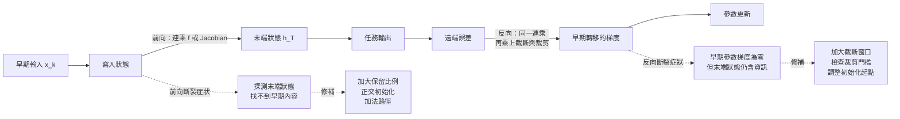

+++
title = "「資訊還在狀態裡」為何不算證據：前向探測與反向梯度的分離"
date = "2026-09-08T19:44:05+08:00"
author = "TTL::0"
draft = false
isCJKLanguage = true
description = "2015 年一項針對遞迴網路架構的大規模比較，得出一個令人意外的結論。研究者用演化搜尋測試了上萬種架構變體，想找出比 LSTM 更好的設計。他們找到了一些，但真正值得注意的發現不在新架構上。"
tags = [
    "分析論述", # term:AnalyticalEssay
    "機器學習", # term:MachineLearning
    "反向傳播", # term:Backpropagation
    "梯度消失", # term:VanishingGradient
    "信用分配", # term:CreditAssignment
    "損失函數", # term:LossFunction
    "梯度下降", # term:GradientDescent
    "脫鉤", # term:Desynchronization
  ]
series = ["訓練訊號與能力證據：當指標變好，你到底知道了什麼"]
[ai_info]
    [ai_info.generation]
        model = "Claude Opus 5"
        agent = "Claude Code VSCode Extension 2.1.261"
    [ai_info.refinement]
        model = "Claude Opus 5"
        agent = "Claude Code VSCode Extension 2.1.263"
+++

<!--more-->

## 導言

2015 年一項針對遞迴網路架構的大規模比較，得出一個令人意外的結論。研究者用演化搜尋測試了上萬種架構變體，想找出比 LSTM 更好的設計。他們找到了一些，但真正值得注意的發現不在新架構上。

他們發現，把 LSTM 的**遺忘門偏置初始化為 1**，就足以把 LSTM 與當時被認為更好的 GRU 之間的差距補平。[Jozefowicz、Zaremba 與 Sutskever，2015](https://proceedings.mlr.press/v37/jozefowicz15.html)

這是一個常數。不是新的門控結構，不是新的連接方式，不是更多參數——一個初始化常數從 0 改成 1。

這件事逼出一個關於**儀表**的問題。在改動之前，如果你去檢查那個模型，你會得到一組看起來很正面的讀數：架構文件說它有長程記憶機制，參數空間裡確實存在能解出任務的解，而如果你從末端狀態去探測早期的輸入內容，你甚至能把它讀出來。三個訊號都說「這個能力在」。

而那個模型學不會。

這篇要處理的就是這個落差：**「資訊還在狀態裡」是一個可以量測、而且量得到的訊號，但它不是能力證據**。它回答的是「內容有沒有被保留」，不回答「遠端誤差能不能教得動早期的轉移」。兩個問題共用同一個數學結構，因此常被當成同一件事；而它們可以各自成立或失敗，最極端的情況下前者滿分而後者精確為零。

換句話說，前向探測是一個會系統性給出樂觀答案的儀表。這篇要說明它為什麼樂觀、樂觀多少，以及該搭配哪個讀數才能得到完整判斷。

## 分析

### 先把數字走一遍

用一個只有一個參數的模型，把整件事算清楚。

模型的狀態更新是

$$
h_t=f\cdot h_{t-1}+x_t,
$$

其中 $f\in(0,1)$ 是保留比例。任務極簡單：第 1 步輸入 1，之後全部輸入 0，要求第 50 步的狀態等於 1。也就是把一個數字原封不動地帶過 49 步。

先確認架構有沒有能力。把遞迴展開：

$$
h_{50}=f^{49}\cdot h_1=f^{49}.
$$

要讓 $h_{50}=1$，只需要 $f=1$。這個解存在、精確、且在參數範圍內。**架構完全有能力解出這個任務。**

現在看 $f$ 取不同值時，第 1 步的輸入還剩多少：

- $f=0.5$：$0.5^{49}\approx 1.78\times10^{-15}$
- $f=0.7311$：$0.7311^{49}\approx 2.16\times10^{-7}$
- $f=0.9526$：$0.9526^{49}\approx 9.25\times10^{-2}$

三個數字跨越十三個數量級。$f=0.5$ 時，原始輸入在雙精度浮點下已經接近可表示的下限。

這三個 $f$ 值不是隨便挑的。在 LSTM 中，遺忘門是 $f=\sigma(b_f+\cdots)$，而 $\sigma(0)=0.5$、$\sigma(1)=0.7311$、$\sigma(3)=0.9526$。上面那三行，就是遺忘門偏置初始化為 0、1、3 時的起點。

### 同一個連乘，兩個不同的問題

關鍵在於 $f^{49}$ 這個連乘同時出現在兩個地方。

**前向**：它決定第 1 步的輸入在第 50 步還剩多少，也就是**資訊是否仍可辨識**。

**反向**：末端誤差對第 $k$ 步狀態的敏感度是

$$
\frac{\partial h_{50}}{\partial h_k}=f^{50-k},
$$

它決定遠端誤差能否**教得動**早期的轉移。

兩者共用同一個連乘，所以在這個最簡模型中它們同進同退。這正是「**梯度消失**（Vanishing Gradient） <!-- term:VanishingGradient -->」與「記憶消失」常被當成同一件事的原因。後面會看到，一旦引入截斷或門控學習，兩者就分開了。

> [!IMPORTANT]
> **梯度消失** <!-- term:VanishingGradient --> (Vanishing Gradient): 梯度沿深度或時間反向傳播時逐層衰減，使早期參數幾乎收不到更新訊號的現象。 <!-- anchor:VanishingGradient -->


先驗證這個共用結構的後果。下面的程式讓偏置 $b$ 成為可訓練參數，用**梯度下降**（Gradient Descent） <!-- term:GradientDescent -->訓練兩萬步，看不同初始化的結局。

> [!IMPORTANT]
> **梯度下降** <!-- term:GradientDescent --> (Gradient Descent): 沿損失函數負梯度方向反覆更新參數的最佳化方法。 <!-- anchor:GradientDescent -->


```python
import math

T = 50
def sigmoid(z): return 1.0 / (1.0 + math.exp(-z))

# 模型：h_t = f*h_{t-1} + x_t，f = sigmoid(b)。x_1 = 1，其後全為 0。
# 任務：h_T = 1。f = 1 可完美解出——架構有這個能力。
def forward(b):  return sigmoid(b) ** (T - 1)
def loss(b):     return (forward(b) - 1.0) ** 2
def grad(b):
    f = sigmoid(b)
    return 2.0 * (f**(T-1) - 1.0) * (T-1) * f**(T-2) * f * (1 - f)

for b0 in (0.0, 1.0, 2.0, 3.0):
    b = b0
    for _ in range(20000):
        b -= 5.0 * grad(b)
    tag = "解出" if loss(b) < 1e-3 else "卡住"
    print("初始 b=%.1f  f=%.4f  前向殘量=%.3e  初始梯度=%.3e  訓練後 f=%.4f  %s"
          % (b0, sigmoid(b0), forward(b0), abs(grad(b0)), sigmoid(b), tag))
```

實際執行輸出：

```text
初始 b=0.0  f=0.5000  前向殘量=1.776e-15  初始梯度=8.704e-14  訓練後 f=0.5000  卡住
初始 b=1.0  f=0.7311  前向殘量=2.156e-07  初始梯度=5.683e-06  訓練後 f=1.0000  解出
初始 b=2.0  f=0.8808  前向殘量=1.990e-03  初始梯度=2.320e-02  訓練後 f=1.0000  解出
初始 b=3.0  f=0.9526  前向殘量=9.248e-02  初始梯度=3.901e-01  訓練後 f=1.0000  解出
```

第一行與第二行之間有一道懸崖。$b=0$ 起步的模型訓練兩萬步後，$f$ 停在 0.5000——一步都沒動。$b=1$ 起步的模型完全解出，$f$ 收斂到 1.0000。

兩者的初始梯度分別是 $8.7\times10^{-14}$ 與 $5.7\times10^{-6}$，相差 **6.5×10⁷ 倍**。第一個數字在任何實際的最佳化器與浮點精度下都等同於零。

這就是那個初始化常數的作用。它沒有給模型任何新能力——$f=1$ 這個解在兩種初始化下都同樣存在、同樣可達。它做的事是**把起點放在梯度不為零的位置**，讓訓練程序有機會走過去。

### 把前向與反向徹底分開

上面的模型中兩條路綁在一起。實務中有一個標準做法會把它們拆開，而它揭示了本篇的核心區分。

長序列訓練時，完整的**反向傳播**（Backpropagation） <!-- term:Backpropagation -->需要保存整段序列的中間狀態，記憶體開銷隨長度線性成長。標準的處理是**截斷反向傳播** <!-- term:Backpropagation -->：只在最近 $W$ 步之內回傳梯度，超過窗口的路徑直接切斷。

> [!IMPORTANT]
> **反向傳播** <!-- term:Backpropagation --> (Backpropagation): 以連鎖律沿計算圖回傳誤差，有效求得各層參數梯度的演算法。 <!-- anchor:Backpropagation -->


前向計算不受影響——狀態照樣一步步傳下去，跨越整個序列。只有梯度被切。

```python
T = 50
def sigmoid(z): return 1.0/(1.0+math.exp(-z))

def forward_residual(b, k):
    """第 k 步的輸入，在第 T 步還剩多少"""
    return sigmoid(b) ** (T - k)

def backward_path(b, k, window=None):
    """末端誤差傳到第 k 步的梯度路徑；截斷後超過窗口者為 0"""
    dist = T - k
    if window is not None and dist > window:
        return 0.0
    return sigmoid(b) ** dist

for b in (1.0, 2.0, 3.0, 5.0):
    print("b=%.1f  f=%.4f  第1步前向殘量=%.3e  完整BPTT=%.3e  截斷(W=20)=%.1f"
          % (b, sigmoid(b), forward_residual(b, 1),
             backward_path(b, 1), backward_path(b, 1, window=20)))
```

實際執行輸出：

```text
b=1.0  f=0.7311  第1步前向殘量=2.156e-07  完整BPTT=2.156e-07  截斷(W=20)=0.0
b=2.0  f=0.8808  第1步前向殘量=1.990e-03  完整BPTT=1.990e-03  截斷(W=20)=0.0
b=3.0  f=0.9526  第1步前向殘量=9.248e-02  完整BPTT=9.248e-02  截斷(W=20)=0.0
b=5.0  f=0.9933  第1步前向殘量=7.196e-01  完整BPTT=7.196e-01  截斷(W=20)=0.0
```

看最後一行。$f=0.9933$ 時，第 1 步的輸入在第 50 步仍保留了 **71.96%**——資訊清清楚楚地在狀態裡，任何前向探測都能找到它。而截斷後的梯度路徑是 **0.0**，精確的零，不是小數。

**資訊在，訊號不在。** 這是兩條獨立的路最乾淨的形態。

把窗口邊界附近逐步列出來，可以看到這道切口的形狀：

```text
  第 50 步  前向殘量 9.248e-02   完整 1.000e+00   截斷 1.000e+00
  第 35 步  前向殘量 1.917e-01   完整 4.825e-01   截斷 4.825e-01
  第 30 步  前向殘量 2.444e-01   完整 3.784e-01   截斷 3.784e-01   <- 窗口邊界
  第 29 步  前向殘量 2.565e-01   完整 3.605e-01   截斷 0.000e+00
  第 20 步  前向殘量 3.973e-01   完整 2.328e-01   截斷 0.000e+00
  第  1 步  前向殘量 1.000e+00   完整 9.248e-02   截斷 0.000e+00
```

第 30 步與第 29 步之間，前向殘量從 0.2444 平順地變成 0.2565——沒有任何異常。同一個位置，截斷梯度從 0.3784 掉到精確的 0。

這道懸崖與遞迴動力完全無關。它是一個實作決策造成的，而且在任何前向診斷中都不可見。

### 兩條路的診斷矩陣

有了這個分離，長程失敗就可以被分成四種情況，而它們需要不同的修補。下圖把兩條路畫成獨立的通道，因為**修補動作取決於是哪一條斷掉**。



圖中兩條虛線指向的診斷可以直接執行，而且區分度很高。**探測末端狀態是否含有早期內容**——用一個小型讀出器從 $h_T$ 預測 $x_k$，看能否成功。**檢查早期參數的梯度範數**——若它是零而狀態探測成功，斷的是反向。

四種組合中，只有「前向通、反向通」才是可訓練的。前向斷而反向通在數學上不會發生（同一個連乘）；但前向通而反向斷非常常見，而且它是最容易被誤診的一種——因為模型看起來「應該學得會」。

### 這個誤判什麼時候其實是對的

上面的論證有幾個明確的失效條件。

**當任務不需要長程資訊時，遺忘是正確行為。** 若**損失函數**（Loss Function） <!-- term:LossFunction -->從不獎勵保存第 1 步的內容，門控學到把它丟掉是最合理的解，不是故障。診斷長程失敗之前，必須先確認目標函數確實要求那個資訊。這個檢查常被跳過，因為「模型應該記住」是一個直覺而非設計。

> [!IMPORTANT]
> **損失函數** <!-- term:LossFunction --> (Loss Function): 把模型輸出與目標之間的差距量化為單一數值的評分函數。 <!-- anchor:LossFunction -->


**當固定窗口基線已經足夠時，長程能力不是瓶頸。** 把同一個任務交給一個只看最近 20 步的簡單模型。若它表現相當，那麼你的長程機制無論通不通都不影響結果，最佳化它是在最佳化一個不在關鍵路徑上的東西。這個基線便宜且經常被忽略。

**當保留所有方向時，穩定梯度不等於選擇性記憶。** 正交或單位譜的遞迴矩陣可以讓連乘不衰減，梯度因此穩定。但這也意味著無關的歷史同樣不衰減，會持續干擾當前狀態。梯度穩定是可訓練性的必要條件，不是良好記憶的充分條件——兩者之間還隔著「模型是否學會選擇性地寫入與讀出」。

## 反思

### 裁剪處理的是另一個方向

連乘可以讓訊號指數衰減，也可以讓它指數增長。後者表現為梯度爆炸，標準處理是梯度裁剪。[Pascanu、Mikolov 與 Bengio，2013](https://proceedings.mlr.press/v28/pascanu13.html)

裁剪的作用範圍需要說清楚。它限制更新的幅度，防止單次更新把參數推到無意義的區域。它**不會**恢復已經衰減到零的方向——把零乘以任何裁剪係數還是零。

實務後果是：看到梯度爆炸就加裁剪，然後發現長程準確率沒有改善，這不是矛盾。裁剪成功地做了它該做的事（防止非有限更新），而消失與**信用分配**（Credit Assignment） <!-- term:CreditAssignment -->的問題原封不動。要區分兩者，需要同時記錄時間距離與梯度範數，而不只是看訓練是否穩定。

> [!IMPORTANT]
> **信用分配** <!-- term:CreditAssignment --> (Credit Assignment): 判定某個結果應歸因於哪些參數或決策步驟的問題。 <!-- anchor:CreditAssignment -->


### 推論時的狀態更新不是學習

一個常見的說法是「RNN 每讀一個 token 就更新一次」。這句話混淆了兩種完全不同的更新。

推論時改變的是**樣本狀態** $h_t$，它隨序列前進，序列結束後被丟棄。共享參數 $W$ 完全不動。

訓練時改變的是**參數**，而且通常在反向傳播 <!-- term:Backpropagation -->與最佳化步驟之後才發生，一個批次一次。

把兩者混為一談會導致一類特定的誤診：上下文資訊在長序列後段遺失時，被解釋成「模型在線上學習中覆寫了早期記憶」。實際上參數一個位元都沒變，遺失發生在狀態的連乘衰減中。修補方向因此完全不同——前者會讓人去改學習率，後者需要改的是保留機制或截斷窗口。

### 門控重塑路徑，不保證內容被使用

遺忘門的貢獻常被描述為「解決了梯度消失 <!-- term:VanishingGradient -->」。更精確的說法是：它把一個**固定的**連乘換成一個**可學習的**連乘。

原始 RNN 中，$\partial h_t/\partial h_{t-1}$ 由權重矩陣與激活的導數決定，模型無法直接控制它。門控結構讓 $\partial c_t/\partial c_{t-1}$ 沿直接路徑約等於 $f_t$，而 $f_t$ 是模型自己算出來的。這開啟了一條可以逼近 1 的加法高速路。

但「可以逼近 1」不等於「會逼近 1」。模型是否把某個門推向 1，取決於損失是否獎勵這個行為，以及訓練程序能否走到那裡。本篇開頭那個初始化常數之所以有效，正是因為它處理的是後者——它不改變獎勵結構，只改變起點。

### 實驗能證明什麼，不能證明什麼

實驗用的是純量遞迴 $h_t=f\,h_{t-1}+x_t$，只有一個可學參數。真實網路的 Jacobian 是矩陣，連乘的行為由奇異值分佈決定而非單一數值；飽和與門控又讓有效 Jacobian 隨狀態改變。

所以實驗證明的是**分離本身**——前向殘量與反向梯度可以**脫鉤**（Desynchronization） <!-- term:Desynchronization -->，而初始化只移動起點、不改變獎勵結構。它不能預測任何真實網路是否走得出去，因為走得出去取決於矩陣連乘的譜性質，那不在這個模型裡。

> [!IMPORTANT]
> **脫鉤** <!-- term:Desynchronization --> (Desynchronization): 中介索引檔與真實檔案系統狀態不再一致的現象，是雙重狀態同步最典型的故障表現。 <!-- anchor:Desynchronization -->


學習率 5.0 與 20000 步是為了讓純量問題在能解出時確實解出而選的，不是關於真實訓練預算的主張。

第三段的三個診斷是程序示意，沒有被執行。

## 實務對比

**錯誤做法**：長程任務表現差，於是換更大的模型。

```text
症狀：延遲 50 步的複製任務準確率 0.31
動作：hidden 128 → 512      準確率 0.33
      LSTM → 雙向 LSTM       準確率 0.35
      加到 4 層               準確率 0.32
```

四次嘗試都沒有觸及問題。若梯度在超過截斷窗口處被切成零，加大模型只是讓同樣被切斷的路徑變寬。

**較可靠的做法**：先分別測兩條路，再決定改什麼。

```python
# 診斷一：前向路通嗎？從末端狀態能否還原早期輸入
probe = LinearProbe(hidden_dim, vocab_size)
train_probe(probe, states=h_T.detach(), targets=x_1)   # 主模型凍結
print("前向探測準確率", probe_accuracy)      # 高 → 資訊還在

# 診斷二：反向路通嗎？早期時間步收到多少梯度
loss.backward()
for k in (1, 10, 25, 40, 50):
    print(f"t={k} 輸入梯度範數", x.grad[:, k].norm().item())

# 診斷三：固定窗口基線
print("只看最近 20 步的基線準確率", window_baseline_acc)
```

三個診斷各自排除一種可能。若探測準確率高而早期梯度為零，斷的是反向，該檢查截斷窗口與裁剪門檻。若探測準確率也低，斷的是前向，該檢查保留比例與初始化。若固定窗口基線就已經達到目標，長程機制根本不在關鍵路徑上。

**另一個錯誤做法**：只報告混合長度的平均準確率。

```text
複製任務準確率：0.82
```

這個數字把短序列與長序列混在一起。若資料中八成是短序列，長程完全失效也只會讓平均掉到 0.82。

**較可靠的做法**：把時間距離當成獨立變因，分層報告。

```text
延遲   準確率   ‖∂h_T/∂h_1‖   截斷窗口內
  5     0.99      3.1e-01        是
 10     0.98      2.6e-01        是
 20     0.96      1.9e-01        是
 30     0.51      0.0e+00        否   <- 準確率與梯度同時斷在這裡
 50     0.48      0.0e+00        否
```

這張表把成因與症狀放在同一列。準確率的崖點與梯度歸零的位置重合，而且恰好落在截斷窗口的邊界上——這三個事實一起出現時，診斷不再需要猜測。

## 結論

「資訊還在狀態裡」是一個真實的、可量測的訊號，而它不是能力證據。它回答「內容有沒有被保留」，不回答「遠端誤差能不能教得動早期的轉移」。

這個儀表之所以樂觀，是因為它只觀察兩條路中的一條。前向路由保留比例與動力決定；反向路除了共用同一個連乘，還額外受截斷窗口、梯度裁剪與初始化起點影響。量測顯示這道落差可以大到極端：保留比例 0.9933 時，第一步的輸入在第五十步仍保有 71.96%，而窗口二十步的截斷讓同一位置的梯度精確等於零。探測滿分，訊號歸零。

它也解釋了為什麼一個初始化常數能造成數量級的差異。架構的能力與訓練的可達性是兩件事：所需的解可以完整存在於參數空間中，而梯度在起點附近小到讓訓練程序永遠走不過去——量到的放大倍數是 6.5×10⁷。

因此，長程能力的判斷需要兩個讀數並列：從末端狀態探測早期內容是否可還原，以及早期參數是否收到不為零的梯度。只有前者時，你手上的是一個系統性偏樂觀的估計；而只看一個末端準確率時，保存失敗、訓練失敗與目標根本沒有要求保存，這三種情況會給出完全相同的數字。