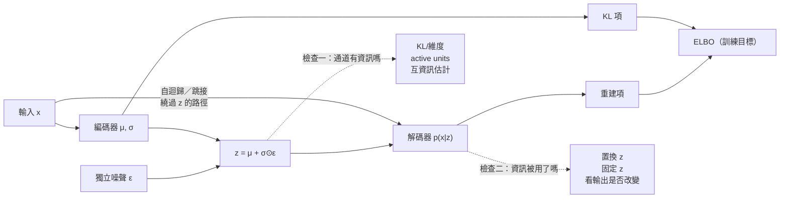

+++
title = "KL 為何在強解碼器下失去意義：潛在通道的使用率量測"
date = "2026-09-08T20:11:07+08:00"
author = "TTL::0"
draft = false
isCJKLanguage = true
description = "2015 年，一組研究者把變分自動編碼器套用到文字上。動機很清楚：他們想要一個連續的句子空間，可以在其中插值、可以從先驗取樣生成新句子、可以把「語氣」或「主題」這類屬性對應到座標軸上。"
tags = [
    "分析論述", # term:AnalyticalEssay
    "機器學習", # term:MachineLearning
    "證據下界", # term:EvidenceLowerBound
    "後驗坍縮", # term:PosteriorCollapse
    "變分自動編碼器", # term:VariationalAutoencoder
    "互資訊", # term:MutualInformation
    "重參數化技巧", # term:ReparameterizationTrick
  ]
series = ["訓練訊號與能力證據：當指標變好，你到底知道了什麼"]
[ai_info]
    [ai_info.generation]
        model = "Claude Opus 5"
        agent = "Claude Code VSCode Extension 2.1.261"
    [ai_info.refinement]
        model = "Claude Opus 5"
        agent = "Claude Code VSCode Extension 2.1.263"
+++

<!--more-->

## 導言

2015 年，一組研究者把**變分自動編碼器**（Variational Autoencoder） <!-- term:VariationalAutoencoder -->套用到文字上。動機很清楚：他們想要一個連續的句子空間，可以在其中插值、可以從先驗取樣生成新句子、可以把「語氣」或「主題」這類屬性對應到座標軸上。

> [!IMPORTANT]
> **變分自動編碼器** <!-- term:VariationalAutoencoder --> (Variational Autoencoder): 學習潛在變數的條件分佈，並以證據下界同時訓練編碼器與解碼器的生成模型。 <!-- anchor:VariationalAutoencoder -->


訓練過程一切正常。目標函數穩定下降，生成的句子文法通順，看起來完全成功。

然後他們檢查了目標函數裡的**KL 項**——那個負責讓編碼器輸出接近先驗的部分。它降到接近零。

接近零意味著編碼器對每一個輸入句子，都輸出幾乎相同的分佈：標準常態。潛在變數完全不區分句子。解碼器沒有從潛在變數得到任何資訊，它退化成一個普通的語言模型，靠自己的自迴歸能力把句子寫出來。[Bowman 等人，《Generating Sentences from a Continuous Space》](https://arxiv.org/abs/1511.06349)

整個模型的設計目的——那個連續的句子空間——完全沒有實現。

這裡有一個容易被忽略的轉折。**低 KL 這個讀數，在正常情況下是好消息。** KL 項的職責就是讓近似後驗貼近先驗，貼得越近、從先驗取樣生成的樣本就越可靠。一個訓練得好的 VAE，KL 本來就該降下來。所以看到它變小的第一反應是「正則化生效了」，而這個反應在許多情況下正確。

問題是它在另一種情況下也會變小，而兩種情況的讀數長得一樣。

這篇要處理的就是這個儀表失效：**KL 是一個在強解碼器下失去鑑別力的讀數**。同一個接近零的數字，可能代表「通道不需要，正確地閒置」，也可能代表「通道被繞過，設計目的落空」。要分辨它們，KL 自己不夠——需要另一個獨立的量測。而更麻煩的是，讓 KL 失去意義的那個因素，正是工程上通常被視為改進的東西。

## 分析

### 先把數字走一遍

先算清楚 KL 項在什麼時候等於零，因為那個零點是整件事的樞紐。

編碼器對每個輸入 $x$ 輸出一個高斯分佈 $q(z\mid x)=\mathcal{N}(\mu,\sigma^2)$，而先驗固定為 $p(z)=\mathcal{N}(0,1)$。兩個一維高斯之間的 KL 散度有閉式解：

$$
D_{\mathrm{KL}}\big(\mathcal{N}(\mu,\sigma^2)\,\|\,\mathcal{N}(0,1)\big)
=\tfrac{1}{2}\left(\mu^2+\sigma^2-\log\sigma^2-1\right).
$$

代幾組數字進去：

```python
import math
def kl(mu, var):
    return 0.5 * (mu*mu + var - math.log(var) - 1.0)

for mu, var in ((0.0,1.0), (1.0,1.0), (0.0,0.25), (0.0,4.0), (2.0,0.5)):
    print("mu=%4.1f var=%4.2f -> KL = %.4f" % (mu, var, kl(mu, var)))
```

實際執行輸出：

```text
mu= 0.0 var=1.00 -> KL = 0.0000
mu= 1.0 var=1.00 -> KL = 0.5000
mu= 0.0 var=0.25 -> KL = 0.3181
mu= 0.0 var=4.00 -> KL = 0.8069
mu= 2.0 var=0.50 -> KL = 2.0966
```

第一行是關鍵。當 $\mu=0$ 且 $\sigma^2=1$ 時，KL 恰好是零，**而且這是唯一的零點**。

現在把這件事的含義說清楚。KL 是一個成本，訓練會壓低它。壓到最低的方式是讓 $q(z\mid x)$ 對**每一個** $x$ 都輸出 $\mathcal{N}(0,1)$。但那樣一來，$z$ 就與 $x$ 完全無關了——不同的輸入產生相同的分佈，潛在變數不攜帶任何輸入資訊。

換句話說：**KL 項的全域最小值，恰好是潛在通道完全無用的那個點。**

這不是設計瑕疵。KL 項的職責就是讓後驗可以被先驗取樣，而「等於先驗」當然最容易取樣。問題在於，這個職責與另一個職責衝突，而衝突的結果取決於一些不明顯的因素。

### 目標函數裡的兩股力量

完整的目標是**證據下界**（Evidence Lower Bound） <!-- term:EvidenceLowerBound -->。它來自對數邊際似然的一個分解：

> [!IMPORTANT]
> **證據下界** <!-- term:EvidenceLowerBound --> (Evidence Lower Bound): 對數邊際似然的可最佳化下界，由重建項與 KL 正則項組成。 <!-- anchor:EvidenceLowerBound -->


$$
\log p_\theta(x)=
\underbrace{\mathbb{E}_{q_\phi(z\mid x)}\big[\log p_\theta(x\mid z)\big]
-D_{\mathrm{KL}}\big(q_\phi(z\mid x)\,\|\,p(z)\big)}_{\mathcal{L}_{\mathrm{ELBO}}(x)}
+\;D_{\mathrm{KL}}\big(q_\phi(z\mid x)\,\|\,p_\theta(z\mid x)\big).
$$

最後一項是近似後驗與真實後驗的距離，它非負，所以 $\mathcal{L}_{\mathrm{ELBO}}$ 確實是 $\log p_\theta(x)$ 的下界。[Kingma 與 Welling，2014](https://arxiv.org/abs/1312.6114)

> [!IMPORTANT]
> **證據下界**（Evidence Lower Bound）：對數邊際似然的可最佳化下界，由重建項與 KL 正則項組成。最大化它是 VAE 的訓練目標。

兩項的作用方向相反：

- **重建項** $\mathbb{E}_q[\log p_\theta(x\mid z)]$ 希望 $z$ 攜帶足夠資訊，讓解碼器能還原 $x$。
- **KL 項** 希望 $q(z\mid x)$ 貼近先驗，也就是希望 $z$ **不要**攜帶輸入資訊。

看起來像一場拉鋸，兩邊各有立場，應該會停在中間某處。但這個直覺漏掉了一個關鍵變數。

### 為什麼強解碼器會讓拉鋸變成單邊倒

重建項希望 $z$ 攜帶資訊——**前提是解碼器需要那些資訊**。

若解碼器本身就有能力建模資料的邊際分佈，那麼它不需要 $z$ 也能把重建項做得不錯。文字的自迴歸解碼器正是這種情況：它可以根據前面已生成的詞預測下一個詞，這件事完全不需要 $z$。

這時候拉鋸就消失了。攜帶資訊要付 KL 成本，而不攜帶資訊在重建上損失有限——最佳解就是不攜帶。

把這個機制寫成可以求解的形式。設解碼器自己能解釋資料變異的比例為 $c$，剩下的 $(1-c)$ 需要靠潛在通道。設 $a$ 為潛在通道實際攜帶的增益（$a=1$ 表示完整傳遞，$a=0$ 表示通道空置）。則

$$
\text{重建損失}=(1-c)(1-a)^2,
\qquad
\text{KL 成本}=\beta\,a^2 .
$$

對 $a$ 求極小，得到

$$
a^*=\frac{1-c}{(1-c)+\beta}.
$$

這個式子把兩個因素同時放進來。下面的程式把它列成表。

```python
print("%-24s %s" % ("", "  ".join("beta=%-6.2f" % b for b in (0.0, 0.1, 1.0, 4.0))))
for c in (0.0, 0.5, 0.9, 0.99, 0.999):
    row = ["%-11.4f" % ((1-c)/((1-c)+beta) if (1-c)+beta > 0 else 1.0)
           for beta in (0.0, 0.1, 1.0, 4.0)]
    print("解碼器自解釋 c=%-7.3f %s" % (c, " ".join(row)))
```

實際執行輸出：

```text
                         beta=0.00    beta=0.10    beta=1.00    beta=4.00
解碼器自解釋 c=0.000   1.0000      0.9091      0.5000      0.2000
解碼器自解釋 c=0.500   1.0000      0.8333      0.3333      0.1111
解碼器自解釋 c=0.900   1.0000      0.5000      0.0909      0.0244
解碼器自解釋 c=0.990   1.0000      0.0909      0.0099      0.0025
解碼器自解釋 c=0.999   1.0000      0.0099      0.0010      0.0002
```

沿著 `beta=1.00` 那一欄由上往下讀。這一欄的 $\beta$ 從頭到尾都是 1.0——這是標準 VAE，沒有任何加權調整。潛在增益卻從 0.5000 一路掉到 **0.0010**。

**唯一改變的是解碼器變強。**

這個結果推翻一個常見的誤解：**後驗坍縮**（Posterior Collapse） <!-- term:PosteriorCollapse -->不是 KL 權重設定失誤，也不是最佳化沒收斂。在 $\beta=1$ 的標準設定下，只要解碼器夠強，**通道空置就是這個目標函數的最佳解**。模型沒有做錯任何事，它精確地最佳化了你寫下的東西。

> [!IMPORTANT]
> **後驗坍縮** <!-- term:PosteriorCollapse --> (Posterior Collapse): 近似後驗退化為先驗、潛在變數不再攜帶輸入資訊的失效現象。 <!-- anchor:PosteriorCollapse -->


這與實測分析的方向一致：強 likelihood 模型下的潛在變數坍縮，與生成端能否繞過 $z$ 直接相關。[Dieng 等人，2019](https://proceedings.mlr.press/v89/dieng19a.html) 但成因不只一種——局部最優與資料本身的結構也會參與，把坍縮全部歸給解碼器強度是另一種過度簡化。[Dai、Wang 與 Wipf，2020](https://proceedings.mlr.press/v119/dai20c.html)

### 重參數化解決的是別的問題

談到這裡，需要澄清一個常被誤放在同一格的東西。

訓練 VAE 需要對 $\mathbb{E}_{q_\phi(z\mid x)}[\cdot]$ 求關於 $\phi$ 的梯度，而 $\phi$ 決定了抽樣分佈本身。直接寫 $z\sim q_\phi$ 會讓路徑導數無法穿過抽樣操作。**重參數化技巧**（Reparameterization Trick） <!-- term:ReparameterizationTrick -->把它改寫成

> [!IMPORTANT]
> **重參數化技巧** <!-- term:ReparameterizationTrick --> (Reparameterization Trick): 把隨機取樣改寫成可微分變換與獨立噪聲，使梯度能穿過取樣節點。 <!-- anchor:ReparameterizationTrick -->


$$
z=\mu_\phi(x)+\sigma_\phi(x)\odot\epsilon,\qquad \epsilon\sim\mathcal{N}(0,I),
$$

隨機性被隔離到與 $\phi$ 無關的 $\epsilon$ 裡，於是可以對 $\mu_\phi$ 與 $\sigma_\phi$ 求導。

下面的程式驗證這件事，並對照「先抽樣再當成常數」的做法。

```python
mu, S = 1.5, 200000
eps = [rng.gauss(0,1) for _ in range(S)]

g_reparam  = sum(2.0*(mu+e) for e in eps)/S      # z = mu + eps，dz²/dmu = 2z
g_detached = 0.0                                  # z 抽出後視為常數
h = 1e-4
f = lambda m: sum((m+e)**2 for e in eps)/S
g_fd = (f(mu+h)-f(mu-h))/(2*h)                    # 有限差分求真值
```

實際執行輸出：

```text
目標 E[z^2]，z ~ N(mu, 1)。解析導數 d/dmu = 2*mu
  真值(有限差分)      3.006595
  重參數化估計        3.006595
  抽樣後當常數        0.000000
```

重參數化的估計與真值吻合到小數點後六位；把抽樣結果當成常數則得到恆為零的梯度，連反向都無從開始。

這個對比說明了重參數化的作用範圍：它讓**梯度可以穿過抽樣**。它與 KL 和重建之間的張力**完全無關**。前一節那張表裡的每一個數字，都是在重參數化正常運作的前提下算出來的。

把兩者混為一談會導致一類特定的誤診：以為換個抽樣寫法、換個梯度估計器就能避免坍縮。可微性與通道使用率是兩個獨立的命題。

### 兩條必須分開的檢查

上面的分析可以整理成一張診斷圖。畫成圖是因為關鍵在於**哪些檢查彼此不能替代**，而這是一個結構性質。



圖中那條「繞過 z 的路徑」是全篇的核心。它的存在讓重建項失去了強迫 $z$ 攜帶資訊的力量。

兩條虛線是兩個不可互換的檢查。**檢查一**問編碼器有沒有把資訊放進去，可用 KL、活躍單元數或**互資訊**（Mutual Information） <!-- term:MutualInformation -->估計來量；**檢查二**問解碼器有沒有把資訊拿出來。兩者可以不一致：$z$ 可能攜帶資訊（KL 不為零）但解碼器根本不理它，此時只看 KL 會給出過度樂觀的結論。

> [!IMPORTANT]
> **互資訊** <!-- term:MutualInformation --> (Mutual Information): 兩個隨機變數之間共享的資訊量，用來量化潛在變數是否攜帶輸入資訊。 <!-- anchor:MutualInformation -->


ELBO 這個總值兩個問題都回答不了。它是一個純量，把重建、KL 與通道使用率壓在一起。

### 這個誤判什麼時候其實是對的

低 KL 不總是故障，而區分兩種情況是實務上最重要的判斷。

**部分維度閒置是合理的自動容量選擇。** 若你給了 64 個潛在維度，而資料的內在結構只需要 8 個，那麼其餘 56 個回到先驗是正確行為——保留它們只會付出 KL 成本而換不到重建收益。這種情況下該量的不是總 KL，而是**活躍單元**（Active Units）數：逐維度計算 $\mathrm{Var}_x(\mu_j(x))$，超過門檻的算活躍。8 個活躍、56 個閒置是健康的；0 個活躍才是坍縮。

**當你只需要條件生成、不需要可用表示時，坍縮的代價可能為零。** 若下游只要求「生成通順的句子」，而不需要用 $z$ 做控制、聚類或插值，那麼一個退化成語言模型的 VAE 在功能上沒有損失。它只是一個名字取錯的語言模型。判斷坍縮是否有害，取決於**下游契約是否依賴 $z$**，不取決於架構圖上有沒有畫潛在變數。

**當解碼器本來就弱時，這整套顧慮不適用。** 若解碼器是一個小型的前饋網路，無法自行建模資料分佈，$c$ 就很小，前面那張表的第一列告訴你潛在增益會保持在合理範圍。坍縮是強解碼器特有的問題。

## 反思

### 連續不保證語意連續

即使潛在通道被充分使用，另一個常見的期待仍然沒有保證：在潛在空間中做線性插值，會得到語意上平滑的過渡。

解碼器只在訓練時實際遇到的區域受到約束——也就是聚合後驗 $\int q(z\mid x)p(x)\,dx$ 與先驗 $p(z)$ 共同覆蓋的地方。兩個點之間的直線可能穿過這兩者都很少覆蓋的低密度區。在那裡，解碼器的行為沒有被任何訓練訊號規範，輸出可以任意。

實務後果是：插值動畫看起來平滑，不能證明潛在空間有良好結構。它只證明了那條特定路徑上的解碼器輸出恰好連續。要支持更強的主張，需要量測聚合後驗與先驗的重疊程度，以及在多條隨機路徑上的樣本品質。

### ELBO 變好不等於三件事都變好

一個更廣的邊界：ELBO 是單一數字，而人們通常關心三個不同的東西——樣本品質、密度估計的準確度、表示的可用性。

這三者可以分岔。提高解碼器容量通常改善 ELBO 與樣本品質，卻可能同時摧毀表示可用性（就是前面那張表）。降低 $\beta$ 會改善重建與表示資訊量，卻可能讓聚合後驗偏離先驗，使得從先驗取樣的品質變差。

因此，用 ELBO 做模型選擇時，實際上是在用一個不知道權重的加權平均做選擇。若你在乎的是其中特定一項，應該直接量那一項。

### 提高重建權重可能讓事情更糟

一個直覺的修補是：既然重建不夠好、KL 太低，那就提高重建的權重（等價於降低 $\beta$）。

從那張表看，這確實有效——沿著 `c=0.9` 那一列往左走，$a^*$ 從 0.0244 升到 0.5000。但這個修補假設了成因是 $\beta$ 太大。

若真正的成因是解碼器可以繞過 $z$，降低 $\beta$ 只是讓潛在通道在一場它本來就不需要參與的競爭中稍微佔便宜。而且降低 $\beta$ 會同時讓後驗遠離先驗，使得從先驗取樣的生成品質下降——你修好了一個指標，弄壞了另一個。

針對性的修補應該對準機制：限制解碼器的容量、加入從 $z$ 到輸出的跳接讓 $z$ 更難被繞過、或使用 free bits 為每個維度保留一個不受懲罰的 KL 額度。這些動作各自對應不同的成因假設，而選擇哪一個需要先做診斷。

### 實驗能證明什麼，不能證明什麼

第二個實驗那張表是一個閉式解：把「解碼器自解釋程度 $c$」與 $\beta$ 代入 $(1-c)/((1-c)+\beta)$，得到潛在通道的使用率 $a^{*}$。它是一個**兩參數的靜態模型**，不是訓練動態的模擬。真實訓練裡 $c$ 不是超參數而是隨解碼器學習而變的量，$\beta$ 的退火也讓兩者互相影響。因此這張表證明的是「同一個低 KL 可以由兩個不同成因產生」，不是任何真實模型會落在哪一格。

第一個實驗只是把 KL 的封閉式代入幾組 $(\mu,\mathrm{var})$，用途是顯示 KL 趨零對應後驗塌回先驗。它不涉及任何模型。

第三個實驗比較重參數化梯度與有限差分，$S=200000$ 個樣本、$\mu=1.5$、$h=10^{-4}$。它證明的是抽樣後把 $z$ 當常數會讓梯度少掉一項，這是代數事實；有限差分的數值精度受 $h$ 影響，表上的一致程度是這組參數下的。

第四與第五段程式是診斷程序的示意，需要訓練好的模型，在此不產生數字。

## 實務對比

**錯誤做法**：挑幾個重建良好的樣本，宣稱潛在空間可用。

```python
for x in test_batch[:8]:
    z = encoder(x).mean           # 從後驗取，不是從先驗
    show(decoder(z))              # 看起來很像 x，於是宣稱成功
```

這段程式碼測的是**自動編碼**，不是**生成**。重建使用的 $z$ 來自 $q(z\mid x)$ 附近，而真正的生成必須從 $p(z)$ 取樣。若聚合後驗與先驗差距很大，這兩個區域幾乎不重疊，重建良好完全不蘊涵生成良好。

而且這段程式碼即使在完全坍縮的模型上也會通過——若解碼器是自迴歸的，重建時它可以看到 $x$ 的前綴。

**較可靠的做法**：三種取樣方式並列，並加上一個會失敗的干預測試。

```python
# 1) 重建：z 來自後驗
recon = [decoder(encoder(x).mean) for x in test_batch]

# 2) 生成：z 來自先驗
prior_samples = [decoder(sample_prior()) for _ in range(n)]

# 3) 干預：同一個 x，換掉 z，輸出應該要改變
x = test_batch[0]
z_own   = encoder(x).mean
z_other = encoder(test_batch[1]).mean
delta = distance(decoder(z_own), decoder(z_other))

assert delta > threshold, f"置換 z 後輸出幾乎不變（delta={delta:.4f}），潛在通道未被使用"
```

第三項是關鍵，因為它**可以失敗**。若把 $z$ 換成另一個輸入的編碼，而解碼器的輸出幾乎不變，那就直接證明了解碼器沒有在使用 $z$——不論 KL 是多少。

**另一個錯誤做法**：只報告 ELBO 一個數字。

```text
測試集 ELBO: -89.3
```

**較可靠的做法**：拆開報告，讓兩條檢查各自可見。

```text
ELBO              -89.3
  重建項          -87.9
  KL 項             1.4      <- 幾乎為零
KL / 維度          0.022     （64 維）
活躍單元數         2 / 64    <- 只有 2 個維度在用
z 置換後輸出差異   0.008     <- 幾乎不變，通道確實沒被使用
先驗樣本品質       （另附）
```

這五行講的是同一個模型，但它們回答不同的問題。KL 幾乎為零告訴你編碼器沒放進去；活躍單元數 2/64 告訴你不是「部分維度閒置」而是接近全面坍縮；置換測試告訴你解碼器也確實沒在讀。三個證據一致時，診斷才成立。

## 結論

低 KL 是一個雙義讀數。它可以代表「後驗貼近先驗，正則化生效」，也可以代表「通道被繞過，設計目的落空」，而兩種情況在這個數字上長得一樣。

讓它失去鑑別力的因素，正是工程上通常被當成改進的東西。量測顯示，在標準的 $\beta=1$ 設定下——沒有任何加權調整——只要解碼器的自解釋能力從 0 升到 0.999，潛在增益就從 0.5 掉到 0.001。換一個更強的解碼器，是每個團隊都會做的事；而它會把 KL 這個儀表悄悄調成無用。

要強調的是，此時模型並沒有做錯。零資訊通道就是這個目標函數在強解碼器下的最優解——最佳化沒有失敗，它精確地找到了你寫下的東西的最優解。這使得問題無法靠「訓練久一點」或「換個抽樣寫法」解決。

因此，「潛在變數被使用」需要兩條不可互換的讀數並列：KL 與活躍單元數說明編碼器是否放進資訊，對 $z$ 的置換或固定測試說明解碼器是否讀取它。前者可以在完全坍縮時看起來正常，後者則會直接失敗——而 ELBO 這個把三者壓在一起的單一數字，一個都不回答。