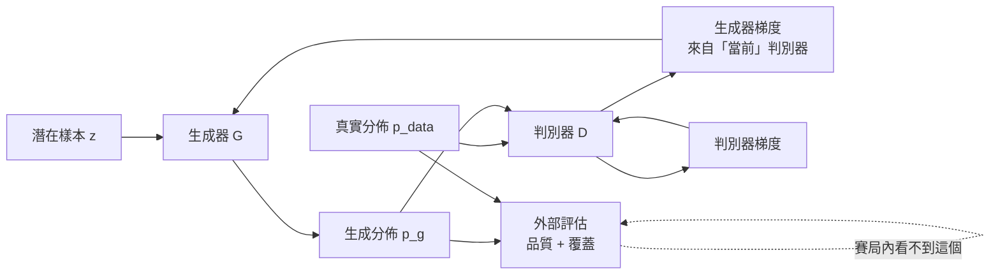

+++
title = "品質分數為何看不見缺模式：生成評估的二維前緣"
date = "2026-09-08T20:24:08+08:00"
author = "TTL::0"
draft = false
isCJKLanguage = true
description = "有好幾年時間，生成影像模型的主要評分標準是一個叫做 Inception Score 的數字。它的計算方式是把生成的影像送進一個預訓練分類器，然後獎勵兩件事：每張圖被分得很有把握，以及不同的圖被分到不同類別。[Salimans 等人，2016](https://arxiv.org/abs/1606.03498)"
tags = [
    "分析論述", # term:AnalyticalEssay
    "機器學習", # term:MachineLearning
    "模式坍縮", # term:ModeCollapse
    "分佈覆蓋", # term:DistributionCoverage
  ]
series = ["訓練訊號與能力證據：當指標變好，你到底知道了什麼"]
[ai_info]
    [ai_info.generation]
        model = "Claude Opus 5"
        agent = "Claude Code VSCode Extension 2.1.261"
    [ai_info.refinement]
        model = "Claude Opus 5"
        agent = "Claude Code VSCode Extension 2.1.263"
+++

<!--more-->

## 導言

有好幾年時間，生成影像模型的主要評分標準是一個叫做 Inception Score 的數字。它的計算方式是把生成的影像送進一個預訓練分類器，然後獎勵兩件事：每張圖被分得很有把握，以及不同的圖被分到不同類別。[Salimans 等人，2016](https://arxiv.org/abs/1606.03498)

後來有人指出一個問題。這個分數的計算過程中，**從頭到尾沒有用到任何真實資料**。它只看生成樣本經過分類器之後的機率分佈。

這造成一個具體的後果：一個生成器如果只記住每個類別的一張完美影像，然後反覆輸出那一千張圖，它的分數會非常高。每張圖分得極有把握，一千個類別都覆蓋到了。而它實際上什麼分佈都沒學到。[Barratt 與 Sharma，《A Note on the Inception Score》](https://arxiv.org/abs/1801.01973)

這個案例的價值在於它暴露了一個結構性問題，而不只是某個指標設計不良。當你把「模型學會了資料分佈」這件事壓縮成**一個數字**時，你必然要在多個互相衝突的面向之間選擇權重——而任何固定的權重都會讓某一類失效變得不可見。

這篇處理的就是這個壓縮，而要處理的形式比「兩個面向要兼顧」更強。

品質類指標對缺模式的不敏感，不是「靈敏度不足」這種程度問題。它是**結構性的盲區**：這類指標問的是「生成出來的東西像不像真的」，而一個把分佈砍掉八分之七、只保留其中一塊的生成器，在剩下那一塊上完全可以做到極像。它答對了被問的問題。

後面的量測會顯示這個盲區有多徹底——一個只生成八分之一分佈的模型，在品質指標上不是「稍差」，而是**與真實資料無法區分，甚至略優**。當一個儀表對某類失效的讀數與完全正常的讀數相同時，再怎麼細看它都不會發現問題。你需要的是第二個軸。

## 分析

### 先把數字走一遍

用一個能完全掌握真相的設定，把問題量出來。

真實分佈是八個等權的二維高斯，中心排在半徑 2 的圓上，標準差 0.12。因為是我們自己造的，所以我們**確知**正確答案長什麼樣。

現在造四種生成器：

- **完全坍縮**：只生成第 1 個模式，品質很高。
- **部分坍縮**：只生成前 3 個模式。
- **過度分散**：八個模式都覆蓋，但標準差放大四倍。
- **良好**：與真實分佈相同。

然後用兩類指標評估。**品質類**問「生成的樣本有多像真的」，這裡用「到最近真實模式中心的平均距離」。**覆蓋類**問「真實分佈有多少被觸及」，這裡用觸及的模式數，以及 precision 與 recall。

precision 與 recall 的定義借自流形估計的做法：precision 是生成樣本落在真實樣本鄰域內的比例（衡量品質），recall 是真實樣本落在生成樣本鄰域內的比例（衡量覆蓋）。[Kynkäänniemi 等人，2019](https://arxiv.org/abs/1904.06991)

```python
def report(name, samples, real):
    R = 0.35                                  # 流形半徑
    prec = sum(1 for s in samples if any(dist(s, r) < R for r in real[:600])) / len(samples)
    rec  = sum(1 for r in real[:600] if any(dist(r, s) < R for s in samples[:600])) / 600
    hits = {i for i in (mode_hit(s) for s in samples) if i is not None}
    print("%-14s %-14.4f %-12d %-12.3f %-10.3f" %
          (name, sum(nearest_mode_dist(s) for s in samples)/len(samples),
           len(hits), prec, rec))
```

實際執行輸出：

```text
生成器            最近模式距離         觸及模式數        precision    recall
               (越小越像真)        (滿分 8)       (品質)         (覆蓋)
真實資料           0.1521         8            1.000        1.000
完全坍縮           0.1517         1            1.000        0.137
部分坍縮           0.1501         3            1.000        0.407
過度分散           0.5679         8            0.600        1.000
良好             0.1492         8            1.000        1.000
```

請仔細比較第一列與第二列。

**真實資料的最近模式距離是 0.1521，完全坍縮的生成器是 0.1517——更小。** 它的 precision 也是 1.000，與真實資料相同。

也就是說，用品質類指標評估時，**一個只會生成八分之一分佈的模型，看起來比真實資料本身還好**。這不是巧合或調參，這是品質指標的定義決定的：它只問生成的東西像不像真，不問真的東西有沒有被生成。

失效只在右邊兩欄現形。觸及模式數 1/8，recall 0.137。

第四列則展示了相反方向的失敗。過度分散的生成器覆蓋了全部八個模式，recall 滿分，但 precision 掉到 0.600——它生成了大量落在真實分佈之外的樣本。

**兩種失效模式在單一軸上無法區分。** 你必須至少有兩個軸。

### 為什麼會坍縮：目標的理想與訓練的實際

理想情況下這不該發生。原始的極小極大目標是

$$
\min_G\max_D V(D,G)=
\mathbb{E}_{x\sim p_{\text{data}}}\big[\log D(x)\big]
+\mathbb{E}_{z\sim p(z)}\big[\log\big(1-D(G(z))\big)\big].
$$

固定生成器並允許判別器逐點最佳化時，最優判別器有閉式解：

$$
D^*(x)=\frac{p_{\text{data}}(x)}{p_{\text{data}}(x)+p_g(x)}.
$$

把它代回目標，可以連到 Jensen–Shannon 散度，而理想平衡點確實要求 $p_g=p_{\text{data}}$，此時 $D^*\equiv 1/2$。[Goodfellow 等人，2014](https://arxiv.org/abs/1406.2661)

證明沒有問題。問題在於它的前提：**判別器必須是最優的**。

實際訓練不會在每一步都求出 $D^*$。判別器與生成器交替更新各若干步，任一方看到的損失曲面都隨對方移動。這使得「生成器的損失下降了」這個觀察失去它在固定目標下的通常意義。

### 凍結的生成器，上升的損失

上一段是機制主張，可以直接驗證。下面的程式建立一個**完全凍結**的生成器——只覆蓋雙峰資料的右峰，一個參數都不改——然後只訓練判別器，觀察生成器自己的損失。

```python
# 真實資料：雙峰。生成器：只覆蓋右峰，全程凍結
real = [rng.gauss(-3,.3) for _ in range(800)] + [rng.gauss(3,.3) for _ in range(800)]
fake = [rng.gauss(3,.3) for _ in range(1600)]

def gen_loss():
    """生成器的損失。生成器不變，只有判別器在變"""
    return -sum(math.log(max(1e-12, fwd(x)[0])) for x in fake)/len(fake)

for target in (0, 20, 100, 400, 1500):
    while steps < target:
        d_step(); steps += 1
    print("判別器更新 %d 步後，生成器損失 %.4f" % (steps, gen_loss()))
```

實際執行輸出：

```text
生成器全程凍結（一個參數都沒改）。以下是它自己的損失：

判別器更新步數          生成器損失            生成器改變了嗎
0                0.6787           沒有
20               0.6907           沒有
100              0.6949           沒有
400              1.0889           沒有
1500             1.0986           沒有
```

生成器的損失上升了 62%。生成器完全沒有改變——它生成的樣本、它的分佈、它的參數，全部相同。

這是**非定態目標**的直接證據。它有一個立即的實務後果：單看生成器的損失曲線，無法區分「生成品質變差」與「判別器變強」。同一個數值可以對應完全不同的分佈差距，取決於當時判別器處於什麼狀態。

這也解釋了為什麼判別器與生成器的更新次數比必須被當成控制變因記錄，而不是一個隨手設定的雜項。

### 坍縮的因果鏈

有了上面兩件事，就可以把坍縮的形成過程寫出來。下圖畫的是資訊與梯度的流向，因為關鍵在於**唯一能看見整體分佈的地方在賽局之外**。



圖的重點是右下角那條分支。判別器與生成器之間的迴圈只交換**當前的相對狀態**——判別器說「這批樣本比較可疑」，生成器就往那個方向調整。整體分佈是否被覆蓋，這個問題在迴圈內部從未被直接提出。

坍縮的因果鏈因此是：當前判別器在某個模式附近提供了容易利用的梯度；生成器把多個潛在輸入映到該區域；那裡的局部品質改善；判別器轉向新的弱點；而被遺漏的模式若不提供足夠梯度，生成器的映射不會自行展開回去。

失效點是把「當前判別器騙過去了」當成「整體**分佈覆蓋**（Distribution Coverage） <!-- term:DistributionCoverage -->了」。前面那張表顯示，這兩件事在品質指標上完全無法區分。

> [!IMPORTANT]
> **分佈覆蓋** <!-- term:DistributionCoverage --> (Distribution Coverage): 生成分佈涵蓋目標分佈中各個模式的程度，與單一樣本的品質是不同的觀察量。 <!-- anchor:DistributionCoverage -->


### 梯度都正確，動力仍可能發散

還有一個更基本的層次值得指出，因為它說明問題不只出在神經網路的複雜性上。

考慮一個沒有任何網路的最小賽局：$\min_x\max_y\; xy$。唯一的平衡點是原點。雙方同時沿各自正確的梯度更新：

$$
x_{t+1}=x_t-\eta y_t,\qquad y_{t+1}=y_t+\eta x_t.
$$

代入計算新的半徑平方：

$$
x_{t+1}^2+y_{t+1}^2=(1+\eta^2)(x_t^2+y_t^2).
$$

半徑**單調增加**。兩方各自沿正確方向走，聯合軌跡卻螺旋遠離平衡點。

```text
eta      50 步後 |x,y|  200 步後       理論每步半徑倍率
0.01     1.0025       1.0100       1.000050
0.05     1.0644       1.2836       1.001249
0.10     1.2824       2.7048       1.004988
```

實測與理論的 $(1+\eta^2)^{t/2}$ 逐行吻合。這個反例的意義是：**「雙方各自的梯度都正確」不蘊涵「聯合動力會收斂」**。這與模型容量、資料量、架構選擇都無關，是同時更新這個結構本身的性質。

## 反思

### 坍縮不是所有低多樣性的同義詞

在把低多樣性診斷為**模式坍縮**（Mode Collapse） <!-- term:ModeCollapse -->之前，需要排除幾種會產生相似症狀的情況。

> [!IMPORTANT]
> **模式坍縮** <!-- term:ModeCollapse --> (Mode Collapse): 生成器只覆蓋資料分佈中少數模式，導致樣本多樣性不足的失效現象。 <!-- anchor:ModeCollapse -->


**資料本身不平衡。** 若真實資料裡某個模式只佔 0.1%，生成器很少產生它是在正確地反映分佈，不是坍縮。診斷的前提是你確知目標分佈裡有哪些模式、各佔多少——這正是前面用合成資料的理由。

**潛在維度不足。** 若潛在空間的維度低於資料流形的內在維度，生成器在數學上無法覆蓋全部。這是容量問題，不是動力問題，加 unrolling 或改損失都無效。

**評估器本身有偏。** 用一個預訓練分類器估計多樣性時，該分類器對某些模式不敏感就會低報。這一點在導言那個案例中特別關鍵——指標的盲點會被誤讀成模型的成功。

四種成因需要不同的處理，而它們在「生成樣本看起來很像」這個症狀上完全相同。

### 判別器太強不是完整病因

一個流行的解釋是「判別器太強，生成器得不到梯度」。這個說法有部分道理，但它不是完整的因果。

理論中的最優判別器正是散度推導所需要的東西——若判別器真的是 $D^*$，目標就等價於一個明確定義的分佈距離。問題出現在別的地方：有限支撐、飽和的損失形式、函數容量的限制，以及交替更新的動力，這些因素的組合才產生坍縮。

實務後果是：某些損失改寫確實能改善梯度的形狀，但它們不會自動解決資料覆蓋或模型容量的限制。把所有坍縮都歸給「判別器太強」，會導致反覆調整更新比而不去檢查潛在維度或資料分佈。

### 非定態不等於必然不穩

前面的雙線性反例容易被過度推廣成「對抗訓練本質上不收斂」。這個推論太強。

在適當的條件下，賽局演算法可以收斂。額外梯度法與樂觀更新透過「先看一步再走」的修正，能讓上面那個旋轉軌跡收縮而非發散。讓生成器對判別器未來數步的更新反向求導，也在實驗中改善了模式多樣性。[Metz 等人，《Unrolled Generative Adversarial Networks》](https://arxiv.org/abs/1611.02163)

因此正確的態度是量測實際軌跡，而不是從「對抗」這個詞推論震盪。前面那個凍結生成器的實驗給出的是一個關於這個設定的事實，不是關於所有對抗訓練的定理。

### 兩軸也不夠

最後要說清楚：本篇主張「至少兩個軸」，不是主張「兩個軸就夠了」。

precision 與 recall 都依賴一個鄰域半徑的選擇，而那個半徑的選法會改變結論。它們也都在特徵空間中計算，因此繼承了特徵抽取器的偏見。在高解析影像上，「落在真實樣本鄰域內」與「人類覺得逼真」之間仍有距離。

前面那張表之所以乾淨，是因為資料是合成的、模式是已知的、維度是二維的。把它的結論外推到真實影像生成需要額外的證據，而本篇沒有提供那些證據。

## 實務對比

**錯誤做法**：從十萬張生成圖裡人工挑二十張最好的展示。

```text
評估流程：
  生成 100,000 張
  人工瀏覽，挑出 20 張最佳
  放進簡報
```

這個流程測的是**可能品質**——模型在最好的情況下能做到什麼。它不測典型品質，更完全不測覆蓋。前面那張表裡的「完全坍縮」生成器在這個流程下會表現得非常好。

**較可靠的做法**：固定抽樣規則，盲報分佈統計。

```python
# 抽樣規則事前固定，不可事後更改
random.seed(20260908)
samples = [G(sample_prior()) for _ in range(10_000)]

report = {
    "品質分位數":   quantiles(quality_scores(samples), [0.1, 0.5, 0.9]),
    "重複率":       duplicate_rate(samples, threshold=0.02),
    "分群覆蓋":     cluster_coverage(samples, reference_clusters),
    "precision":    precision_vs(real_samples),
    "recall":       recall_vs(real_samples),
}
# 人工檢查在此之後進行，且必須看隨機抽出的樣本，不是挑選過的
```

關鍵是「品質分位數」而非「最佳樣本」，以及 precision 與 recall 並列。第 10 百分位的品質告訴你典型的壞情況長什麼樣，而這是使用者實際會遇到的。

**另一個錯誤做法**：用生成器損失曲線判斷訓練進度。

```python
if gen_loss < best_gen_loss:
    save_checkpoint()          # 判別器同時在變，這個比較沒有意義
```

前面的實驗顯示，生成器完全凍結時它的損失也會上升 62%。用這個數字選 checkpoint，選到的是「判別器當時剛好比較弱」的時刻。

**較可靠的做法**：用外部固定的評估器，並保留軌跡。

```python
# 評估器在訓練開始前就凍結，不參與賽局
frozen_evaluator = load_pretrained().eval()

for step in checkpoints:
    m = {
        "coverage":  mode_coverage(G, known_modes),      # 玩具分佈可直接算
        "precision": precision_vs(real, G, frozen_evaluator),
        "recall":    recall_vs(real, G, frozen_evaluator),
        "n_nonfinite": nonfinite_update_count,
    }
    log(step, m)     # 保留完整軌跡，不只保留最佳值

# 選 checkpoint 依 (precision, recall) 前緣，不依單一分數
```

最後那行註解是重點。當你有兩個軸時，「最好的 checkpoint」通常不存在——存在的是一條前緣，上面每一點代表一種取捨。把取捨明確化，比用一個加權平均把它藏起來更誠實。

## 結論

品質類指標對缺模式的盲區是結構性的，不是靈敏度問題。量測顯示，一個只生成八分之一分佈的生成器，其最近模式距離是 0.1517，而真實資料本身是 0.1521——**坍縮的模型讀數更好**，precision 兩者同為 1.000。這不是指標不夠精細，是它問的問題不包含「有沒有漏掉東西」。缺的那七個模式，只在覆蓋類讀數上現形：觸及模式數 1/8，recall 0.137。

這個盲區在訓練期特別危險，因為賽局內部沒有任何一個訊號在監看整體覆蓋。判別器與生成器交換的是當前的相對狀態，而那個狀態本身也在移動——量測顯示，生成器完全凍結時，它的損失仍會因為對手變強而上升六成。用生成器損失判斷進度，等於用一把刻度會自己改變的尺。

因此，生成能力至少需要兩個獨立的問題來驗證：生成樣本離真實支持有多近，以及真實支持有多少被生成器觸及。這兩個問題不能壓縮成一個分數——任何固定的權重都會讓某一側的失效變得不可見。有兩個軸時，「最好的模型」通常不存在，存在的是一條取捨前緣；把取捨明確化，比用一個加權平均把它藏起來更誠實。