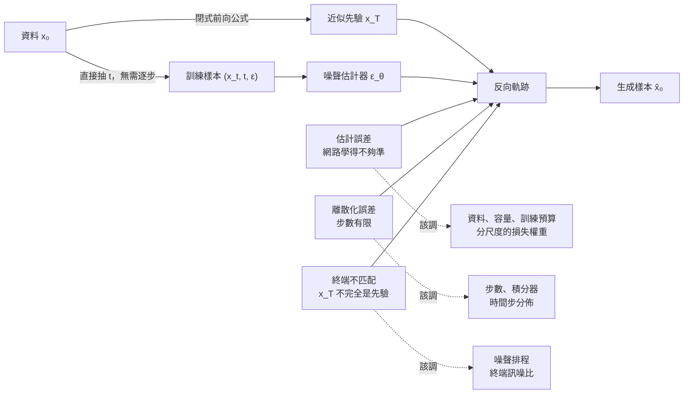

+++
title = "多跑幾步不會讓它變準：擴散採樣的誤差預算"
date = "2026-09-08T20:38:09+08:00"
author = "TTL::0"
draft = false
isCJKLanguage = true
description = "2020 年提出的去噪擴散模型，生成一張影像需要一千步。每一步呼叫一次神經網路，逐步把純噪聲修回影像。這個「一千步」被廣泛理解為方法的內在成本——生成是一個漸進的過程，急不得。"
tags = [
    "分析論述", # term:AnalyticalEssay
    "機器學習", # term:MachineLearning
    "擴散模型", # term:DiffusionModel
    "噪聲排程", # term:NoiseSchedule
  ]
series = ["訓練訊號與能力證據：當指標變好，你到底知道了什麼"]
[ai_info]
    [ai_info.generation]
        model = "Claude Opus 5"
        agent = "Claude Code VSCode Extension 2.1.261"
    [ai_info.refinement]
        model = "Claude Opus 5"
        agent = "Claude Code VSCode Extension 2.1.263"
+++

<!--more-->

## 導言

2020 年提出的去噪**擴散模型**（Diffusion Model） <!-- term:DiffusionModel -->，生成一張影像需要一千步。每一步呼叫一次神經網路，逐步把純噪聲修回影像。這個「一千步」被廣泛理解為方法的內在成本——生成是一個漸進的過程，急不得。

> [!IMPORTANT]
> **擴散模型** <!-- term:DiffusionModel --> (Diffusion Model): 以前向加噪與反向去噪的多步轉移建立生成程序的模型族。 <!-- anchor:DiffusionModel -->


幾個月後，另一組研究者拿**完全相同的、已經訓練好的模型**，換了一個採樣程序，用 50 步生成出品質相當的影像。訓練目標沒變，權重沒變，一個參數都沒重新訓練。[Song、Meng 與 Ermon，《Denoising Diffusion Implicit Models》](https://arxiv.org/abs/2010.02502)

二十倍的計算量差異，來自一個與訓練無關的決策。

這件事推翻了一個直覺：**步數與品質之間並不存在單調關係**。如果一千步是必要的，50 步不可能達到同樣品質；如果 50 步就夠了，那一千步裡的九百五十步在做什麼？

答案是：步數只對付三種誤差中的一種。這篇要把那三種誤差拆開，並說明什麼時候加步數有用、什麼時候沒用、以及什麼時候它會讓事情變糟。

## 分析

### 先把數字走一遍

**擴散模型** <!-- term:DiffusionModel -->的訓練訊號來自一個看起來很不起眼的代數性質，值得先確認它。

前向過程是逐步加入高斯噪聲。設 $\beta_t\in(0,1)$、$\alpha_t=1-\beta_t$，則

$$
q(x_t\mid x_{t-1})=\mathcal{N}\big(\sqrt{\alpha_t}\,x_{t-1},\ \beta_t I\big).
$$

這是一步一步的定義。但高斯的疊加有封閉形式，所以定義 $\bar\alpha_t=\prod_{s=1}^{t}\alpha_s$ 之後，可以**跳過所有中間步驟**直接寫出

$$
x_t=\sqrt{\bar\alpha_t}\,x_0+\sqrt{1-\bar\alpha_t}\,\epsilon,
\qquad \epsilon\sim\mathcal{N}(0,I).
$$

這個式子的實務意義極大：要產生「第 500 步的帶噪樣本」，不需要真的跑 500 次加噪，代一次公式就好。

先驗證它成立。若公式正確，$x_0$ 與 $x_t$ 的相關係數應該恰好是 $\sqrt{\bar\alpha_t}$，而殘差 $x_t-\sqrt{\bar\alpha_t}x_0$ 的均方應該是 $1-\bar\alpha_t$。

```python
for a in (0.99, 0.9, 0.5, 0.1, 0.01):
    xt = [math.sqrt(a)*p + math.sqrt(1-a)*e for p, e in zip(x0, eps)]
    # 計算 corr(x0, xt) 與殘差 MSE，與理論值比對
```

實際執行輸出（20 萬樣本）：

```text
ab         corr 實測          sqrt(ab) 理論      殘差MSE 實測         1-ab 理論
0.99       0.9949           0.9950           0.0100           0.0100
0.90       0.9482           0.9487           0.1002           0.1000
0.50       0.7048           0.7071           0.5008           0.5000
0.10       0.3132           0.3162           0.9014           0.9000
0.01       0.0975           0.1000           0.9915           0.9900
```

實測與理論吻合到抽樣誤差之內。這個公式是後續所有分析的地基，而它可以用一個不到十行的單元測試確認。

### 訓練與生成走不同的路

有了前向公式，訓練的形態就確定了。隨機抽一個時間 $t$，用公式直接造出 $(x_t, t, \epsilon)$，然後要網路從 $x_t$ 與 $t$ 預測出 $\epsilon$：

$$
L_{\text{simple}}(\theta)=\mathbb{E}\left[\big\lVert\epsilon-\epsilon_\theta(x_t,t)\big\rVert_2^2\right].
$$

[Ho、Jain 與 Abbeel，2020](https://arxiv.org/abs/2006.11239)

注意這裡沒有任何「逐步」的成分。每個訓練樣本獨立抽取，$t=3$ 與 $t=800$ 的樣本在同一個批次裡，彼此無關。

**生成則必須逐步。** 從近似先驗的 $x_T$ 出發，反覆使用學到的反向轉移回到資料區域。這是一個序列過程，因為每一步的輸入是上一步的輸出。

兩條路的形態完全不同，而這就是「訓練用一千步、生成也必須一千步」這個直覺的來源——它把訓練時的時間索引範圍，誤當成生成時的必要步數。實際上訓練得到的是一族**受 $t$ 條件控制的估計器**，生成時要在這族估計器上走幾步、怎麼走，是另一個獨立的設計決策。

連續時間的表述讓這件事更清楚：訓練近似的是各時刻的分數函數，而反向過程是一個微分方程，可以用任何數值解法求解。解法的選擇與訓練目標無關。[Song 等人，2021](https://openreview.net/forum?id=PxTIG12RRHS)

### 三種誤差

生成樣本的失真，可以歸到三個獨立的來源。下圖把它們畫成沿反向軌跡匯入的三條支流，因為關鍵在於**它們各自對什麼旋鈕敏感**。



圖中三條虛線是本篇最實用的部分：**每種誤差對應不同的旋鈕，而它們不互通**。

加步數只削減離散化誤差。若估計器本身在某些噪聲尺度上有系統性偏誤，多走幾步只是把同一個錯誤方向多執行幾次。

這是一個機制主張，需要驗證。

### 誤差預算：把估計誤差固定，只調步數

下面的實驗建立一個可以完全掌握真相的設定。目標分佈是兩個高斯的混合，其分數函數解析可得——因此可以構造一個「完美的估計器」，然後**刻意注入已知大小的估計誤差**。

誤差模型選的是過度平滑：估計器對 $x_0$ 的預測收縮一個固定比例。這是真實模型常見的失效形態，而且它有界，不會沿軌跡爆炸。

```python
def ddim(x, steps, shrink):
    """shrink 模擬估計器過度平滑：對 x0 的預測收縮 shrink 比例"""
    ts = [1.0 - i/steps for i in range(steps+1)]
    for i in range(steps):
        t, tn = ts[i], ts[i+1]
        a, an = math.sqrt(ab(t)), math.sqrt(ab(tn))
        sg, sgn = math.sqrt(1-ab(t)), math.sqrt(1-ab(tn))
        eps = -sg * true_score(x, t)
        x0  = (x - sg*eps) / max(a, 1e-8)
        x0  = (1.0 - shrink) * x0                 # <- 估計誤差進入的位置
        eps = (x - a*x0) / max(sg, 1e-8)
        x   = an*x0 + sgn*eps
    return x
```

所有設定共用同一批初始噪聲，因此步數與偏誤是唯二的獨立變因。誤差用生成分佈與目標分佈之間的 Wasserstein-1 距離衡量。

實際執行輸出：

```text
誤差 = 生成分佈與目標分佈的 Wasserstein-1 距離（越小越好）
雜訊地板（兩次獨立真實抽樣之間的距離）= 0.0248

步數       估計器完美            過度平滑 1%          過度平滑 5%
2        0.6250           0.6387           0.6933
5        0.1476           0.1729           0.2728
10       0.0812           0.1167           0.2545
25       0.0381           0.0863           0.2736
50       0.0244           0.0796           0.2973
200      0.0151           0.0785           0.3326
1000     0.0134           0.0794           0.3470
```

三欄各講一個故事。

**估計器完美（第一欄）：加步數確實單調有效。** 從 0.6250 一路降到 0.0134，在 50 步時已經達到雜訊地板 0.0248。這一欄支持「離散化誤差存在，且更細的步長能削減它」。

**過度平滑 1%（第二欄）：誤差撞上地板就停住。** 從 2 步到 200 步，誤差降到 0.0785 之後不再下降。從 50 步加到 1000 步——**二十倍的計算量**——誤差從 0.0796 變成 0.0794。買到的改善小於量測噪聲。

**過度平滑 5%（第三欄）：加步數反而變糟。** 誤差在 **25 步時達到最低 0.2736**，之後開始上升，1000 步時是 0.3470——比 25 步差了 **27%**。

第三欄值得多說一句。這裡沒有任何數值不穩定，也沒有隨機性作祟。原因是離散化誤差與估計偏誤在這個設定下方向相反：粗步長的截斷誤差恰好部分抵消了過度平滑造成的收縮。步數增加時，抵消消失，偏誤完全顯露。

這種抵消是偶然的，不能依賴——但它示範了一件重要的事：**當多個誤差來源共存時，單一旋鈕與最終品質之間可以完全不是單調關係**。「跑久一點總不會更差」這個直覺沒有根據。

### 這個誤判什麼時候其實是對的

上面的論證有明確的適用範圍。

**當估計器確實很準時，加步數是有效的。** 第一欄就是這個情況。在估計誤差遠小於離散化誤差的區間，「多跑幾步」是最簡單有效的改善手段，而且它不需要重新訓練。判斷自己在不在這個區間的方法是畫出誤差對步數的曲線——若還在下降，就繼續；若已經平坦，就停。

**當採樣器本身是主要瓶頸時，換積分器比加步數更划算。** 導言那個二十倍的例子正是如此。同一個模型、同樣的估計誤差，換一個數值路徑就把所需步數降了一個數量級。訓練與採樣是可以分開設計與分開最佳化的兩個軸。[Karras 等人，2022](https://arxiv.org/abs/2206.00364)

**當你要的是速度而非極限品質時，這整套分析可以簡化。** 若產品要求是「兩秒內出圖」，那麼步數是一個由延遲預算決定的常數，剩下的問題只是在那個常數下把品質做到最好。此時該調的是估計器與採樣器，不是步數。

## 反思

### 人工加噪與資料污染不是同一件事

擴散模型 <!-- term:DiffusionModel -->裡的「噪聲」與資料品質問題裡的「噪聲」是兩個完全不同的東西，而共用同一個詞造成過不少混淆。

前向過程加的噪聲有**已知的條件分佈、可重現的種子、以及明確的預測目標**。它是被設計出來的，其統計性質完全掌握，因此可以據以構造監督訊號。

錯誤標註、感測器偏差、抽樣不均則改變了**資料生成機制本身**。它們沒有已知的分佈，也沒有對應的預測目標。

把兩者混稱會讓控制手段錯位：以為「模型學會了去噪，所以對資料噪聲穩健」。實際上模型學會的是還原一種特定的、人工加入的高斯擾動，這與處理標註錯誤沒有關係。

### 平均損失會被容易的尺度主宰

訓練損失是對所有 $t$ 取平均。這帶來一個容易被忽略的問題。

不同噪聲尺度的預測難度差異極大。在訊噪比很高的區間（$\bar\alpha_t$ 接近 1），輸入幾乎是乾淨的，要從中反推那一點點噪聲很難。在訊噪比很低的區間（$\bar\alpha_t$ 接近 0），輸入幾乎是純噪聲，$x_0$ 幾乎不提供資訊，同樣預測不準。中段才有可學的訊號。

若某些尺度的樣本佔多數，平均損失會被它們主宰，而其他尺度的誤差被稀釋。更麻煩的是，**不同尺度對最終樣本的重要性不同**——某些 $t$ 的小誤差會沿反向軌跡放大，某些則會被後續步驟修正掉。

實務後果是：只報告一個總體 $\epsilon$-MSE，無法定位問題。需要分時間區間報告損失，並用干預測試確認哪些區間對最終樣本影響最大。

### 引導把一個旋鈕變成兩個目標的取捨

還有一個常見的單旋鈕誤判值得指出。分類器無關引導透過放大條件與無條件預測之間的差，提高生成樣本對提示的貼合度。[Ho 與 Salimans](https://arxiv.org/abs/2207.12598)

提高引導強度會改善保真度，同時降低多樣性。這不是實作缺陷，是機制的直接後果：放大差值等於把樣本推向條件分佈的高密度區，而高密度區比整個分佈窄。

因此「引導強度調到多少最好」這個問題沒有單一答案——它是一條取捨曲線上的位置選擇，而選在哪裡取決於你要的是貼合還是多樣。用單一分數評估引導強度，會系統性地偏向該分數所隱含的權重。

### 實驗能證明什麼，不能證明什麼

第二個實驗把估計誤差寫成一個固定的 `shrink` 比例，每一步都對 $x_0$ 的預測收縮同樣的量。真實的估計誤差不是均勻收縮——它隨 $t$ 變化、隨 $x$ 變化，而且不只是縮放。因此實驗證明的是「一個不隨步數消失的偏差會設出下限」這個結構，不是任何真實模型的誤差輪廓。

實驗用的分數函數是一個已知解析分佈的真分數。換成學習得到的分數，誤差會有這個模型不具備的結構——特別是它可能在不同 $t$ 之間相關，而相關的誤差沿軌跡的累積方式與獨立誤差不同。

第三到第五段程式需要訓練好的檢查點與指標實作，屬示意，在此不產生數字。

## 實務對比

**錯誤做法**：同時改採樣器、步數、引導強度、解析度與種子，然後把品質差異歸因於步數。

```text
實驗 A: DDPM, 1000 步, guidance 1.0, 512px, seed 隨機
實驗 B: DDIM,   50 步, guidance 7.5, 768px, seed 隨機
結論：「50 步品質較差，所以需要更多步數」
```

五個變因同時改變，其中至少三個會獨立影響品質。這個比較無法歸因到任何一個。

**較可靠的做法**：固定 checkpoint 與初始噪聲，一次只改一個設定。

```python
torch.manual_seed(20260908)
z0 = torch.randn(64, C, H, W)        # 固定初始噪聲，所有設定共用
model = load_checkpoint("v3.pt").eval()

results = {}
for steps in (10, 25, 50, 100, 250, 1000):
    imgs = sample(model, z0, sampler="ddim", steps=steps, guidance=1.0)
    results[steps] = {
        "quality":  quality_metric(imgs, real_ref),
        "coverage": coverage_metric(imgs, real_ref),
        "nfe":      steps,                    # 網路評估次數 = 實際成本
    }
# 畫出「品質 vs 網路評估次數」曲線，找出它在哪裡變平
```

三個要素缺一不可。**固定初始噪聲**讓不同步數的樣本可比較。**同時報告覆蓋**避免用單一品質分數掩蓋多樣性損失。**記錄網路評估次數**讓成本進入比較——這是實際付出的計算，而步數只是它的代理。

**另一個錯誤做法**：逐步實作前向加噪來訓練，卻沒有檢查閉式邊際公式。

```python
# 錯誤：慢，而且沒有任何測試確認它與閉式公式一致
x = x0.clone()
for s in range(t):
    x = math.sqrt(alpha[s]) * x + math.sqrt(beta[s]) * torch.randn_like(x)
```

這段程式碼可能是對的，也可能在索引上差一格。差一格造成的偏差很小，訓練照樣會收斂，只是收斂到一個略微錯誤的目標——這正是最難發現的一類 bug。

**較可靠的做法**：用閉式公式產生樣本，並用單元測試把兩者釘在一起。

```python
def q_sample(x0, t, noise):
    ab = alpha_bar[t].view(-1, 1, 1, 1)
    return ab.sqrt() * x0 + (1 - ab).sqrt() * noise

def test_forward_marginal():
    """任意 t 的統計性質必須符合閉式公式"""
    x0 = torch.randn(200_000)
    for t in (1, 100, 500, 999):
        xt = q_sample(x0, t, torch.randn_like(x0))
        ab = alpha_bar[t]
        assert abs(corr(x0, xt) - ab.sqrt()) < 0.01
        assert abs(((xt - ab.sqrt()*x0)**2).mean() - (1 - ab)) < 0.01
```

這個測試跑得很快，而且它會抓到索引偏移、排程定義錯誤與獨立性違反。把它放進 CI 之後，任何生成品質問題都可以直接排除前向構造這個嫌疑。

## 結論

擴散模型 <!-- term:DiffusionModel -->把生成變成可學習問題，關鍵不在「反覆修圖」，而在一個固定的前向過程提供了任意噪聲尺度的監督資料。訓練因此可以隨機抽取時間點、平行進行；生成則必須沿反向軌跡逐步求解。兩者的形態不同，步數也不必相同。

最終品質由三種誤差共同決定：估計器學得多準、數值路徑走得多細、以及起始分佈與前向終點是否匹配。三者對應不同的旋鈕，彼此不互通。量測顯示，估計器完美時加步數單調有效；估計器有 1% 的系統性偏誤時，二十倍的步數買不到任何改善；偏誤到 5% 時，最佳步數是 25，繼續加到 1000 反而讓誤差惡化 27%。

因此，步數既不是品質保證，也不是錯誤來源——它只是在特定估計器與特定數值路徑下，調節計算量與近似程度的其中一個旋鈕。改善生成品質之前，必須先知道自己的誤差預算裡哪一項最大，而這需要固定 checkpoint 與初始噪聲、一次只改一個變因的對照實驗。