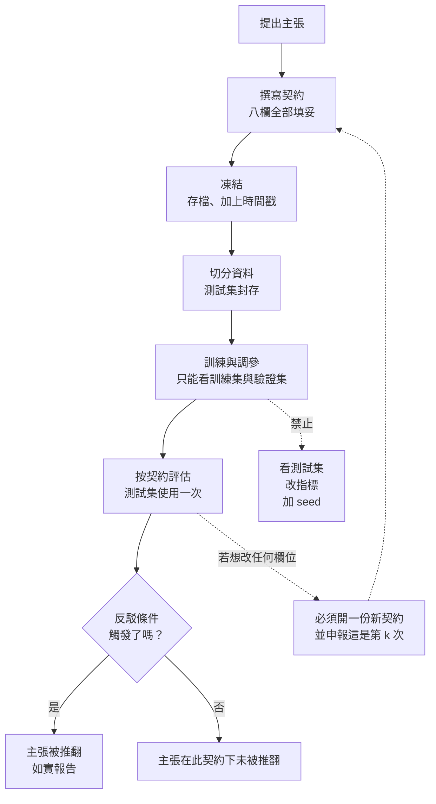

+++
title = "怎麼設計一個會失敗的實驗：事前凍結的八欄契約"
date = "2026-09-08T20:52:10+08:00"
author = "TTL::0"
draft = false
isCJKLanguage = true
description = "2000 年，美國要求臨床試驗必須在開始之前，把主要療效指標登記到公開資料庫。登記的內容包括：要量什麼、怎麼量、預計收多少受試者、什麼條件下算成功。登記之後不能改。"
tags = [
    "分析論述", # term:AnalyticalEssay
    "泛化", # term:Generalization
    "條件命題的前提破壞", # term:BrokenPremise
    "選擇偏差", # term:SelectionBias
    "中介誤認", # term:MediatorMisreading
  ]
series = ["訓練訊號與能力證據：當指標變好，你到底知道了什麼"]
[ai_info]
    [ai_info.generation]
        model = "Claude Opus 5"
        agent = "Claude Code VSCode Extension 2.1.261"
    [ai_info.refinement]
        model = "Claude Opus 5"
        agent = "Claude Code VSCode Extension 2.1.263"
+++

<!--more-->

## 導言

2000 年，美國要求臨床試驗必須在開始之前，把主要療效指標登記到公開資料庫。登記的內容包括：要量什麼、怎麼量、預計收多少受試者、什麼條件下算成功。登記之後不能改。

一項回顧分析檢視了 55 個由國家心肺血液研究所資助的大型心血管藥物與補充劑試驗。在 2000 年之前發表的 30 個試驗中，有 17 個（**57%**）顯示了顯著的療效。在 2000 年之後發表的 25 個試驗中，這個數字是 2 個（**8%**）。[Kaplan 與 Irvin，PLOS ONE 2015](https://journals.plos.org/plosone/article?id=10.1371/journal.pone.0132382)

從 57% 掉到 8%。

改變的不是科學。研究的藥物、研究的疾病、研究者的能力、統計方法——這些都沒有系統性的改變。改變的是**指標必須在看到資料之前就凍結**。

這個對照給出一個可以計量的結論：在沒有事前約束的情況下，大部分「發現」來自事後的選擇自由度，而不是來自被研究的現象。

這篇要把這件事變成一份工程上可執行的契約，並說明它的每一欄各自擋住什麼。

## 分析

### 先把數字走一遍

事後選擇能造成多大的偏差？這件事可以直接模擬，而且模擬的前提刻意設定成極端：**兩組資料之間沒有任何真實差異**，都來自同一個標準常態分佈。

然後在同一份無效資料上，執行四種常見的分析做法。

```python
def fixed():                       # 事前凍結：一個指標、固定樣本數
    return z_of(draw(50), draw(50)) > 1.96

def best_of_metrics(k=5):          # 量 k 個指標，報最顯著的那個
    return any(z_of(draw(50), draw(50)) > 1.96 for _ in range(k))

def best_of_seeds(k=10):           # 跑 k 個 seed，報最好的
    return any(z_of(draw(50), draw(50)) > 1.96 for _ in range(k))

def optional_stopping():           # 邊收資料邊看，顯著就停
    a, b = draw(10), draw(10)
    for _ in range(19):
        if z_of(a, b) > 1.96: return True
        a += draw(10); b += draw(10)
    return z_of(a, b) > 1.96
```

實際執行輸出（各兩萬次試驗）：

```text
兩組資料之間沒有任何真實差異。以下是「發現顯著差異」的比率：

分析做法                               偽陽性率         相對名目 5% 的倍數
事前凍結：單一指標、固定 n                     5.2%         1.0 倍
在 5 個指標中挑最顯著的                      23.7%        4.7 倍
跑 10 個 seed 報最好的                   41.5%        8.3 倍
邊收資料邊看，顯著就停                        27.1%        5.4 倍
三者兼施                               78.8%        15.8 倍
```

第一行是基準：事前凍結一切，偽陽性率 5.2%，符合名目水準。

其餘各行都是**在資料裡什麼都沒有的情況下**得到的。跑十個種子報最好的，有 41.5% 的機率會「發現」一個不存在的差異。三種做法兼施，這個數字是 **78.8%**——四次裡有三次會得出錯誤結論。

值得強調的是，這三種做法在工程實務中都極其常見，而且**沒有一個看起來像作弊**。多量幾個指標是盡責。多跑幾個種子是嚴謹。邊看邊調是敏捷。它們各自都有正當理由，而它們的共同效果是把偽陽性率推高十六倍。

### 三種代理落差，三種對應的約束

上面的模擬展示了一種特定的偏差。要設計一份完整的契約，需要先把工程實務中會遇到的落差類型盤點清楚。訓練期的每一個指標都是某個無法直接觀測的量的**代理**，而代理與被代理者之間的差距有三種常見的產生機制。

**第一種**：**選擇偏差**（Selection Bias） <!-- term:SelectionBias -->。 同一批資料同時扮演擬合、挑選與證明三個角色。前兩個角色消耗資料中的資訊，第三個角色卻假設資料還是乾淨的。上面的模擬就是這個機制的純粹形態，它的特徵是候選越多、偏差越深。

> [!IMPORTANT]
> **選擇偏差** <!-- term:SelectionBias --> (Selection Bias): 從多個候選中挑出表現最好者時，該讀數同時包含真實能力與抽樣噪聲，使其系統性地優於真值的偏差。 <!-- anchor:SelectionBias -->


**第二種**：**條件命題的前提破壞**（Broken Premise） <!-- term:BrokenPremise -->。 某個方法或架構宣稱具備某性質，該性質確實可證明，但證明依賴的前提在實作中不成立。它的特徵是理論與實作之間的落差，換更多資料不會改善。

> [!IMPORTANT]
> **條件命題的前提破壞** <!-- term:BrokenPremise --> (Broken Premise): 架構或演算法的數學性質是條件命題；當實作為了效率或有限輸入而違反其前提時，該性質在特定條件下完全失效，而非緩慢退化。 <!-- anchor:BrokenPremise -->


**第三種**：**中介誤認**（Mediator Misreading） <!-- term:MediatorMisreading -->。 模型內部有某個可觀測的中間量與輸出相關，於是被當成輸出的原因。它的特徵是觀測本身為真，只有歸因是假的。

> [!IMPORTANT]
> **中介誤認** <!-- term:MediatorMisreading --> (Mediator Misreading): 把因果鏈上可觀察的中介變數當成成因本身，因而以觀察性讀數回答只有干預才能回答的問題。 <!-- anchor:MediatorMisreading -->


三種機制需要不同的獨立證據：乾淨的資料、對性質本身的直接量測、以及一次干預實驗。一份契約要有用，就必須在事前把這三類證據各自的取得方式固定下來。

### 契約的八個欄位

以下是這份契約的形態。每一欄不是形式要求，而是對應一個具體的、已知會發生的失效。

| 欄位 | 它擋住什麼 |
| :--- | :--- |
| **資料** | 事後更換資料集或子集，直到結果好看 |
| **切分** | 測試資料洩漏進選擇決策，使評估不再獨立 |
| **seed** | 只報告表現最好的那次執行 |
| **指標** | 事後更換主要指標，或在多個指標中挑最顯著的 |
| **控制變因** | 一次改多項，使改善無法歸因到任何一項 |
| **觀察量** | 把探索性發現當成事前假設呈現 |
| **反駁條件** | 主張無法被任何觀察推翻 |
| **停止條件** | 結果不顯著就追加樣本或延長訓練 |

八欄之中，**反駁條件**是唯一無法用程式自動檢查的一欄，也是最重要的一欄。它強迫你在做實驗之前回答一個問題：什麼樣的結果會讓你放棄這個主張？

如果這個問題答不出來，那麼實驗無論結果如何都不會改變你的信念，做它就沒有資訊價值。

### 一份填好的契約

抽象的欄位清單容易變成形式主義。下面是一份具體的、可以直接執行的填法，情境是「新的正規化方法是否改善了小樣本情況下的**泛化**（Generalization） <!-- term:Generalization -->」。

> [!IMPORTANT]
> **泛化** <!-- term:Generalization --> (Generalization): 模型在訓練樣本以外的資料上維持表現的能力。 <!-- anchor:Generalization -->


```text
主張：方法 R 在訓練樣本少於 5000 時，能降低驗證誤差至少 2 個百分點。

資料      公開資料集 D 的官方訓練集，抽樣至 n ∈ {1000, 2000, 5000, 20000}
          抽樣以固定 seed 執行，抽出的索引存檔並隨結果一併提交
切分      官方測試集完全不參與；驗證集由訓練集切出，切分在任何超參數決策前固定
          官方測試集在全部決策凍結後只評估一次
seed      0-9 全部執行，全部報告；呈現平均與標準差，不得只呈現最佳
指標      主要：驗證集 top-1 誤差
          次要：訓練誤差、各類別誤差、訓練時間
          主要指標不得事後更換；次要指標的任何發現標記為探索性
控制變因  架構、最佳化器、學習率排程、資料增強、總訓練步數全部固定
          唯一操弄變因：方法 R 開啟或關閉
觀察量    誤差差值 Δ = err(R關) − err(R開)，對每個 n 分別計算
反駁條件  若 Δ 的 10 個 seed 平均在任何 n < 5000 時小於 2 個百分點，
          或 95% 信賴區間跨越 0，則主張被推翻
停止條件  每個設定固定訓練 100 epoch，或驗證誤差連續 20 次評估無改善
          不得因結果不顯著而追加 seed、延長訓練或擴大搜尋範圍
```

這份契約的關鍵性質是：**它可以失敗，而且失敗的樣子被事先寫出來了**。反駁條件那一欄描述的是一個具體的、可能發生的結果。

對照一下沒有這一欄的版本會是什麼樣：「評估方法 R 對泛化 <!-- term:Generalization -->的影響」。這個表述無論結果如何都不會被推翻——改善了就是有效，沒改善就是「在這個設定下效果不明顯，需要進一步研究」。

### 凍結必須發生在什麼時候

契約的效力完全取決於它在流程中的位置。下圖把這件事畫出來，因為時序是全篇最容易出錯的地方。



圖中最重要的是那條回到起點的虛線。契約不是不能改——實務中經常需要改。關鍵是**改了要申報**，而且改過之後的結果是第 $k$ 次嘗試的結果，不是第一次。

一個記錄了「這是第 4 次修改契約」的結果，仍然有價值；它只是需要被折價。一個沒有記錄的結果則無法折價，因為沒有人知道該折多少。

### 這份契約什麼時候不需要

契約有成本，而過度套用會讓它變成形式主義。要誠實說明它什麼時候不划算。

**當回滾成本低於驗證成本時。** 內部工具的推薦排序、可即時關閉的功能開關、探索階段的原型——這些場合下部署本身就是最便宜的驗證。判斷標準不是模型多複雜，而是**你多快能知道自己錯了**。若答案是「一小時內」，直接上線比寫契約快。

**在探索階段。** 契約約束的是確認性研究。探索階段的目的是產生假設，此時多看幾個指標、多試幾種切法都是正確做法。錯誤在於把探索的產物當成確認的結論呈現——正確做法是明確標記「這是探索性發現，尚未在獨立資料上確認」，然後為值得的那個假設寫一份契約。

**當結果的效應量遠大於噪聲時。** 若某個改動讓誤差從 0.40 降到 0.12，而 seed 之間的標準差是 0.005，那麼上面模擬的那些偏差機制都不足以製造這個差距。契約的價值集中在效應量與噪聲尺度相當的區間，而那恰好是多數實務改進所在的區間。

## 反思

### 契約保證不了什麼

一份完美執行的契約，仍然有幾件事做不到，而誤以為它做得到會產生新的盲點。

**它不保證外部效度。** 契約約束的是「在這個資料、這個切分、這個設定下」的結論。部署環境的輸入分佈若與實驗不同，結論不會自動遷移。契約讓內部結論可信，不讓它可外推。

**它不保證你量的是對的東西。** 若主要指標是平均誤差，而你真正在乎的是罕見但昂貴的錯誤，那麼一份嚴格執行的契約會給你一個嚴謹的、關於錯誤問題的答案。指標選擇發生在契約之前，契約無法檢查它。

**它不保證實作正確。** 契約管的是實驗設計，不是程式碼。一個梯度算錯的實作可以完美遵守契約，並得出一個嚴謹但無意義的結論。實作正確性需要另一套工具——單元測試、有限差分檢查、不變量斷言。

三個限制共用一個形狀：契約處理的是**選擇自由度**，不處理**測量效度**與**實作正確性**。把三者混為一談，會讓契約變成一張安心毯。

### 全部報告與只報最好

「seed 全部報告」這一欄看起來瑣碎，但它擋住的失效相當嚴重。

一項針對深度強化學習的重現性分析發現，同一份程式碼、同一個環境、同一組超參數，只更換隨機種子，把十次執行隨機分成兩組各五條學習曲線，兩組看起來會像兩個不同的演算法。[Henderson 等人，2018](https://arxiv.org/abs/1709.06560)

這意味著在種子變異大的領域裡，「挑五個種子畫圖」這個動作本身就足以支持任何預設立場。而五個種子在計算成本高的實驗中是很常見的數量。

實務上的處理有兩層。第一層是全部報告，並呈現分佈而非平均——箱型圖比誤差棒更誠實，因為它顯示分佈形狀。第二層是在契約中預先寫下種子數量，讓「跑到出現想要的結果為止」在事後可稽核。

### 契約是溝通產物，不只是紀律產物

最後一個常被忽略的功能：契約讓不同的人可以對同一個結果做出不同的折價。

當一份報告寫著「測試集使用次數：3」，讀者可以自行判斷該把那個數字看輕多少。當它什麼都不寫，讀者只有兩個選擇——全信或全不信。

這使得契約在團隊協作中的價值超出個人紀律。它把「這個數字有多可信」這個判斷，從一個需要信任作者的問題，變成一個查表就能回答的問題。

### 實驗能證明什麼，不能證明什麼

第一個實驗是純虛無模擬：兩組都從同一個分佈抽出，所以任何「顯著」都是構造出來的偽陽性。它量的是每種做法在真值為零時把偽陽性率推高多少，**完全沒有量檢定力**——也就是每種做法會不會同時漏掉真實效果。一個把偽陽性壓到最低的契約也可能把真效果擋掉，而那個代價不在這些數字裡。

四種做法是各自隔離模擬的。實務上它們會疊加（同時換指標、換種子、又邊看邊停），而疊加後的比率不是各項相加。

每組 50 個樣本，以及 5 個指標、10 個種子、19 次中途查看這些數字都是選定的。每一項結果的方向穩固，幅度則隨這些選擇改變。

第二段的契約是一份 schema，不是一次執行。**寫下契約是否真的改變行為，是一個關於人的經驗主張，本文沒有測試它。**

## 實務對比

**錯誤做法**：實驗做完之後才寫實驗設計。

```text
（週一到週四：跑了大約 200 組設定，換過三次評估指標，
  中途發現驗證集切法有問題於是重切，測試集看過大概五次）

（週五）撰寫報告：
  「我們在資料集 D 上評估方法 R。訓練集/驗證集/測試集依 8:1:1 切分，
    使用 top-1 誤差作為評估指標。結果顯示 R 降低誤差 2.3 個百分點。」
```

報告裡的每一句話都是真的。切分確實是 8:1:1，指標確實是 top-1 誤差，數字確實是 2.3。而整段敘述完全略過了產生這個數字的搜尋過程——讀者無法知道它是 200 次嘗試中的哪一次。

**較可靠的做法**：把契約當成程式碼提交，凍結在實驗開始之前。

```python
# contract.py —— 在任何實驗執行之前提交，commit hash 隨結果一併報告
CONTRACT = {
    "claim":       "方法 R 在 n < 5000 時降低驗證誤差至少 2 個百分點",
    "seeds":       list(range(10)),          # 全部執行，全部報告
    "primary":     "val_top1_error",         # 不得事後更換
    "secondary":   ["train_error", "per_class_error", "wall_clock"],
    "controls":    ["arch", "optimizer", "lr_schedule", "augmentation", "steps"],
    "refutation":  "任一 n < 5000 的 10-seed 平均 Δ < 0.02，或 95% CI 跨越 0",
    "stop":        "100 epoch 或驗證誤差 20 次評估無改善",
    "test_budget": 1,                        # 測試集只能用一次
}

def check_contract(results):
    """跑完之後自動檢查契約是否被遵守，而不是靠記憶"""
    assert set(results.seeds) == set(CONTRACT["seeds"]), "seed 未全部報告"
    assert results.test_evaluations <= CONTRACT["test_budget"], "測試集超用"
    assert results.primary_metric == CONTRACT["primary"], "主要指標被更換"
```

`check_contract` 這個函式是關鍵。它把契約從一份文件變成一個**會失敗的斷言**，而失敗的斷言無法被遺忘或合理化。

**另一個錯誤做法**：報告只呈現最終數字。

```text
方法 R：誤差 12.4%
基準線：誤差 14.7%
結論：R 有效
```

**較可靠的做法**：讓折價所需的資訊全部可見。

```text
契約 commit          a3f9c21（實驗開始前 4 天提交）
契約修訂次數         1（第 2 版：把 n=500 移出範圍，因為基準線不收斂；已申報）

n=1000   R: 21.3 ± 1.4    基準: 24.1 ± 1.6    Δ = 2.8 ± 2.1   [95% CI: -1.3, 6.9]
n=2000   R: 16.8 ± 0.9    基準: 19.2 ± 1.1    Δ = 2.4 ± 1.4   [95% CI: -0.3, 5.1]
n=5000   R: 13.1 ± 0.5    基準: 14.0 ± 0.6    Δ = 0.9 ± 0.8   [95% CI: -0.7, 2.5]
n=20000  R: 12.4 ± 0.3    基準: 12.6 ± 0.4    Δ = 0.2 ± 0.5   [95% CI: -0.8, 1.2]

seed 全部 10 個皆已執行並納入統計，無排除
測試集使用次數      1
反駁條件            已觸發：n=1000 與 n=2000 的 95% CI 皆跨越 0
結論                在此契約下，主張未獲支持
```

這份報告的結論是「主張未獲支持」，而它比前一版的「R 有效」更有價值。它告訴讀者效應可能存在但被噪聲淹沒，告訴讀者需要多少樣本才能分辨，也告訴讀者契約被修訂過一次以及修訂的理由。

最重要的是，**它是一個可能發生的結果**。一個永遠只會產出「有效」的流程，不產生資訊。

## 結論

一個能力主張要成為可檢查的命題，需要在看到結果之前就固定三件事：這個數字會在哪批資料上產生、這批資料是否參與過任何選擇決策、以及哪一個尚未發生的觀察能夠推翻它。

第三項是分界線。量測顯示，當分析者保有事後選擇的自由度時——多量幾個指標、多跑幾個種子、邊看邊決定何時停——在完全沒有真實效應的資料上，「發現顯著差異」的比率可以從名目的 5% 升到 78.8%。這三種做法在工程實務中都常見，而且沒有一個看起來像作弊。

因此，契約的驗收標準只有一條，而它不能靠程式檢查：**這個設計得出「主張是錯的」這個結論嗎？** 若答案是否定的，那麼實驗無論結果如何都不會改變任何人的信念，它產生的是一份對訓練過程的描述，不是一份關於能力的證據。