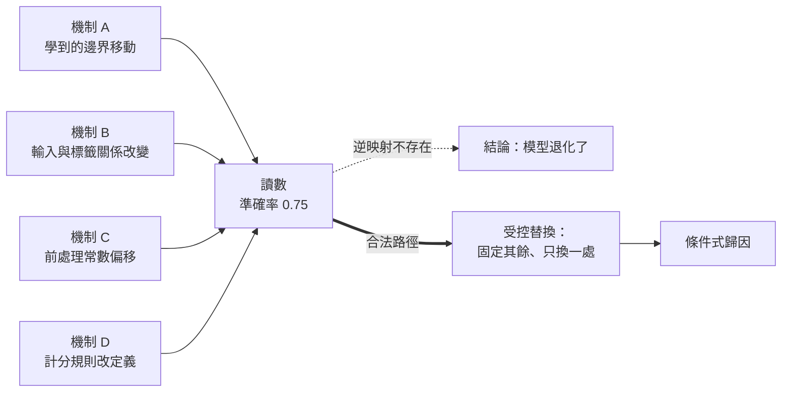

+++
title = "同一個數字，好幾個世界：能力歸因的不可識別性"
date = "2026-09-08T21:30:01+08:00"
author = "TTL::0"
draft = false
isCJKLanguage = true
description = "一個上線八個月的文件分類器，週一的離線評測是 90%，週二變成 75%。值班工程師在事故頻道貼上兩張截圖，標題寫「模型退化」，並提出回滾上週的權重。"
tags = [
    "分析論述", # term:AnalyticalEssay
    "機器學習", # term:MachineLearning
    "確定性邊界", # term:DeterministicTrustBoundary
    "單射", # term:Injective
    "量化", # term:Quantization
  ]
series = ["能力失效歸因：一個聚合讀數能證明什麼，不能證明什麼"]
[ai_info]
    [ai_info.generation]
        model = "Claude Opus 5"
        agent = "Claude Code VSCode Extension 2.1.261"
    [ai_info.refinement]
        model = "Claude Opus 5"
        agent = "Claude Code VSCode Extension 2.1.263"
+++

<!--more-->

## 導言

一個上線八個月的文件分類器，週一的離線評測是 90%，週二變成 75%。值班工程師在事故頻道貼上兩張截圖，標題寫「模型退化」，並提出回滾上週的權重。

回滾執行了，分數沒有回來。

事後拆解才發現週末有三件事同時落地：訓練管線推了一版新權重、上游把掃描解析度從 300 dpi 調到 200 dpi、評測腳本把「低信心棄答」從排除改成計為錯誤。三件事各自都足以讓那個數字掉 15 個百分點。回滾只處理了其中一件，而且是事後看來影響最小的那一件。

這個事故的教訓不是「要更小心地回滾」。它揭露的是一個結構問題：**那個掉下來的數字，本身不攜帶足以指認成因的資訊**。分數是整套評估程序的輸出，不是模型權重的體檢報告。當多個條件同時變動，下降只能構成警報，不能構成歸因。

因此本文要處理的問題是：一個聚合觀察量與產生它的機制之間，是什麼關係？以及在什麼條件下，觀察量的變動才有資格升格為因果判斷？

## 分析

要回答這個問題，先要看清那個數字實際上壓縮掉了什麼。下面用一個能實際執行的最小系統來外化這件事，而不是停留在斷言。

### 一個讀數，四個世界

以下程式建立一個八筆樣本的線性判別系統，基線全對。接著讓四種**互不相同**的事情各發生一次，每次只動一處：學到的決策邊界、輸入與標籤的關係、前處理的正規化偏移、計分規則對棄答的處理。

```python
X = [-2.0, -1.0, 0.5, 1.0, 2.0, 3.0, -0.5, 4.0]
Y = [0, 0, 1, 1, 1, 1, 0, 1]

def serve(x, boundary=0.0, offset=0.0):
    return 1 if (x - offset) >= boundary else 0

def accuracy(pred, labels):
    return sum(1 for p, y in zip(pred, labels) if p == y) / len(labels)

base = [serve(x) for x in X]
world = {
    "theta  邊界移到 1.5": ([serve(x, boundary=1.5) for x in X], Y),
    "P      標籤關係改變": (base, [0, 1, 1, 1, 1, 1, 1, 1]),
    "c      前處理偏移 1.2": ([serve(x, offset=1.2) for x in X], Y),
    "m      棄答計為錯誤": ([(-1 if i in (2, 5) else base[i]) for i in range(8)], Y),
}

print("baseline", accuracy(base, Y), base)
for name, (pred, labels) in world.items():
    print(name, accuracy(pred, labels), pred)

a = world["theta  邊界移到 1.5"][0]
c = world["c      前處理偏移 1.2"][0]
print("theta 與 c 的逐樣本輸出相同:", a == c)
```

實際執行的輸出如下：

```text
baseline 1.0 [0, 0, 1, 1, 1, 1, 0, 1]
theta  邊界移到 1.5 0.75 [0, 0, 0, 0, 1, 1, 0, 1]
P      標籤關係改變 0.75 [0, 0, 1, 1, 1, 1, 0, 1]
c      前處理偏移 1.2 0.75 [0, 0, 0, 0, 1, 1, 0, 1]
m      棄答計為錯誤 0.75 [0, 0, -1, 1, 1, -1, 0, 1]
theta 與 c 的逐樣本輸出相同: True
```

四個世界都給出 0.75。讀者要看的不是「分數會掉」這件平凡的事，而是四條完全不同的因果路徑收斂到同一個讀數。第一個世界裡權重真的變了；第二個世界裡權重一個位元都沒動，是資料換了；第三個世界裡模型與資料都沒動，是服務層的一個常數；第四個世界裡連預測都完全沒變，只是計分規則換了定義。

最後一行是這段實驗真正的收穫，它比原本的預期更嚴厲：**第一個世界與第三個世界的逐樣本輸出完全相同**。

### 不是單射：不可識別性的最小模型

把上面的觀察形式化。令一次評估的輸出為

$$
S = \Phi(\mathcal{W}),
$$

其中 $\mathcal{W}$ 是產生這次評估的**世界狀態**（world state），涵蓋模型參數、資料生成程序、推論設定與計分規則；$\Phi$ 是把世界狀態壓縮成一個數字的評估程序。

上面的實驗證明了一件事：存在 $\mathcal{W}_1 \neq \mathcal{W}_2$ 使得 $\Phi(\mathcal{W}_1) = \Phi(\mathcal{W}_2)$。也就是 $\Phi$ 不是**單射**（Injective） <!-- term:Injective -->。這個性質有一個直接後果——$\Phi^{-1}$ 不存在，所以**不存在任何從讀數回推世界狀態的合法運算**。

> [!IMPORTANT]
> **單射** <!-- term:Injective --> (Injective): 一對一的映射性質：不同的輸入必對應不同的輸出。聚合讀數與產生它的機制之間不具此性質，因此無法從讀數回推機制。 <!-- anchor:Injective -->


這就是**不可識別性**（non-identifiability）：不是測量不夠精準，也不是樣本不夠多，而是多個世界狀態被映射到同一個像。加大樣本會縮小抽樣誤差，卻不會讓這個映射變成單射 <!-- term:Injective -->。

下圖把這個結構外化。它要解決的閱讀問題是：為什麼「從分數推成因」這個動作在形式上就不成立。



圖裡有兩條線。虛線是事故頻道實際走的路徑，它在形式上就沒有依據。粗線是唯一合法的路徑：不從讀數回推，而是主動製造反事實——固定其餘部分，只替換一處，再看讀數是否隨之改變。

這裡要立一組最小詞彙，後面的討論都靠它承載：

- **聚合量**（aggregate）：把多個個體行為壓縮成單一數值的觀察量，例如準確率。
- **機制**（mechanism）：世界狀態中一個可獨立替換的部分，例如那個前處理常數。
- **反事實**（counterfactual）：固定其餘機制、只替換一處後所得的另一個讀數。
- **介入**（intervention）：實際去替換某個機制的動作，與被動觀察相對。

有了這四個詞，前面的結論可以重述得更精確：讀數的變動是觀察，機制的歸因需要反事實，而反事實只能靠介入取得。

### 把觀察量加細不會恢復可識別性

面對聚合量不可識別，最自然的反應是換一個更細的觀察量。既然平均值把個體差異抹掉了，那就保存逐樣本輸出，看哪些個體翻轉。

這個方向是對的，但它不足以解決問題，而且實驗已經給出了反證。前面輸出的最後一行顯示，第一個世界與第三個世界的逐樣本向量都是 `[0, 0, 0, 0, 1, 1, 0, 1]`，一模一樣。

原因不難看出。決策邊界從 $0$ 移到 $1.5$，與輸入被減去 $1.2$ 之後再與 $0$ 比較，這兩件事在這批資料上導出同一個判別區域。權重改變與前處理改變落在同一個等價類裡。

這推翻了一個常見的隱含假設：「觀察量夠細就能識別機制」。加細觀察量會縮小等價類，卻不保證把它縮成單點。從聚合到個體只是把不可識別性從一個層級推到下一個層級，並沒有消除它。

### 逐軸替換的極限：兩個各自無害的變更

到這裡，合法路徑看起來很清楚：固定其餘、只換一處、看讀數是否改變。但這個程序本身有一個必須寫明的失效模式，否則它會製造一種虛假的安全感。

下面的系統有兩處變更。第一處是資料——樣本從遠離決策邊界移到聚集在邊界附近。第二處是推論——服務層把權重與偏置落到較粗的數值格點上。標籤由那個未經**量化**（Quantization） <!-- term:Quantization -->的模型的正確行為定義，所以它在兩批資料上都應該全對。

> [!IMPORTANT]
> **量化** <!-- term:Quantization --> (Quantization): 以較少位元表示權重或啟動值，改變數值格點以降低記憶體與計算成本的近似方法。 <!-- anchor:Quantization -->


```python
W, B, STEP = 0.60, -0.11, 0.25          # fp32 邊界落在 x = 0.183

def score(x, quantized):
    w, b = (STEP * round(W / STEP), STEP * round(B / STEP)) if quantized else (W, B)
    return w * x + b

OLD_X = [-3.0, -2.5, -2.0, 2.0, 2.5, 3.0]           # 遠離邊界
NEW_X = [0.05, 0.10, 0.15, 0.25, 0.30, 0.40]        # 聚集在邊界附近
label = lambda x: 1 if score(x, False) >= 0 else 0
OLD = [(x, label(x)) for x in OLD_X]
NEW = [(x, label(x)) for x in NEW_X]

def accuracy(data, quantized):
    return sum(1 for x, y in data
               if (1 if score(x, quantized) >= 0 else 0) == y) / len(data)

print("            fp32 推論   量化推論")
for name, data in (("舊資料", OLD), ("新資料", NEW)):
    print(f"{name}      {accuracy(data, False):9.3f}  {accuracy(data, True):9.3f}")
print()
print("自「舊資料 + fp32」出發的單軸替換:")
print(f"  只換資料   : {accuracy(NEW, False):.3f}   (無變化)")
print(f"  只換推論   : {accuracy(OLD, True):.3f}   (無變化)")
print(f"  兩者同時換 : {accuracy(NEW, True):.3f}")
```

實際執行的輸出：

```text
            fp32 推論   量化推論
舊資料          1.000      1.000
新資料          1.000      0.500

自「舊資料 + fp32」出發的單軸替換:
  只換資料   : 1.000   (無變化)
  只換推論   : 1.000   (無變化)
  兩者同時換 : 0.500
```

兩次單軸替換都顯示 $1.000$。依照前面那條合法路徑的判讀規則，結論會是「資料軸無異常，推論軸無異常」。而兩者同時替換時，讀數是 $0.500$。

機制不難看出。粗格點把邊界從 $0.183$ 移到 $0$，這個位移只影響落在兩者之間的樣本。舊資料裡沒有這樣的樣本，所以格點變粗無害；新資料裡有，但只要邊界仍在正確位置就仍然全對。**傷害需要兩個條件同時成立**，而任何一次單軸替換都只提供其中一個。

這給逐軸排查加上一條必要的但書：「所有單軸替換皆未復現症狀」不能推出「無問題」。它只推出「沒有單一機制獨立造成該症狀」。當症狀在完整替換下復現、而所有單軸替換都不復現時，正確的結論是存在交互作用，需要至少一個二乘二的設計；而不是宣告排查完成。

### 三種時間結構需要三種反事實

上面談的都是「同一時刻的多個世界」。但實務裡的能力主張還牽涉時間，而時間結構不同，需要的反事實也不同。事故頻道最常犯的錯是把三種結構都叫「退化」，然後套用同一套排查。

| 時間結構 | 實際發生的事 | 需要的反事實 | 「回滾」是否有意義 |
| :--- | :--- | :--- | :--- |
| 從未取得 | 能力從一開始就不存在，只是舊評測看不出來 | 換一個能區分候選規則的評測條件，同一個模型 | 無意義：沒有可回滾的較好狀態 |
| 曾有後失去 | 某次更新改寫了支撐舊行為的部分 | 同一評測條件下，替換模型版本 | 有意義，但須先確認評測條件未變 |
| 關係失效 | 模型未變，它與當前世界的關係變了 | 同一模型，替換資料生成程序 | 無意義：舊版本面對新世界同樣失效 |

這張表的用途是攔住一類具體的浪費。前面那個事故裡，值班工程師預設的是第二列，於是回滾；但真正發生的至少包含第三列與一個測量變更。第二列的補救動作施加在第三列的病因上，不會有效果，而且會消耗掉一次寶貴的、系統仍處於可觀察狀態的機會。

三種結構的區分不是分類學上的整潔，而是因為它們的反事實在操作上互斥。要建立「曾有後失去」，必須固定評測條件而替換模型；要建立「關係失效」，必須固定模型而替換資料。同一次排查不可能同時做這兩件事，所以必須先判斷該做哪一件。

### 為什麼統計執行層的主張需要額外的邊界宣告

還有一個前提要就地講清楚，否則上面所有討論都會被誤用。

一個系統可以分成兩層。**確定性邊界**（Deterministic Trust Boundary） <!-- term:DeterministicTrustBoundary -->是那些給定輸入必然給出同一輸出的部分，例如那個前處理常數、計分程式的分支、序列化格式。**統計執行層**（statistical execution layer）是那些行為由估計而來、且帶有抽樣與執行變異的部分，例如學到的權重、取樣程序、批次順序造成的數值差。

> [!IMPORTANT]
> **確定性邊界** <!-- term:DeterministicTrustBoundary --> (Deterministic Trust Boundary): 在系統設計中，劃分確定性執行層（如腳本、CI）與統計推論層（如大語言模型）的介面契約，以確保關鍵操作的 100% 正確性。 <!-- anchor:DeterministicTrustBoundary -->


這個區分之所以要緊，是因為兩層的「相同」是兩件事。確定性邊界 <!-- term:DeterministicTrustBoundary -->上的相同可以逐位元檢查，不同就是不同。統計執行層上的相同只能在某個容差內成立，而容差本身是一個必須事先宣告的量。

把統計執行層的差異當成確定性差異來讀，會製造大量假警報：兩次跑分差 0.4 個百分點被寫成退化。反過來，把確定性邊界 <!-- term:DeterministicTrustBoundary -->上的差異當成統計波動來讀，會漏掉真正的事故：那個前處理常數換了，被解釋成「這批資料比較難」。

因此本文所有的歸因主張都隱含一個附加條款：差異必須先超出統計執行層的變異範圍，才進入機制歸因的討論。這個門檻不是本文的內容，但沒有它，前面所有的反事實都無法判讀。

## 反思

不可識別性不等於不可診斷。這是最容易被誤讀的一點。前面證明的是「不存在從讀數回推機制的運算」，不是「機制無法被判定」。合法路徑仍然存在，它只是比看一眼儀表板貴得多——需要保存可重放的世界狀態、需要主動介入、需要一次只換一處。

同時，「固定條件再比較」不是推卸線上問題。這裡有一個真實的張力值得寫明：把資料凍結成快照後做的比較，回答的是「模型是否改變」，不是「模型是否仍適合今天的世界」。這是兩個問題，需要分別回答。先回答前者，是因為它的反事實可以取得；不回答後者，則是逃避。順序是方法上的必要，不是優先級上的宣告。

一個反例可以顯示本文主張的邊界。假設模型與資料都完全固定，只把指標從整體準確率改成罕見類別的召回率，數字從 0.90 掉到 0.31。依本文的框架，這是計分規則的替換，不是能力的失去。但這個結論不能被讀成「所以這次下降不重要」。新指標甚至可能更貼近真實風險——那 0.31 是一直存在的事實，舊指標只是把它平均掉了。測量替換不製造能力損失，卻可以揭露一直存在的能力缺口。

反方向的邊界同樣要標出來。舊測試分數維持不變，不能證明服務無害。若部署族群已經離開參考分佈，那個穩定的數字度量的是一個不再存在的世界。分數不變是關於評測集的陳述，不是關於使用者的陳述。

最後，本文刻意不處理一個問題：那份「機制清單」本身從哪裡來、是否完備。前面的實驗列了四種機制，但沒有任何論證說明為什麼是四種而不是七種。這個缺口是真實的，而且無法靠加長清單解決——凡是沒被列入清單的機制，都會在排查中偽裝成「其餘條件相同」。本文的範圍止於證明映射不是單射 <!-- term:Injective -->；清單完備性是另一個問題，需要另一套論證，不在此處成立或否證。

## 實務對比

**線上指標下降時的第一個動作。** 錯誤做法是看到點擊率下降就回滾權重。這個動作預設了「曾有後失去」這個時間結構，而該結構尚未被建立。若真正的原因是流量來源改變，回滾只是替換掉一個無辜的版本，並且讓系統離開原本可比較的狀態。正確做法是先取得反事實：用同一批輸入重放新舊兩個模型，再用同一個模型交叉新舊兩批資料，最後逐項核對數值精度、前處理常數、後處理規則與計分程式。三個比較各自回答一個不同的問題，順序不能顛倒。

**宣稱兩個模型能力相同。** 錯誤做法是兩者平均分數都是 90% 就結案。平均值是壓縮，不是行為同一性的證明；兩個模型可以在完全不同的樣本上出錯而得到同一個平均。正確做法是保存逐樣本輸出，檢查哪些個體翻轉、損失集中在哪些切片。但這裡要附上本文實驗給出的限制：逐樣本相同也不足以證明機制相同，因為權重改變與前處理改變可以落在同一個等價類。逐樣本比較把等價類縮小了，沒有縮成單點。

**保存基線的方式。** 錯誤做法是把模型權重存進物件儲存，寫一行「v3 基線」就當作可回溯。沒有資料快照、前處理常數、數值精度與計分程式，那份權重無法重建出當初那個 90%，它只是一個孤立檔案。正確做法是把整個世界狀態一起封存，並在封存後立刻驗證一次可重放——重跑基線，確認得到同一個數字。沒有通過重放驗證的基線，在事故當下會發現它不是基線。

**描述一次下降的措辭。** 錯誤做法是在事故報告寫「模型退化 15 個百分點」。這句話把觀察寫成了歸因，之後所有討論都會繼承這個未經證成的前提。正確做法是寫「離線讀數自 0.90 降至 0.75；已知同期變動的機制有三項；尚未取得單一機制的反事實」。這個措辭更長，但它保留了後續排查所需的全部資訊，而且不預先鎖定結論。

## 結論

一個聚合讀數與產生它的世界之間，是一對多的關係。本文用一個可執行的最小系統證明了兩件事：四種互不相同的機制可以映射到同一個準確率；其中兩種機制甚至映射到同一組逐樣本輸出。前者說明聚合量不可識別機制，後者說明加細觀察量不能保證恢復可識別性。

由此，「模型變差了」這句話要拆成三個必須分別回答的問題：

1. **差異是否真實**——讀數的變動是否已超出統計執行層的變異範圍，而不只是兩次跑分的抖動。
2. **是哪一種時間結構**——能力是從未取得、曾有後失去，還是模型未變而它與世界的關係失效。這三者的反事實在操作上互斥，必須先選定一個。
3. **反事實是否已取得**——是否存在一次受控替換，其中除了被指控的那個機制之外，其餘部分皆固定。
4. **單軸替換全數無效時，是否已檢查交互**——實測顯示兩個各自無害的變更可以合起來讓讀數從 $1.000$ 掉到 $0.500$。因此「每個軸都換過了，都沒事」只排除了單一機制獨立致因，沒有排除交互致因。

四個問題都得到肯定答覆之前，手上握有的是一個警報，不是一個診斷。而回應警報的正確動作是取得反事實，不是施加補救；在因果結構未定之前施加的補救，會同時消耗掉系統的可觀察性與團隊的排查預算。

最後一點值得單獨記住，因為它是本文推薦的程序自身的邊界：**逐軸排查的無罪判決比它看起來的弱**。它能證明的是「沒有單一機制獨立造成此症狀」，不能證明「沒有問題」。兩者的差距，就是那個從 $1.000$ 到 $0.500$ 的落差所在。