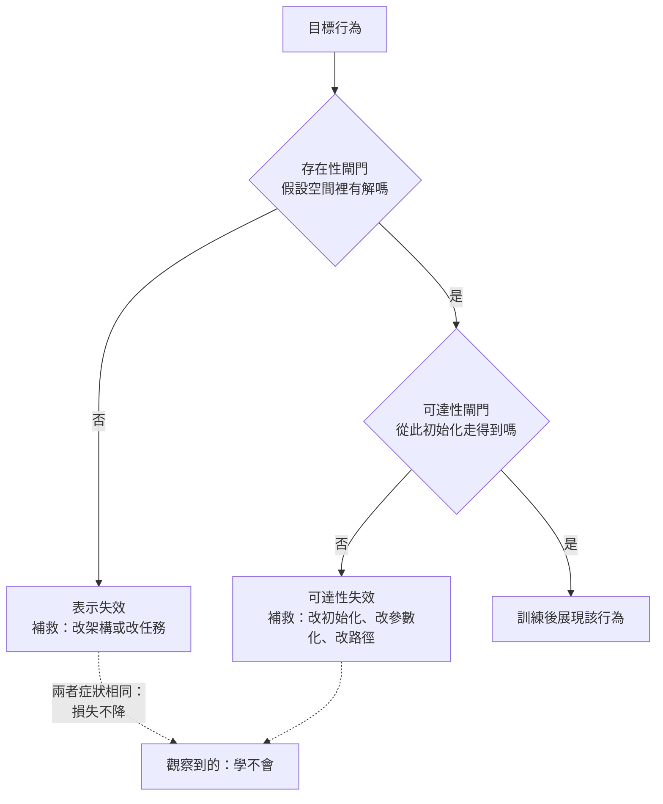

+++
title = "存得住不等於學得到：表示能力與最佳化可達性的分離"
date = "2026-09-08T21:34:02+08:00"
author = "TTL::0"
draft = false
isCJKLanguage = true
description = "一個團隊要模型學會一條需要串接多個步驟才能算出的規則。他們讀了容量不足的診斷，把網路從四層加到十二層，參數量翻了三倍。新模型的訓練損失幾乎不動，驗證表現比四層版本更差。"
tags = [
    "分析論述", # term:AnalyticalEssay
    "機器學習", # term:MachineLearning
    "假設空間", # term:HypothesisSpace
    "梯度下降", # term:GradientDescent
  ]
series = ["能力失效歸因：一個聚合讀數能證明什麼，不能證明什麼"]
[ai_info]
    [ai_info.generation]
        model = "Claude Opus 5"
        agent = "Claude Code VSCode Extension 2.1.261"
    [ai_info.refinement]
        model = "Claude Opus 5"
        agent = "Claude Code VSCode Extension 2.1.263"
+++

<!--more-->

## 導言

一個團隊要模型學會一條需要串接多個步驟才能算出的規則。他們讀了容量不足的診斷，把網路從四層加到十二層，參數量翻了三倍。新模型的訓練損失幾乎不動，驗證表現比四層版本更差。

結論寫在週會簡報上：「深度對這個任務沒有幫助，可能需要更多資料，或者這個任務本身不適合這類模型。」

這個結論有一個可以直接檢驗的漏洞，而檢驗方式很便宜：**手工把解構造出來，然後評估它**。如果那組手工權重確實把任務做對了，那麼「這類模型不適合」就被推翻了——解存在，而且就在**假設空間**（Hypothesis Space） <!-- term:HypothesisSpace -->裡。剩下的問題不是模型能不能表示，而是訓練程序能不能走到。

> [!IMPORTANT]
> **假設空間** <!-- term:HypothesisSpace --> (Hypothesis Space): 學習演算法可選函數所構成的集合，其大小決定泛化保證的鬆緊。 <!-- anchor:HypothesisSpace -->


這兩件事被同一個詞「能力」蓋住了。本文要處理的問題是：一個架構「能表示某個函數」與「訓練後會展現該行為」之間，是什麼關係？以及當兩者背離時，要用什麼證據把責任歸給其中一邊？

## 分析

先把兩個概念分開命名，因為後面所有的判斷都靠這個區分。

**表示能力**（expressivity）：假設空間 <!-- term:HypothesisSpace -->裡是否存在一組參數，使模型實現目標行為。這是關於集合的陳述，與訓練程序無關。

**最佳化可達性**（optimization reachability）：從實際使用的初始化出發，用實際使用的更新規則，在實際負擔得起的步數內，是否會抵達那組參數。這是關於一條路徑的陳述。

表示能力是可達性的必要條件，不是充分條件。集合裡有那個點，不表示從某個起點走得到。

### 兩道閘門，不是一道

下圖把這個結構外化。它要解決的閱讀問題是：一次「模型學不會」的事故，實際上可能卡在兩個不同位置，而兩者的補救動作互不相干。



圖的重點在底下那兩條虛線。兩種失效在儀表板上長得一樣——損失不降、驗證分數貼著隨機水準。加深、加寬、加資料這些動作全都作用在存在性閘門上；如果真正卡住的是可達性閘門，那些動作不但無效，還可能讓情況變壞，因為它們改變了損失地景的樣貌。

### 一個能實際執行的分離實驗

以下用一個能完整執行的最小系統把兩道閘門分開。模型是 $d$ 個純量參數的乘積：

$$
f(x) = \Big(\prod_{i=1}^{d} w_i\Big) x, \qquad L(w) = \Big(\prod_{i=1}^{d} w_i - 1\Big)^2.
$$

目標是讓乘積等於 $1$。這個目標的解在每個深度都存在，而且不只一個——把所有 $w_i$ 設成 $1$ 就是其中一組。所以存在性閘門在任何深度都通過，這一點不需要爭論，可以直接驗算。

操弄變因是深度 $d$；控制初始化（一律 $0.1$）、學習率（一律 $0.05$）與步數（一律 $20000$）；觀察量是初始梯度的最大絕對值、最終損失與最終乘積。

```python
def loss_and_grads(w):
    prod = 1.0
    for v in w: prod *= v
    residual = prod - 1.0
    grads = []
    for i in range(len(w)):
        other = 1.0
        for j, v in enumerate(w):
            if j != i: other *= v
        grads.append(2.0 * residual * other)
    return residual ** 2, grads, prod

def descend(depth, init, steps=20000, lr=0.05):
    w = [init] * depth
    l0, g0, _ = loss_and_grads(w)
    for _ in range(steps):
        l, g, _ = loss_and_grads(w)
        w = [wi - lr * gi for wi, gi in zip(w, g)]
    l, _, prod = loss_and_grads(w)
    return l0, max(abs(x) for x in g0), l, prod

print("depth  init_loss  init_max_grad  final_loss  final_product")
for d in (2, 4, 8, 16):
    l0, g0, l, prod = descend(d, 0.1)
    print(f"{d:5d}  {l0:9.6f}  {g0:13.3e}  {l:10.6f}  {prod:13.3e}")

print()
print("顯式構造（全部設為 1）:")
for d in (2, 4, 8, 16):
    l, _, prod = loss_and_grads([1.0] * d)
    print(f"  depth {d:2d}  loss {l:.1f}  product {prod:.1f}")
```

實際執行的輸出：

```text
depth  init_loss  init_max_grad  final_loss  final_product
    2   0.980100      1.980e-01    0.000000      1.000e+00
    4   0.999800      2.000e-03    0.000000      1.000e+00
    8   1.000000      2.000e-07    1.000000      1.016e-08
   16   1.000000      2.000e-15    1.000000      1.000e-16

顯式構造（全部設為 1）:
  depth  2  loss 0.0  product 1.0
  depth  4  loss 0.0  product 1.0
  depth  8  loss 0.0  product 1.0
  depth 16  loss 0.0  product 1.0
```

讀者要對照的是兩個區塊的同一列。深度 16 的那一列，訓練後損失是 $1.000000$，乘積是 $10^{-16}$——兩萬步之後參數幾乎沒動。而下方顯式構造的同一深度，損失是 $0$。**同一個假設空間 <!-- term:HypothesisSpace -->，同一個目標，一邊到不了，一邊直接就在那裡。**

深度 8 的那一列更說明問題的性質。乘積從初始的 $10^{-8}$ 走到 $1.016 \times 10^{-8}$，兩萬步移動了 1.6%。這不是收斂到一個較差的解，而是根本沒有離開起點。

### 因果機制：乘積結構讓梯度隨深度指數衰減

上面的現象有一個可以寫出來的成因。對第 $i$ 個參數求偏導：

$$
\frac{\partial L}{\partial w_i} = 2\Big(\prod_j w_j - 1\Big)\prod_{j \neq i} w_j .
$$

當所有 $w_j$ 初始化為 $\epsilon$ 時，右邊那個連乘是 $\epsilon^{d-1}$，而括號裡約為 $-1$。所以初始梯度的量級是

$$
\Big|\frac{\partial L}{\partial w_i}\Big| \approx 2\epsilon^{d-1}.
$$

以 $\epsilon = 0.1$ 代入：深度 2 得 $2 \times 10^{-1}$，深度 8 得 $2 \times 10^{-7}$，深度 16 得 $2 \times 10^{-15}$。輸出的第三欄逐格吻合這個式子。

因果鏈因此是：參數以乘積方式串接 → 單一參數的梯度含其餘參數的連乘 → 小初始化使該連乘隨深度指數衰減 → 有限步數內的位移小於任何有意義的尺度 → 解雖存在但不被抵達。

這條鏈裡沒有任何一步涉及「容量不足」。容量在深度 16 時比深度 2 更充裕，失效卻只在深的那一端出現。**深度同時增加了表示能力與抵達難度，而事故報告只看到前者。**

### 責任不在深度：固定深度的尺度掃描

前面的表格容易被讀成「深度有害」，因為失效恰好出現在深的那一端。這個讀法可以直接被否證：把深度固定，只改初始尺度。

```python
print("深度固定為 16，只改初始尺度")
print("init    初始最大梯度    最終損失     最終乘積")
for init in (0.1, 0.3, 0.5, 0.7, 0.9, 1.0):
    g0, l, prod = descend(16, init)
    print(f"{init:.1f}  {g0:14.3e}  {l:10.6f}  {prod:11.6f}")
```

實際執行的輸出：

```text
深度固定為 16，只改初始尺度
init    初始最大梯度    最終損失     最終乘積
0.1       2.000e-15    1.000000     0.000000
0.3       2.870e-08    1.000000     0.000000
0.5       6.103e-05    0.000000     1.000000
0.7       9.464e-03    0.000000     1.000000
0.9       3.355e-01    0.000000     1.000000
1.0       0.000e+00    0.000000     1.000000
```

深度在整張表裡都是 16。同一個架構、同一個目標、同一個更新規則、同一個步數預算，$0.3$ 失敗而 $0.5$ 成功。臨界落在兩者之間，對應初始梯度從 $10^{-8}$ 量級跨到 $10^{-5}$ 量級。

這推翻了「該深度不可訓練」這個說法。可訓練與否不是深度的屬性，而是深度與初始尺度共同決定的一個量——初始梯度的量級——是否落在有限步數能夠利用的範圍內。表格的第二欄才是真正的預測變數，深度只是影響它的因素之一。

最後一列有一個需要誠實標註的細節：$\text{init} = 1.0$ 時初始梯度恰為 $0$，損失也是 $0$。這不是「訓練成功」，而是初始點本身就是解，所以沒有任何路徑需要走。它在表裡的角色是邊界，不是最佳設定。

### 顯式構造測試：一個便宜的分流動作

前面的實驗提示了一個可以搬到真實系統的診斷動作，本文把它稱為**顯式構造測試**（explicit-construction test）：不要從訓練結果推論架構的能力，而是繞過訓練，直接把一組解放進去，然後評估它。

操作上有三種取得那組解的途徑，成本依序上升：

1. **手工構造**：任務有已知的程序解時，直接把權重寫成該程序的實現。乘積模型的「全部設為 1」屬於這一類。
2. **從較容易的設定遷移**：先在淺版本、短序列或簡化任務上訓練成功，再把權重嵌入目標架構。
3. **從答案反向擬合**：用目標行為產生的輸入輸出對，以強監督直接擬合，不要求走原本的訓練路徑。

三條途徑的判讀規則相同。若構造出的參數在評測上表現良好，存在性閘門通過，失效被定位到可達性；若構造出的參數表現同樣糟糕，則問題在存在性一側，或者目標行為本身的定義有誤。

這個測試的價值在於它把一個模糊的問題換成兩個明確的問題。「模型學不會」無法直接排查，因為它同時相容於兩種病因。「解存在但走不到」與「解不存在」則各自對應一組不重疊的補救動作，而且都可以被後續觀察推翻。

### 這是「從未取得」，不是「失去」

最後要標明這類失效在時間軸上的位置，因為它決定了哪些補救動作在邏輯上根本不適用。

可達性失效屬於**從未取得**：那個行為在任何時刻都沒有存在過。這與「曾有後失去」在操作上完全不同——後者存在一個較好的過去狀態可以回滾，前者沒有。對一個從未取得的能力執行回滾、還原檢查點、或比對版本差異，都是在一個不存在的狀態之間搜尋。

實務上的辨識線索是：訓練損失從一開始就沒有實質下降，而不是先下降後回升。前者指向可達性或存在性，後者才進入「更新改寫了既有行為」的討論。

## 反思

這裡最容易被誤讀的是把本文當成反對深度的論證。它不是。深度 16 的失效不是深度造成的，是深度與那個特定初始化尺度搭配之後才造成的——同一個深度換一個初始尺度就能通過。前面的式子直接給出這個結論：梯度量級是 $2\epsilon^{d-1}$，把 $\epsilon$ 從 $0.1$ 換成接近 $1$，指數衰減就消失。所以可操作的旋鈕是初始化尺度與參數化方式，不是深度本身。

這也劃出了本文主張的邊界：可達性是**參數化與路徑的性質**，不是架構的固有屬性。同一個函數可以用乘積形式寫，也可以用殘差形式寫；兩者的表示能力相同，損失地景卻不同。因此「這個架構不可訓練」這種說法幾乎總是不完整，缺少了初始化、參數化與更新規則這些條件。

一個反例可以顯示不能把所有失效都推給可達性。假設目標行為要求對輸入做一次精確的整數取模運算，而模型是一個沒有任何離散結構的淺層連續函數。此時顯式構造測試會失敗——寫不出那組權重，因為假設空間 <!-- term:HypothesisSpace -->裡確實沒有。這種情況下再怎麼調初始化、換最佳化器、加步數都不會有進展，因為卡住的是存在性閘門。把它誤診成可達性問題，會導致團隊在超參數空間裡搜索一個不存在的目標。

反方向的反例同樣要標出。顯式構造測試通過，也不保證訓練「應該」找到那組解。存在性只告訴我們目標在集合裡；訓練程序找到的可能是另一組同樣低損失、但行為不同的參數。所以構造測試的結論要寫成條件式：它排除了「表示不足」這個解釋，並沒有證明「只要調好就會學到那個特定解」。

最後一個限制關於實驗本身。上面的乘積模型是純量、無非線性、無隨機性的。它足以證明「解存在而路徑不可達」這個現象存在，不足以預測真實網路中衰減的具體速率。真實模型有非線性飽和、有隨機梯度的噪聲、有正規化層改變有效尺度，這些都會讓有效的衰減指數偏離 $d-1$。本文的主張是關於現象的存在性與診斷程序，不是關於量級的預測。

## 實務對比

**面對「損失不降」的第一個動作。** 錯誤做法是加深、加寬或加資料。這三個動作都作用在存在性閘門上，而該閘門很可能早就通過了。正確做法是先跑顯式構造測試：花一小時把一組已知解放進模型並評估。這一小時買到的是一個二分結論——存在性通過或不通過——而每一邊都指向不同的一組後續動作。

**判定一個架構是否適合任務。** 錯誤做法是訓練三次都失敗就結案「不適合」。訓練失敗是關於路徑的證據，不是關於集合的證據，兩者不能互推。正確做法是把主張寫成兩層：「在此初始化與此更新規則下，二十次嘗試皆未抵達」是一個誠實的可達性陳述；「該架構無法表示此函數」是一個更強的主張，需要顯式構造測試失敗來支撐。

**報告一次架構升級的結果。** 錯誤做法是寫「加深到十二層後表現變差，深度無益」。這句話把一個特定條件下的觀察寫成了關於深度的普遍結論，而且沒有記錄初始化尺度——那正是決定衰減指數的量。正確做法是同時記錄初始化尺度、初始梯度的量級與參數位移量。初始梯度是 $10^{-7}$ 這個事實，比「表現變差」提供的資訊多得多，因為它直接指向機制。

**設定一次失敗實驗的停止條件。** 錯誤做法是「跑到損失不再下降就停」。在可達性失效的情形下，損失從第一步就不下降，這個條件會在得到任何資訊之前就觸發。正確做法是把參數位移量列為並行的停止指標：若在預算內參數的相對位移小於某個預設下限，該次嘗試應被記為「未離開起點」，而不是「收斂到較差解」。這兩種記錄會導向完全不同的下一步。

## 結論

「模型有能力做某件事」這句話混合了兩個獨立的命題，而它們可以分別為真為假。表示能力說的是假設空間 <!-- term:HypothesisSpace -->裡存在那組參數；最佳化可達性說的是從實際起點用實際規則走得到那組參數。前者是集合的性質，後者是路徑的性質，前者為真不蘊含後者為真。

本文用一個可執行的乘積模型證明了這個分離：深度 16 時解存在且可被手工寫出，損失為 $0$；而**梯度下降**（Gradient Descent） <!-- term:GradientDescent -->兩萬步後參數幾乎沒有離開初始點，因為初始梯度的量級是 $2 \times 10^{-15}$。同一個假設空間 <!-- term:HypothesisSpace -->，一邊到不了，一邊直接就在那裡。

> [!IMPORTANT]
> **梯度下降** <!-- term:GradientDescent --> (Gradient Descent): 沿損失函數負梯度方向反覆更新參數的最佳化方法。 <!-- anchor:GradientDescent -->


由此得到三個可直接執行的判斷：

1. **「學不會」不是一個診斷**，它同時相容於存在性失效與可達性失效，而兩者的補救動作不重疊。
2. **顯式構造測試是分流這兩者的最便宜手段**——把一組已知解放進模型並評估，結果為二分，且兩邊都可被後續觀察推翻。
3. **可達性是參數化與路徑的性質，不是架構的固有屬性**，所以任何「這個架構不可訓練」的主張都必須附帶初始化尺度與更新規則，否則它不是一個可反駁的命題。

而在時間軸上，可達性失效屬於從未取得的那一類。對從未存在過的狀態執行回滾或版本比對，是在搜尋一個沒有出現過的過去。