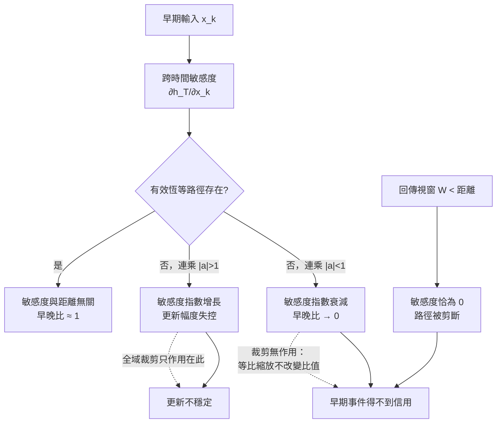

+++
title = "五十步之外沒有信用：跨時間梯度通道的取得失敗"
date = "2026-09-08T21:41:03+08:00"
author = "TTL::0"
draft = false
isCJKLanguage = true
description = "一個序列模型要在第 200 步回答一個問題，答案取決於第 3 步出現過的一個標記。任務本身很簡單：把早期看到的符號記住，在序列末端把它輸出。"
tags = [
    "分析論述", # term:AnalyticalEssay
    "機器學習", # term:MachineLearning
    "信用分配", # term:CreditAssignment
    "梯度消失", # term:VanishingGradient
  ]
series = ["能力失效歸因：一個聚合讀數能證明什麼，不能證明什麼"]
[ai_info]
    [ai_info.generation]
        model = "Claude Opus 5"
        agent = "Claude Code VSCode Extension 2.1.261"
    [ai_info.refinement]
        model = "Claude Opus 5"
        agent = "Claude Code VSCode Extension 2.1.263"
+++

<!--more-->

## 導言

一個序列模型要在第 200 步回答一個問題，答案取決於第 3 步出現過的一個標記。任務本身很簡單：把早期看到的符號記住，在序列末端把它輸出。

延遲設成 5 步時，模型準確率 99%。延遲設成 50 步時，準確率貼著隨機水準。

團隊查了訓練不穩定的常見處方，加上梯度範數裁剪，重跑。訓練曲線變得平滑許多，損失的抖動明顯減少。長延遲的準確率一動也沒動。

裁剪之所以不可能有效，有一個可以直接證明的理由，而它不依賴任何實驗細節：**全域範數裁剪是等比縮放，等比縮放不改變任何兩個梯度分量的比值**。信用在時間上的相對分配，在裁剪前後完全相同。

這個事故揭露的問題是：當一個架構在結構上能夠保存早期狀態，訓練後卻只對最近的輸入敏感時，失效發生在哪裡？以及要用什麼觀察量把它與其他症狀相同的失效分開？

## 分析

先把「記得住」與「學得到要記住」分開。前者是關於前向計算的陳述：隱藏狀態在數值上是否還攜帶早期資訊。後者是關於反向訊號的陳述：早期那個位置是否收到足以改變參數的更新。

一個系統可以前者為真而後者為假。狀態裡有那個資訊，但沒有任何梯度告訴模型應該去用它。這種情況下能力不是先存在再消失，而是**從未取得**。

### 敏感度沿時間的連乘

令狀態更新為 $h_t = F(h_{t-1}, x_t; \theta)$。末端損失對第 $k$ 步輸入的敏感度，要經過從 $T$ 回到 $k$ 的整條路徑：

$$
\frac{\partial h_T}{\partial h_k} = \prod_{t=k+1}^{T} J_t, \qquad J_t = \frac{\partial h_t}{\partial h_{t-1}}.
$$

這是一個連乘，項數等於時間距離。所以距離不是線性地增加難度，而是進入指數。

取一個最簡化的情形：$h_t = a\,h_{t-1} + x_t$。此時 $J_t = a$，於是

$$
\frac{\partial h_T}{\partial x_k} = a^{\,T-1-k}.
$$

**信用分配**（Credit Assignment） <!-- term:CreditAssignment -->的問題就落在這個式子上。$|a| < 1$ 時，早期輸入的敏感度隨距離指數衰減；$|a| > 1$ 時指數增長。只有 $|a| = 1$ 這條邊界上，遠近一致。

> [!IMPORTANT]
> **信用分配** <!-- term:CreditAssignment --> (Credit Assignment): 判定某個結果應歸因於哪些參數或決策步驟的問題。 <!-- anchor:CreditAssignment -->


### 三個症狀相同的失效，一個對它們都無效的處方

下面的程式把上面的式子做成可觀察的量。它同時計算三件事：不同 $a$ 之下的逐距離敏感度、全域裁剪對這些敏感度的作用、以及截斷回傳的效果。

操弄變因是 $a$ 與回傳視窗；控制序列長度（50）與裁剪門檻（1.0）；觀察量是早期與晚期的敏感度、兩者的比值，以及裁剪前後該比值的變化。

```python
T = 50

def sensitivities(a, gated=False):
    if gated:                      # h_t = h_{t-1} + g_t * u_t，恆等路徑
        return [1.0 for _ in range(T)]
    return [a ** (T - 1 - k) for k in range(T)]

def clip(vec, max_norm=1.0):
    norm = sum(v * v for v in vec) ** 0.5
    if norm <= max_norm:
        return vec, norm, 1.0
    scale = max_norm / norm
    return [v * scale for v in vec], norm, scale

print("a      早期 k=0     晚期 k=49    早晚比        裁剪前範數  縮放係數  裁剪後早晚比")
for a in (0.80, 0.95, 1.00, 1.05, 1.20):
    g = sensitivities(a)
    ratio = g[0] / g[-1]
    gc, norm, scale = clip(g)
    print(f"{a:.2f}  {g[0]:11.3e}  {g[-1]:10.3e}  {ratio:11.3e}"
          f"  {norm:10.3e}  {scale:8.3e}  {gc[0] / gc[-1]:12.3e}")

print()
g = sensitivities(0.0, gated=True)
gc, _, _ = clip(g)
print(f"恆等路徑  早期 {g[0]:.3f}  晚期 {g[-1]:.3f}"
      f"  早晚比 {g[0]/g[-1]:.3f}  裁剪後早晚比 {gc[0]/gc[-1]:.3f}")

print()
print("截斷回傳：只回傳最後 W 步，早於 W 的敏感度被設為 0")
for W in (5, 20, 50):
    g = sensitivities(0.95)
    trunc = [(v if (T - 1 - k) < W else 0.0) for k, v in enumerate(g)]
    reachable = sum(1 for v in trunc if v != 0.0)
    print(f"  W={W:2d}  可獲得信用的步數 {reachable:2d}/{T}  k=0 的敏感度 {trunc[0]:.3e}")
```

實際執行的輸出：

```text
a      早期 k=0     晚期 k=49    早晚比        裁剪前範數  縮放係數  裁剪後早晚比
0.80    1.784e-05   1.000e+00    1.784e-05   1.667e+00  6.000e-01     1.784e-05
0.95    8.099e-02   1.000e+00    8.099e-02   3.193e+00  3.132e-01     8.099e-02
1.00    1.000e+00   1.000e+00    1.000e+00   7.071e+00  1.414e-01     1.000e+00
1.05    1.092e+01   1.000e+00    1.092e+01   3.568e+01  2.803e-02     1.092e+01
1.20    7.584e+03   1.000e+00    7.584e+03   1.372e+04  7.289e-05     7.584e+03

恆等路徑  早期 1.000  晚期 1.000  早晚比 1.000  裁剪後早晚比 1.000

截斷回傳：只回傳最後 W 步，早於 W 的敏感度被設為 0
  W= 5  可獲得信用的步數  5/50  k=0 的敏感度 0.000e+00
  W=20  可獲得信用的步數 20/50  k=0 的敏感度 0.000e+00
  W=50  可獲得信用的步數 50/50  k=0 的敏感度 8.099e-02
```

第一個區塊裡要看的是最後兩欄的關係。縮放係數從 $6 \times 10^{-1}$ 一路變到 $7.3 \times 10^{-5}$，變動了四個數量級；而「裁剪後早晚比」與「早晚比」**逐列完全相同**。

這不是巧合，是等比縮放的定義。裁剪把整個向量乘上同一個純量 $s$，於是

$$
\frac{s \cdot g_{\text{早}}}{s \cdot g_{\text{晚}}} = \frac{g_{\text{早}}}{g_{\text{晚}}} .
$$

比值與 $s$ 無關。所以裁剪能做的事只有一件：把更新的**總幅度**壓回門檻之內。它對信用在時間上的**分配**沒有任何作用力。$a = 1.2$ 那一列裡，早期敏感度是晚期的 7584 倍，裁剪後仍然是 7584 倍——爆炸的方向性被完整保留，只是整體變小了。

### 為什麼「有記憶單元」不是判別依據

第二個區塊給出對照。恆等路徑的早晚比是 $1.000$，而且裁剪後仍是 $1.000$。

這裡的機制值得寫清楚，因為它常被含糊地說成「門控解決了**梯度消失**（Vanishing Gradient） <!-- term:VanishingGradient -->」。設更新為

> [!IMPORTANT]
> **梯度消失** <!-- term:VanishingGradient --> (Vanishing Gradient): 梯度沿深度或時間反向傳播時逐層衰減，使早期參數幾乎收不到更新訊號的現象。 <!-- anchor:VanishingGradient -->


$$
h_t = h_{t-1} + g_t \odot u_t ,
$$

則 $\partial h_t / \partial h_{t-1} = I$，於是整條路徑的連乘是 $I$，與距離無關。真正起作用的不是「有一個叫做記憶的元件」，而是**存在一條導數恆為單位的加法路徑**。

這個區分有操作後果。一個帶門控的架構，若門在訓練中飽和到接近零，那條加法路徑實際上被關閉，連乘重新出現，衰減照樣發生。反過來，一個不叫做記憶單元的殘差連接同樣提供恆等路徑，效果一致。因此診斷時該問的是「有效的恆等路徑存在嗎」，不是「用了哪一種單元」。

### 第三種失效：不是衰減，是結構性歸零

第三個區塊呈現一個完全不同的機制。截斷回傳把視窗外的敏感度設為**恰好零**，不是很小。

$W = 5$ 與 $W = 20$ 時，$k=0$ 的敏感度是 `0.000e+00`。這與 $a = 0.8$ 那一列的 `1.784e-05` 有本質差別：後者是小到無效，前者是根本不存在。前者可以靠改變 $a$、改變初始化或延長訓練來搶救；後者不論怎麼調數值都不會改變，因為那條路徑在計算圖上已經被剪斷了。

下圖把三條失效路徑與各自的補救位置外化。它要解決的閱讀問題是：同一個症狀「長延遲學不到」對應三個不同的介入點。



圖的關鍵是右下兩條虛線。裁剪的作用點只在更新幅度那一側；它與左邊那條衰減路徑之間沒有連線，而這正是前面實驗證明的事。

### 總梯度範數對時間分佈完全盲目

實務上最常被記錄的量是梯度的總範數，因為它是一個數字、容易畫成曲線、而且裁剪本來就需要它。下面的構造顯示這個量無法承載本文關心的任何資訊。

```python
T = 50
def norm(v): return sum(x*x for x in v) ** 0.5

decay = [0.95 ** (T - 1 - k) for k in range(T)]                  # 連乘衰減，處處非零
trunc = [(1.0 if (T - 1 - k) < 10 else 0.0) for k in range(T)]   # 恆等但只回傳最後 10 步

def early_mass(v, first=20):
    tot = sum(abs(x) for x in v)
    return sum(abs(x) for x in v[:first]) / tot

print("設定              總範數    k=0 敏感度   前 20 步佔總信用   零敏感度步數")
for name, v in (("連乘衰減 a=0.95", decay), ("截斷恆等 W=10 ", trunc)):
    zeros = sum(1 for x in v if x == 0.0)
    print(f"{name}  {norm(v):7.3f}  {v[0]:11.3e}  {early_mass(v):16.4f}  {zeros:12d}")

print()
print(f"兩者總範數差距: {abs(norm(decay) - norm(trunc)):.4f}  "
      f"（相對差 {abs(norm(decay)-norm(trunc))/norm(decay)*100:.1f}%）")
```

實際執行的輸出：

```text
設定              總範數    k=0 敏感度   前 20 步佔總信用   零敏感度步數
連乘衰減 a=0.95    3.193    8.099e-02            0.1492             0
截斷恆等 W=10     3.162    0.000e+00            0.0000            40

兩者總範數差距: 0.0308  （相對差 1.0%）
```

兩個設定的總範數是 $3.193$ 與 $3.162$，相差 1%。任何以總範數為觀察量的監測都會判定這兩個訓練狀態相同。

而它們的信用分配 <!-- term:CreditAssignment -->沒有任何相似之處。第一個設定在每一步都收得到非零訊號，前 20 步承擔了 14.9% 的總信用；第二個設定有 40 步的敏感度**恰好為零**，早期信用佔比是 0。

這兩種狀態需要完全不同的處置：第一種可以靠改變有效的 $a$ 來搶救，第二種只能靠延長回傳視窗。**總範數對這個區分完全盲目**，因為它把時間位置與方向性一起平均掉了。可判讀的量是敏感度沿時間的分佈本身，以及該分佈中恰好為零的步數。

### 分流這三者的最小觀察集

要判定一次長程失敗屬於哪一種，需要的不是更多訓練，而是三個並行的觀察量：

1. **延遲掃描**：固定模型、資料量、參數量與訓練步數，只改變任務所需的時間距離，記錄每個距離的表現。這回答「失敗是否隨距離出現」。
2. **逐距離敏感度**：直接量測 $\|\partial L / \partial h_k\|$ 隨 $k$ 的分佈，而不是只看總梯度範數。這回答「訊號是衰減、爆炸，還是恰好為零」。
3. **回傳視窗與距離的關係**：確認實際使用的截斷長度是否短於任務要求的距離。這回答「路徑是否在計算圖上被剪斷」。

三者並看才能區分：近距離成功而遠距離失敗、敏感度隨距離指數下降、且視窗長於距離——這一組觀察支持衰減假說。若視窗短於距離，則不需要討論衰減，先修視窗。若各距離的表現都一樣差，則失敗與距離無關，該去找別的原因。

這組觀察也給出反駁條件：若長延遲的表現改善了，而逐距離敏感度的分佈沒有對應變化，那麼「梯度通道被修復」不是該次改善的機制，必須另找解釋。

## 反思

小梯度不必然是錯誤。這是本文主張最重要的邊界。如果遠端事件與當前任務確實無關，模型抑制它是正確的行為，而衰減的敏感度正是這種正確抑制的表現。把所有的小梯度都當成病症，會導向一個奇怪的目標：強迫模型對無關的歷史保持敏感。

因此信用分配 <!-- term:CreditAssignment -->的故事只有在一組條件下才成立：資料生成程序明確要求遠端依賴、模型在近距離的控制組成功、而遠距離失敗。缺少近距離控制組，「長程失敗」與「這個任務根本沒學會」無法分開。

一個反例可以顯示單一聚合量的不足。考慮一個帶加法路徑的門控網路，其中某些局部導數確實很小，但那條近似恆等的路徑仍然把訊號傳過去。此時總梯度範數可能不大，長程能力卻完好。反方向也存在：總範數很大，但大的部分全集中在最後幾步，早期依然是零。**平均梯度範數會同時掩蓋這兩種情形**，因為它把方向性與時間位置都平均掉了。可判讀的量是敏感度沿時間的分佈，不是它的總和。

本文的實驗也有明確限制。它用的是純量遞迴，$J_t$ 退化成一個數。真實網路的 $J_t$ 是矩陣，矩陣不可交換，連乘的行為由奇異值的分佈決定而非單一數值；非線性飽和會讓有效的 $J_t$ 隨狀態改變；門的開合使有效路徑隨輸入變動。所以純量模型能證明「距離放大微小的局部差異」這個現象，不能預測特定網路在特定資料上的衰減速率。

至於裁剪的那個結論，強度不同。它不依賴模型是純量或矩陣，只依賴一個代數事實：等比縮放保持比值。任何形式的全域範數裁剪都受此約束。**這是一個可以先驗排除的補救動作，不是一個經驗上通常無效的動作。**

## 實務對比

**長序列表現不佳時的第一個動作。** 錯誤做法是一律降低學習率。降低學習率會緩和爆炸那一側，但它同樣是等比的操作，對已經微弱的訊號只會讓有效更新更小。正確做法是先跑延遲掃描，確認失敗與距離的關係存在，再量逐距離敏感度以判斷屬於衰減、爆炸或歸零。三種判斷各自對應不同的下一步，而降低學習率只對其中一種有意義。

**用訓練損失證明記憶能力。** 錯誤做法是在短序列上訓練到收斂，然後宣稱模型具備記憶能力。短序列的成功只證明模型在該視窗內可用，不涉及可延伸性。正確做法是把訓練長度與測試長度分開設計，並記錄表現隨測試長度的變化曲線。若曲線在訓練長度處斷崖，模型取得的是視窗內的規則，不是可延伸的規則。

**報告一次穩定性修復。** 錯誤做法是寫「加入梯度裁剪後訓練穩定，長程問題已緩解」。這句話把兩件事綁在一起，而其中一件在代數上不可能由該動作達成。正確做法是分開陳述：更新幅度的分佈已被壓回門檻內，這是裁剪的效果；逐距離敏感度的分佈未變，因此長程信用分配 <!-- term:CreditAssignment -->未受影響。兩句話同時為真，而只有第二句回答了原本的問題。

**設定截斷長度。** 錯誤做法是按記憶體預算選一個視窗，然後在任務需要更長距離時歸因於「模型記不住」。視窗外的敏感度是恰好零，這是實作的選擇造成的，不是模型的性質。正確做法是先寫下任務要求的最大時間距離，再讓視窗至少覆蓋它；若記憶體不允許，該記錄的是「本次訓練在結構上排除了超過 W 步的依賴」，而不是關於模型能力的結論。

## 結論

遞迴架構在結構上保存早期狀態的能力，與訓練程序把信用分配 <!-- term:CreditAssignment -->給早期事件的能力，是兩件事。前者是前向計算的性質，後者取決於跨時間敏感度的分佈，而該分佈由一個項數等於時間距離的連乘決定。

本文用可執行的量測把三種症狀相同的失效分開，並得到一個代數上確定的結論：**全域梯度裁剪不可能修復長程信用分配** <!-- term:CreditAssignment -->。實測顯示縮放係數變動四個數量級，而早期與晚期敏感度的比值逐列不變——因為等比縮放保持比值。裁剪處理的是更新幅度，衰減處理的是更新分配，兩者無交集。

由此，面對一次「長程依賴學不到」，要分別回答三個問題：

1. **失敗是否隨時間距離出現**——近距離控制組成功而遠距離失敗，才使距離成為可疑變因；各距離都失敗則該找別的原因。
2. **敏感度是衰減、爆炸，還是恰好為零**——前兩者是數值問題，可靠參數化與初始化處理；後者是計算圖被剪斷，只能靠改視窗處理。
3. **有效的恆等路徑是否存在**——判別依據是導數恆為單位的加法路徑是否暢通，不是使用了哪一種單元的名稱。

而在時間軸上，這類失效屬於從未取得。沒有一個「還記得住的過去版本」可以回滾，因為那個行為在任何時刻都沒有被學到過。