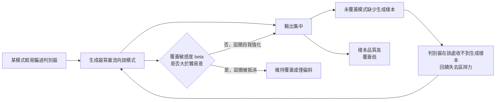

+++
title = "少了模式，分數不會說：覆蓋損失的證據要另外找"
date = "2026-09-08T21:52:04+08:00"
author = "TTL::0"
draft = false
isCJKLanguage = true
description = "一個生成模型的每週評審流程是這樣的：訓練跑完，工程師從輸出裡挑 16 張最好的圖貼進評審文件，團隊看過覺得比上週更逼真，通過。連續七週，評審記錄上的判斷都是「品質持續改善」。"
tags = [
    "分析論述", # term:AnalyticalEssay
    "大型語言模型", # term:LargeLanguageModel
    "分佈覆蓋", # term:DistributionCoverage
  ]
series = ["能力失效歸因：一個聚合讀數能證明什麼，不能證明什麼"]
[ai_info]
    [ai_info.generation]
        model = "Claude Opus 5"
        agent = "Claude Code VSCode Extension 2.1.261"
    [ai_info.refinement]
        model = "Claude Opus 5"
        agent = "Claude Code VSCode Extension 2.1.263"
+++

<!--more-->

## 導言

一個生成模型的每週評審流程是這樣的：訓練跑完，工程師從輸出裡挑 16 張最好的圖貼進評審文件，團隊看過覺得比上週更逼真，通過。連續七週，評審記錄上的判斷都是「品質持續改善」。

第八週，下游團隊回報一個問題：某一整類內容從來沒有出現過。

回查訓練記錄，那個類別在資料裡佔 12%，不是罕見樣本。回查評審記錄，七週的 112 張圖裡，那個類別出現零次。沒有人注意到，因為評審流程從來不問「什麼沒有出現」——它問的是「出現的東西夠不夠好」。

這個事故的成因不在模型，而在評審協議的結構。**挑選最佳樣本這個動作，在設計上就無法偵測缺失。** 一個只覆蓋單一模式的生成器，其最佳樣本可以與一個完整覆蓋的生成器一樣好，甚至更好——因為它把全部容量投在一個區域。

由此產生兩個必須分別回答的問題。第一，要用什麼觀察量才能證明失去的是模式，而不是樣本品質或評估器偏差？第二，一旦確認模式確實缺失，什麼機制解釋這個缺失，以及該機制在什麼條件下才會發生？

## 分析

先把兩個容易被同一個詞蓋住的量分開。

**樣本品質**（sample quality）：生成出來的東西有多像真的。它是對已生成樣本的陳述。

**分佈覆蓋**（Distribution Coverage） <!-- term:DistributionCoverage -->：目標分佈裡的各個區域有多少被生成分佈觸及。它是對未生成的東西的陳述。

> [!IMPORTANT]
> **分佈覆蓋** <!-- term:DistributionCoverage --> (Distribution Coverage): 生成分佈涵蓋目標分佈中各個模式的程度，與單一樣本的品質是不同的觀察量。 <!-- anchor:DistributionCoverage -->


第二個量的特殊之處在於它關於缺席。任何只檢視已生成樣本的協議——包括挑最佳、算平均品質、看使用者評分——都無法直接觀察它。

### 兩個量各有盲區

下面的程式把四種生成器放進同一套量測。真實分佈是四個等機率模式；四種生成器分別是完整覆蓋、只剩單一模式、九成質量集中在單一模式、以及覆蓋但變異過大。

操弄變因是生成分佈；控制樣本數（2000）、模式內變異與量測程序；觀察量是品質（每個生成樣本到最近真實樣本的平均距離）與召回（有多少真實樣本被生成分佈覆蓋 <!-- term:DistributionCoverage -->）。

```python
import random
random.seed(7)
CENTERS = [-3.0, -1.0, 1.0, 3.0]
N, SIGMA, TAU = 2000, 0.2, 0.6

def draw(weights):
    out = []
    for _ in range(N):
        r, acc = random.random(), 0.0
        for c, w in zip(CENTERS, weights):
            acc += w
            if r <= acc:
                out.append(random.gauss(c, SIGMA)); break
        else:
            out.append(random.gauss(CENTERS[-1], SIGMA))
    return out

real = draw([0.25] * 4)

def quality(fake):
    return sum(min(abs(f - r) for r in real) for f in fake) / len(fake)

def recall(fake):
    return sum(1 for r in real if any(abs(r - f) < TAU for f in fake)) / len(real)

cases = {
    "covered   四模式均勻": draw([0.25] * 4),
    "collapsed 只剩一個模式": draw([0.0, 0.0, 0.0, 1.0]),
    "skewed    一模式佔九成": draw([0.033, 0.033, 0.034, 0.90]),
    "blurry    覆蓋但高變異": [random.gauss(random.choice(CENTERS), 1.4) for _ in range(N)],
}
print("case                     quality(越小越好)  recall(越大越好)")
for name, fake in cases.items():
    print(f"{name:24s} {quality(fake):17.4f}  {recall(fake):15.4f}")
```

實際執行的輸出：

```text
case                     quality(越小越好)  recall(越大越好)
covered   四模式均勻                     0.0016           1.0000
collapsed 只剩一個模式                    0.0019           0.2415
skewed    一模式佔九成                    0.0017           1.0000
blurry    覆蓋但高變異                    0.2369           1.0000
```

第一列與第二列的對照是預期中的：品質幾乎相同（$0.0016$ 對 $0.0019$），召回卻從 $1.0$ 掉到 $0.24$。品質量測看不見坍縮，這證實了挑最佳樣本的協議為何會漏掉整個類別。

但真正值得停下來的是第三列。九成質量壓在單一模式上，這是一個嚴重的偏斜；而召回仍然是 $1.0000$。原因在召回的定義：它問的是每個真實樣本附近是否存在**至少一個**生成樣本。稀薄的覆蓋與充分的覆蓋在這個二元判準下無法區分。

所以結論比「品質不足以判定覆蓋」更嚴厲：**品質看不見坍縮，召回看不見偏斜，兩者一起用仍有共同盲區。** 第四列補上最後一塊——品質確實抓到了模糊（$0.2369$），而召回對此完全不敏感。

四列合起來說明，任何兩個聚合量並用都不保證覆蓋盲區被填滿。可判讀的量是**逐模式質量**本身，也就是生成分佈在各區域上的機率，而不是任何把它壓縮成單一數值的函數。

### 坍縮的機制，以及它何時不發生

確認模式缺失之後，下一個問題是為什麼。常見的說法是「生成器與判別器的對抗動態造成坍縮」，但這個說法沒有給出條件——它無法解釋為什麼同樣的對抗訓練有時不坍縮。

下面的模型把條件寫出來。它有兩個關鍵量：各模式「容易騙過判別器」的程度差異，以及判別器對過度代表的敏感度 $\beta$。生成器只追當下最有利的模式，不含任何多樣性項。

```python
from math import log
K, REAL = 4, 0.25
EASE = [0.00, 0.05, 0.10, 0.30]      # 各模式「容易騙過判別器」的程度，第 4 個最容易

def run(beta, eta=0.15, steps=200):
    g = [0.25] * K
    for _ in range(steps):
        d = [-EASE[i] + beta * (g[i] - REAL) for i in range(K)]
        best = min(range(K), key=lambda i: d[i])
        g = [(1 - eta) * g[i] + (eta if i == best else 0.0) for i in range(K)]
    return g

def entropy(g):
    return -sum(p * log(p) for p in g if p > 1e-12)

print("beta(判別器覆蓋敏感度)  最大模式質量  活躍模式數  熵(上限 1.386)  判定")
for beta in (0.0, 0.1, 0.3, 0.6, 1.2, 2.0):
    g = run(beta)
    active = sum(1 for p in g if p > 0.01)
    verdict = "坍縮" if active <= 2 else ("偏斜" if max(g) > 0.4 else "維持覆蓋")
    print(f"{beta:21.2f}  {max(g):12.4f}  {active:10d}  {entropy(g):14.4f}  {verdict}")
```

實際執行的輸出：

```text
beta(判別器覆蓋敏感度)  最大模式質量  活躍模式數  熵(上限 1.386)  判定
                 0.00        1.0000           1          0.0000  坍縮
                 0.10        1.0000           1          0.0000  坍縮
                 0.30        0.7208           2          0.5922  坍縮
                 0.60        0.4656           4          1.1491  偏斜
                 1.20        0.4124           4          1.2994  偏斜
                 2.00        0.3304           4          1.3567  維持覆蓋
```

輸出呈現一個單調的轉變，而轉變的位置可以與參數對上。模式間的難易差是 $0.30 - 0.00 = 0.30$。當 $\beta$ 明顯小於這個差距時，難易差主導，質量全部流向最容易的模式；當 $\beta$ 上升到與該差距相當時，覆蓋懲罰開始抵抗，活躍模式數回到四個；再往上，分佈趨近均勻。

因此坍縮的條件可以寫成一句可檢驗的話：**當判別器對過度代表的敏感度低於模式間的難易差時，質量會流向最容易的模式並停在那裡。** 這比「對抗動態會造成坍縮」有用得多，因為它指出了兩個可以分別量測與干預的量。

下圖把這條迴圈與它的閘門外化。它要解決的閱讀問題是：迴圈在哪一步可以被打斷。



圖的重點是那個菱形閘門。它說明迴圈不是必然自我強化的——它有一個可以計量的抵抗條件。批次內多樣性、目標函數的形式、判別器與生成器的更新比例，這些常被列舉的因素之所以有效，是因為它們都在提高有效的 $\beta$；它們不是各自獨立的偏方，而是同一個量的不同實現途徑。

### 分流三種解釋的最小對照

觀察到「輸出集中」之後，至少有三個候選解釋，而它們需要不同的對照才能分開：

| 候選解釋 | 需要的對照 | 反駁條件 |
| :--- | :--- | :--- |
| 生成分佈確實失去模式 | 固定取樣程序與評估器，只換生成器版本 | 逐模式質量未下降，則不成立 |
| 取樣程序造成的假象 | 固定生成器，移除任何挑選、溫度或截斷 | 移除挑選後集中消失，則歸因於取樣 |
| 評估器把不同模式判成同一個 | 固定生成器與取樣，只換表示或距離定義 | 換評估器後集中消失，則歸因於評估器 |

第三列值得強調，因為它最常被跳過，而它的效果比直覺預期的大得多。下面的程式固定資料、固定生成器，只改評估器的距離門檻。

```python
def modes_at(tau, pts):                    # 單連結：距離小於 tau 者視為同一模式
    s = sorted(pts); count = 1
    for a, b in zip(s, s[1:]):
        if b - a >= tau: count += 1
    return count

def recall_at(tau, fake):
    return sum(1 for r in real if any(abs(r - f) < tau for f in fake)) / len(real)

collapsed = draw([0.0, 0.0, 0.0, 1.0])
print("評估器門檻 tau   真實資料的「模式數」   坍縮生成器的 recall   會得出的結論")
for tau in (0.3, 0.6, 1.0, 2.0, 4.0, 7.0):
    m, rc = modes_at(tau, real), recall_at(tau, collapsed)
    verdict = "覆蓋完整" if rc > 0.95 else ("嚴重缺模式" if rc < 0.5 else "部分缺失")
    print(f"{tau:12.1f}   {m:19d}   {rc:19.4f}   {verdict}")
```

實際執行的輸出：

```text
評估器門檻 tau   真實資料的「模式數」   坍縮生成器的 recall   會得出的結論
         0.3                     4                0.2415   嚴重缺模式
         0.6                     4                0.2415   嚴重缺模式
         1.0                     1                0.2640   嚴重缺模式
         2.0                     1                0.4750   嚴重缺模式
         4.0                     1                0.7390   部分缺失
         7.0                     1                1.0000   覆蓋完整
```

資料沒有換，生成器沒有換。只有評估器的門檻在變，而結論從「資料有四個模式、生成器嚴重缺失」一路走到「資料只有一個模式、生成器覆蓋完整」。

$\tau = 1.0$ 那一列還暴露了一個更難處理的問題：評估器判定資料只有一個模式，同時判定生成器只覆蓋該模式的 26%。「模式數」與「覆蓋率」在這個設定下說著互相矛盾的話，因為兩者都由同一個門檻定義，而該門檻並不是為了同時支撐這兩個量而選的。

所以第三列的對照不是一個補充檢查，而是覆蓋這個概念的前提。**在門檻與表示被固定並宣告之前，「少了一個模式」不是一個有真假值的命題。** 評估器把兩類判成同一類時覆蓋看起來完好；把一類判成兩類時覆蓋看起來破損。兩種錯誤都會偽裝成生成器的性質。

## 反思

低多樣性不必然是失效。這是本文主張的第一個邊界。條件生成若固定同一個類別，輸出集中正是契約要求的行為；此時追求四個模式是評估錯誤，不是模型改善。同樣地，若真實資料本身只有一個模式，那麼完整覆蓋就等於單一模式，任何「多樣性不足」的判定都是把評估者的預期當成了資料的性質。

第二個邊界更根本，而且本文無法在自身範圍內解決：**模式數不是資料自然給定的**。上面的實驗預先知道有四個中心，所以逐模式質量可以直接計算。真實高維資料沒有這個特權——所謂「語義模式」隨表示與距離定義而改變，換一個編碼器就可能得到不同的模式數。因此本文所有關於覆蓋的結論都攜帶一個前提：模式的劃分已被固定且宣告。這個前提是否成立、以及該由誰決定，是另一個問題，本文不在此處成立或否證它，但任何援引本文結論的評估都必須先把該劃分寫下來。

一個雙向的反例可以標出品質與覆蓋的獨立性。生成器可以覆蓋所有模式而每個樣本都模糊——覆蓋指標良好，品質很差；也可以只產出少數極高品質的樣本——品質極佳，召回很低。這兩種失效在單軸評估下會被排成不同的順序，取決於挑了哪個軸。因此「哪個模型更好」在單軸上不是一個有定義的問題，除非事先宣告了兩軸之間的取捨。

最後，本文的迴圈模型是離散、低維、且把判別器簡化成一個純量懲罰的。它足以證明「坍縮有一個可計量的抵抗條件」這個結構性主張，不足以預測真實訓練中的臨界值。真實系統裡難易差不是常數，會隨生成器改變；$\beta$ 也不是超參數，而是判別器容量、更新次數與正則化共同決定的隱含量。

## 實務對比

**每週評審的取樣方式。** 錯誤做法是挑 16 張最佳圖片。這個動作與覆蓋量測在結構上不相容：它只檢視已生成樣本中最好的那些，而覆蓋是關於缺席的陳述。正確做法是固定一個無人工挑選的取樣程序，報告逐模式質量、近鄰重複率，並且明確列出零出現的區域。零出現這一欄比任何品質分數都重要，因為它是唯一直接回答缺席問題的觀察。

**以生成器損失判斷訓練進展。** 錯誤做法是看到生成損失下降就宣稱模型改善。對抗損失的尺度依賴當前判別器的狀態，判別器變弱時生成損失也會下降，而這與生成分佈無關。正確做法是在固定的外部評估器與固定的真實測試集上比較，並保留多個隨機種子；同時記錄判別器的區辨表現，因為生成損失只有在判別器狀態可比時才可比。

**回報覆蓋良好。** 錯誤做法是報告召回等於 1.0 就結案。前面的實驗顯示，九成質量壓在單一模式時召回仍是 $1.0000$——這個判準只問附近有無樣本，不問有多少。正確做法是同時報告逐模式質量與其分佈的離散程度；召回作為門檻式指標可以保留，但它不能單獨支撐「覆蓋良好」這個結論。

**歸因一次覆蓋下降。** 錯誤做法是看到覆蓋指標變差就調整訓練配方。覆蓋下降至少相容於三個機制，其中兩個與生成器無關。正確做法是先跑那三個對照：固定取樣與評估器只換生成器版本、固定生成器移除挑選程序、固定生成器與取樣只換表示。三個對照各自可以推翻一個候選解釋，而配方調整只在第一個對照確認之後才有目標。

## 結論

樣本品質是關於已生成樣本的陳述，分佈覆蓋 <!-- term:DistributionCoverage -->是關於缺席的陳述。任何只檢視已生成內容的協議都無法觸及後者，這是結構上的限制，不是靈敏度不足。

本文的量測給出比預期更嚴厲的結果：品質量測看不見坍縮（$0.0016$ 對 $0.0019$），召回看不見九成質量集中在單一模式的偏斜（仍為 $1.0000$），而兩者一起用仍留有共同盲區。可判讀的量是逐模式質量本身，不是任何把它壓縮成單一數值的函數。

在機制一側，坍縮不是對抗訓練的必然後果，而是有條件的。實測顯示，當判別器對過度代表的敏感度低於模式間的難易差時，質量流向最容易的模式並停留；當該敏感度上升到與難易差相當時，活躍模式數即回復。常被列舉的緩解手段之所以有效，是因為它們都在提高同一個量。

因此一個完整的覆蓋損失主張需要三項並立的證據：

1. **逐模式質量確實下降**，在固定取樣程序與固定評估器的條件下取得。
2. **集中不是取樣或評估器造成**，各以一個只替換該環節的對照排除。
3. **模式的劃分已事先宣告**，因為缺少這個宣告，「少了一個模式」不是一個有定義的命題。

三項缺一，手上握有的是一組看起來不夠多樣的樣本，不是一個關於生成能力的結論。