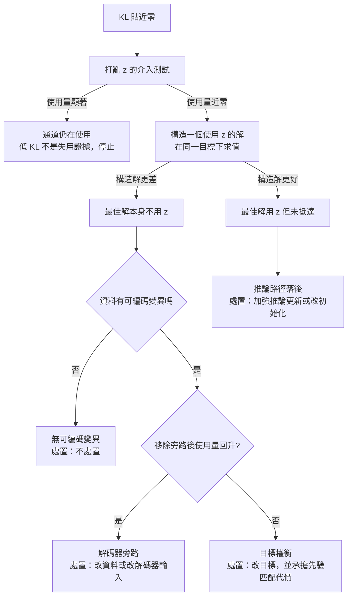

+++
title = "同一個低 KL，四種病因：潛在通道失用的成因分流"
date = "2026-09-08T22:03:05+08:00"
author = "TTL::0"
draft = false
isCJKLanguage = true
description = "一個團隊訓練帶潛在變數的生成模型，儀表板上的 KL 項在第三個 epoch 之後貼在 $0.003$ 附近不動。有人查了常見的處方，把 KL 的權重從 $1.0$ 降到 $0.1$。"
tags = [
    "分析論述", # term:AnalyticalEssay
    "機器學習", # term:MachineLearning
    "證據下界", # term:EvidenceLowerBound
    "損失函數", # term:LossFunction
    "梯度下降", # term:GradientDescent
  ]
series = ["能力失效歸因：一個聚合讀數能證明什麼，不能證明什麼"]
[ai_info]
    [ai_info.generation]
        model = "Claude Opus 5"
        agent = "Claude Code VSCode Extension 2.1.261"
    [ai_info.refinement]
        model = "Claude Opus 5"
        agent = "Claude Code VSCode Extension 2.1.263"
+++

<!--more-->

## 導言

一個團隊訓練帶潛在變數的生成模型，儀表板上的 KL 項在第三個 epoch 之後貼在 $0.003$ 附近不動。有人查了常見的處方，把 KL 的權重從 $1.0$ 降到 $0.1$。

KL 回來了，升到 $1.8$。重建誤差略微下降。但下游任務的表現沒有改善，而且從先驗取樣生成的樣本變得比原本更差。

兩週後另一位工程師發現，這個資料集在做過前處理之後，每筆輸入幾乎可以從同批次的其他欄位算出來——解碼器根本不需要潛在變數。降低 KL 權重迫使模型把資訊塞回一條它不需要的通道，代價是先驗匹配變差。

這個事故的結構是：一個症狀（KL 接近零）被當成一個病名（KL 懲罰太強），於是套用了對應那個病名的處方。但同一個症狀至少相容於四種機制，而其中三種的正確處置是**不處置**。

本文要處理的問題是：在確認潛在變數不攜帶輸入資訊之後，如何在候選機制之間分流？以及這些候選機制是否屬於同一類事物？

## 分析

先把前置的量講清楚，因為後面的分流建立在它之上。

模型最大化**證據下界**（Evidence Lower Bound） <!-- term:EvidenceLowerBound -->：

> [!IMPORTANT]
> **證據下界** <!-- term:EvidenceLowerBound --> (Evidence Lower Bound): 對數邊際似然的可最佳化下界，由重建項與 KL 正則項組成。 <!-- anchor:EvidenceLowerBound -->


$$
\mathcal{L}(x) = \mathbb{E}_{q_\phi(z \mid x)}\big[\log p_\theta(x \mid z)\big] - D_{\mathrm{KL}}\big(q_\phi(z \mid x)\,\Vert\,p(z)\big).
$$

第一項獎勵重建，第二項限制近似後驗偏離先驗。當 $q_\phi(z \mid x) = p(z)$ 時第二項為零，而若解碼器不看 $z$ 也能預測 $x$，第一項付出的代價很小。

要確認「解碼器是否真的不看 $z$」，觀察 KL 本身是不夠的——低 KL 只說後驗接近先驗，不說解碼行為。可以直接回答這個問題的是一個**介入**（intervention）：把每筆輸入的潛在碼在批次內打亂，再看重建誤差變化多少。這個量本文稱為**使用量**（usage）。使用量接近零，表示解碼器的輸出與 $z$ 的對應關係已經斷開。

### 打亂測試能確認失用，卻不能歸因

下面的程式把四種候選機制各實現一次，然後在同一套量測下比較。四種機制分別是：解碼器可從旁路特徵繞過 $z$、KL 權重過高、資料沒有可編碼的變異、以及推論網路的更新遠比解碼器稀疏。

模型是一個最小的線性高斯系統。編碼器給出 $q(z \mid x) = \mathcal{N}(a x,\, s^2)$；解碼器輸出 $\hat{x} = c z + d b$，其中 $b$ 是一個與 $x$ 相關度為 $\rho$ 的旁路特徵。四個參數以有限差分**梯度下降**（Gradient Descent） <!-- term:GradientDescent -->擬合，避免手推導數出錯。

> [!IMPORTANT]
> **梯度下降** <!-- term:GradientDescent --> (Gradient Descent): 沿損失函數負梯度方向反覆更新參數的最佳化方法。 <!-- anchor:GradientDescent -->


操弄變因是四種情境的設定；控制參數量、步數（4000）、學習率與資料量（400）；觀察量是 KL、重建誤差、打亂後的重建誤差、使用量，以及最後兩欄——一個手工構造的使用 $z$ 之解的損失，與訓練實際達到的損失。

```python
import random, math
random.seed(3)
N = 400

def make_data(sx, rho):
    xs = [random.gauss(0.0, sx) for _ in range(N)]
    bs = [rho * x + math.sqrt(max(0.0, 1 - rho*rho)) * random.gauss(0, sx if sx > 0 else 1.0)
          for x in xs]
    eps = [random.gauss(0, 1) for _ in range(N)]
    return xs, bs, eps

def loss(p, data, beta):
    a, log_s, c, d = p
    xs, bs, eps = data
    s = math.exp(log_s)
    rec = kl = 0.0
    for x, b, e in zip(xs, bs, eps):
        z = a * x + s * e
        rec += (c * z + d * b - x) ** 2
        kl += 0.5 * ((a * x) ** 2 + s * s - 1.0 - 2.0 * log_s)
    return rec / N + beta * kl / N

def fit(data, beta, steps=4000, lr=0.02, enc_every=1):
    p = [0.1, 0.0, 0.1, 0.1]
    for t in range(steps):
        g = []
        for i in range(4):
            h = 1e-5
            q = list(p); q[i] += h
            r = list(p); r[i] -= h
            g.append((loss(q, data, beta) - loss(r, data, beta)) / (2 * h))
        for i in range(4):
            if i in (0, 1) and t % enc_every != 0:
                continue                      # 推論網路更新較稀疏
            p[i] -= lr * g[i]
    return p
```

量測與情境設定如下。最後兩欄是本文的核心：`構造解損失` 把 $a = 1$、$c = 1$、$d = 0$ 這組明確使用 $z$ 的參數直接放進同一個**損失函數**（Loss Function） <!-- term:LossFunction -->求值，不經過訓練。

> [!IMPORTANT]
> **損失函數** <!-- term:LossFunction --> (Loss Function): 把模型輸出與目標之間的差距量化為單一數值的評分函數。 <!-- anchor:LossFunction -->


```python
def report(p, data, beta):
    a, log_s, c, d = p
    xs, bs, eps = data
    s = math.exp(log_s)
    kl = sum(0.5 * ((a*x)**2 + s*s - 1.0 - 2.0*log_s) for x in xs) / N
    zs = [a * x + s * e for x, e in zip(xs, eps)]
    rec = sum((c*z + d*b - x)**2 for x, b, z in zip(xs, bs, zs)) / N
    sh = zs[:]; random.shuffle(sh)
    rec_sh = sum((c*z + d*b - x)**2 for x, b, z in zip(xs, bs, sh)) / N
    return kl, rec, rec_sh, rec_sh - rec

scen = {
    "健康              ": dict(sx=1.0, rho=0.0,  beta=0.02, enc_every=1),
    "旁路：解碼器可繞過 ": dict(sx=1.0, rho=0.99, beta=0.02, enc_every=1),
    "權衡：beta 過高    ": dict(sx=1.0, rho=0.0,  beta=3.0,  enc_every=1),
    "無可編碼變異       ": dict(sx=0.02, rho=0.0, beta=0.02, enc_every=1),
    "推論落後          ": dict(sx=1.0, rho=0.0,  beta=0.02, enc_every=400),
}
for name, cfg in scen.items():
    data = make_data(cfg["sx"], cfg["rho"])
    p = fit(data, cfg["beta"], enc_every=cfg["enc_every"])
    kl, rec, rec_sh, use = report(p, data, cfg["beta"])
    built = loss([1.0, math.log(0.05), 1.0, 0.0], data, cfg["beta"])
    got = loss(p, data, cfg["beta"])
    print(f"{name} {kl:7.4f} {rec:7.4f} {rec_sh:11.4f} {use:9.4f} {built:11.4f} {got:9.4f}")
```

實際執行的輸出：

```text
scenario                     KL     recon  recon(打亂z)   使用量    構造解損失  已達損失
健康                2.2823  0.0122      1.9553    1.9431      0.0627    0.0578
旁路：解碼器可繞過   0.0013  0.0223      0.0227    0.0004      0.0618    0.0223
權衡：beta 過高      0.0042  0.9306      0.9735    0.0429      8.9261    0.9431
無可編碼變異         0.0000  0.0004      0.0004    0.0000      0.0525    0.0004
推論落後            0.0097  0.9784      1.0099    0.0316      0.0623    0.9786
```

先看前四欄。健康那一列的使用量是 $1.9431$——打亂 $z$ 讓重建誤差暴增，通道確實在用。其餘四列的 KL 分別是 $0.0013$、$0.0042$、$0.0000$、$0.0097$，使用量分別是 $0.0004$、$0.0429$、$0.0000$、$0.0316$。

**四種機制在這四欄上無法區分。** 它們共享同一組症狀：KL 貼近零，打亂 $z$ 幾乎不改變輸出。介入測試成功地確認了失用，卻對成因完全沉默。這是本文要解決的問題的具體樣貌。

### 構造比較把四者切成兩類

現在看最後兩欄。它們的關係在五列之間出現了一次符號翻轉：

| 情境 | 構造解損失 | 已達損失 | 關係 |
| :--- | ---: | ---: | :--- |
| 健康 | 0.0627 | 0.0578 | 已達更好 |
| 旁路 | 0.0618 | 0.0223 | 已達更好 |
| beta 過高 | 8.9261 | 0.9431 | 已達**遠**更好 |
| 無可編碼變異 | 0.0525 | 0.0004 | 已達更好 |
| 推論落後 | 0.0623 | 0.9786 | **構造解更好** |

在旁路、權衡與無變異三種情境下，訓練達到的損失比那個明確使用 $z$ 的構造解**更低**。這意味著在該目標函數下，不使用 $z$ 是更好的解。把資訊塞回通道會讓損失變差——$\beta$ 過高那一列尤其明顯，構造解的損失是已達損失的九倍以上。

只有在推論落後那一列，構造解（$0.0623$）遠優於訓練達到的（$0.9786$）。存在一個明顯更好的、會使用 $z$ 的參數設定，而訓練沒有走到。

這個符號翻轉把四種機制切成兩個本體上不同的類別：

- **最佳解本身不使用 $z$**（旁路、權衡、無可編碼變異）。此時「坍縮」不是失效，而是模型對所宣告目標的正確回應。要改變它，必須改變目標或資料，不能改變訓練。
- **最佳解使用 $z$，但路徑沒有抵達**（推論落後）。此時才存在一個真正的失效，而且它與最佳化的路徑性質有關，不與目標有關。

原本被並列成「三種候選機制」的東西，其實分屬兩類。第一類的正確處置是不處置，或者修改目標；第二類的正確處置是改變訓練路徑。**把第二類的處方施加在第一類上，正是導言那個事故的內容。**

### 分流程序

下圖把上面的判讀寫成可執行的順序。它要解決的閱讀問題是：每一步排除了什麼，以及在哪裡該停下來。



圖的關鍵是第二層那個分岔。它不是一個統計檢定，而是一次求值——把一組參數放進損失函數 <!-- term:LossFunction -->算一個數。成本極低，而它決定了後續四條路徑裡走哪一條。

## 反思

低 KL 不必然是失效。這句話在本文有了具體的支撐，而不只是一個謹慎的補充：五列輸出裡有三列的低 KL 對應著比 $z$-使用解更低的損失。在那三種情境下，模型忽略潛在變數是對它被給定的目標的正確解。把它稱為「坍縮」並施加補救，等於用一個未宣告的偏好去覆蓋一個已宣告的目標。

反過來，總 KL 非零也不保證通道有用。KL 是對一個分佈距離的聚合，它可以由少數樣本或少數維度承擔全部。因此「KL 健康」不能推出「每個維度都在攜帶資訊」；能回答後者的是逐維度的量測與逐維度的介入。

一個反例可以標出本文主張的邊界。假設解碼器很弱，確實依賴 $z$，但近似後驗的品質很差。此時打亂測試會顯示通道被大量使用——使用量很高——而模型的生成品質仍然糟糕。這說明**「通道被使用」與「模型是對的」是兩個問題**，而本文只回答前者。使用量高不是品質的證據，只是通道未被繞過的證據。

另一個邊界關於下游探測。常見的做法是訓練一個小模型從 $z$ 預測某個屬性，成功就宣稱表示良好。這個推論有一個缺口：探測成功只證明資訊可從 $z$ 讀取，不證明解碼器實際上使用了它，也不證明潛在維度與該屬性有因果對應。可讀取性與被使用性是兩個獨立的性質，前者由探測回答，後者只能由介入回答。

最後是本文實驗的限制。它是線性、單維潛在、單維觀測、且以有限差分擬合的。這個規模足以證明「四種機制共享症狀而構造比較能分流」這個結構性主張，不足以預測真實模型中構造解的取得難度。真實系統裡「構造一個使用 $z$ 的解」本身可能不容易——它需要對目標行為的先驗知識，而那正是訓練原本要提供的東西。當構造不可得時，本文的分流程序退化為只能排除部分候選，這個限制必須隨結論一起陳述。

## 實務對比

**KL 貼近零時的第一個動作。** 錯誤做法是降低 KL 權重。這個動作預設了「目標權衡」這個機制，而它只是四個候選之一，並且在其中三種情境下會讓事情變糟——把資訊塞進一條不需要的通道，代價是先驗匹配變差。正確做法是先跑打亂測試確認失用，再跑構造比較確認最佳解是否使用 $z$。兩個動作都很便宜，而它們合起來把四個候選壓到一個。

**宣稱模型學到了有用的表示。** 錯誤做法是重建誤差低就結案。重建誤差低同時相容於「$z$ 承載了全部資訊」與「解碼器完全繞過 $z$」——輸出裡「旁路」那一列的重建誤差是 $0.0223$，比健康那一列的 $0.0122$ 只差一點，而使用量是 $0.0004$。正確做法是把重建誤差與使用量並列報告；單獨的重建誤差對通道狀態沒有鑑別力。

**報告一次潛在通道的修復。** 錯誤做法是寫「加強推論網路更新後 KL 回升，坍縮已解決」。KL 回升是關於後驗分佈的陳述，不是關於解碼行為的陳述，而後者才是原本的問題。正確做法是報告使用量的變化，並且說明構造比較在修復前指向哪一類——若修復前構造解並不優於已達解，那麼 KL 回升不是修復，是把目標改掉了。

**設計實驗以區分推論落後。** 錯誤做法是加強推論更新後看 KL 是否上升就下結論。這個對照有一個混淆：加強推論更新同時改變了路徑與有效的目標權衡。正確做法是把「加強推論更新」與「構造解求值」當成兩個獨立的證據來源。若構造解在修復前就優於已達解，路徑假說得到支持；若加強更新提高了使用量而構造解原本並不更優，則該次改善需要另一個解釋。

## 結論

潛在通道失用的核心事實不是「KL 的數字很小」，而是「解碼器的輸出不再隨潛在碼改變」。前者是對分佈的觀察，後者要靠介入才能建立——把潛在碼打亂，看輸出變不變。

但介入只能確認失用，不能歸因。本文的量測顯示四種機制共享同一組症狀：KL 皆貼近零，使用量皆近乎零，在這些觀察量上無法區分。能夠分流的是一次求值：把一組明確使用潛在碼的參數放進同一個目標函數，與訓練實際達到的損失比較。

這個比較的結果把四種機制切成兩類，而它們在本體上不同：

1. **最佳解本身不使用潛在碼**——解碼器有旁路、目標權衡壓過重建收益、或資料沒有可編碼的變異。此時失用是對所宣告目標的正確回應，處置是修改目標或資料，不是修改訓練。
2. **最佳解使用潛在碼但路徑未抵達**——推論路徑落後於生成模型。此時才存在一個失效，處置作用在訓練路徑上。

因此面對一次低 KL，要依序回答三個問題：通道是否真的沒被使用（介入回答）、不使用是否就是更好的解（構造比較回答）、以及若不是，缺的是目標還是路徑（前述分流回答）。三個問題都沒回答就調整 KL 權重，改的是目標而不是缺陷，而目標的改變應該是一個被宣告的決定，不是一次排查的副作用。