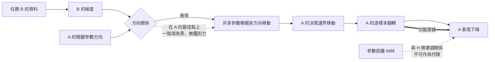

+++
title = "新任務如何改寫舊行為：共享方向上的干涉與功能距離"
date = "2026-09-08T22:31:06+08:00"
author = "TTL::0"
draft = false
isCJKLanguage = true
description = "一個團隊在既有模型上微調新任務。新任務的表現達標，舊任務的準確率掉了 20 個百分點。"
tags = [
    "分析論述", # term:AnalyticalEssay
    "機器學習", # term:MachineLearning
    "梯度干涉", # term:GradientInterference
  ]
series = ["能力失效歸因：一個聚合讀數能證明什麼，不能證明什麼"]
[ai_info]
    [ai_info.generation]
        model = "Claude Opus 5"
        agent = "Claude Code VSCode Extension 2.1.261"
    [ai_info.refinement]
        model = "Claude Opus 5"
        agent = "Claude Code VSCode Extension 2.1.263"
+++

<!--more-->

## 導言

一個團隊在既有模型上微調新任務。新任務的表現達標，舊任務的準確率掉了 20 個百分點。

值班的人做了一件看起來很合理的事：把微調前後的檢查點載入，計算權重的 L2 距離。數字是 $0.03$，相對於權重本身的尺度非常小。結論寫成「參數幾乎沒動，這個下降不可能來自微調」，於是團隊轉去查資料管線。

三天後才確認，那 $0.03$ 的位移確實造成了那 20 個百分點。**問題不在於量測做錯，而在於量錯了東西。** 參數距離與行為改變之間沒有單調關係，所以「距離很小」不構成「行為沒變」的證據。

這個事故指出兩個必須分別處理的問題。第一，一次針對新任務的更新，在什麼局部條件下會傷害舊任務？第二，這個局部條件為什麼不是充分條件，以及該用什麼量取代參數距離？

## 分析

### 一階線索：梯度內積

令兩項損失為 $L_A(\theta)$ 與 $L_B(\theta)$，共享同一組參數。針對 B 走一步：

$$
\theta' = \theta - \eta \nabla L_B(\theta).
$$

把 $L_A$ 在 $\theta$ 處做一階展開：

$$
L_A(\theta') \approx L_A(\theta) - \eta\,\nabla L_A(\theta)^\top \nabla L_B(\theta).
$$

若內積為負，這一步在局部提高舊損失。因果鏈是：兩任務共用關鍵參數方向 → 新任務梯度與舊任務梯度在該方向相衝 → 更新移動決策邊界 → 舊任務行為翻轉。這個量叫**梯度干涉**（Gradient Interference） <!-- term:GradientInterference -->，而它是可以直接量測的。

> [!IMPORTANT]
> **梯度干涉** <!-- term:GradientInterference --> (Gradient Interference): 不同任務的梯度方向相衝，使一方的更新提高另一方損失的情形。 <!-- anchor:GradientInterference -->


### 這個線索在微調的起點上恰好無效

上面的推導有一個容易被跳過的前提：它需要 $\nabla L_A(\theta) \neq 0$。而微調的起點通常正是 A 收斂之後的參數，也就是 $\nabla L_A \approx 0$ 的地方。

```python
def la(t):  return 0.5*((t[0]-1.0)**2 + (t[1]-0.0)**2)
def ga(t):  return [t[0]-1.0, t[1]-0.0]
def gb(t):  return [t[0]+1.0, 4.0*(t[1]-0.5)]

theta = [1.0, 0.0]                      # 自 A 的最佳點出發
gA, gB = ga(theta), gb(theta)
print(f"在 A 的最佳點：gA = {gA}, gB = {gB}")
print(f"內積 = {sum(a*b for a, b in zip(gA, gB)):.4f}")
```

實際執行的輸出：

```text
在 A 的最佳點：gA = [0.0, 0.0], gB = [2.0, -2.0]
內積 = 0.0000
```

在 A 的最佳點上，$\nabla L_A$ 是零向量，於是內積必為 $0$，餘弦沒有定義。**不論 $\nabla L_B$ 指向哪裡，這個診斷都回報「無衝突」。**

這不是數值問題，是定義問題。一階項為零時，$L_A$ 的變化由二階項主導：

$$
L_A(\theta') \approx L_A(\theta) + \tfrac{\eta^2}{2}\,\nabla L_B^\top H_A \nabla L_B ,
$$

其中 $H_A$ 是 A 的損失在該點的曲率。由於最佳點上 $H_A$ 半正定，這一項非負——**傷害是必然的，而一階線索恰好看不到它**。上面的例子裡 $\nabla L_B = (2, -2)$ 明顯把參數拉離 A 的最佳點，而內積診斷完全沉默。

實務後果很直接：在剛收斂的模型上量梯度內積，得到接近零的結果，不能讀成「這次微調不會傷害舊任務」。該讀成「一階項無資訊，需要看曲率或直接重放」。

### 一階近似撐得多遠

即使在 $\nabla L_A \neq 0$ 的地方，一階預測的有效範圍也很窄。下面的掃描固定一個內積為負的點，只改學習率。

```python
theta = [0.8, 0.1]
gA, gB = ga(theta), gb(theta)
dot = sum(a*b for a, b in zip(gA, gB))
print(f"在 theta = {theta}：內積 = {dot:.4f}")
print("  eta     一階預測 dLA     實際 dLA        相對誤差")
for eta in (0.001, 0.01, 0.1, 0.5, 1.0, 2.0):
    pred = -eta * dot
    nt = [theta[i] - eta * gB[i] for i in range(2)]
    actual = la(nt) - la(theta)
    err = abs(actual - pred) / max(abs(actual), 1e-12)
    print(f"{eta:7.3f}  {pred:14.6f}  {actual:14.6f}  {err*100:12.1f}%")
```

實際執行的輸出：

```text
在 theta = [0.8, 0.1]：內積 = -0.5200
  eta     一階預測 dLA     實際 dLA        相對誤差
  0.001        0.000520        0.000523           0.6%
  0.010        0.005200        0.005490           5.3%
  0.100        0.052000        0.081000          35.8%
  0.500        0.260000        0.985000          73.6%
  1.000        0.520000        3.420000          84.8%
  2.000        1.040000       12.640000          91.8%
```

$\eta = 0.001$ 時預測誤差 0.6%，可用。$\eta = 0.1$ 時已經 35.8%，$\eta = 1.0$ 時 84.8%——預測值只有實際傷害的六分之一。

所以內積的符號可以指出方向，它的數值不能用來估計幅度，除非步長極小。任何「內積是 $-0.5$，所以 A 大約會升 $0.5\eta$」的推算，在實際使用的學習率下會嚴重低估。

### 參數距離不是功能距離

現在回到導言那個事故的核心。下面的實驗對同一個線性判別模型施加五種擾動，並列參數距離與決策翻轉率。模型的後三維權重為零。

```python
import random
random.seed(1)
D, N = 6, 3000
X = [[random.gauss(0, 1) for _ in range(D)] for _ in range(N)]
W = [1.0, -0.5, 0.3, 0.0, 0.0, 0.0]
B = 0.0

def decide(w, b):
    return [1 if sum(wi*xi for wi, xi in zip(w, x)) + b >= 0 else 0 for x in X]
base = decide(W, B)
def flip(w, b): return sum(1 for a, c in zip(base, decide(w, b)) if a != c) / N
def dist(w, b): return (sum((wi-Wi)**2 for wi, Wi in zip(w, W)) + (b-B)**2) ** 0.5

cases = {
    "整體縮放 x2      ": ([2*w for w in W], 2*B),
    "整體縮放 x0.25   ": ([0.25*w for w in W], 0.25*B),
    "沿零權重方向移動 ": (W[:3] + [1.2, -0.9, 0.6], B),
    "偏置微調 +0.02   ": (W[:], B + 0.02),
    "第一維權重 +0.02 ": ([W[0]+0.02] + W[1:], B),
}
print("擾動                參數距離 ‖dθ‖   決策翻轉率")
for name, (w, b) in cases.items():
    print(f"{name}  {dist(w, b):14.4f}  {flip(w, b):12.4f}")
```

實際執行的輸出：

```text
擾動                參數距離 ‖dθ‖   決策翻轉率
整體縮放 x2                1.1576        0.0000
整體縮放 x0.25             0.8682        0.0000
沿零權重方向移動           1.6155        0.3040
偏置微調 +0.02             0.0200        0.0090
第一維權重 +0.02           0.0200        0.0030
```

三個結論從這五列讀出來，而它們合起來否證了參數距離作為代理量的資格。

**第一，大距離可以對應零行為改變。** 整體縮放兩倍的參數距離是 $1.1576$，決策翻轉率是 $0.0000$。判別函數的符號在正比例縮放下不變，所以行為完全相同。這是模型的重新參數化，不是能力的改變。

**第二，小距離可以對應可觀的行為改變。** 偏置微調 $0.02$ 的參數距離是 $0.0200$，翻轉了 0.9% 的樣本。與第一列相比，參數距離小了 58 倍，而行為效果從無到有。兩個量甚至不是單調相關的。

**第三，相同的距離對應不同的行為效果。** 第四列與第五列的參數距離完全相同（皆為 $0.0200$），翻轉率卻是 $0.0090$ 與 $0.0030$，差三倍。位移的**方向**決定效果，而距離這個純量把方向丟掉了。

第三列補上另一面：把位移放進原本權重為零的維度，參數距離 $1.6155$，翻轉率 $0.3040$。那些維度在原模型中不參與決策，一旦取得非零權重就開始影響輸出。所以「模型沒在用的方向」不是安全方向，只是目前未被使用的方向。

### 可用的觀察量是舊任務重放

上面的實驗指出，能回答「舊行為是否改變」的量必須直接作用在行為上：

1. **保存舊任務的評測切片與逐樣本輸出**，包含 logits 或機率，不只最終標籤。
2. **在每個訓練階段重放該切片**，記錄逐樣本翻轉與切片損失。
3. **把翻轉連回更新方向**，也就是檢查翻轉是否集中在被新任務梯度顯著移動的方向上。

第三步是把行為證據與機制線索接起來的地方。翻轉本身證明行為改變，梯度方向提供為什麼；缺少前者無法確認損失，缺少後者無法歸因。

下圖把兩層證據的關係外化。它要解決的閱讀問題是：哪一條線提供損失的事實，哪一條線提供成因。



圖裡兩條虛線標出兩個不能使用的推論。上面那條是參數距離，下面那條是在收斂點上的一階線索。粗線是唯一直接的證據路徑。

## 反思

負內積是警報，不是充分條件。這是本文主張的第一個邊界。一階分析描述的是當下這一步，而訓練會走很多步；高維模型有大量冗餘方向，後續更新可能繞開衝突，最終找到一組同時滿足兩個任務的參數。因此「這一步會傷 A」與「訓練結束後 A 會變差」是兩個不同強度的命題，前者不蘊含後者。

第二個邊界關於矛盾的任務。若 A 與 B 的定義真的互相排斥——同一個輸入被要求給出兩個不相容的輸出——那麼任何限制更新的方法都只能選擇取捨，不能創造同時滿足兩者的解。這種情況下 A 的下降是**明示的政策更新**，不是未預期的遺忘。把它當成技術缺陷來修，會讓團隊在一個不存在的解上耗費預算；正確的動作是把取捨寫成決定並宣告。

以參數重要性施加二次懲罰的做法值得放在這個框架裡看。它的目標函數形如

$$
L(\theta) = L_B(\theta) + \frac{\lambda}{2}\sum_i F_i\big(\theta_i - \theta^{*}_{A,i}\big)^2,
$$

其中 $F_i$ 近似參數對舊任務的重要性。$\lambda$ 越大，重要方向越難移動。但這個式子的懲罰項作用在**參數空間**上，而本文的實驗顯示參數位移與行為改變沒有單調關係。所以這類方法的有效性依賴 $F_i$ 是否真的抓到了功能上重要的方向；當它抓錯時，懲罰會限制無害的位移而放過有害的位移。這不是反對該方法，而是指出它的成敗條件是可檢驗的，檢驗方式仍然是舊任務重放。

一個反例可以標出「重要性」估計的脆弱處。考慮一個帶正規化層的網路，其中某一層的權重整體縮放不改變輸出。該層所有參數的重要性估計都可能很高，因為擾動單一參數確實改變損失；然而沿著整體縮放這個方向的位移完全無害。重要性是逐參數的量，而功能等價是方向上的性質，兩者不對齊。

最後，本文的實驗是線性、低維、無隨機性的。它足以證明「參數距離不是功能距離的代理」這個結構性主張——反例只需要一個——不足以預測真實網路中兩者的關係強度。

## 實務對比

**判斷微調是否傷害了舊能力。** 錯誤做法是比較微調前後的平均權重距離。實測顯示參數距離 $1.1576$ 的擾動可以零翻轉，而 $0.0200$ 的擾動翻轉 0.9%；這個量與行為改變沒有單調關係，因此它的大小不論落在哪一端都不構成證據。正確做法是保存舊任務切片與逐樣本輸出，在每個階段重放並記錄翻轉。

**在微調開始前評估風險。** 錯誤做法是在收斂的模型上量梯度餘弦，接近零就判定安全。收斂點上 $\nabla L_A$ 為零向量，內積必為零，這個讀數與風險無關。正確做法是承認一階項在此無資訊，改用曲率方向上的探測——沿 $\nabla L_B$ 走一小段，直接重放舊任務量翻轉，而不是依賴展開式的預測。

**用內積數值估計傷害幅度。** 錯誤做法是把 $-\eta\langle \nabla L_A, \nabla L_B\rangle$ 當成 A 的預期升幅。實測顯示在 $\eta = 0.1$ 時該預測已低估 35.8%，在 $\eta = 1.0$ 時低估 84.8%。正確做法是把內積的**符號**用於方向判斷，幅度則靠實際重放取得。

**設定新舊能力的目標。** 錯誤做法是要求舊能力完全不變、同時新能力達標。若兩個任務在關鍵方向上矛盾，這個要求沒有可行解，而追求它的過程會表現為無止盡的超參數搜索。正確做法是預先定義 A 的容許損失與 B 的最低收益，報告兩者的取捨曲線，讓權衡成為一個被記錄的決定而非一個被隱藏的結果。

## 結論

新任務更新改寫舊行為，是共享參數上的目標衝突造成的。可檢查的機制是：兩任務共用關鍵方向 → 梯度在該方向相衝 → 共享參數朝衝突方向移動 → 舊任務決策邊界移動 → 逐樣本行為翻轉。

但本文的量測對這條鏈上的兩個常用儀表給出了否定結論：

1. **梯度內積在微調的起點上沒有鑑別力。** 舊任務收斂處 $\nabla L_A$ 為零向量，內積必為零，而傷害由二階項承擔。接近零的內積不能讀成安全。
2. **參數距離不是功能距離的代理。** 實測中距離 $1.1576$ 的擾動翻轉率為零，距離 $0.0200$ 的擾動翻轉 0.9%；兩個相同距離的擾動翻轉率相差三倍。距離丟掉了方向，而方向決定效果。

因此唯一直接的證據是舊任務重放：保存切片與逐樣本輸出，在每個階段重跑，記錄翻轉，再把翻轉連回被移動的方向。內積提供成因線索，重放提供損失事實，兩者必須並用且不可互換。

而所有緩解手段——重播、方向約束、重要性懲罰——管理的都是穩定與可塑性之間的取捨。當兩個任務的定義真正矛盾時，它們無法消除該矛盾，只能決定要犧牲哪一邊；此時該產出的是一個被宣告的取捨，不是一次被當成缺陷修復的嘗試。