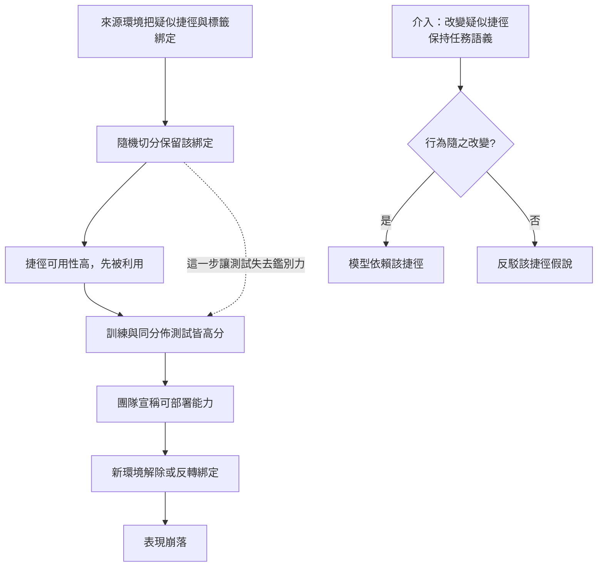

+++
title = "不是後來壞掉，是從頭學錯：偽相關與跨環境反例"
date = "2026-09-08T22:44:08+08:00"
author = "TTL::0"
draft = false
isCJKLanguage = true
description = "一個文件分流模型要判斷案件是否緊急。訓練資料來自單一機構三年的歷史卷宗，隨機切分成訓練與測試，測試準確率 97%。上線第二個機構後，準確率掉到 54%。"
tags = [
    "分析論述", # term:AnalyticalEssay
    "機器學習", # term:MachineLearning
    "偽相關", # term:SpuriousCorrelation
    "捷徑學習", # term:ShortcutLearning
    "經驗風險", # term:EmpiricalRisk
    "泛化", # term:Generalization
    "校準", # term:Calibration
  ]
series = ["能力失效歸因：一個聚合讀數能證明什麼，不能證明什麼"]
[ai_info]
    [ai_info.generation]
        model = "Claude Opus 5"
        agent = "Claude Code VSCode Extension 2.1.261"
    [ai_info.refinement]
        model = "Claude Opus 5"
        agent = "Claude Code VSCode Extension 2.1.263"
+++

<!--more-->

## 導言

一個文件分流模型要判斷案件是否緊急。訓練資料來自單一機構三年的歷史卷宗，隨機切分成訓練與測試，測試準確率 97%。上線第二個機構後，準確率掉到 54%。

事後回查發現：第一個機構的緊急案件走專用掃描通道，該通道的機器解析度與一般通道不同。模型學到的規則裡包含「解析度」這個特徵，而它在原機構與緊急標籤高度相關。第二個機構只有一台掃描機。

值得注意的是這個事故的時間結構。模型不是上線後退化的——它從第一次訓練完成起就在用那條規則，只是原本的測試集與訓練集共享同一個相關性，所以測不出來。**那個 97% 不是後來失效的能力證據，它從一開始就在度量一條不可轉移的規則。**

由此產生的問題是：當核心訊號與**偽相關**（Spurious Correlation） <!-- term:SpuriousCorrelation -->都能降低訓練損失時，什麼證據能辨認模型實際使用了哪一條？以及為什麼「再多蒐集一些同類資料」不是答案？

> [!IMPORTANT]
> **偽相關** <!-- term:SpuriousCorrelation --> (Spurious Correlation): 在訓練分佈中與標籤同時出現、但不具因果支撐的統計關聯。 <!-- anchor:SpuriousCorrelation -->


## 分析

### 目標函數不偏好人類所稱的核心

**經驗風險**（Empirical Risk） <!-- term:EmpiricalRisk -->最小化選擇的是

> [!IMPORTANT]
> **經驗風險** <!-- term:EmpiricalRisk --> (Empirical Risk): 模型在有限訓練樣本上的平均損失，是目標分佈期望風險的間接替代量。 <!-- anchor:EmpiricalRisk -->


$$
\hat{f} = \arg\min_{f \in \mathcal{H}} \frac{1}{n}\sum_{i=1}^{n} \ell\big(f(x_i), y_i\big).
$$

這個式子裡沒有任何一項提及因果。若特徵 $x_c$ 與 $x_s$ 在訓練環境都能預測 $y$，目標函數不會自動偏好人類稱為「核心」的那一個。決定先被利用的是資料頻率、模型偏置與最佳化的容易程度。

**偽相關** <!-- term:SpuriousCorrelation -->就是這樣一個在訓練分佈中與標籤同時出現、卻不具因果支撐的關聯；模型採用它所形成的決策規則稱為**捷徑學習**（Shortcut Learning） <!-- term:ShortcutLearning -->。

> [!IMPORTANT]
> **捷徑學習** <!-- term:ShortcutLearning --> (Shortcut Learning): 模型採用在標準基準有效、卻無法轉移到更具挑戰條件的決策規則。 <!-- anchor:ShortcutLearning -->


### 決定捷徑偏好的是可用性，不是相關強度

常見的直覺是「捷徑之所以被選，因為它與標籤的相關更強」。這個直覺可以被否證。下面的實驗讓兩個特徵**與標籤的相關方向完全相同**，只讓噪聲不同。

```python
import random, math
def make(n, noise_c, noise_s, shortcut_sign, seed):
    rnd = random.Random(seed)
    rows = []
    for _ in range(n):
        y = rnd.choice((0, 1)); t = 2*y - 1
        core = t + noise_c * rnd.gauss(0, 1)
        sc = shortcut_sign * t + noise_s * rnd.gauss(0, 1)
        rows.append(([core, sc], y))
    return rows

def fit(rows, steps=3000, lr=0.2):
    w, b = [0.0, 0.0], 0.0
    n = len(rows)
    for _ in range(steps):
        gw, gb = [0.0, 0.0], 0.0
        for x, y in rows:
            p = 1.0 / (1.0 + math.exp(-(w[0]*x[0] + w[1]*x[1] + b)))
            d = p - y
            gw[0] += d*x[0]; gw[1] += d*x[1]; gb += d
        w = [w[i] - lr*gw[i]/n for i in range(2)]; b -= lr*gb/n
    return w, b

def acc(rows, w, b):
    return sum(1 for x, y in rows
               if (1 if w[0]*x[0] + w[1]*x[1] + b >= 0 else 0) == y) / len(rows)

print("shortcut噪聲   w_core   w_shortcut   權重比   同分佈準確率   反相關環境準確率")
for ns in (0.05, 0.2, 0.4, 0.8, 1.6):
    tr = make(1500, 0.8, ns, +1, seed=11)
    w, b = fit(tr)
    iid = acc(make(1500, 0.8, ns, +1, seed=99), w, b)
    flip = acc(make(1500, 0.8, ns, -1, seed=99), w, b)
    print(f"{ns:11.2f}  {w[0]:7.3f}  {w[1]:11.3f}  {w[1]/w[0]:7.2f}"
          f"  {iid:14.3f}  {flip:17.3f}")
```

實際執行的輸出：

```text
shortcut噪聲   w_core   w_shortcut   權重比   同分佈準確率   反相關環境準確率
       0.05    1.507        5.641     3.74           1.000              0.000
       0.20    1.564        5.866     3.75           1.000              0.002
       0.40    1.953        6.219     3.18           0.998              0.079
       0.80    2.908        3.021     1.04           0.961              0.473
       1.60    3.080        0.790     0.26           0.918              0.803
```

第一列是本文的核心觀察。同分佈準確率是 $1.000$——完美。同一個模型在反相關環境的準確率是 $0.000$——比隨機猜還差，因為它系統性地反過來。

而權重比隨噪聲單調變化：$3.74 \to 3.75 \to 3.18 \to 1.04 \to 0.26$。兩個特徵的標籤相關方向在整張表裡都相同，變的只有噪聲。所以驅動偏好的量是**可用性**——訊號的可靠程度、被最佳化利用的容易程度——而不是相關的強度。

這個區分有直接的實務後果。若誤以為偏好由相關強度決定，補救動作會是「提高核心特徵與標籤的相關」，而這在上表裡對應不到任何一列，因為相關方向從頭到尾沒變。有效的旋鈕是噪聲比，也就是兩個訊號的相對可用性。

### 增加同源資料會加深依賴

第二個常見動作是蒐集更多資料。下面固定捷徑噪聲，只增加資料量。

```python
print("     n   w_core   w_shortcut   權重比   反相關環境準確率")
for n in (300, 1500, 6000):
    tr = make(n, 0.8, 0.05, +1, seed=11)
    w, b = fit(tr)
    flip = acc(make(1500, 0.8, 0.05, -1, seed=99), w, b)
    print(f"{n:6d}  {w[0]:7.3f}  {w[1]:11.3f}  {w[1]/w[0]:7.2f}  {flip:17.3f}")
```

實際執行的輸出：

```text
     n   w_core   w_shortcut   權重比   反相關環境準確率
   300    1.772        5.492     3.10              0.005
  1500    1.507        5.641     3.74              0.000
  6000    1.466        5.676     3.87              0.000
```

資料量增加二十倍，捷徑的權重比從 $3.10$ 升到 $3.87$，核心特徵的權重從 $1.772$ 降到 $1.466$。反相關環境的準確率從 $0.005$ 掉到 $0.000$。

機制很直接：新資料保留了同一個偽相關 <!-- term:SpuriousCorrelation -->，所以它提供的證據支持同一條規則。**增加同源樣本降低的是估計的變異，而不是規則的錯誤。** 模型變得更確信一條不可轉移的規則。

### 唯一有鑑別力的證據是跨環境反例

上面兩張表指出，訓練分佈內的任何觀察都無法區分兩條規則——它們在該分佈上導出相同的預測。有鑑別力的證據必須來自一個**任務語義保持、疑似捷徑改變**的環境。

下圖把這個要求與事故的成因鏈放在一起。它要解決的閱讀問題是：誤判在哪一步被固化，以及唯一能打破它的介入在哪裡。



圖的虛線指出事故的真正發生位置：隨機切分。它不是一個中性的技術選擇，而是讓測試集繼承訓練集的相關結構，因此讓測試無法回答部署所需的問題。

「保持任務語義」這個要求在實作上有三種可行形式，成本依序上升：

1. **按來源分層**：以機構、設備、時段或通道為單位切分，禁止先混合再隨機切。這不改變任何樣本，只改變切分。
2. **選擇性重取樣**：在資料中找出綁定被打破的子集——例如來自一般通道的緊急案件——並把它單獨作為評測環境。這不需要新資料，只需要來源標記。
3. **主動介入**：直接修改疑似捷徑而保留標籤語義，例如把掃描解析度統一重採樣。這需要確認該修改不同時破壞核心訊號。

三者的判讀規則相同：若介入後模型行為顯著改變，捷徑依賴假說得到支持；若行為不變，該假說被削弱。第三種形式最強，但也最容易出錯，因為「只改捷徑不改核心」這個保證需要另外的論證。

實務上最常缺的是第二種形式所需的來源標記。若歷史資料沒有記錄機構、設備或通道，選擇性重取樣就無從下手。此時有兩條退路，強度依序下降。第一條是尋找**可從內容反推的來源代理**——檔案的解析度、時間戳的分佈型態、欄位的缺失樣式；這些不是來源標記，但它們常與來源高度相關，足以切出粗略的環境。第二條是**只往前建立**：從此刻開始記錄來源，累積到足夠樣本後再做環境切分。第二條慢，但它避免了第一條的風險——用來反推來源的那個代理，本身可能就是模型正在使用的捷徑，於是切出來的環境與捷徑對齊，對照失去鑑別力。

無論走哪一條，要記錄的是同一件事：這次對照覆蓋了哪些來源、遺漏了哪些。遺漏的那些不是「假設相同」，而是未測。

## 反思

捷徑不等於無用。這是本文主張的第一個邊界。掃描解析度在原機構確實有預測力，那個相關是真實存在的統計事實。失敗來自部署主張越過了相關性可維持的範圍，而不是模型違反了訓練目標——模型精確地做了目標要求的事。

第二個邊界是疑似捷徑本身可能位於穩定的因果鏈上。考慮一條固定製程中的感測器**校準**（Calibration） <!-- term:Calibration -->訊號：它與產出品質相關，且該相關由物理機制支撐。刻意移除它會降低真實效用。因此「疑似捷徑」的判定不能只依據「它看起來不該相關」，必須依據該相關在目標部署環境中是否維持。

> [!IMPORTANT]
> **校準** <!-- term:Calibration --> (Calibration): 模型輸出機率與實際正確率的一致程度。 <!-- anchor:Calibration -->


第三個邊界最難處理，而本文無法在自身範圍內解決：**人類指定的核心特徵也可能只是另一個相關代理**。上面的實驗把 `core` 這個名字寫在程式裡，於是誰是核心不需要爭論。真實系統沒有這個標記——標註者說「應該看病灶」，而病灶的影像表現本身可能是另一個代理。因此本文所有結論都攜帶一個前提：核心與捷徑的區分已由某個外部來源給定。這個來源的資格是另一個問題，本文不在此處建立它，但任何援引本文的評估都必須說明該區分是誰下的、依據什麼。

一個反例可以標出這個前提的分量。若「核心」被指定錯了——實際上指定的那個特徵才是不可轉移的——那麼跨環境對照仍然會運作，只是結論會反過來：它會告訴你模型依賴「核心」，而那正是問題所在。對照程序本身不會出錯，出錯的是對結論的解讀。這意味著跨環境測試是一個關於**穩定性**的量測，不是一個關於**正確性**的量測。

最後，環境可被枚舉這個假設也值得標記。上面的實驗只有兩個環境，而現實中的環境是開放集。「在三個環境上都穩定」不蘊含「在第四個環境上穩定」；它只把主張的範圍擴大到已測環境的凸包附近，而該範圍的邊界無法從內部觀察。

## 實務對比

**切分資料的方式。** 錯誤做法是把同一機構的卷宗隨機切成訓練與測試，然後以高分宣稱跨機構可用。隨機切分讓測試集繼承訓練集的全部相關結構，因此該測試在設計上無法回答跨機構的問題。正確做法是按機構、設備或通道切分，並另外建立語義相同而設備標記改變的對照。

**面對高分但下游反映不佳。** 錯誤做法是無差別增加同來源資料。實測顯示資料量增加二十倍後，捷徑權重比從 $3.10$ 升到 $3.87$，反相關環境準確率從 $0.005$ 掉到 $0.000$。更多同源樣本讓錯誤的規則被更確信地估計。正確做法是增加能區分候選規則的環境，即使樣本數少得多——一百個綁定被打破的樣本，比一萬個同源樣本更有鑑別力。

**歸因捷徑依賴。** 錯誤做法是看到模型在新環境失敗就宣稱它學了捷徑。新環境失敗同時相容於捷徑依賴與其他變化，例如標註標準不同或核心訊號本身改變。正確做法是執行介入：只改變疑似捷徑而保持任務語義，觀察行為是否隨之改變。行為不變即反駁該假說，這是一個明確的反駁條件。

**報告一次穩健性評估。** 錯誤做法是寫「模型在三個環境上皆穩定，具備**泛化**（Generalization） <!-- term:Generalization -->能力」。環境是開放集，三個樣本不支撐關於全體的主張。正確做法是把結論寫成有邊界的形式：列出已測環境、列出各環境中被改變的具體因素，並明確標示未測的因素——後者才是下一次事故的候選來源。

> [!IMPORTANT]
> **泛化** <!-- term:Generalization --> (Generalization): 模型在訓練樣本以外的資料上維持表現的能力。 <!-- anchor:Generalization -->


## 結論

高同分佈分數只能證明某條規則在該環境有效，不能證明模型採用了可轉移的機制。本文的量測給出這個落差的極端形式：同一個模型在同分佈測試上的準確率是 $1.000$，在疑似捷徑被反轉的環境上是 $0.000$。

這類失效的時間結構是「從頭學錯」，不是「後來退化」。原本那個高分並沒有度量一個後來失去的能力；它度量的是一條從第一天起就不可轉移的規則，而測試集因為與訓練集共享相關結構，所以沒有鑑別力。

三個可執行的判斷由此得到：

1. **驅動捷徑偏好的是可用性，不是相關強度。** 實測中兩個特徵的標籤相關方向相同，權重比僅由噪聲決定，從 $3.74$ 變到 $0.26$。因此提高核心特徵的相關不是有效的旋鈕，改變相對可用性才是。
2. **增加同源資料會加深依賴。** 更多同源樣本降低估計變異而不改變規則錯誤，實測中它讓捷徑權重比上升、反相關環境準確率歸零。
3. **唯一有鑑別力的證據是跨環境反例。** 訓練分佈內的任何觀察都無法區分兩條規則，因為它們在該分佈上導出相同預測。

而這個程序回答的是穩定性，不是正確性。它需要一個外部來源事先指定誰是核心、誰是捷徑；那個指定的資格不由本程序建立，且若指定錯誤，程序仍會正常運作而結論會反過來。