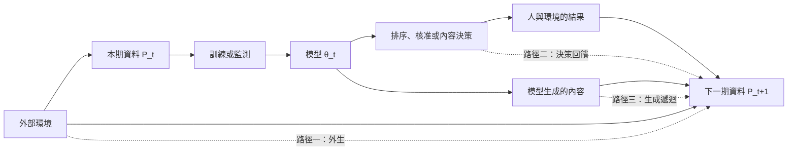

+++
title = "模型是常數，風險仍上升：通往下一期資料的三條路"
date = "2026-09-08T23:14:09+08:00"
author = "TTL::0"
draft = false
isCJKLanguage = true
description = "一個詐騙偵測模型的權重被凍結了八個月，一個位元都沒改。告警精確率從 0.71 降到 0.48。"
tags = [
    "分析論述", # term:AnalyticalEssay
    "大型語言模型", # term:LargeLanguageModel
    "校準", # term:Calibration
  ]
series = ["能力失效歸因：一個聚合讀數能證明什麼，不能證明什麼"]
[ai_info]
    [ai_info.generation]
        model = "Claude Opus 5"
        agent = "Claude Code VSCode Extension 2.1.261"
    [ai_info.refinement]
        model = "Claude Opus 5"
        agent = "Claude Code VSCode Extension 2.1.263"
+++

<!--more-->

## 導言

一個詐騙偵測模型的權重被凍結了八個月，一個位元都沒改。告警精確率從 0.71 降到 0.48。

團隊的處置是重新訓練。用最近三個月的資料重跑，上線。兩週後精確率降到 0.41。

再查才發現三件事同時在動。第一，上游一個資料源在四月換了格式，某個欄位的缺失率從 2% 升到 31%。第二，模型的告警會觸發人工複審，而複審過的案件才會產生標籤——所以訓練資料裡的「已確認詐騙」是模型自己挑出來的那些。第三，該領域的攻擊方在觀察到攔截模式後改變了手法。

重新訓練同時受這三件事影響，而它只能把模型擬合到第二件事所塑造的資料上。**模型沒變的那八個月裡，變的是它與世界之間的關係；而重訓沒有修復那個關係，它把模型更緊地綁在自己造成的觀察偏差上。**

本文因此要處理：當參數固定而風險上升時，資料生成程序有哪幾條變動路徑、它們各自需要什麼介入才能被確認、以及在三條路徑同時作用時還剩下哪些可識別的部分。

## 分析

固定模型 $f_\theta$ 時，兩個時期的風險是

$$
R_{P_j}(\theta) = \mathbb{E}_{(x,y)\sim P_j}\big[\ell(f_\theta(x), y)\big], \qquad j \in \{0, 1\}.
$$

第一個要立刻放棄的直覺是 $P_0 \neq P_1$ 蘊含 $R_{P_0} \neq R_{P_1}$。

### 路徑一：外生漂移，而偵測與風險互相獨立

下面的實驗建立一個雙向解離。模型只看第一維，第二維權重為零。

```python
import random
rnd = random.Random(4)
N = 4000
W, B = [1.0, 0.0], 0.0          # 模型只看第一維；第二維權重為零

def predict(x): return 1 if W[0]*x[0] + W[1]*x[1] + B >= 0 else 0
def risk(rows): return sum(1 for x, y in rows if predict(x) != y) / len(rows)
def mean_stat(rows):            # 最常見的漂移偵測：逐維平均值位移
    d = len(rows[0][0])
    return [sum(x[i] for x, _ in rows)/len(rows) for i in range(d)]

base = [([rnd.gauss(0,1), rnd.gauss(0,1)], None) for _ in range(N)]
base = [(x, 1 if x[0] >= 0 else 0) for x, _ in base]

A = [([x[0], x[1] + 3.0], y) for x, y in base]        # 只動模型不敏感的維度
B_rows = [(x, (1 - y) if abs(x[0]) < 0.6 else y) for x, y in base]  # 只動條件關係

print("情境          第一維均值   第二維均值   偵測到輸入漂移   任務風險")
for name, rows in (("基準      ", base), ("A 輸入位移", A), ("B 條件改變", B_rows)):
    m, m0 = mean_stat(rows), mean_stat(base)
    detected = any(abs(m[i] - m0[i]) > 0.2 for i in range(2))
    print(f"{name}  {m[0]:10.3f}  {m[1]:11.3f}  {str(detected):>14s}  {risk(rows):9.4f}")
```

實際執行的輸出：

```text
情境          第一維均值   第二維均值   偵測到輸入漂移   任務風險
基準             0.012        0.012           False     0.0000
A 輸入位移       0.012        3.012            True     0.0000
B 條件改變       0.012        0.012           False     0.4535
```

情境 A：偵測器響了，風險是 $0.0000$。輸入分佈確實移動了三個標準差，但移動落在模型不敏感的方向上。這是一個假警報，而且是那種會消耗信任的假警報——因為分佈差異是真的。

情境 B：偵測器沒響，風險是 $0.4535$。輸入的邊際分佈逐維完全不變，改變的是 $P(y \mid x)$ 在邊界附近的關係。任何只看輸入的統計量都無法觸及這件事，因為它不在輸入裡。

**所以偵測到統計差異與風險上升是兩個彼此獨立的事件。** 統計漂移只有在連上任務損失時才是有害的證據；而任務損失可以在完全沒有輸入漂移的情況下惡化。

### 路徑二：決策回饋，觀察值是政策的函數

當預測影響行動，下一期的分佈就依賴當期的參數：

$$
P_{t+1} = \mathcal{D}(\theta_t, P_t), \qquad R(\theta) = \mathbb{E}_{z \sim \mathcal{D}(\theta)}\big[\ell(z; \theta)\big].
$$

這條路徑最常見的形式是**只有被核准的案件才產生標籤**。下面固定母體，只改核准門檻。

```python
pop = population()
true_rate = sum(y for _, y in pop) / N
print(f"母體真實違約率（不依賴任何決策）: {true_rate:.4f}")
print("核准門檻   核准比例   已核准者的觀察違約率   與母體真值的落差")
for thresh in (-2.0, -1.0, -0.5, 0.0, 0.5, 1.0, 2.0):
    app = [y for s, y in pop if s >= thresh]
    obs = sum(app) / len(app)
    print(f"{thresh:8.1f}  {len(app)/N:9.3f}  {obs:21.4f}  {obs - true_rate:17.4f}")
```

實際執行的輸出：

```text
母體真實違約率（不依賴任何決策）: 0.4984

核准門檻   核准比例   已核准者的觀察違約率   與母體真值的落差
    -2.0      0.977                 0.4866            -0.0118
    -1.0      0.845                 0.4093            -0.0891
    -0.5      0.699                 0.3089            -0.1895
     0.0      0.504                 0.1737            -0.3246
     0.5      0.308                 0.0628            -0.4355
     1.0      0.154                 0.0219            -0.4764
     2.0      0.021                 0.0060            -0.4924
```

母體的真實違約率在整張表裡是常數 $0.4984$。而觀察到的違約率從 $0.4866$ 走到 $0.0060$，落差從 $-0.01$ 走到 $-0.49$。

在門檻 $1.0$ 那一列，系統觀察到 2.19% 的違約率，而世界的真值是 49.84%。**那個 2.19% 完全誠實——它是被核准者的真實違約率——而它與任何關於母體的問題都無關。**

這條路徑的關鍵量可以精確定義。**回饋彈性**（feedback elasticity）是觀察量對政策參數的敏感度：政策移動一單位，觀察值改變多少。

```python
for thresh in (0.0, 0.5, 1.0):
    a1 = [y for s, y in pop if s >= thresh]
    a2 = [y for s, y in pop if s >= thresh - 0.5]
    o1, o2 = sum(a1)/len(a1), sum(a2)/len(a2)
    print(f"  門檻 {thresh:.1f} -> {thresh-0.5:.1f}：觀察違約率 {o1:.4f} -> {o2:.4f}"
          f"   彈性 {(o2-o1)/0.5:+.4f} /單位門檻")
```

```text
  門檻 0.0 -> -0.5：觀察違約率 0.1737 -> 0.3089   彈性 +0.2703 /單位門檻
  門檻 0.5 -> 0.0：觀察違約率 0.0628 -> 0.1737   彈性 +0.2218 /單位門檻
  門檻 1.0 -> 0.5：觀察違約率 0.0219 -> 0.0628   彈性 +0.0818 /單位門檻
```

彈性不是常數：$+0.2703$、$+0.2218$、$+0.0818$。它取決於當前政策的位置，所以無法用單一係數校正。這也解釋了為什麼「反覆重訓」在這條路徑上是無效的：每次重訓都改變政策，而政策的改變又改變下一批觀察，模型在追逐一個由它自己移動的目標。

### 路徑三：生成遞迴，而平均值看不見它

第三條路徑是模型的輸出直接進入後續訓練資料。下面隔離其中一個成分——有限抽樣造成的罕見事件流失。

```python
runs = [trial(s) for s in range(40)]
print("代次   平均機率   標準差   已歸零的比例")
for g in range(12):
    col = [r[g] for r in runs]
    mean = sum(col)/len(col)
    sd = (sum((c-mean)**2 for c in col)/len(col)) ** 0.5
    zero = sum(1 for c in col if c == 0.0)/len(col)
    print(f"{g:4d}  {mean:10.4f}  {sd:7.4f}  {zero:13.3f}")
```

實際執行的輸出（罕見事件初始機率 0.05，每代 $n = 100$，完全以當代樣本取代來源分佈）：

```text
代次   平均機率   標準差   已歸零的比例
   0      0.0550   0.0269          0.025
   3      0.0623   0.0523          0.100
   6      0.0648   0.0613          0.200
   9      0.0720   0.0810          0.325
  11      0.0683   0.0788          0.350
```

平均機率從 $0.0550$ 到 $0.0683$，幾乎沒有變化。**任何以平均值監測這個過程的系統都會判定一切正常。**

改變的是另一欄：已歸零的軌跡比例從 2.5% 升到 35%。零是吸收態——某一代抽到零之後，後代無法自行恢復。所以這條路徑的損害形式不是「平均值下滑」，而是「越來越多的個別世界線永久失去了那個事件」。標準差同時從 $0.0269$ 升到 $0.0788$，這是唯一在聚合層可見的線索。

對照組確認了條件性：

```text
對照：每代保留 50% 真實來源樣本
  第 12 代平均機率 0.0520，已歸零的比例 0.000
```

保留一半真實來源樣本，40 條軌跡沒有任何一條歸零。所以這條路徑的傷害不是「使用生成資料」造成的，而是「以生成資料完全取代來源」造成的。混合比例是可操作的旋鈕。

### 三條路徑同時作用時，還剩什麼可識別

前面三節各自隔離了一條路徑，而現實中它們同時發生——導言那個事故就是。這一節處理那個情形，因為它是實務上唯一會遇到的情形。

下圖標出三條路徑各自的介入點。



三條路徑無法靠被動觀察分開，因為它們對 $P_{t+1}$ 的貢獻在同一批資料裡疊加。可識別性只能靠介入取得，而每條路徑對應一個不同的介入：

| 路徑 | 介入 | 若該路徑活躍會觀察到 | 反駁條件 |
| :--- | :--- | :--- | :--- |
| 決策回饋 | 凍結政策，或對一小部分流量隨機化決策 | 隨機化組與常規組的後續資料分佈不同 | 兩組分佈無差異，則該路徑不活躍 |
| 生成遞迴 | 標記來源與代次，改變真實資料保留率 | 保留率改變時罕見事件覆蓋隨之改變 | 保留率不影響覆蓋，則該路徑不活躍 |
| 外生漂移 | 前兩者皆已固定後的殘差 | 政策凍結且來源比例固定，分佈仍變動 | 固定前兩者後分佈穩定，則無外生成分 |

順序是必要的，因為第三列是以殘差定義的。外生漂移沒有自己的介入手段——外部世界不接受我們的實驗設計——所以它只能在其他路徑被固定之後，以剩餘的變動來認定。這使它成為三者中最弱的歸因：它總是包含「我們沒想到要固定的東西」。

### 標籤延遲讓上面的每一步都測晚一拍

還有一個橫跨三條路徑的限制。風險需要標籤，而標籤在多數系統中延遲抵達——貸款要等到期、詐騙要等爭議期、醫療要等追蹤期。

這造成一個具體的錯位：在時刻 $t$ 能算出風險的世代，是標籤已成熟的那些，也就是**較早政策下產生的世代**。而政策在這段期間已經改過。所以任何當期的風險讀數，回答的是一個不再執行的政策的問題。

這與路徑二疊加時尤其麻煩：政策改變導致觀察偏差改變，而偏差的效果要等一個標籤週期才可見。此時「重訓後兩週精確率更差」這個觀察無法區分「重訓讓模型變差」與「較早政策的成熟標籤剛好抵達」。可行的補救是把每個世代按其產生時的政策版本分群報告，而不是按報表日期彙總；後者會把不同政策的結果混成一條曲線。

## 反思

「模型仍精確執行舊映射」與「系統仍服務今天的人」是兩個問題。參數不變可以排除內部更新，不能排除關係性失效。這是本文的核心邊界：本文全篇的模型都是常數，而風險仍然變動。

另一方面，輸入分佈改變也不必然有害。實測中三個標準差的位移對應零風險變化。只有落在任務敏感方向上的改變才值得升級為事件，而判定「是否敏感」需要標籤，不能只從輸入統計得出。

一個反例可以標出漂移偵測的誤導方向。上游感測器經過重新**校準**（Calibration） <!-- term:Calibration -->，輸入的平均值改變，而真實的標籤關係變得更準確。漂移偵測會告警，任務風險卻下降。此時依告警回滾或重訓，會把系統推離一個剛剛變好的狀態。

> [!IMPORTANT]
> **校準** <!-- term:Calibration --> (Calibration): 模型輸出機率與實際正確率的一致程度。 <!-- anchor:Calibration -->


另一個邊界是關於生成資料的過度概括。實測顯示完全取代來源時 35% 的軌跡失去罕見事件，而保留一半來源時歸零比例是 0。因此「生成資料必然毒害模型」是一個過強的主張；可支撐的主張只涵蓋被實際驗證的取代比例與生成程序。

最後，本文的三個實驗都是低維、離散、且把每條路徑單獨隔離的。它足以證明三條路徑各自存在、各自需要不同介入，也足以證明聚合量在其中兩條路徑上盲目。它不足以估計真實系統中三者的相對貢獻——那需要在該系統上實際執行前述介入，而其中決策隨機化往往受商業與倫理限制，這個限制無法靠分析消除。

## 實務對比

**線上指標下降時的第一個動作。** 錯誤做法是立即微調。若原因是上游感測器故障，模型會適應錯誤訊號，設備修復後再度失效——而且此時舊版本也已不可用。正確做法是先固定模型，分別比較輸入分佈、標籤分佈與條件錯誤，再決定要修資料管線、改政策，還是更新模型。

**設定漂移監測的告警規則。** 錯誤做法是對輸入的統計差異告警。實測顯示這會在零風險變化時響（三個標準差的無害位移），並在風險 $0.4535$ 時沉默（條件關係改變而邊際不變）。正確做法是把輸入統計量作為輔助線索，把告警綁在有標籤的任務損失或其代理上，並明確記錄「未偵測到」只代表該偵測器的檢驗力範圍。

**估計母體的基礎率。** 錯誤做法是用系統已核准案件的觀察比率。實測顯示該比率隨核准門檻從 $0.4866$ 走到 $0.0060$，而母體真值恆為 $0.4984$；門檻 $1.0$ 時系統看到的數字是真值的二十三分之一。正確做法是保留一小部分隨機核准的流量作為無偏樣本，並在報告任何基礎率時標明它來自哪一組。

**評估重訓的效果。** 錯誤做法是比較重訓前後兩週的彙總指標。標籤延遲使當期成熟的標籤來自較早的政策，所以這個比較混合了兩個政策的結果。正確做法是按世代產生時的政策版本分群，各群等到自己的標籤成熟後才納入比較。

**使用生成資料。** 錯誤做法是宣稱它必然有害或必然無害。正確做法是記錄來源與代次，分別測試完全取代、混合保留與尾端補樣三種配置，並且以罕見事件的覆蓋率而非平均值作為觀察量——實測中平均值在 35% 的軌跡已永久歸零時仍然穩定。

## 結論

部署風險由模型與當前資料生成程序共同決定，所以參數不變不能推出風險不變。本文把「漂移」這個單一詞彙拆成三條路徑，並給出各自的量測與介入：

1. **外生漂移**——外部世界自行改變。實測給出雙向解離：偵測器可以在風險為 $0.0000$ 時響，也可以在風險 $0.4535$ 時沉默。統計漂移只有連上任務損失時才是有害證據。
2. **決策回饋**——模型的決策改變誰進入後續資料。實測中觀察違約率隨政策從 $0.4866$ 走到 $0.0060$，而母體真值恆定；觀察值是政策的函數，且其彈性隨政策位置變化，無法以單一係數校正。
3. **生成遞迴**——模型輸出直接進入後續資料。實測中平均機率幾乎不動，而永久失去罕見事件的軌跡比例從 2.5% 升到 35%；保留一半真實來源時該比例為 0。

三條路徑在同一批資料裡疊加，無法靠被動觀察分開。可識別性依序取得：先凍結或隨機化政策以檢驗回饋，再改變來源保留率以檢驗遞迴，剩餘的變動才歸給外生——而這第三項永遠包含「未被固定的未知項」，因此是三者中最弱的歸因。

最後，標籤延遲使每一步都測晚一拍：當期可算出風險的世代，屬於一個已經不再執行的政策。因此世代必須按其產生時的政策版本分群報告；按報表日期彙總會把不同政策的結果混成一條無法歸因的曲線。