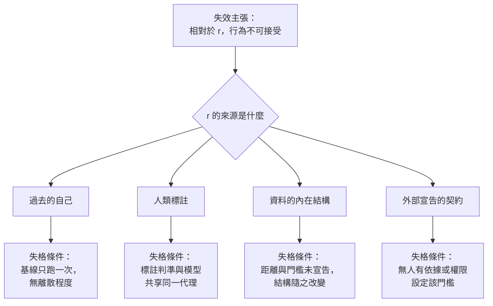

+++
title = "用什麼當基準？判定失效所依據的參考點來源"
date = "2026-09-08T23:31:10+08:00"
author = "TTL::0"
draft = false
isCJKLanguage = true
description = "一套評估流程連續 14 個月每週回報「無退化」。第 15 個月，一次外部稽核發現該模型對某個子群體系統性地判錯，錯誤率是其他群體的四倍。"
tags = [
    "分析論述", # term:AnalyticalEssay
  ]
series = ["能力失效歸因：一個聚合讀數能證明什麼，不能證明什麼"]
[ai_info]
    [ai_info.generation]
        model = "Claude Opus 5"
        agent = "Claude Code VSCode Extension 2.1.261"
    [ai_info.refinement]
        model = "Claude Opus 5"
        agent = "Claude Code VSCode Extension 2.1.263"
+++

<!--more-->

## 導言

一套評估流程連續 14 個月每週回報「無退化」。第 15 個月，一次外部稽核發現該模型對某個子群體系統性地判錯，錯誤率是其他群體的四倍。

團隊回查評估流程，沒有找到任何錯誤。程式沒有 bug，資料沒有洩漏，統計檢定用得正確。問題在別處：那套流程用來判定對錯的參考答案，是由同一批標註者依同一份指引產生的，而那份指引裡的判準與模型學到的規則是同一個。

**這套流程在 14 個月裡從未有能力回報那個問題。** 它不是靈敏度不足，而是它所比較的對象與被檢查的對象共享同一個缺陷。

這指出一件在前面所有討論中被當成已知的事：每一個「失效」判定都需要一個參考點，而參考點不是世界給定的，它是被選的。本文要處理的問題是：判定失效所依據的參考點有哪些可能來源、各自在什麼條件下失去資格、以及一份失效主張要附上什麼才算完整。

## 分析

一個失效主張的形式總是「相對於 $r$，觀察到的行為不可接受」。其中 $r$ 是參考點。省略 $r$ 的主張不是更簡潔，而是不完整——它把一個選擇偽裝成一個事實。

實務中的參考點只有四個來源。以下逐一檢查，並給出各自失去資格的條件。

### 來源一：過去的自己

最常見的參考點是同一系統的較早狀態。它的問題不在概念上，而在那個「較早狀態」通常不是一個點。

```python
import random
def run(seed, true_acc=0.90, n=1000):
    rnd = random.Random(seed)
    return sum(1 for _ in range(n) if rnd.random() < true_acc) / n

seeds = list(range(200))
scores = [run(s) for s in seeds]
mean = sum(scores)/len(scores)
sd = (sum((x-mean)**2 for x in scores)/len(scores)) ** 0.5
print(f"系統完全未改變。200 個 seed 的分數：平均 {mean:.4f}  標準差 {sd:.4f}")
print(f"  最低 {min(scores):.4f}   最高 {max(scores):.4f}   全距 {max(scores)-min(scores):.4f}")

base_single = scores[0]
deltas = sorted(base_single - s for s in scores[1:])
print(f"  基線(seed 0) = {base_single:.4f}")
print(f"  相對它的表觀退化：最大 {max(deltas):.4f}，第 95 百分位 "
      f"{deltas[int(0.95*len(deltas))]:.4f}")
```

實際執行的輸出：

```text
系統完全未改變。200 個 seed 的分數：平均 0.8994  標準差 0.0096
  最低 0.8710   最高 0.9330   全距 0.0620
  基線(seed 0) = 0.8960
  相對它的表觀退化：最大 0.0250，第 95 百分位 0.0100
```

系統完全沒有改變。分數的全距是 6.2 個百分點。

若基線只跑一次——這是絕大多數團隊的做法——那個單一數字繼承了該次執行的全部噪聲。相對它，純由 seed 造成的表觀退化最大 2.5 個百分點，而每二十次比較就有一次會看到 1 個百分點以上的「下降」。

所以「過去的自己」作為參考點有一個最低要求：它必須是一個**帶有離散程度的分佈**，不是一個數字。單次執行的結果不構成參考點，它構成一個樣本。

### 判決由最小實務差異決定，而它由人選

即使基線的分佈已知，判定仍需要一個門檻——多大的差異才算重要。這個量通常叫最小實務差異，而它不是從資料推出來的。

```python
observed_drop = 0.018
print(f"  觀察到的下降 = {observed_drop:.3f}；基線自身標準差 = {sd:.4f}")
for mpd in (0.005, 0.010, 0.020, 0.040):
    detectable = mpd > 2*sd
    verdict = ("退化成立" if observed_drop >= mpd else "證據不足")
    print(f"  MPD={mpd:.3f} -> {verdict:6s}   (該 MPD 是否大於 2 個基線標準差: {detectable})")
```

實際執行的輸出：

```text
  觀察到的下降 = 0.018；基線自身標準差 = 0.0096
  MPD=0.005 -> 退化成立     (該 MPD 是否大於 2 個基線標準差: False)
  MPD=0.010 -> 退化成立     (該 MPD 是否大於 2 個基線標準差: False)
  MPD=0.020 -> 證據不足     (該 MPD 是否大於 2 個基線標準差: True)
  MPD=0.040 -> 證據不足     (該 MPD 是否大於 2 個基線標準差: True)
```

同一組觀察，四個判決分成兩派，而分派的依據是誰選了那個門檻。

輸出還揭露一個反直覺的細節。宣告「退化成立」的兩個門檻（$0.005$ 與 $0.010$）都**小於**兩個基線標準差（$0.0192$）——它們位在噪聲底線之下，所以它們宣告的退化有相當機率只是抖動。而位在噪聲底線之上的兩個門檻都說「證據不足」。

也就是說，把門檻設得更嚴格看起來更謹慎，實際上是讓自己更容易對噪聲下結論。門檻的選擇是一個**規範性決定**——它決定要承擔哪一類錯誤——而不是一個可以從資料最佳化出來的技術參數。

### 來源二：人類標註

第二個來源是標註好的參考答案。導言那個事故就發生在這裡。下面的實驗把它形式化：因果特徵 $c$ 決定真值，而標註者實際看得到的是代理 $s$；模型也只看得到 $s$。

```python
def env(coupling, n=N):
    rows = []
    for _ in range(n):
        c = rnd.choice((0, 1))                      # 因果特徵
        s = c if rnd.random() < coupling else 1 - c # 標註者實際看得到的代理
        rows.append((c, s, c, s))                   # (c, s, 因果真值, 標註標籤)
    return rows

model = lambda c, s: s                              # 模型只看得到 s

def score(rows, ref):
    idx = 3 if ref == "annot" else 2
    return sum(1 for r in rows if model(r[0], r[1]) == r[idx]) / len(rows)

for cp in (0.95, 0.5, 0.05):
    rows = env(coupling=cp)
    print(f"部署環境（耦合 {cp:.2f}）")
    print(f"  以標註標籤為參考點 : {score(rows,'annot'):.4f}")
    print(f"  以因果真值為參考點 : {score(rows,'true'):.4f}")
```

實際執行的輸出：

```text
部署環境（耦合 0.95）
  以標註標籤為參考點 : 1.0000   判決: 無退化
  以因果真值為參考點 : 0.9473   判決: 無退化

部署環境（耦合 0.50）
  以標註標籤為參考點 : 1.0000   判決: 無退化
  以因果真值為參考點 : 0.5018   判決: 退化

部署環境（耦合 0.05）
  以標註標籤為參考點 : 1.0000   判決: 無退化
  以因果真值為參考點 : 0.0555   判決: 退化
```

以標註為參考點，分數在每一個環境都是 $1.0000$。這個流程永遠不會回報問題，因為模型完美地複製了標註者所做的事。

以因果真值為參考點，同一個模型從 $0.9473$ 掉到 $0.0555$。

**同一個模型、同樣的環境、兩個參考點、相反的判決。** 而幾乎所有實際的評估流程用的是第一個參考點，因為第二個通常拿不到。

這給標註作為參考點加上一個具體的資格條件：標註者所依據的判準必須與模型可取用的資訊**不同**。若兩者共享同一個代理，該參考點對這一類錯誤沒有鑑別力，而這件事無法從流程內部發現。

### 來源三：資料的內在結構

第三個來源是宣稱從資料本身讀出的結構——有幾個類別、有幾個模式、哪些樣本屬於同一群。這個來源的問題是它依賴一個未被宣告的選擇。

```python
PTS = [(0.0,0.0), (0.7,0.7), (2.0,0.0), (2.9,0.6), (6.0,6.0)]
metrics = (("L1  ", lambda a,b: abs(a[0]-b[0])+abs(a[1]-b[1])),
           ("L2  ", lambda a,b: ((a[0]-b[0])**2+(a[1]-b[1])**2)**0.5),
           ("Linf", lambda a,b: max(abs(a[0]-b[0]), abs(a[1]-b[1]))))
print("同一組 5 個點，同一個門檻 1.0，只改距離定義：")
for name, d in metrics:
    print(f"  {name} -> 資料的「內在群數」= {groups(d, 1.0)}")
```

實際執行的輸出：

```text
同一組 5 個點，同一個門檻 1.0，只改距離定義：
  L1   -> 資料的「內在群數」= 5
  L2   -> 資料的「內在群數」= 4
  Linf -> 資料的「內在群數」= 3
```

同一組點、同一個門檻。三個距離定義給出三個不同的群數。

「內在」這個詞在這裡是誤導的。結構不在資料裡，它在資料與一個被選定的距離之間。因此任何「模型漏掉了一個群」的主張，都預設了某個距離定義與某個門檻，而這兩者通常沒有被寫下來。

### 來源四：外部宣告的契約

第四個來源是明文宣告的可接受行為範圍——某類錯誤的上限、某個子群體的最低表現、某個延遲的預算。

它是四者中最誠實的，因為它不假裝自己是被發現的事實；它是一個決定。它的失效條件也不同：不是「參考點錯了」，而是「沒有人有依據或權限去設定它」。當一個門檻是由工程團隊在衝刺末期隨手定的，它在形式上仍然是一個宣告的契約，實質上只是一個未經審視的預設值。

### 四個來源的對照



| 來源 | 最低要求 | 無法自我偵測的錯誤 |
| :--- | :--- | :--- |
| 過去的自己 | 多次執行、報告離散程度、門檻高於噪聲底線 | 過去本身就已經錯了 |
| 人類標註 | 標註判準與模型可取用資訊不同 | 兩者共享同一代理 |
| 資料的內在結構 | 距離定義與門檻明文宣告 | 該選擇本身是否恰當 |
| 外部宣告的契約 | 設定者、依據與生效範圍留有記錄 | 契約本身是否對應真實風險 |

第三欄是這張表的重點。每一個來源都有一類它結構上偵測不到的錯誤，而那正是導言那個 14 個月的所在。因此參考點的選擇不能只求一個，它需要**至少兩個來源互相交叉**，且兩者的失格條件不重疊。

## 反思

本文刻意不提供「正確參考點」的配方。這不是迴避，而是主張的一部分：不存在一個不需要被選擇的參考點。四個來源全都涉及選擇，差別只在於選擇是否被記錄。把選擇記錄下來，是能做到的最好的事；把選擇消除，不是一個可達成的目標。

一個反例可以標出本文主張的邊界。假設參考點選對了、模型也確實正確，而判決仍然是「退化」——因為門檻被設在噪聲底線之下。此時錯誤不在參考點的來源，而在門檻的位置。所以參考點的資格與門檻的位置是兩個獨立的要求，兩者都對才得到可信的判決。

另一個邊界是關於交叉驗證的成本。要求兩個失格條件不重疊的來源，實務上往往意味著要建立一組昂貴的參考答案——例如以不同資訊管道重新標註、或追蹤真實結果而非代理結果。這個成本是真實的，而本文不主張它總是值得付。可以主張的是：不付這個成本時，評估流程對某一類錯誤的盲區應該被明文記錄，而不是以「無退化」的形式呈現為證據。

最後，本文的三個實驗都是小規模、低維、且參考點的真值由程式指定的。它們足以證明「判決隨參考點的來源與門檻而反轉」這個結構性主張——反例只需要一個——不足以估計真實系統中各來源的偏差幅度。特別是第二個實驗把「標註者看到什麼」寫成了一行程式，而在真實流程裡那正是最難確定的事。

## 實務對比

**建立一個基線。** 錯誤做法是跑一次，把數字寫進文件當作參考點。實測顯示系統完全未改變時分數全距達 6.2 個百分點，而相對單次基線的表觀退化最大 2.5 個百分點。正確做法是跑多個 seed，把基線記錄成平均值加離散程度，並把噪聲底線一起寫下來。

**設定退化門檻。** 錯誤做法是選一個聽起來嚴格的小數字，例如 0.5 個百分點。實測顯示低於兩個基線標準差的門檻會對噪聲宣告退化。正確做法是先量出噪聲底線，再把門檻設在它之上，並明確記錄這個選擇犧牲了哪一類靈敏度——因為門檻的選擇是決定要承擔哪種錯誤，不是最佳化。

**使用標註集作為參考答案。** 錯誤做法是把它當成真值，並以高分作為無問題的證據。實測顯示當標註判準與模型共享同一代理時，分數在所有環境皆為 $1.0000$，而對因果真值的表現可以掉到 $0.0555$。正確做法是明文寫下標註者依據什麼資訊做判斷，並檢查模型是否也能取用同樣的資訊；若是，該參考點對這類錯誤沒有鑑別力，此事應記入評估流程的已知盲區。

**主張模型漏掉了某個群體或模式。** 錯誤做法是直接報告群數或覆蓋率。實測顯示同一組資料在三種距離定義下有 5、4、3 個群。正確做法是連同距離定義與門檻一起報告，並說明該選擇的依據；沒有這兩項，群數不是一個有真假值的量。

**回報一次「無退化」。** 錯誤做法是把它寫成一句結論。正確做法是寫成有範圍的形式：相對於哪個參考點、在哪個門檻下、覆蓋哪些切片、以及該參考點結構上偵測不到什麼。前三項讓結論可被檢查，第四項讓它可被推翻。

## 結論

每一個失效判定都相對於一個參考點，而參考點是被選的，不是被發現的。省略它的主張把選擇偽裝成事實。

本文的量測顯示這個選擇可以直接決定判決：

1. **單次執行不構成參考點。** 系統完全未改變時分數全距 6.2 個百分點，相對單次基線的表觀退化最大 2.5 個百分點。參考點必須是帶離散程度的分佈。
2. **門檻的位置決定判決，而門檻由人選。** 同一組觀察在四個門檻下分成「退化成立」與「證據不足」兩派；而宣告退化的那些門檻全都位在噪聲底線之下。
3. **參考點的來源可以讓判決反轉。** 同一個模型以標註為參考點在所有環境皆得 $1.0000$，以因果真值為參考點掉到 $0.0555$。
4. **「資料的內在結構」依賴未宣告的選擇。** 同一組點在三種距離定義下有 5、4、3 個群。

四個可能來源——過去的自己、人類標註、資料的內在結構、外部宣告的契約——各有一類結構上偵測不到的錯誤。因此可信的判定需要至少兩個來源交叉，且兩者的失格條件不重疊。

而當這個交叉的成本無法負擔時，能做到的最好的事不是換一個聽起來更客觀的參考點，而是把該流程的盲區明文記錄下來——讓「無退化」被讀成「在此參考點與此門檻下未觀察到差異」，而不是被讀成一個關於系統的事實。