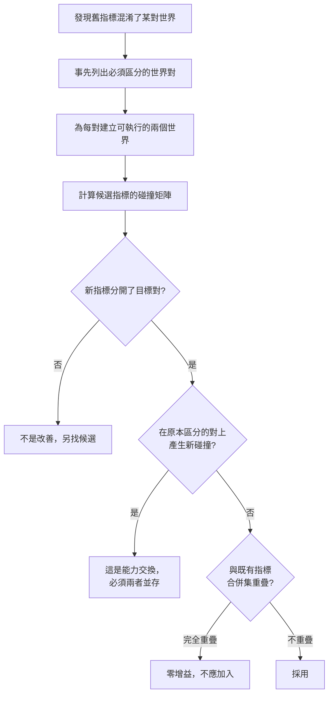

+++
title = "換一個指標為何不夠：替代量的遞迴不可識別性"
date = "2026-09-08T23:47:11+08:00"
author = "TTL::0"
draft = false
isCJKLanguage = true
description = "一個團隊經歷過一次事故：平均準確率不變，而個體行為大量改變，正負翻轉互相抵銷。事後檢討的結論很合理——平均值是壓縮，應該改用逐樣本翻轉率作為發布閘門。"
tags = [
    "分析論述", # term:AnalyticalEssay
  ]
series = ["能力失效歸因：一個聚合讀數能證明什麼，不能證明什麼"]
[ai_info]
    [ai_info.generation]
        model = "Claude Opus 5"
        agent = "Claude Code VSCode Extension 2.1.261"
    [ai_info.refinement]
        model = "Claude Opus 5"
        agent = "Claude Code VSCode Extension 2.1.263"
+++

<!--more-->

## 導言

一個團隊經歷過一次事故：平均準確率不變，而個體行為大量改變，正負翻轉互相抵銷。事後檢討的結論很合理——平均值是壓縮，應該改用逐樣本翻轉率作為發布閘門。

六週後第二次事故。上游一個標籤管線的變更讓 3% 的樣本標籤改變，模型的判斷因此有一批從對變錯。翻轉率閘門回報：$0.0000$。

原因是結構性的。翻轉率比較的是新舊**預測**，而標籤不在這個比較裡。模型的預測確實沒變——變的是它們的正確與否。**那次升級不只是沒有覆蓋新的失效模式，它移除了舊指標原本具備的一項能力。**

這指出一個在前面所有討論中都被預設的事：每當一個聚合量被指出不足，處置是換一個更細的量。而新的量同樣是聚合量。本文要處理的問題是：這個替換在什麼條件下才算改善？以及「更細」是否是一個有意義的排序？

## 分析

### 每個指標誘導一個等價類劃分

任何指標 $m$ 都是一個從世界狀態到讀數的函數。它把世界集合切成等價類：$\mathcal{W}_1 \sim_m \mathcal{W}_2$ 當且僅當 $m(\mathcal{W}_1) = m(\mathcal{W}_2)$。

指標的鑑別力就是它誘導的等價類數量。類越多，能區分的情形越多；被合併在同一類裡的世界，該指標永遠無法分開。

這個框架讓「換一個指標」變成一個可計算的問題：新指標誘導的劃分，是否在我們關心的那些對上比舊的更細？

### 五個世界，五個指標

下面建立五個世界。它們涵蓋四種不同的變動：權重微擾、另一個數值不同但效果相近的微擾、整體縮放（函數行為不變的重新參數化）、以及標籤改變（模型完全未動）。

```python
import random
rnd = random.Random(2)
D, N = 4, 2000
W0, B0 = [1.0, -0.6, 0.25, 0.0], 0.0
X = [[rnd.gauss(0,1) for _ in range(D)] for _ in range(N)]
def logit(w, b, x): return sum(wi*xi for wi, xi in zip(w, x)) + b
Y = [1 if logit(W0, B0, x) >= 0 else 0 for x in X]
base_logit = [logit(W0, B0, x) for x in X]
base_pred = Y[:]
cut = sorted(abs(s) for s in base_logit)[N//10]
group = [0 if x[0] >= 0 else 1 for x in X]

flip_labels = [(1-y) if abs(base_logit[i]) < 0.25 else y for i, y in enumerate(Y)]
WORLDS = {
    "0 基線        ": world(W0, B0),
    "1 權重微擾    ": world([1.0, -0.6, 0.25, 0.03], 0.012),
    "2 另一個微擾  ": world([1.02, -0.585, 0.25, 0.0], -0.004),
    "3 整體縮放 x3 ": world([3*v for v in W0], 3*B0),
    "4 標籤噪聲    ": world(W0, B0, labels=flip_labels),
}
```

五個指標依「一般認為的細緻程度」排列：整體準確率、翻轉率、低邊際切片翻轉率、最差切片分數、以及最細的——完整的逐樣本輸出向量。

```python
METRICS = (("準確率      ", m_acc), ("翻轉率      ", m_flip),
           ("低margin翻轉", m_lowm), ("最差切片    ", m_worst),
           ("逐樣本輸出向量", m_vec))

for mname, f in METRICS:
    vals = {}
    for n in names:
        p, l = WORLDS[n]
        vals.setdefault(f(p, l), []).append(n.strip())
    classes = list(vals.values())
    merged = [c for c in classes if len(c) > 1]
    print(f"  {mname}: {len(classes)} 個等價類"
          + (f"；合併 {merged}" if merged else "；無合併"))
```

實際執行的輸出：

```text
每個指標把 5 個世界分成幾個等價類，以及哪些世界被合併：
  準確率      : 4 個等價類；合併 [['0 基線', '3 整體縮放 x3']]
  翻轉率      : 3 個等價類；合併 [['0 基線', '3 整體縮放 x3', '4 標籤噪聲']]
  低margin翻轉: 3 個等價類；合併 [['0 基線', '3 整體縮放 x3', '4 標籤噪聲']]
  最差切片    : 4 個等價類；合併 [['0 基線', '3 整體縮放 x3']]
  逐樣本輸出向量: 3 個等價類；合併 [['0 基線', '3 整體縮放 x3', '4 標籤噪聲']]
```

三個結論從這五列讀出來，而它們合起來否證了「換更細的指標」這個直覺。

### 「更細」不是一個全序

**第一，翻轉率的等價類比準確率更少。** $3$ 對 $4$。那個被公認為「更細」的替代品，在這組判別任務上**嚴格更差**。

原因就是導言那個事故：翻轉率比較預測與預測，標籤不在其中，所以標籤改變的世界被併進基線那一類。準確率雖然會抵銷，但它至少把標籤放進了比較。

這推翻了把指標排成一條「解析度」軸的做法。指標不是沿單一維度變細或變粗的；每個指標**沿某個特定方向盲目**，而盲目的方向之間沒有包含關係。翻轉率盲於標籤，準確率盲於個體分佈，兩者不可比。

**第二，最細的觀察量同樣有合併集。** 完整的逐樣本輸出向量——能取得的最細粒度——仍然只有 $3$ 個等價類，與翻轉率相同。它盲於整體縮放（因為縮放不改變任何預測）也盲於標籤改變（因為標籤不在輸出裡）。

所以遞迴不會終止在「足夠細」的地方。加細觀察量會改變合併集，不會消除它。

**第三，增加指標數量不等於減少盲區。** 翻轉率與低邊際翻轉率的合併集**完全相同**：都是 $\{$基線, 整體縮放, 標籤噪聲$\}$。把第二個加進儀表板，鑑別力增加為零。

這是儀表板膨脹的典型樣態。兩個指標看起來提供兩種視角，實際上它們的盲區重疊，所以第二個只增加維護成本與閱讀負擔。

### 並用多個指標買到多少

前面談的是單一指標的鑑別力。實務上儀表板同時放很多指標，所以真正該問的是**聯集**能分開多少對。下面把五個世界的十個配對逐一檢查。

```python
from itertools import combinations
W = ["0","1","2","3","4"]
PARTS = {                          # 各指標把五個世界標成哪些等價類（取自上面實測）
    "準確率":      {"0":0,"1":1,"2":2,"3":0,"4":3},
    "翻轉率":      {"0":0,"1":1,"2":2,"3":0,"4":0},
    "低margin翻轉":{"0":0,"1":1,"2":2,"3":0,"4":0},
    "最差切片":    {"0":0,"1":1,"2":2,"3":0,"4":3},
    "逐樣本向量":  {"0":0,"1":1,"2":2,"3":0,"4":0},
}
ALLPAIRS = list(combinations(W, 2))
def separated(names):
    return {(a,b) for a,b in ALLPAIRS
            if any(PARTS[n][a] != PARTS[n][b] for n in names)}

print(f"共 {len(ALLPAIRS)} 個世界對")
for n in PARTS: print(f"  {n:12s} 單獨分開 {len(separated([n]))}")
print(f"全部五個並用: {len(separated(list(PARTS)))} / {len(ALLPAIRS)}")
print(f"無論如何都分不開的: {sorted(set(ALLPAIRS) - separated(list(PARTS)))}")
```

實際執行的輸出（節錄）：

```text
共 10 個世界對

單一指標分開的世界對數：
  準確率          9
  翻轉率          7
  低margin翻轉    7
  最差切片         9
  逐樣本向量        7

兩個指標並用：
  準確率         + 翻轉率          9
  準確率         + 低margin翻轉    9
  翻轉率         + 低margin翻轉    7
  翻轉率         + 最差切片         9

全部五個指標並用: 9 / 10
無論如何都分不開的世界對: [('0', '3')]
```

兩件事從這裡讀出來。

**第一，四個指標的邊際貢獻是零。** 準確率單獨分開 9 對；把翻轉率、低邊際翻轉率、最差切片、逐樣本向量全部加上去，仍然是 9 對。在這組世界上，那四個指標沒有任何一個能分開準確率分不開的那對，所以整個儀表板的鑑別力等於其中一個指標的鑑別力。

**第二，最後那一對分不開是正確的。** 五個指標全用之後剩下的唯一未分對是「基線與整體縮放」。而整體縮放是一次真正的重新參數化——兩個世界的行為完全相同，任何指標都不該把它們分開。

第二點很重要，因為它劃出了本文批評的界線。並非所有的合併都是缺陷；有些合併正確地反映了兩個世界在行為上同一。指標該被批評的是**把行為不同的世界合併**，不是把行為相同的世界合併。這也給替換的驗收加上一個檢查：目標世界對必須先被確認在行為上真的不同，否則要求指標分開它們是要求一個錯誤。

### 什麼條件下替換才算改善

上面的結果指出，替換指標不能以「更細」為理由，因為那不是一個有定義的比較。可以作為理由的只有一件事：**新指標分開了一對舊指標混淆的、而我們確實關心的世界。**

這使替換變成一個可驗收的動作，程序如下：

1. **事先列出必須被區分的世界對。** 這一步不能省，也不能事後補。它是規範性的輸入——哪些混淆是不可接受的，取決於風險，不取決於資料。
2. **為每一對建立可執行的兩個世界。** 這通常是小規模的合成資料或受控擾動，不需要真實系統。
3. **計算候選指標在這些對上的碰撞。** 也就是上面那段程式做的事。
4. **檢查新指標是否在任何原本被區分的對上產生新的碰撞。** 這一步攔住的正是導言那個事故：升級移除了既有能力。
5. **檢查新指標與既有指標的合併集是否重疊。** 完全重疊者不應加入儀表板。

下圖把這個程序與它要防的兩種失敗放在一起。



圖的第二個菱形是導言事故的攔截點。當替換會產生新碰撞時，正確的動作不是取捨，而是**兩者並存**——因為兩個指標的盲區不重疊，所以任一個都不足以取代另一個。

### 這個程序自己的極限

誠實地說，上面的程序沒有解決不可識別性，它只是把它變成一個被記錄的選擇。程序的輸出是「在這份世界對清單上，這組指標的碰撞矩陣如下」。它不能保證清單完整，而清單之外的世界對仍然可以碰撞。

所以本文不主張存在一個沒有盲區的指標組。可以主張的是：盲區可以從隱含變成明文，而明文的盲區可以被審視、被排優先序、被逐步縮小；隱含的盲區只能靠事故發現。

## 反思

本文刻意不推薦指標清單。理由在前面已經證明：指標的價值不是它自身的性質，而是它與一組必須被區分的世界對之間的關係。同一個指標在一個系統裡是必要的，在另一個系統裡可能是零增益的，這取決於該系統的風險結構。給出清單會把一個關係誤植為屬性。

一個反例可以標出本文主張的邊界。假設一個系統的風險結構確實只有一種失效模式，而某個單一指標對它有完整鑑別力。此時「盲區」仍然存在——該指標對其他世界對照樣盲目——但那些世界對在該系統中不會發生。因此盲區的存在不等於不可接受；不可接受的是**未被記錄的**盲區落在會發生的世界對上。

另一個邊界關於程序的成本。要為每一對世界建立可執行的實例，需要對失效模式有相當具體的理解——而那正是排查原本要提供的東西。所以這個程序在成熟系統上可行，在剛開始運行的系統上會退化為猜測。此時能做到的是把清單標記為「初版、預期不完整」，並在每次事故後把新發現的世界對加進去；清單的成長本身就是系統知識的紀錄。

最後，本文的實驗只有五個世界與五個指標，且世界是由程式構造的。它足以證明三個結構性主張——替代指標可以嚴格更差、最細觀察量仍有合併集、增加指標可以零增益——因為每一項都只需要一個反例。它不足以描述真實系統的碰撞矩陣，那必須在該系統上實際計算。

## 實務對比

**在一次事故後升級發布閘門。** 錯誤做法是把舊指標換成新指標。實測顯示翻轉率的等價類（$3$）比準確率（$4$）更少，替換會移除既有能力。正確做法是先計算候選指標在既有世界對上的碰撞；若新指標在任何原本被區分的對上產生碰撞，兩者必須並存，而不是取代。

**判斷一個新指標值不值得加進儀表板。** 錯誤做法是「多一個視角總是好的」。實測顯示翻轉率與低邊際翻轉率的合併集完全相同，第二個帶來零鑑別力增益。正確做法是計算它與既有指標的合併集重疊程度；完全重疊者只增加維護與閱讀成本。

**追求更細的觀察量。** 錯誤做法是把逐樣本輸出當成終點，認為它足夠細所以不會有盲區。實測顯示它仍然只有 $3$ 個等價類，盲於整體縮放與標籤改變。正確做法是承認任何觀察量都有合併集，並明文記錄該合併集裡有什麼。

**描述一次評估的結論。** 錯誤做法是寫「所有指標皆無異常」。這句話的實質內容是「所有指標的合併集都涵蓋了當前世界」，而那與「無問題」不是同一件事。正確做法是寫「在下列世界對上，本組指標可區分；在下列世界對上不可區分」，讓結論的邊界與結論本身一起呈現。

## 結論

每一個聚合量都把世界集合切成等價類，而被合併在同一類裡的世界，該量永遠無法分開。因此「這個指標不夠」總是成立，對任何指標都成立。

問題不在於找到一個沒有這個性質的指標——它不存在——而在於替換憑什麼算改善。本文的量測給出三個否定結論：

1. **替代指標可以嚴格更差。** 翻轉率誘導 $3$ 個等價類，準確率誘導 $4$ 個；那個被視為更細的量在此組判別上鑑別力更低，因為它盲於標籤改變。
2. **「更細」不是一個全序。** 每個指標沿某個特定方向盲目，而盲目方向之間沒有包含關係。翻轉率盲於標籤，準確率盲於個體分佈，兩者不可比。
3. **最細的觀察量仍有合併集。** 完整的逐樣本輸出向量同樣只有 $3$ 個等價類；加細改變合併集，不消除它。
4. **增加指標數量可以零增益。** 兩個看似不同的指標若合併集相同，第二個只增加成本。

所以替換的唯一合法理由是：它分開了一對舊指標混淆的、而風險結構要求區分的世界。這使替換成為可驗收的動作——事先列出必須區分的世界對、為每對建立可執行實例、計算碰撞矩陣、檢查是否產生新碰撞、檢查是否與既有指標重疊。

這個程序不消除不可識別性。它把不可識別性從隱含變成明文，而明文的盲區可以被審視與排序；隱含的盲區只能靠下一次事故發現。