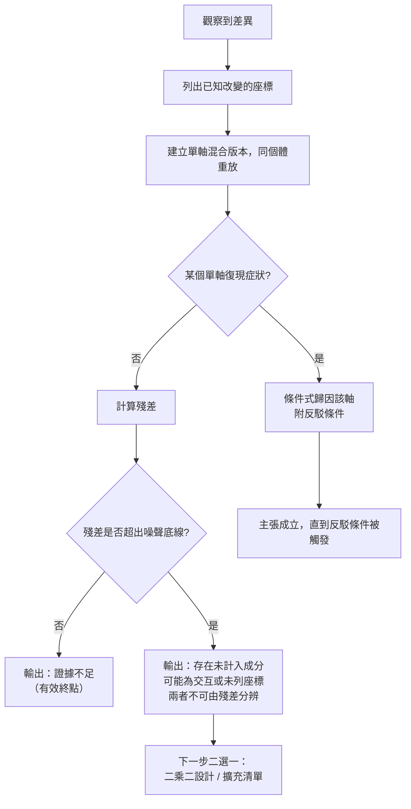

+++
title = "契約永遠不完備，所以改守可反駁性"
date = "2026-09-09T00:02:12+08:00"
author = "TTL::0"
draft = false
isCJKLanguage = true
description = "一個團隊在追一個 1.2 個百分點的離線分數差異。他們的封存制度很嚴謹：模型權重、資料快照、前處理與推論設定、計分程式、隨機種子，五項全部固定並逐位元比對一致。"
tags = [
    "分析論述", # term:AnalyticalEssay
  ]
series = ["能力失效歸因：一個聚合讀數能證明什麼，不能證明什麼"]
[ai_info]
    [ai_info.generation]
        model = "Claude Opus 5"
        agent = "Claude Code VSCode Extension 2.1.261"
    [ai_info.refinement]
        model = "Claude Opus 5"
        agent = "Claude Code VSCode Extension 2.1.263"
+++

<!--more-->

## 導言

一個團隊在追一個 1.2 個百分點的離線分數差異。他們的封存制度很嚴謹：模型權重、資料快照、前處理與推論設定、計分程式、隨機種子，五項全部固定並逐位元比對一致。

差異穩定重現。六週的排查裡，每一項單獨替換都無法復現症狀。

最後找到的原因是一次驅動程式更新。它改變了一個融合算子的累加順序，而該順序不在封存的五項之中。這不是封存做得不夠仔細——**它是封存這個動作本身無法解決的問題**：要把某個東西納入版本向量，得先知道它存在。

這個事故指出前面所有討論共有的一個未證成前提。逐軸替換的程序假設那份座標清單是完備的，於是「所有軸都固定後差異仍在」可以被讀成「問題在某個已列的軸上」。但清單的完備性從來沒有被證明過，而本文要說明它**無法**被證明。

由此產生的問題是：當完備性不可得時，一份診斷還能守住什麼？

## 分析

### 版本向量與逐軸替換

先把程序寫清楚，以免後面的批評指錯對象。

一次可重放的評估由一組座標決定。把它們寫成向量 $v = (v_1, \dots, v_k)$，涵蓋模型、資料、推論設定、計分規則、隨機狀態等。當基線 $v^{(0)}$ 與觀察 $v^{(1)}$ 在多個座標上同時不同時，單一的分數差無法識別各自貢獻。

程序因此是：對每個改變的座標，建立一個只替換該座標的混合版本，在同一批個體上重放，記錄差異。若某個單軸替換復現了症狀，歸因指向該軸。

這個程序在清單完備時是有效的。問題出在它的輸出如何被解讀。

### 殘差無法識別「未列座標」與「交互作用」

當所有單軸效應加起來不等於總差異時，差額就是殘差。實務上殘差常被讀成「交互作用」，因為那是清單內唯一剩下的解釋。

下面的系統有四個座標，其中 $h$ 是排查者不知道存在的那一個，另外還有一個 $a$ 與 $b$ 之間的交互項。

```python
def score(a, b, c, h, gamma):
    return 1.0*a + 1.0*b + 1.0*c + 1.0*h + gamma*a*b

def audit(h_obs, gamma, label):
    KNOWN = ("a", "b", "c")                       # 排查者手上的版本向量
    base = dict(a=0, b=0, c=0, h=0)
    obs  = dict(a=1, b=1, c=1, h=h_obs)
    total = score(**obs, gamma=gamma) - score(**base, gamma=gamma)
    singles = {}
    for ax in KNOWN:                              # 固定其餘，只換一軸
        mixed = dict(base); mixed[ax] = obs[ax]
        singles[ax] = score(**mixed, gamma=gamma) - score(**base, gamma=gamma)
    residual = total - sum(singles.values())
    print(f"{label}")
    print(f"  總差異 {total:+.2f}   單軸總和 {sum(singles.values()):+.2f}")
    print(f"  殘差 = {residual:+.2f}   （真實成分：未列座標 {h_obs:+.2f}，交互 {gamma:+.2f}）")

audit(h_obs=1.0,  gamma=0.0,  label="情形一：只有未列座標")
audit(h_obs=0.0,  gamma=1.0,  label="情形二：只有交互作用")
audit(h_obs=1.0,  gamma=1.0,  label="情形三：兩者皆有")
audit(h_obs=1.0,  gamma=-1.0, label="情形四：兩者皆有且恰好抵銷")
```

實際執行的輸出：

```text
情形一：只有未列座標
  總差異 +4.00   單軸總和 +3.00
  殘差 = +1.00   （真實成分：未列座標 +1.00，交互 +0.00）

情形二：只有交互作用
  總差異 +4.00   單軸總和 +3.00
  殘差 = +1.00   （真實成分：未列座標 +0.00，交互 +1.00）

情形三：兩者皆有
  總差異 +5.00   單軸總和 +3.00
  殘差 = +2.00   （真實成分：未列座標 +1.00，交互 +1.00）

情形四：兩者皆有且恰好抵銷
  總差異 +3.00   單軸總和 +3.00
  殘差 = +0.00   （真實成分：未列座標 +1.00，交互 -1.00）
```

情形一與情形二的殘差**完全相同**（皆為 $+1.00$），而成因不同：一個是清單外的座標，一個是清單內的交互。殘差這個量對這兩者沒有鑑別力。這件事很要緊，因為兩者的下一步動作完全相反——前者要去擴充清單，後者要去做二乘二設計。

情形四更糟。殘差恰為 $+0.00$，而世界裡同時有一個未列座標與一個交互項，兩者互相抵銷。任何以「殘差為零」作為歸因完成判準的程序，都會在這裡宣告排查結束，而兩個未計入的機制仍在運作。

**所以殘差為零不是完備性的證據。** 它只是「已列座標的單軸效應恰好加總到總差異」這個算術事實。

### 為什麼完備性不可證

完備性的主張形式是「清單之外沒有任何影響此讀數的東西」。這是一個全稱否定命題，而它的否證只需要一個實例——那個驅動程式更新就是。

要證實它，需要枚舉「所有可能影響讀數的東西」，而那是一個開集：作業系統的排程、函式庫的次要版本、硬體的錯誤修正、時區、locale 對數字格式化的影響、容器基礎映像的一個共享函式庫。每次事故都會往清單加一項，而加完之後清單仍然不完備——只是暫時沒有反例。

這給出一個結構性的結論：**清單的長度可以增加，清單的完備性不會被證明。** 因此任何以完備性為前提的結論——「所有軸都固定了，所以問題在模型」——都繼承了一個永遠無法建立的前提。

### 擴充清單確實買到東西，只是買不到完備性

上面的批評容易被誤讀成「擴充清單沒有用」。下面把同一個系統跑兩次，一次把 $h$ 納入清單，一次不納入。

```python
def audit(known, h_obs, gamma):
    base = dict(a=0, b=0, c=0, h=0); obs = dict(a=1, b=1, c=1, h=h_obs)
    total = score(**obs, gamma=gamma) - score(**base, gamma=gamma)
    s = 0.0
    for ax in known:
        m = dict(base); m[ax] = obs[ax]
        s += score(**m, gamma=gamma) - score(**base, gamma=gamma)
    return total, s, total - s

for known, label in ((("a","b","c"), "清單 = {a,b,c}   （h 未列）"),
                     (("a","b","c","h"), "清單 = {a,b,c,h} （h 已列）")):
    t, s, r = audit(known, 1.0, 1.0)
    print(f"  {label}: 總差異 {t:+.2f}  單軸總和 {s:+.2f}  殘差 {r:+.2f}")
```

實際執行的輸出：

```text
擴充清單買到什麼（真實成分：未列座標 +1.00，交互 +1.00）
  清單 = {a,b,c}   （h 未列）: 總差異 +5.00  單軸總和 +3.00  殘差 +2.00
  清單 = {a,b,c,h} （h 已列）: 總差異 +5.00  單軸總和 +4.00  殘差 +1.00
```

納入 $h$ 之後殘差從 $+2.00$ 降到 $+1.00$，而且剩下的 $+1.00$ 恰好等於交互項。此時殘差變成一個可解釋的量：它只含交互，不含未列座標。

所以擴充清單是有價值的動作，而且價值是可計量的——它把殘差裡的一個成分移到可歸因的部分。要注意的是這個判讀成立的條件：我們之所以知道剩下的 $+1.00$ 是交互，是因為在構造這個系統時就知道 $h$ 是最後一個未列座標。真實系統沒有這個保證，所以殘差 $+1.00$ 在那裡仍然同時相容於「交互」與「還有另一個未列座標」。

**擴充清單縮小殘差，不改變殘差的性質。** 這是「清單可以變長、完備性不會被證明」這句話的操作版本。

### 把目標從完備性換成可反駁性

完備性不可得，但這不表示診斷不可能。它表示診斷的目標要換。

一份診斷可稱為**可反駁**（refutable），當它同時滿足三個條件：

1. **指名機制**：說出主張是哪一個座標、以什麼路徑造成該讀數，而不只是說「某處有問題」。
2. **指名反駁觀察**：說出什麼樣的觀察結果會推翻它，且該觀察在邏輯上有可能出現。
3. **反駁可負擔**：那個觀察在現有預算與權限下取得得到。

第三個條件常被忽略，而它決定了前兩個是否有意義。一個反駁條件若需要在生產系統上做一年的隨機化實驗，那份診斷實質上不可反駁。

可反駁性與完備性的關鍵差別是：它不需要對世界的枚舉。它只需要對**這一份主張**負責。清單不完備時，可反駁的主張仍然可以被檢驗，因為它的內容是條件式的。

對照兩種寫法可以看出差別：

```text
不可反駁：「新版模型在部署環境退化了。」
  — 未指名座標，未指名反駁條件，任何後續觀察都可以被吸收進這句話。

可反駁：「在資料快照 S、推論設定 C、計分規則 M 固定下，替換模型版本
        使凍結測試集的低邊際切片翻轉率自 0.012 升至 0.108；
        若在快照 S 上重放兩個版本而翻轉率差異落回 0.02 以內，
        或該差異無法在第二份快照 S' 上重現，本歸因即被推翻。」
  — 指名了座標與觀察量，且列出兩個可執行的反駁條件。
```

第二種寫法沒有主張清單完備。它明確地把結論限制在被固定的三個座標與被測的兩份快照之內。那個驅動程式更新如果存在，它會讓第二個反駁條件觸發——差異無法在另一份快照上重現——於是這份診斷會被自己的反駁條件殺掉，而不是靠六週的搜尋。

### 程序的輸出應該有三種，不是兩種

下圖把目標轉換後的程序畫出來。它要解決的閱讀問題是：殘差不為零時，程序該輸出什麼。



圖的重點在右下角那兩個輸出。傳統程序只有兩種結局——歸因或無問題——而正確的程序有三種，多出來的是「存在未計入成分」。

這個輸出不是失敗。它是在清單不完備的世界裡唯一誠實的結論，而且它是可操作的：它把下一步縮到兩個選項，並且明確標示這兩個選項無法由現有證據分辨。相較之下，把殘差讀成交互作用，會讓團隊在二乘二設計上耗盡預算，而真正的成因在清單之外。

同樣地，左下角的「證據不足」也是有效終點。當差異落在噪聲底線之內，正確的輸出是停止，而不是繼續尋找一個尚未被證明存在的效應。

## 反思

可反駁性不保證找到真因。這是本文主張最重要的邊界。它做的是**約束主張的範圍**，讓錯誤的歸因可以被便宜地殺掉；它不生產正確的歸因。一份可反駁的診斷可以是錯的——它只是不會在錯的時候繼續存活。

一個反例可以標出這一點的分量。假設一份診斷完全符合三個條件，反駁條件也確實可執行，而它指名的機制是錯的；同時真正的機制恰好在被測的兩份快照上產生相同的讀數。此時反駁條件不會觸發，錯誤的診斷會存活。可反駁性提供的是淘汰壓力，不是真值保證。

另一個邊界是關於清單擴充的動機。本文說完備性不可證，可能被誤讀成「不必費心擴充清單」。恰好相反：每一次事故揭露的新座標都應該加進去，因為清單越長，未列座標造成的殘差就越少見。可證明的完備性與有用的長度是兩件事——後者可以持續改善，只是永遠不會抵達前者。

還有一個誠實的說明關於本文的實驗。它是線性可加加上一個交互項的構造，殘差因此有封閉形式。真實系統的座標效應不可加，殘差也不會這麼乾淨地分解。實驗足以證明兩個結構性主張——殘差混淆未列座標與交互、殘差為零不蘊含完備——因為兩者各只需一個反例。它不足以描述真實系統中殘差的組成。

最後，本文不處理監測的設計。何時該告警、告警的靈敏度該設多高、要不要在告警當下就給出成因，這些問題有它們自己的目標函數，與本文討論的歸因程序不同。本文的範圍止於：一份歸因主張要滿足什麼條件才算成立。

## 實務對比

**解讀「所有軸都固定後差異仍在」。** 錯誤做法是結論「所以問題在模型本身」。這個推論預設清單完備，而完備性無法被證明。正確做法是輸出「在已列座標固定的條件下差異仍存在，因此存在未計入成分」，並把下一步縮到二選一：對可疑對做二乘二設計，或擴充清單。

**解讀殘差。** 錯誤做法是把殘差讀成交互作用。實測顯示只有未列座標與只有交互作用會給出完全相同的殘差（皆 $+1.00$）。正確做法是把殘差報告為「未計入成分的總量」，並明確標示它無法區分這兩種成因。

**判斷排查是否完成。** 錯誤做法是以殘差歸零為結案條件。實測顯示殘差可以在兩個未計入機制互相抵銷時恰為 $+0.00$。正確做法是以「已列出的預註冊假說皆已判定，且每個成立的歸因都附有可執行的反駁條件」為結案條件；殘差歸零只是一個算術觀察，不是完整性證明。

**撰寫一份事故歸因。** 錯誤做法是寫「新版模型導致退化」。這句話沒有指名座標，也沒有指名反駁條件，因此任何後續觀察都可以被吸收進去而不改變結論。正確做法是把被固定的座標、被測的觀察量、以及至少一個可執行的反駁條件寫進主張本身。

**面對落在噪聲內的差異。** 錯誤做法是繼續加大樣本直到出現顯著結果。正確做法是把「證據不足」作為一個有效的終點寫入報告——它是關於當前預算下可得結論的誠實陳述，而不是排查的失敗。

## 結論

逐軸替換的程序假設座標清單完備，而該假設無法被建立。完備性是一個全稱否定命題：它的否證只需要一個實例——一次改變了累加順序的驅動程式更新——而它的證實需要枚舉一個開集。

本文的量測進一步顯示，程序內部也沒有可用的完備性檢查：

1. **殘差混淆兩種成因。** 只有未列座標與只有交互作用給出完全相同的殘差，而兩者的下一步動作相反。
2. **殘差為零不蘊含完備。** 一個未列座標與一個交互項可以恰好抵銷，使殘差為 $+0.00$，而兩個未計入的機制仍在運作。

因此可守的目標不是完備性，而是可反駁性。一份診斷成立的條件變成三項：指名機制、指名一個在邏輯上可能出現的反駁觀察、以及該觀察在現有預算內取得得到。這樣的主張不需要對世界的枚舉，因為它的內容是條件式的——它只對自己負責。

程序的輸出因此有三種而非兩種：條件式歸因、證據不足、以及存在未計入成分。第三種不是失敗，而是清單不完備的世界裡唯一誠實的結論，並且它是可操作的——它把下一步縮到二選一，同時標明這兩者無法由現有證據分辨。

而可反駁性提供的是淘汰壓力，不是真值保證。它讓錯誤的歸因可以被便宜地殺掉；它不保證留下來的那個是對的。