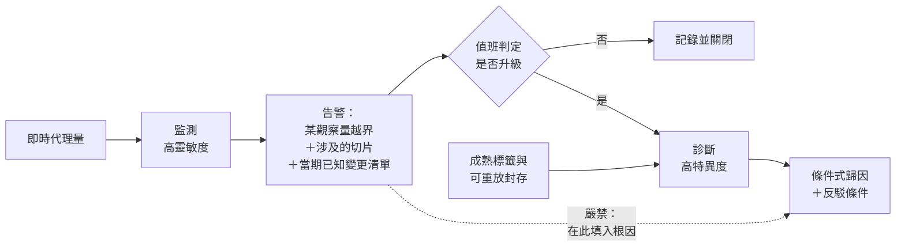

+++
title = "早發現與正確歸因：兩個目標，兩個損失函數"
date = "2026-09-09T00:18:13+08:00"
author = "TTL::0"
draft = false
isCJKLanguage = true
description = "一個組織為了縮短事故處理時間，訂了一條規則：每一個模型品質告警都必須附上一個「可能根因」欄位，讓值班人員一眼知道該找誰。"
tags = [
    "分析論述", # term:AnalyticalEssay
    "機器學習", # term:MachineLearning
    "損失函數", # term:LossFunction
  ]
series = ["能力失效歸因：一個聚合讀數能證明什麼，不能證明什麼"]
[ai_info]
    [ai_info.generation]
        model = "Claude Opus 5"
        agent = "Claude Code VSCode Extension 2.1.261"
    [ai_info.refinement]
        model = "Claude Opus 5"
        agent = "Claude Code VSCode Extension 2.1.263"
+++

<!--more-->

## 導言

一個組織為了縮短事故處理時間，訂了一條規則：每一個模型品質告警都必須附上一個「可能根因」欄位，讓值班人員一眼知道該找誰。

規則上線後告警數量沒變，處理時間也沒變。六個月後的一次回顧發現，值班人員已經完全不看那個欄位——它填的內容通常是錯的，而且填錯的方式有規律：系統傾向填上最近有變更紀錄的那個元件，不論該變更與症狀是否相關。

規則的設計者假設「告警觸發時已經有足夠資訊指認根因」。這個假設可以直接算出來是錯的。在該系統的事件基礎率下，靈敏度足以及早發現問題的告警，其中**大多數根本沒有真因可找**——它們是假警報。要求每一個告警附根因，等於要求系統為不存在的原因編造答案。

本文因此要處理：早發現與正確歸因為什麼是兩個目標，它們的**損失函數**（Loss Function） <!-- term:LossFunction -->如何不同，以及把兩者塞進同一個儀表為什麼會同時損害兩邊。

> [!IMPORTANT]
> **損失函數** <!-- term:LossFunction --> (Loss Function): 把模型輸出與目標之間的差距量化為單一數值的評分函數。 <!-- anchor:LossFunction -->


## 分析

### 兩個目標，兩組成本

先把兩件事的目的分開寫。

**監測**（monitoring）的目的是及早察覺可能有問題。它的成本結構是：漏報昂貴——問題持續擴大、影響更多使用者；假警報便宜——花掉一些注意力，然後被排除。因此監測的最佳操作點偏向高靈敏度，並且它可以使用即時可得的代理量，不必等標籤。

**診斷**（diagnosis）的目的是正確歸因。它的成本結構相反：錯誤歸因昂貴——團隊被導向錯誤的元件，消耗排查預算，同時真正的成因繼續運作；而慢一點做出結論相對便宜。因此診斷的最佳操作點偏向高特異度，並且它需要可重放的證據，而那通常要等標籤成熟。

| 面向 | 監測 | 診斷 |
| :--- | :--- | :--- |
| 目的 | 及早察覺 | 正確歸因 |
| 昂貴的錯誤 | 漏報 | 錯誤歸因 |
| 便宜的錯誤 | 假警報 | 結論較慢 |
| 偏好的操作點 | 高靈敏度 | 高特異度 |
| 可用的證據 | 即時代理量 | 可重放的成對比較 |
| 候選集合 | 開放，尚未收斂 | 需先收斂到少數候選 |

### 靈敏的告警大多沒有真因

上面的表還只是定性的。下面把基礎率代進去，看「要求每個告警附根因」實際上要求了什麼。

```python
BASE = 0.02          # 每個監測週期真的發生事件的機率

print(f"真實事件基礎率 = {BASE:.1%}")
print("靈敏度  特異度   每期告警率   告警精確率   告警中無真因者的比例")
for sens, spec in ((0.99, 0.80), (0.95, 0.90), (0.90, 0.95),
                   (0.70, 0.99), (0.50, 0.999)):
    tp = BASE * sens
    fp = (1 - BASE) * (1 - spec)
    alert = tp + fp
    prec = tp / alert
    print(f"{sens:6.2f}  {spec:6.3f}  {alert:11.4f}  {prec:11.4f}  {1-prec:20.4f}")
```

實際執行的輸出：

```text
真實事件基礎率 = 2.0%

靈敏度  特異度   每期告警率   告警精確率   告警中無真因者的比例
  0.99   0.800       0.2158       0.0918                0.9082
  0.95   0.900       0.1170       0.1624                0.8376
  0.90   0.950       0.0670       0.2687                0.7313
  0.70   0.990       0.0238       0.5882                0.4118
  0.50   0.999       0.0110       0.9107                0.0893
```

第一列是任何重視漏報的組織會選的操作點：靈敏度 0.99。它的精確率是 $0.0918$——**90.8% 的告警沒有真因可找**。

要求這些告警都附上根因，會產生 90.8% 的錯誤歸因。而且錯誤不是隨機分佈的：填答的系統必須從某處取材，於是它取用最容易取得的相關資訊——最近的變更紀錄。這正是導言那個事故裡觀察到的規律。**那個欄位的填答規則不是壞掉了，它是在資訊不足的條件下唯一可執行的規則。**

最後一列顯示要把精確率拉到 $0.9107$，靈敏度必須降到 $0.50$——一半的真實事件不會被發現。這是同一個儀表上無法迴避的取捨。

### 「填最近一次變更」的實際正確率

導言那個系統的填答規則有規律：它填上最近有變更紀錄的元件。這個規則的正確率可以算出來，因為它由兩個獨立的機率相乘。

一個告警要填對根因，需要兩件事同時成立：該告警是真警報（機率為精確率），且視窗內 $k$ 個變更中被挑中的那個恰好是真因（機率 $1/k$）。

```python
BASE, SENS, SPEC = 0.02, 0.99, 0.80
print("視窗內變更數 k   真告警中猜對的機率   全部告警中根因正確的比例")
for k in (1, 2, 3, 5, 10):
    tp = BASE*SENS; fp = (1-BASE)*(1-SPEC)
    prec = tp/(tp+fp)
    print(f"{k:14d}   {1.0/k:19.4f}   {prec * (1.0/k):24.4f}")
```

實際執行的輸出：

```text
「填最近一次變更」這個規則的實際正確率
視窗內變更數 k   真告警中猜對的機率   全部告警中根因正確的比例
             1                1.0000                     0.0918
             2                0.5000                     0.0459
             3                0.3333                     0.0306
             5                0.2000                     0.0184
            10                0.1000                     0.0092
```

在一個每週有三次變更的系統裡，那個欄位的正確率是 $0.0306$。也就是三十三個告警裡有一個填對。

這個數字解釋了值班人員的行為。他們不是懶惰或不信任流程——他們在六個月內累積了足夠的樣本，估計出這個欄位的正確率接近三十分之一，然後停止閱讀它。**那是一個正確的統計判斷。**

值得注意的是 $k = 1$ 那一列：即使視窗內只有一個變更、挑選必然挑中它，整體正確率仍只有 $0.0918$。因為 90.8% 的告警根本沒有真因，那唯一的變更也不是原因。所以「減少變更頻率」不能修復這個欄位；限制它的是精確率，不是候選數。

### 兩個目標的最佳門檻不同

上面的取捨可以再往前一步：分別為兩個目標寫出成本，看它們的最佳點是否重合。

```python
print("設定       漏報成本(x20)   假警報成本(x1)   監測總成本   錯誤歸因成本(x50)")
for sens, spec in ((0.99, 0.80), (0.95, 0.90), (0.90, 0.95),
                   (0.70, 0.99), (0.50, 0.999)):
    fn = BASE * (1 - sens)
    fp = (1 - BASE) * (1 - spec)
    mon = 20 * fn + 1 * fp
    wrong_attr = 50 * fp
    print(f"{sens:.2f}/{spec:.3f}  {fn:13.4f}  {fp:15.4f}  {mon:11.4f}  {wrong_attr:18.4f}")
```

實際執行的輸出：

```text
設定       漏報成本(x20)   假警報成本(x1)   監測總成本   錯誤歸因成本(x50)
0.99/0.800         0.0002           0.1960       0.2000              9.8000
0.95/0.900         0.0010           0.0980       0.1180              4.9000
0.90/0.950         0.0020           0.0490       0.0890              2.4500
0.70/0.990         0.0060           0.0098       0.1298              0.4900
0.50/0.999         0.0100           0.0010       0.2010              0.0490
```

監測總成本的最小值落在 $0.90 / 0.950$（$0.0890$）。錯誤歸因成本的最小值落在 $0.50 / 0.999$（$0.0490$）。

**兩個最佳點不重合，而且相距很遠。** 在監測的最佳點上，錯誤歸因成本是 $2.4500$——比歸因的最佳點高了五十倍。在歸因的最佳點上，監測總成本是 $0.2010$，比監測的最佳點高了兩倍多，代表一半的事件被漏掉。

這是一個結構性的結論，不依賴上面那些成本係數的具體數值：只要兩個目標對假警報的代價評價不同，它們的最佳操作點就不同。一個儀表只能停在一個操作點上，所以它無法同時為兩者最佳化。

### 三個無法靠調參消除的結構差異

除了門檻，兩個目標還有三個差異是調參解決不了的。

**第一，證據的可得時間不同。** 監測必須在事件進行中就有輸出，所以它只能用即時可得的量——輸入分佈的統計量、輸出分佈的統計量、系統層的計數。而歸因需要標籤，標籤在多數系統中延遲抵達。要求告警當下附根因，等於要求用第一類證據回答只有第二類證據能回答的問題。

**第二，候選集合的狀態不同。** 告警觸發時，候選成因的集合是開放的——尚未收斂。歸因程序的前提是候選已被縮到少數幾個，因為它靠的是逐項排除。把歸因塞進告警，等於在候選集開放時執行一個需要候選封閉的程序。

**第三，錯誤的傳播方式不同。** 一個假警報的代價會停在被排除的那一刻。一個錯誤歸因的代價會繼續傳播：它進入事故報告、成為後續決策的前提、被引用為「上次也是這個原因」。**錯誤歸因有記憶，假警報沒有。** 這是為什麼兩者的成本係數不該相同。

### 分置的介面

上面的分析指向一個具體的設計：兩個目標各有自己的儀表，並以明確的介面銜接。



圖裡的虛線是導言那條規則試圖走的捷徑。它被禁止的理由不是流程潔癖，而是那一步所需的證據在該時點不存在。

介面的內容因此可以寫得很具體。**告警應該輸出**：哪一個觀察量越界、越界多少、涉及哪些切片、以及當期已知的變更清單。前三項是監測有能力回答的，第四項是可查的事實。**告警不應該輸出**：這些變更中哪一個造成了越界——那是歸因的問題，而它的證據要等標籤。

這樣的告警比帶著錯誤根因的告警更有用，因為它交給值班人員的是一組真實的線索，而不是一個需要先被推翻的結論。

## 反思

本文不主張監測不該提供線索。「當期已知的變更清單」是一條極有價值的線索，而且它是可查的事實。要區分的是**列出候選**與**指認成因**：前者縮小搜尋空間，後者宣稱因果關係。列出候選不需要標籤，指認成因需要。

一個反例可以標出本文主張的邊界。若某系統的事件基礎率很高——例如一個正在大規模遷移的服務，每期都真的有事——那麼靈敏告警的精確率也會很高，兩個目標的張力隨之縮小。上面的計算完全由基礎率驅動；把 $0.02$ 換成 $0.5$，第一列的精確率會升到 $0.83$。所以本文的結論是條件式的：它適用於事件稀少的穩態系統，而那是多數已上線系統的狀態。

另一個邊界關於成本係數的來源。上面用 $20$、$1$、$50$ 這三個數字算出兩個不同的最佳點，而這些數字不是從資料推出來的——它們是關於「漏一次事故有多糟」與「錯一次歸因有多糟」的判斷。因此「最佳門檻」這個說法本身攜帶一個規範性輸入。本文能主張的是兩個最佳點不重合，不能主張它們各自該落在哪裡；後者需要該組織自己的風險判斷。

還有一個誠實的說明。本文把監測與診斷寫成兩個乾淨分開的階段，而實務上它們有回饋：一次成功的歸因會改進監測的代理量選擇，讓下一次的靈敏度與精確率同時變好。這個回饋是真實的，也是分置的好處之一——只有當歸因的結論可信時，它才有資格改進監測。把兩者混在一起會讓這條回饋失效，因為錯誤的歸因會把監測導向錯誤的代理量。

最後，本文不設計具體的門檻數值，也不處理歸因程序的內部構造。前者依賴各組織的成本結構，後者有它自己的一套要求。

## 實務對比

**設計告警的輸出欄位。** 錯誤做法是加一個「可能根因」欄位並要求必填。實測顯示在 2% 的基礎率與 0.99 靈敏度下，90.8% 的告警沒有真因可找，因此該欄位在多數情況下只能編造。正確做法是輸出越界的觀察量、幅度、涉及切片，以及當期已知變更清單；把因果宣稱留給有標籤與封存證據的階段。

**選擇告警門檻。** 錯誤做法是用一個門檻同時滿足「不要漏」與「告警要準」。實測顯示監測成本與錯誤歸因成本的最小值分別落在 $0.90/0.950$ 與 $0.50/0.999$，兩者不重合。正確做法是承認一個儀表只服務一個目標，讓監測選它自己的操作點，並在其後接一個獨立的升級判定。

**評估告警品質。** 錯誤做法是以「告警是否找到根因」衡量監測。這把診斷的成功標準施加在監測上，會逼使監測降低靈敏度以求精確，代價是漏掉真實事件。正確做法是分開衡量：監測看漏報率與偵測延遲，診斷看歸因的可反駁性與被推翻率。

**撰寫事故報告的成因段落。** 錯誤做法是把告警當時的根因欄位抄進報告。錯誤歸因有記憶——它會成為後續決策的前提，並在下一次事故中被引用為前例。正確做法是把告警的內容與歸因的結論分兩段記錄，並註明歸因所依據的證據是在告警之後多久才取得的。

## 結論

及早發現與正確歸因是兩個目標，它們的損失函數 <!-- term:LossFunction -->不同：監測的昂貴錯誤是漏報，診斷的昂貴錯誤是錯誤歸因。因此兩者偏好的操作點不同，而一個儀表只能停在一個操作點上。

本文的計算把這個張力算了出來：

1. **靈敏的告警大多沒有真因。** 在 2% 的事件基礎率與 0.99 的靈敏度下，告警精確率是 $0.0918$——90.8% 的告警沒有成因可找。要求每個告警附根因，等於要求 90.8% 的根因是編造的。
2. **兩個目標的最佳門檻不重合。** 監測總成本的最小值落在 $0.90/0.950$，錯誤歸因成本的最小值落在 $0.50/0.999$；在前者上錯誤歸因成本高出五十倍，在後者上一半的事件被漏掉。
3. **三個差異無法靠調參消除**——證據的可得時間、候選集合是否收斂、以及錯誤的傳播方式。錯誤歸因會進入報告並成為後續前提，假警報則停在被排除的那一刻。

因此可行的設計是分置：監測輸出越界的觀察量、幅度、切片與已知變更清單；歸因在標籤成熟與封存證據齊備後另行執行，並輸出附反駁條件的條件式結論。

而要求告警在觸發當下就附上成因，並不會讓歸因變快。它只會讓系統輸出一個未經證成的故事，而那個故事的代價會在後續每一次決策裡被重複支付。